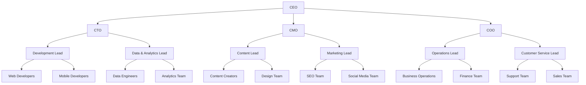

# Azure Yacht Group - Project Plan & Roadmap

## Executive Summary

This document outlines the comprehensive project plan for Azure Yacht Group's digital platform development. The plan is organized into phases with clear deliverables, timelines, and resource allocations. The goal is to create a fully integrated digital ecosystem that leverages our intellectual property and digital assets to maximize business value.

## Strategic Objectives

1. **Platform Development** - Create a scalable, integrated digital platform
2. **Asset Optimization** - Leverage existing IP and digital assets for maximum ROI
3. **Customer Engagement** - Implement systems for enhanced customer experience
4. **Operational Efficiency** - Streamline business operations through technology
5. **Market Expansion** - Develop tools to support geographic and service expansion

## Current Asset Baseline

Based on our [IP & Digital Asset Inventory](resources/ip-assets.md), we have established the following baseline:

- **Total Digital Asset Value**: $518,750 - $873,500
- **Key Asset Categories**:
  - Customer Data (CRM): $343,250 - $686,500
  - Brand & IP: $75,000 - $150,000
  - Industry Relationships: $68,000 - $100,000
  - Website & Online Presence: $20,500 - $34,000
  - Digital Marketing Assets: $7,000 - $15,000
  - Social Media Presence: $5,000 - $8,000

## Project Phases

### Phase 1: Foundation (Q2-Q3 2025)
**Status: In Progress - 45% Complete**

| Component | Status | Priority | Deadline | Owner |
|-----------|--------|----------|----------|-------|
| Core Website Structure | 85% Complete | High | June 30, 2025 | Web Team |
| Yacht Data Integration | 70% Complete | High | July 15, 2025 | Data Team |
| CRM Implementation | 50% Complete | High | July 30, 2025 | CRM Team |
| Documentation Framework | 60% Complete | Medium | August 15, 2025 | Doc Team |
| Initial SEO Implementation | 40% Complete | Medium | August 30, 2025 | Marketing |

**Key Deliverables:**
- Complete Tilda website with all core sections
- Integrated yacht listing system with parent-child variants
- HubSpot CRM implementation with segmented customer data
- Core business documentation and processes
- Basic SEO and analytics implementation

**Success Metrics:**
- Website launch with 100% of planned yacht listings
- CRM populated with 1,500+ qualified contacts
- All key business processes documented
- Baseline performance metrics established

### Phase 2: Enhancement (Q3-Q4 2025)
**Status: Planning - 10% Complete**

| Component | Status | Priority | Deadline | Owner |
|-----------|--------|----------|----------|-------|
| Booking System | Planning | High | Sept 30, 2025 | Web Team |
| Marketing Automation | Initial Setup | High | Oct 15, 2025 | Marketing |
| Analytics Integration | Planning | Medium | Oct 30, 2025 | Data Team |
| Performance Optimization | Not Started | Medium | Nov 15, 2025 | Web Team |
| Asset Enhancement | Initial Review | Medium | Nov 30, 2025 | Content Team |

**Key Deliverables:**
- Full-featured booking and availability system
- Automated marketing workflows for lead nurturing
- Comprehensive analytics dashboards
- Website performance optimization
- Enhanced digital assets (photography, videos, content)

**Success Metrics:**
- 25% increase in qualified leads
- 15% improvement in website conversion rate
- 30% increase in social media engagement
- 20% increase in organic search traffic

### Phase 3: Expansion (Q1-Q2 2026)
**Status: Conceptual - 5% Complete**

| Component | Status | Priority | Deadline | Owner |
|-----------|--------|----------|----------|-------|
| International Expansion | Research | Medium | Jan 30, 2026 | Strategy Team |
| Mobile Application | Concept | Medium | Feb 28, 2026 | Mobile Team |
| Advanced CRM Features | Planning | High | Mar 30, 2026 | CRM Team |
| Partner Portal | Concept | Medium | Apr 30, 2026 | Web Team |
| Business Intelligence | Research | Medium | May 30, 2026 | Data Team |

**Key Deliverables:**
- Localized content for international markets
- Mobile application for yacht browsing and booking
- Advanced CRM with predictive analytics
- Partner portal for broker relationships
- BI system for business performance tracking

**Success Metrics:**
- Expansion into 2 new international markets
- 1,000+ mobile app downloads
- 40% increase in customer lifetime value
- 30% increase in broker-sourced revenue

### Phase 4: Innovation (Q3-Q4 2026)
**Status: Conceptual**

| Component | Status | Priority | Deadline | Owner |
|-----------|--------|----------|----------|-------|
| VR Yacht Tours | Concept | Medium | July 30, 2026 | Content Team |
| AI-Driven Recommendations | Research | Medium | Aug 30, 2026 | Data Team |
| Blockchain Contracts | Research | Low | Sept 30, 2026 | Tech Team |
| IoT Integration | Concept | Low | Oct 30, 2026 | Tech Team |
| Loyalty Program | Concept | Medium | Nov 30, 2026 | Marketing |

**Key Deliverables:**
- VR-based yacht tours for remote viewing
- AI recommendation engine for personalized offerings
- Blockchain-based smart contracts for bookings
- IoT integration for yacht monitoring and management
- Customer loyalty and rewards program

**Success Metrics:**
- 50% increase in digital asset value
- 35% increase in repeat business
- 25% reduction in sales cycle length
- Industry recognition for innovation

## Resource Allocation

### Team Structure

### Budget Allocation

| Department | Phase 1 | Phase 2 | Phase 3 | Phase 4 |
|------------|---------|---------|---------|---------|
| Technology | 40% | 35% | 30% | 35% |
| Marketing | 25% | 30% | 35% | 30% |
| Operations | 20% | 20% | 20% | 20% |
| Content | 15% | 15% | 15% | 15% |

## Risk Assessment

| Risk | Impact | Probability | Mitigation Strategy |
|------|--------|------------|---------------------|
| Technical delays | High | Medium | Agile approach, regular milestones, contingency buffer |
| Budget constraints | High | Medium | Phased approach, priority-based implementation |
| Market changes | Medium | Medium | Flexibility in planning, regular market assessment |
| Resource limitations | Medium | High | Cross-training, contractor relationships |
| Competitive pressure | Medium | High | Unique value proposition focus, acceleration of key features |

## Asset Growth Strategy

Our plan aims to significantly increase the value of our digital and IP assets:

| Asset Category | Current Value | 2-Year Target | Growth Strategy |
|----------------|---------------|--------------|----------------|
| Customer Data | $343K-$686K | $600K-$1.2M | Expand database, enhance profiling, increase engagement |
| Brand & IP | $75K-$150K | $150K-$300K | Brand guidelines enforcement, increased trademark protection |
| Industry Relationships | $68K-$100K | $120K-$200K | Network expansion, partner program, data enrichment |
| Website & Presence | $20K-$34K | $50K-$80K | SEO improvement, backlink acquisition, content strategy |
| Digital Marketing | $7K-$15K | $20K-$40K | Content library expansion, automation implementation |
| Social Media | $5K-$8K | $15K-$25K | Platform growth, engagement rate improvement |
| **Total** | **$518K-$873K** | **$955K-$1.845M** | **84%-112% growth target** |

## Key Performance Indicators

### Business KPIs
- Monthly recurring revenue (MRR)
- Customer acquisition cost (CAC)
- Customer lifetime value (LTV)
- Conversion rates at each funnel stage
- Net promoter score (NPS)

### Technical KPIs
- Website performance metrics
- System uptime and reliability
- Development velocity
- Bug resolution time
- Technical debt ratio

### Marketing KPIs
- Cost per lead (CPL)
- Marketing ROI
- Channel effectiveness
- Content engagement rates
- Social media growth rates

## Governance & Reporting

### Steering Committee
- CEO
- CTO
- CMO
- COO
- Project Manager

### Meeting Cadence
- Weekly: Team-level status meetings
- Bi-weekly: Department head coordination
- Monthly: Steering committee review
- Quarterly: Strategic review and planning

### Reporting Structure
- Daily: Automated KPI dashboards
- Weekly: Department status reports
- Monthly: Executive dashboard and financial review
- Quarterly: Strategic assessment and plan adjustments

## Next Steps

### Immediate Actions (Next 30 Days)
1. Complete Phase 1 website components
2. Finalize CRM data segmentation
3. Implement SEO recommendations
4. Complete documentation framework
5. Prepare for Phase 2 kickoff

### Medium-Term Actions (60-90 Days)
1. Launch booking system beta
2. Implement marketing automation workflows
3. Complete analytics integration
4. Begin content enhancement initiative
5. Initiate international expansion research

## Conclusion

This project plan provides a roadmap for transforming Azure Yacht Group's digital presence and leveraging its intellectual property and digital assets for maximum business value. By following this structured approach with clear phases, deliverables, and metrics, we will achieve our strategic objectives while managing risks effectively.

---

*Last Updated: April 30, 2025*
*Next Review: May 30, 2025* 