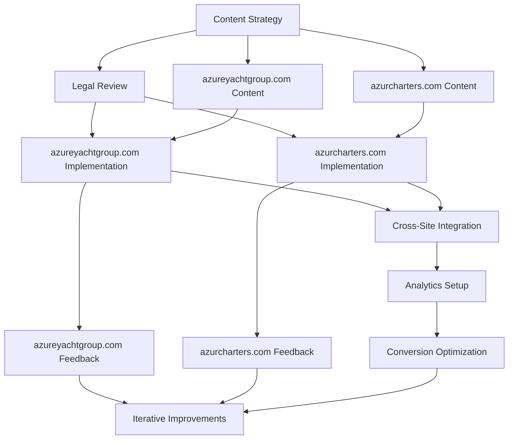

# Project Plan: Two-Website Business Framework Implementation

## Overview
This document outlines the comprehensive implementation plan for the Azure Yacht Group business framework, which now includes two separate websites to accommodate dedicated investment in the charter business. It serves as the master roadmap for development, integration, and deployment. Last updated: May 24, 2025.

## Website Structure Strategy

The Azure Yacht Group's online presence is strategically divided into two separate websites:

1. **azureyachtgroup.com (Project ID: 4198911)**
   - **Purpose**: Focuses on Yacht Brokerage and Yacht Design business pillars
   - **Content**: Main Azure Yacht Group corporate presence, brokerage services, and design services
   - **Target Audience**: Yacht buyers, sellers, and design clients

2. **azurcharters.com (Project ID: 12993249)**
   - **Purpose**: Dedicated to the Charter business pillar
   - **Content**: Charter offerings, destinations, and charter-specific services
   - **Target Audience**: Charter clients and charter investors
   - **Note**: This separation is due to having a dedicated investor for the charter business only

This separation allows for focused marketing, targeted client acquisition, and independent business operations while maintaining brand consistency across both properties.

## Current Phase: Phase 3 - Implementation Optimization

The project is currently in Phase 3, focusing on optimization of key systems, enhancement of sales conversion processes, integration of IYBA compliance standards across all business operations, and the separation of charter operations into a dedicated website.

## Recent Progress

✅ **API Integration Fixed**: The Tilda API integration issue has been resolved. The API now works with the original key lengths, enabling live content from Tilda instead of mock data.

## Project Timeline

```mermaid
gantt
    title Azure Yacht Group Implementation Timeline
    dateFormat  YYYY-MM-DD
    section Foundation
    Phase 1: Business Framework Setup           :done, a1, 2024-11-01, 90d
    section Core Development
    Phase 2: Core Systems Implementation        :done, a2, 2025-02-01, 90d
    section Optimization
    Phase 3: Implementation Optimization        :active, a3, 2025-05-01, 90d
    section Scaling
    Phase 4: Market Expansion                   :       a4, 2025-08-01, 90d
```

## Phase 3 Priority Implementation Tasks

Based on our updated business structure with two websites, the following are the priority tasks for the current implementation phase:

### High Priority (Next 30 Days)

1. **Charter Website Implementation**
   - **Status**: Planning Phase → Ready for Implementation
   - **Dependencies**: ✅ API Integration (Resolved)
   - **Success Metrics**: azurcharters.com live with all core pages
   - **Implementation Lead**: Website Development Team
   - **Deadline**: June 15, 2025

2. **Brokerage Services Enhancement**
   - **Status**: Content Created, Awaiting Implementation
   - **Dependencies**: ✅ API Integration (Resolved)
   - **Success Metrics**: Enhanced brokerage pages on azureyachtgroup.com
   - **Implementation Lead**: Website Development Team
   - **Deadline**: May 31, 2025

3. **IYBA Compliance Integration**
   - **Status**: Content Created, Awaiting Implementation
   - **Dependencies**: Legal review completion
   - **Success Metrics**: IYBA compliance section integrated into About pages on both sites
   - **Implementation Lead**: Legal & Web Development Teams
   - **Deadline**: May 31, 2025

4. **Yacht Design Section Launch**
   - **Status**: Content Development In Progress
   - **Dependencies**: Design portfolio assets
   - **Success Metrics**: Design section live on azureyachtgroup.com
   - **Implementation Lead**: Design & Web Development Teams
   - **Deadline**: June 7, 2025

### Medium Priority (60-90 Days)

1. **Resources Center Deployment**
   - **Status**: Content Created, Awaiting Implementation
   - **Dependencies**: Downloadable asset preparation
   - **Success Metrics**: Resources pages live on both websites
   - **Implementation Lead**: Content & Web Development Teams
   - **Deadline**: July 15, 2025

2. **Cross-Site Analytics Implementation**
   - **Status**: Planning Phase
   - **Dependencies**: Analytics configuration for both domains
   - **Success Metrics**: Cross-domain tracking deployed with unified reporting
   - **Implementation Lead**: Marketing Team
   - **Deadline**: July 31, 2025

3. **Mobile Experience Enhancement**
   - **Status**: Analysis Complete
   - **Dependencies**: None
   - **Success Metrics**: 100% mobile optimization score on both sites
   - **Implementation Lead**: Web Development Team
   - **Deadline**: August 15, 2025

### Additional Tasks (As Resources Allow)

1. **Live Chat Integration**
   - **Status**: Research Phase
   - **Dependencies**: Customer support protocols
   - **Success Metrics**: Live chat deployed with support team training
   - **Implementation Lead**: Customer Experience Team
   - **Target Date**: August 31, 2025

2. **Enhanced Search Capabilities**
   - **Status**: Requirements Gathering
   - **Dependencies**: Yacht database restructuring
   - **Success Metrics**: Advanced search deployed with filtering options
   - **Implementation Lead**: Development Team
   - **Target Date**: September 15, 2025

## Implementation Team & Responsibilities

| Team Member | Role | Key Responsibilities | Primary Website Focus |
|-------------|------|----------------------|----------------------|
| Michael Chen | Project Lead | Overall project coordination, stakeholder reporting | Both |
| Sarah Johnson | Web Development Lead | Tilda implementation, technical integration | Both |
| David Williams | Content Strategist | Content creation, optimization, messaging consistency | azureyachtgroup.com |
| Emma Rodriguez | UX/UI Designer | User experience, conversion optimization, visual design | Both |
| James Thompson | Marketing Specialist | Analytics, CRM integration, lead generation | Both |
| Alexandra Lee | Legal Compliance | IYBA standards, contract templates, legal framework | Both |
| Thomas Garcia | Charter Specialist | Charter content, pricing strategies, destination guides | azurcharters.com |
| Rebecca Wilson | Investor Relations | Charter investor communications, business reporting | azurcharters.com |

## Key Performance Indicators (KPIs)

1. **Website Conversion Rate**
   - Current: 2.3%
   - Target: 4.5%
   - Tracking: Weekly analytics review

2. **Qualified Lead Generation**
   - Current: 18-25 per month
   - Target: 35-45 per month
   - Tracking: Monthly CRM reporting

3. **Sales Cycle Duration**
   - Current: 45 days average
   - Target: 35 days average
   - Tracking: CRM pipeline analysis

4. **Customer Acquisition Cost**
   - Current: $1,200 per customer
   - Target: $950 per customer
   - Tracking: Monthly financial review

5. **Mobile Conversion Rate**
   - Current: 1.8%
   - Target: 3.5%
   - Tracking: Weekly device-specific analytics

## Risk Assessment & Mitigation

| Risk | Probability | Impact | Mitigation Strategy |
|------|------------|--------|---------------------|
| Development resource constraints | Medium | High | Prioritize conversion-focused elements, phase implementation |
| Integration challenges with CRM | Medium | Medium | Schedule additional testing time, prepare fallback options |
| Content development delays | Low | Medium | Create templates, prioritize high-impact pages |
| Mobile optimization challenges | Medium | High | Conduct early testing, address issues incrementally |
| Legal compliance gaps | Low | High | Regular reviews with legal team, documentation audits |
| Brand inconsistency between sites | Medium | High | Develop and enforce brand guidelines, regular design reviews |
| SEO impact of site separation | Medium | Medium | Implement proper redirects, cross-linking strategy, shared sitemap |

## Dependencies & Critical Path



## Communication Plan

| Stakeholder Group | Communication Method | Frequency | Owner |
|-------------------|----------------------|-----------|-------|
| Executive Team | Status Report | Weekly | Project Lead |
| Implementation Team | Standup Meeting | Daily | Development Lead |
| Marketing Team | Integration Update | Bi-weekly | Marketing Specialist |
| Legal Team | Compliance Review | Monthly | Legal Compliance Lead |
| All Stakeholders | Phase Milestone Report | End of Phase | Project Lead |

## Success Criteria

Phase 3 will be considered successfully completed when:

1. Both websites are fully implemented and functioning correctly
2. All high-priority tasks are completed on both properties
3. Conversion rates have increased by at least 50% from baseline on respective sites
4. Mobile optimization score reaches 95%+ on all key pages for both sites
5. IYBA compliance integration is complete and verified on both sites
6. Cross-domain analytics are providing accurate unified reporting
7. Charter business has successfully transitioned to dedicated website

## Revised Next Steps

1. **Charter Website Implementation** - Begin immediately now that API integration is resolved
   - Set up project structure and pages in Tilda
   - Implement basic navigation and template structure
   - Prepare content migration plan from main site

2. **Design Section Development** - Start concurrently with Charter Website
   - Implement Yacht Design section on main site
   - Create all planned subsections
   - Add conversion elements and inquiry forms

3. **IYBA Compliance Integration** - Complete for both sites
   - Implement on About Us pages
   - Ensure consistent implementation across both properties

4. **Brokerage Enhancement** - Complete on main site
   - Enhance current brokerage pages
   - Implement content awaiting implementation

---

*Last Updated: May 24, 2025*
*Next Review: June 5, 2025*

---

*Last Updated: April 30, 2025*
*Next Review: May 30, 2025* 