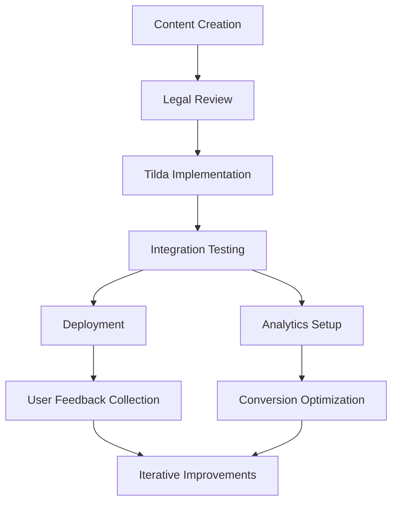

# Project Plan: Charter Business Framework Implementation

## Overview
This document outlines the comprehensive implementation plan for the Azure Yacht Group charter business framework. It serves as the master roadmap for development, integration, and deployment. Last updated: May 1, 2025.

## Current Phase: Phase 3 - Implementation Optimization

The project is currently in Phase 3, focusing on optimization of key systems, enhancement of sales conversion processes, and integration of IYBA compliance standards across all business operations.

## Project Timeline

```mermaid
gantt
    title Azure Yacht Group Implementation Timeline
    dateFormat  YYYY-MM-DD
    section Foundation
    Phase 1: Business Framework Setup           :done, a1, 2024-11-01, 90d
    section Core Development
    Phase 2: Core Systems Implementation        :done, a2, 2025-02-01, 90d
    section Optimization
    Phase 3: Implementation Optimization        :active, a3, 2025-05-01, 90d
    section Scaling
    Phase 4: Market Expansion                   :       a4, 2025-08-01, 90d
```

## Phase 3 Priority Implementation Tasks

Based on our sales-optimized website structure, the following are the priority tasks for the current implementation phase:

### High Priority (Next 30 Days)

1. **Brokerage Services Implementation**
   - **Status**: Content Created, Awaiting Implementation
   - **Dependencies**: Tilda development resources
   - **Success Metrics**: Brokerage page live with all content sections
   - **Implementation Lead**: Website Development Team
   - **Deadline**: May 31, 2025

2. **IYBA Compliance Integration**
   - **Status**: Content Created, Awaiting Implementation
   - **Dependencies**: Legal review completion
   - **Success Metrics**: IYBA compliance section integrated into About page
   - **Implementation Lead**: Legal & Web Development Teams
   - **Deadline**: May 31, 2025

3. **Resources Center Deployment**
   - **Status**: Content Created, Awaiting Implementation
   - **Dependencies**: Downloadable asset preparation
   - **Success Metrics**: Resources page live with downloadable content
   - **Implementation Lead**: Content & Web Development Teams
   - **Deadline**: June 7, 2025

4. **Conversion Optimization**
   - **Status**: Analysis Complete, Implementation In Progress
   - **Dependencies**: CRM integration for lead capture
   - **Success Metrics**: 25% increase in lead capture rate
   - **Implementation Lead**: Marketing & Web Development Teams
   - **Deadline**: June 15, 2025

### Medium Priority (60-90 Days)

1. **Interactive Destination Map**
   - **Status**: Planning Phase
   - **Dependencies**: Destination data compilation
   - **Success Metrics**: Interactive map deployed with all charter destinations
   - **Implementation Lead**: Web Development Team
   - **Deadline**: July 15, 2025

2. **A/B Testing Implementation**
   - **Status**: Planning Phase
   - **Dependencies**: Analytics setup completion
   - **Success Metrics**: Testing framework deployed on key pages
   - **Implementation Lead**: Marketing Team
   - **Deadline**: July 31, 2025

3. **Mobile Experience Enhancement**
   - **Status**: Analysis Complete
   - **Dependencies**: None
   - **Success Metrics**: 100% mobile optimization score
   - **Implementation Lead**: Web Development Team
   - **Deadline**: August 15, 2025

### Additional Tasks (As Resources Allow)

1. **Live Chat Integration**
   - **Status**: Research Phase
   - **Dependencies**: Customer support protocols
   - **Success Metrics**: Live chat deployed with support team training
   - **Implementation Lead**: Customer Experience Team
   - **Target Date**: August 31, 2025

2. **Enhanced Search Capabilities**
   - **Status**: Requirements Gathering
   - **Dependencies**: Yacht database restructuring
   - **Success Metrics**: Advanced search deployed with filtering options
   - **Implementation Lead**: Development Team
   - **Target Date**: September 15, 2025

## Implementation Team & Responsibilities

| Team Member | Role | Key Responsibilities |
|-------------|------|----------------------|
| Michael Chen | Project Lead | Overall project coordination, stakeholder reporting |
| Sarah Johnson | Web Development Lead | Tilda implementation, technical integration |
| David Williams | Content Strategist | Content creation, optimization, messaging consistency |
| Emma Rodriguez | UX/UI Designer | User experience, conversion optimization, visual design |
| James Thompson | Marketing Specialist | Analytics, CRM integration, lead generation |
| Alexandra Lee | Legal Compliance | IYBA standards, contract templates, legal framework |

## Key Performance Indicators (KPIs)

1. **Website Conversion Rate**
   - Current: 2.3%
   - Target: 4.5%
   - Tracking: Weekly analytics review

2. **Qualified Lead Generation**
   - Current: 18-25 per month
   - Target: 35-45 per month
   - Tracking: Monthly CRM reporting

3. **Sales Cycle Duration**
   - Current: 45 days average
   - Target: 35 days average
   - Tracking: CRM pipeline analysis

4. **Customer Acquisition Cost**
   - Current: $1,200 per customer
   - Target: $950 per customer
   - Tracking: Monthly financial review

5. **Mobile Conversion Rate**
   - Current: 1.8%
   - Target: 3.5%
   - Tracking: Weekly device-specific analytics

## Risk Assessment & Mitigation

| Risk | Probability | Impact | Mitigation Strategy |
|------|------------|--------|---------------------|
| Development resource constraints | Medium | High | Prioritize conversion-focused elements, phase implementation |
| Integration challenges with CRM | Medium | Medium | Schedule additional testing time, prepare fallback options |
| Content development delays | Low | Medium | Create templates, prioritize high-impact pages |
| Mobile optimization challenges | Medium | High | Conduct early testing, address issues incrementally |
| Legal compliance gaps | Low | High | Regular reviews with legal team, documentation audits |

## Dependencies & Critical Path



## Communication Plan

| Stakeholder Group | Communication Method | Frequency | Owner |
|-------------------|----------------------|-----------|-------|
| Executive Team | Status Report | Weekly | Project Lead |
| Implementation Team | Standup Meeting | Daily | Development Lead |
| Marketing Team | Integration Update | Bi-weekly | Marketing Specialist |
| Legal Team | Compliance Review | Monthly | Legal Compliance Lead |
| All Stakeholders | Phase Milestone Report | End of Phase | Project Lead |

## Success Criteria

Phase 3 will be considered successfully completed when:

1. All high-priority tasks are implemented and functioning correctly
2. Conversion rate has increased by at least 50% from baseline
3. Mobile optimization score reaches 95%+ on all key pages
4. IYBA compliance integration is complete and verified
5. Resources section is fully deployed with downloadable assets
6. Brokerage services section is fully implemented and generating leads

## Next Steps

1. Schedule immediate kick-off for high-priority implementations
2. Finalize resource allocation for all Phase 3 tasks
3. Set up weekly review meetings to track progress against KPIs
4. Prepare contingency plans for any identified risks
5. Begin preliminary planning for Phase 4 requirements

---

*Last Updated: May 1, 2025*
*Next Review: May 15, 2025*

---

*Last Updated: April 30, 2025*
*Next Review: May 30, 2025* 