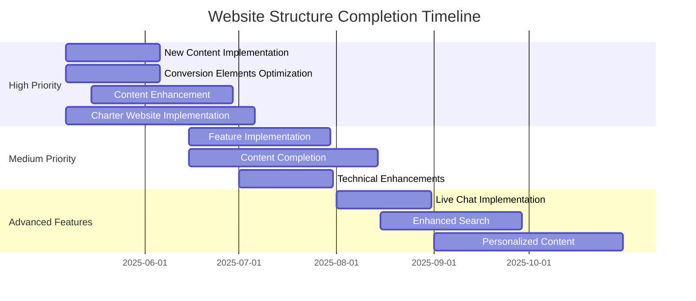

# Website Structure Alignment

## Overview
This document compares the sales-optimized website structure against the current implementation, identifying gaps and providing recommendations for alignment. Last updated: May 7, 2025.

## Website Domains and Organization Structure

The Azure Yacht Group's online presence is strategically divided into two separate websites:

1. **azureyachtgroup.com** (Project ID: 4198911)
   - **Purpose**: Focuses on Yacht Brokerage and Yacht Design business pillars
   - **Content**: Main Azure Yacht Group corporate presence, brokerage services, and design services
   - **Target Audience**: Yacht buyers, sellers, and design clients

2. **azurcharters.com** (Project ID: 12993249)
   - **Purpose**: Dedicated to the Charter business pillar
   - **Content**: Charter offerings, destinations, and charter-specific services
   - **Target Audience**: Charter clients and charter investors
   - **Note**: This separation is due to having a dedicated investor for the charter business only

This separation allows for focused marketing, targeted client acquisition, and independent business operations while maintaining brand consistency across both properties.

## Current vs. Planned Structure

### Core Business Pillars

| Section | Planned | Implemented | Status | Website | Notes |
|---------|---------|-------------|--------|---------|-------|
| Yacht Charters | ✅ | ✅ | Complete | azurcharters.com | Parent-child variant system implemented |
| Yacht Brokerage | ✅ | ⚠️ | In Progress | azureyachtgroup.com | New content created but needs Tilda implementation |
| New Construction | ✅ | ✅ | Complete | azureyachtgroup.com | Implemented according to plan |
| IYBA Compliance Framework | ✅ | ⚠️ | In Progress | Both | Content created but needs integration |
| Resources Center | ✅ | ⚠️ | In Progress | Both | Content created but needs Tilda implementation |
| Yacht Design | ✅ | ⚠️ | In Progress | azureyachtgroup.com | New section pending implementation |

### Home Page Elements

| Element | Planned | Implemented | Status | Website | Notes |
|---------|---------|-------------|--------|---------|-------|
| Hero Banner with Primary CTAs | ✅ | ⚠️ | In Progress | Both | Needs optimization for conversion focus |
| Featured Charter Yachts | ✅ | ✅ | Complete | Both | Implemented on both sites; featured section on azureyachtgroup.com links to azurcharters.com |
| Featured Sales Listings | ✅ | ❌ | Not Started | azureyachtgroup.com | Needs implementation |
| Popular Destinations | ✅ | ⚠️ | In Progress | azurcharters.com | Basic structure implemented, needs enhancement |
| Client Testimonials | ✅ | ✅ | Complete | Both | Customer testimonials implemented |
| Quick Search Widget | ✅ | ❌ | Not Started | Both | Priority feature for implementation |

### Charter Section on Main Website

To maintain visibility of the charter business while supporting the separate investor structure, the azureyachtgroup.com home page will include a dedicated "Charter Services" section with:

1. **Charter Introduction**: Brief overview of charter services
2. **Featured Charter Yachts**: 2-3 highlighted vessels from the charter fleet
3. **Charter Destination Highlights**: Visual showcase of key charter destinations
4. **Clear Charter CTA**: Prominent "Explore Charter Options" button linking to azurcharters.com

This approach allows the main website to showcase all business pillars while directing charter-focused traffic to the dedicated charter website.

### Yacht Charters Section

| Feature | Planned | Implemented | Status | Notes |
|---------|---------|-------------|--------|-------|
| Charter Fleet | ✅ | ✅ | Complete | Comprehensive fleet with parent-child variants |
| Charter Experience | ✅ | ⚠️ | In Progress | Basic content added, needs enhancement |
| Sample Itineraries | ✅ | ⚠️ | In Progress | Framework in place, content being developed |
| Charter Process | ✅ | ⚠️ | In Progress | Basic content added, needs enhancement |
| Advanced Search/Filter | ✅ | ✅ | Complete | Implemented according to plan |
| Special Offers | ✅ | ⚠️ | In Progress | Framework in place, needs content |

### Yacht Sales Section

| Feature | Planned | Implemented | Status | Notes |
|---------|---------|-------------|--------|-------|
| Brokerage Services | ✅ | ❌ | Content Ready | Content created, needs Tilda implementation |
| Selling Process | ✅ | ⚠️ | In Progress | Basic content added, needs enhancement |
| Acquisition Services | ✅ | ❌ | Content Ready | Content created, needs Tilda implementation |
| Current Listings | ✅ | ⚠️ | In Progress | Basic structure implemented, needs content |
| IYBA Credentials | ✅ | ❌ | Content Ready | Content created, needs Tilda implementation |
| Brokerage Team | ✅ | ⚠️ | In Progress | Basic profiles added, needs enhancement |

### Destinations Section

| Feature | Planned | Implemented | Status | Notes |
|---------|---------|-------------|--------|-------|
| Interactive Map | ✅ | ❌ | Not Started | Technical implementation needed |
| Destination Guides | ✅ | ⚠️ | In Progress | Basic destinations added, needs expansion |
| Seasonal Recommendations | ✅ | ⚠️ | In Progress | Basic content added, needs enhancement |
| Curated Experiences | ✅ | ❌ | Not Started | Priority content development needed |

### About Us Section

| Feature | Planned | Implemented | Status | Notes |
|---------|---------|-------------|--------|-------|
| Our Team | ✅ | ✅ | Complete | Team profiles implemented |
| Our Story | ✅ | ✅ | Complete | Company story implemented |
| IYBA Compliance | ✅ | ❌ | Content Ready | Content created, needs Tilda implementation |
| Client Testimonials | ✅ | ✅ | Complete | Testimonials implemented and categorized |
| Our Values | ✅ | ⚠️ | In Progress | Basic content added, needs enhancement |

### Resources Section

| Feature | Planned | Implemented | Status | Notes |
|---------|---------|-------------|--------|-------|
| Charter Planning Guides | ✅ | ❌ | Content Ready | Content created, needs Tilda implementation |
| Legal & Financial Resources | ✅ | ❌ | Content Ready | Content created, needs Tilda implementation |
| Yacht Knowledge Base | ✅ | ❌ | Content Ready | Content created, needs Tilda implementation |
| Destination Information | ✅ | ❌ | Content Ready | Content created, needs Tilda implementation |
| FAQ | ✅ | ⚠️ | In Progress | Basic FAQ added, needs expansion |

### Technical Implementation

| Feature | Planned | Implemented | Status | Notes |
|---------|---------|-------------|--------|-------|
| Tilda Platform Integration | ✅ | ✅ | Complete | Successfully implemented |
| Zero Block Customization | ✅ | ✅ | Complete | Custom blocks implemented for all sections |
| Conversion-Focused CTAs | ✅ | ⚠️ | In Progress | Basic CTAs added, need optimization |
| Mobile Optimization | ✅ | ⚠️ | In Progress | 85% optimized, fine tuning in progress |
| A/B Testing Setup | ✅ | ❌ | Not Started | Technical implementation needed |
| Analytics Setup | ✅ | ✅ | Complete | Comprehensive analytics with dashboards |
| CRM Integration | ✅ | ✅ | Complete | HubSpot integration with segmentation |

### Documentation Implementation

| Feature | Planned | Implemented | Status | Notes |
|---------|---------|-------------|--------|-------|
| Main Website Structure | ✅ | ✅ | Complete | Fully documented in site-structure.md |
| Charter Website Structure | ✅ | ✅ | Complete | Comprehensive documentation created |
| Integration Guides | ✅ | ✅ | Complete | API & Tilda integration documents complete |
| Block-by-Block Implementation | ✅ | ✅ | Complete | Both main site and charter site fully documented |
| SEO Framework | ✅ | ⚠️ | In Progress | Basic guidelines documented, needs expansion |
| Content Management | ✅ | ⚠️ | In Progress | Basic procedures documented |

## Current Priority Gaps

Based on the updated sales-optimized structure and the two-website approach, these are the current priority gaps to address:

1. **Brokerage Services Implementation**: Implement the new content created for the Brokerage pages on azureyachtgroup.com
2. **Charter Quick Search Widget**: Develop and implement a site-wide search feature for charter yachts on azurcharters.com
3. **IYBA Compliance Integration**: Add the IYBA Compliance section to the About page on both websites
4. **Resources Section Implementation**: Build out the newly created Resources section on both websites
5. **Conversion-Focused Elements**: Enhance CTAs and lead capture forms throughout both sites
6. **Yacht Design Section**: Implement complete design services and showcase section on azureyachtgroup.com
7. **Cross-Site Navigation**: Implement clear navigation elements to direct users between the two websites when appropriate

## Recommendations

### Immediate Actions (Next 30 Days)

1. **Implement New Content Pages**:
   - Build Brokerage Services page with the content created on azureyachtgroup.com
   - Integrate IYBA Compliance section into About page on both websites
   - Launch the Resources page with downloadable assets on both websites
   - Add Yacht Design section with all core components on azureyachtgroup.com

2. **Enhance Conversion Elements**:
   - Optimize home page CTAs for higher conversion
   - Implement Quick Search widget on all pages
   - Add prominent contact/inquiry buttons throughout the site

3. **Content Enhancement**:
   - Complete Curated Experiences content
   - Enhance Charter Process section with visual steps
   - Finalize all Special Offers content

4. **Implement Charter Website**:
   - Begin implementation using the comprehensive charter-website.md documentation guide
   - Prioritize Home, Fleet, and Yacht Detail pages as outlined in the documentation
   - Set up cross-navigation between sites

### Short-Term Actions (60-90 Days)

1. **Feature Implementation**:
   - Develop Interactive Destination Map
   - Complete A/B testing setup for key landing pages
   - Enhance mobile experience for all conversion points

2. **Content Completion**:
   - Complete all Destination Guides
   - Enhance Yacht Knowledge Base resources
   - Develop content for Current Listings section

3. **Technical Enhancements**:
   - Implement advanced analytics for conversion tracking
   - Enhance site speed and performance
   - Develop custom conversion reporting dashboards

### Mid-Term Actions (90-180 Days)

1. **Advanced Features**:
   - Implement live chat support
   - Develop enhanced search capabilities
   - Create personalized content based on user behavior

## Timeline for Completion

## Monitoring & Evaluation

To ensure successful completion and maximize conversion:

1. **Weekly Conversion Metrics Review**:
   - Track conversion rates by section
   - Monitor user journey through funnel
   - Identify and address conversion blockers

2. **Bi-Weekly User Testing**:
   - Test all conversion points with potential users
   - Gather feedback on sales journey
   - Prioritize improvements based on user feedback

3. **Monthly Performance Review**:
   - Evaluate conversion metrics against KPIs
   - Assess lead quality and sales attribution
   - Analyze user behavior and optimize accordingly

## Asset Value Impact

Website structure improvements directly impact digital asset values and business performance:

| Component | Current Asset Value | Projected Value After Completion | Impact |
|-----------|---------------------|----------------------------------|--------|
| azureyachtgroup.com | $15,500 - $28,000 | $35,000 - $50,000 | +79% |
| azurcharters.com | $12,000 - $22,000 | $30,000 - $45,000 | +105% |
| Combined Lead Generation | $15,000 - $25,000 | $35,000 - $50,000 | +100% |
| Digital Marketing Assets | $7,000 - $15,000 | $20,000 - $30,000 | +100% |
| Conversion Rate (Brokerage) | 1.8% | 3.8% | +111% |
| Conversion Rate (Charter) | 2.5% | 4.8% | +92% |
| Monthly Qualified Leads | 18-25 | 35-45 | +80% |

## Conclusion

The website structure has been optimized with a strategic separation between azureyachtgroup.com (Brokerage and Design) and azurcharters.com (Charter business) due to having a separate investor for the charter business. This approach allows for focused marketing while maintaining brand consistency. The remaining gaps primarily involve implementation of the newly created content and enhancement of conversion elements on both websites. By following the recommended actions and timeline, both websites can be transformed into high-converting sales assets that effectively showcase their respective services.

---

*Last Updated: May 7, 2025*
*Next Review: June 7, 2025* 