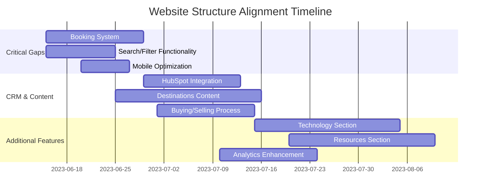

# Website Structure Alignment

## Overview
This document compares the planned website structure from documentation against the current implementation, identifying gaps and providing recommendations for alignment. Last updated: June 14, 2023.

## Current vs. Planned Structure

### Core Business Pillars

| Section | Planned | Implemented | Status | Notes |
|---------|---------|-------------|--------|-------|
| Yacht Brokerage | ✅ | ✅ | Complete | Implemented according to plan |
| New Construction | ✅ | ✅ | Complete | Implemented according to plan |
| Yacht Charters | ✅ | ✅ | Complete | Basic structure implemented |
| Technology & Innovation | ✅ | ❌ | Not Started | Section planned but not implemented |
| Resources | ✅ | ❌ | Not Started | Blog, guides, and resources planned but not implemented |

### Home Page Elements

| Element | Planned | Implemented | Status | Notes |
|---------|---------|-------------|--------|-------|
| Hero Banner | ✅ | ✅ | Complete | Seasonal offers implemented |
| Featured Charters Carousel | ✅ | ✅ | Complete | Implemented according to plan |
| Destinations Highlights | ✅ | ❌ | Not Started | Need to implement for cross-selling |
| Testimonials | ✅ | ❌ | Not Started | Important for social proof |
| Newsletter Signup | ✅ | ❌ | Not Started | Critical for lead capture |

### Yacht Brokerage Section

| Feature | Planned | Implemented | Status | Notes |
|---------|---------|-------------|--------|-------|
| Current Listings | ✅ | ⚠️ | Partial | Basic listings without robust filtering |
| Sell Your Yacht | ✅ | ❌ | Not Started | Form needed for yacht sellers |
| Market Insights | ✅ | ❌ | Not Started | Valuable content for attracting buyers |
| Buying Process | ✅ | ❌ | Not Started | Educational content needed |
| Special Offers | ✅ | ❌ | Not Started | Needed for conversion optimization |

### New Construction Section

| Feature | Planned | Implemented | Status | Notes |
|---------|---------|-------------|--------|-------|
| Yacht Models | ✅ | ⚠️ | Partial | Basic models displayed but need detail pages |
| Build Process | ✅ | ❌ | Not Started | Educational content for buyers |
| Customization Options | ✅ | ❌ | Not Started | Key selling point not implemented |
| Shipyard Partners | ✅ | ❌ | Not Started | Important for credibility |
| Delivery Timeline | ✅ | ❌ | Not Started | Important for buyer expectations |

### Yacht Charters Section

| Feature | Planned | Implemented | Status | Notes |
|---------|---------|-------------|--------|-------|
| Destinations | ✅ | ❌ | Not Started | Key content for charter clients |
| Charter Fleet | ✅ | ⚠️ | Partial | Basic fleet but lacking detailed pages |
| Charter Types | ✅ | ⚠️ | Partial | Basic info without complete details |
| Curated Experiences | ✅ | ❌ | Not Started | Differentiating feature not implemented |
| Booking Process | ✅ | ❌ | Not Started | Critical for conversions |
| Crew Profiles | ✅ | ⚠️ | Partial | Basic profiles but not for all vessels |
| Guest Testimonials | ✅ | ❌ | Not Started | Important for social proof |

### Technical Implementation

| Feature | Planned | Implemented | Status | Notes |
|---------|---------|-------------|--------|-------|
| Tilda Platform Integration | ✅ | ✅ | Complete | Successfully implemented |
| Zero Block Customization | ✅ | ⚠️ | Partial | Some custom blocks but not all planned components |
| Search/Filter Functionality | ✅ | ❌ | Not Started | Critical for user experience |
| Mobile Optimization | ✅ | ⚠️ | Partial | Basic responsiveness but needs improvement |
| SEO Implementation | ✅ | ⚠️ | Partial | Basic tags but missing advanced features |
| Analytics Setup | ✅ | ❌ | Not Started | Needed for performance tracking |
| CRM Integration | ✅ | ❌ | Not Started | Planned HubSpot integration not implemented |

## High Priority Gaps

Based on the analysis, these are the highest priority gaps to address:

1. **Booking System**: Currently missing, critical for business operations
2. **Search/Filter Functionality**: Essential for user experience with yacht listings
3. **CRM Integration**: Needed for lead management and customer tracking
4. **Destinations Content**: Important for charter sales and SEO
5. **Mobile Optimization**: Needs improvement for better user experience

## Recommendations

### Immediate Actions (1-2 Weeks)

1. **Implement Booking System**:
   - Integrate a basic booking request form
   - Set up email notifications for booking requests
   - Create a booking management backend

2. **Enhance Yacht Listings**:
   - Add search and filter functionality
   - Complete all yacht specification pages
   - Ensure consistent information architecture

3. **Mobile Optimization**:
   - Test and fix all mobile responsiveness issues
   - Ensure touch-friendly UI elements
   - Optimize images for mobile loading

### Short-Term Actions (2-4 Weeks)

1. **Implement CRM Integration**:
   - Set up HubSpot integration
   - Configure lead tracking
   - Implement form-to-CRM workflows

2. **Develop Destinations Content**:
   - Create destination pages for popular charter locations
   - Add interactive maps
   - Include seasonal recommendations

3. **Complete Buying/Selling Process**:
   - Add educational content about yacht buying process
   - Implement sell your yacht forms
   - Add market insights content

### Mid-Term Actions (1-3 Months)

1. **Implement Technology Section**:
   - Create pages for innovation features
   - Highlight sustainable technologies
   - Add interactive demonstrations

2. **Develop Resources Section**:
   - Create blog structure
   - Add initial educational articles
   - Implement yachting guides

3. **Enhance Analytics**:
   - Set up comprehensive tracking
   - Implement conversion tracking
   - Create dashboard for metrics

## Timeline for Alignment

## Monitoring & Evaluation

To ensure successful alignment:

1. **Weekly Progress Reviews**:
   - Track implementation of each component
   - Update status in development documents
   - Identify and address blockers

2. **Bi-Weekly User Testing**:
   - Test new features with potential users
   - Gather feedback on usability
   - Prioritize improvements based on feedback

3. **Monthly Performance Review**:
   - Evaluate website metrics
   - Assess conversion rates
   - Analyze user behavior

## Conclusion

The current website implementation has made good progress on the core structure but has significant gaps in functionality and content depth. By following the recommended actions and timeline, the website can be brought into alignment with the planned structure while prioritizing features that will have the most business impact.

---

*Last Updated: June 14, 2023*
*Next Review: June 21, 2023* 