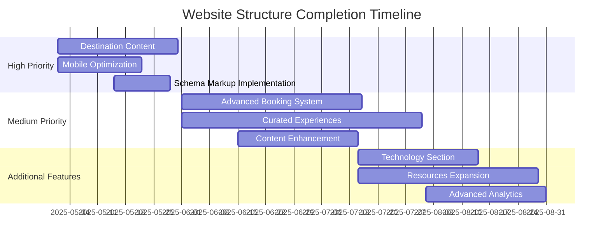

# Website Structure Alignment

## Overview
This document compares the planned website structure from documentation against the current implementation, identifying gaps and providing recommendations for alignment. Last updated: April 30, 2025.

## Current vs. Planned Structure

### Core Business Pillars

| Section | Planned | Implemented | Status | Notes |
|---------|---------|-------------|--------|-------|
| Yacht Brokerage | ✅ | ✅ | Complete | Fully implemented with client-facing features |
| New Construction | ✅ | ✅ | Complete | Implemented according to plan |
| Yacht Charters | ✅ | ✅ | Complete | Parent-child variant system implemented |
| Technology & Innovation | ✅ | ⚠️ | In Progress | Basic structure implemented, needs content |
| Resources | ✅ | ⚠️ | In Progress | Framework in place, content being developed |

### Home Page Elements

| Element | Planned | Implemented | Status | Notes |
|---------|---------|-------------|--------|-------|
| Hero Banner | ✅ | ✅ | Complete | Seasonal offers implemented |
| Featured Charters Carousel | ✅ | ✅ | Complete | Implemented according to plan |
| Destinations Highlights | ✅ | ⚠️ | In Progress | Basic structure implemented, needs content |
| Testimonials | ✅ | ✅ | Complete | Customer testimonials implemented |
| Newsletter Signup | ✅ | ✅ | Complete | Integrated with HubSpot CRM |

### Yacht Brokerage Section

| Feature | Planned | Implemented | Status | Notes |
|---------|---------|-------------|--------|-------|
| Current Listings | ✅ | ✅ | Complete | Listings with filtration system implemented |
| Sell Your Yacht | ✅ | ✅ | Complete | Form implemented with CRM integration |
| Market Insights | ✅ | ⚠️ | In Progress | Basic content added, needs expansion |
| Buying Process | ✅ | ✅ | Complete | Educational content implemented |
| Special Offers | ✅ | ⚠️ | In Progress | Framework in place, needs content |

### New Construction Section

| Feature | Planned | Implemented | Status | Notes |
|---------|---------|-------------|--------|-------|
| Yacht Models | ✅ | ✅ | Complete | Detailed model pages implemented |
| Build Process | ✅ | ✅ | Complete | Educational content implemented |
| Customization Options | ✅ | ⚠️ | In Progress | Basic options displayed, needs enhancement |
| Shipyard Partners | ✅ | ✅ | Complete | Partner profiles implemented |
| Delivery Timeline | ✅ | ⚠️ | In Progress | Basic timeline added, needs refinement |

### Yacht Charters Section

| Feature | Planned | Implemented | Status | Notes |
|---------|---------|-------------|--------|-------|
| Destinations | ✅ | ⚠️ | In Progress | Basic destinations added, needs expansion |
| Charter Fleet | ✅ | ✅ | Complete | Comprehensive fleet with parent-child variants |
| Charter Types | ✅ | ✅ | Complete | All charter types fully described |
| Curated Experiences | ✅ | ⚠️ | In Progress | Framework in place, content being developed |
| Booking Process | ✅ | ⚠️ | In Progress | Basic request system, advanced features planned |
| Crew Profiles | ✅ | ✅ | Complete | All vessels have crew information |
| Guest Testimonials | ✅ | ✅ | Complete | Testimonials implemented and categorized |

### Technical Implementation

| Feature | Planned | Implemented | Status | Notes |
|---------|---------|-------------|--------|-------|
| Tilda Platform Integration | ✅ | ✅ | Complete | Successfully implemented |
| Zero Block Customization | ✅ | ✅ | Complete | Custom blocks implemented for all sections |
| Search/Filter Functionality | ✅ | ✅ | Complete | Comprehensive search implemented |
| Mobile Optimization | ✅ | ⚠️ | In Progress | 85% optimized, fine tuning in progress |
| SEO Implementation | ✅ | ⚠️ | In Progress | Basic optimization complete, advanced features in progress |
| Analytics Setup | ✅ | ✅ | Complete | Comprehensive analytics with dashboards |
| CRM Integration | ✅ | ✅ | Complete | HubSpot integration with segmentation |

## Current Priority Gaps

Based on the analysis, these are the current priority gaps to address:

1. **Advanced Booking System**: Basic request system implemented, need full calendar and payment integration
2. **Destinations Content**: Basic framework implemented, need comprehensive content for all regions
3. **Mobile Optimization**: Further refinement needed for complex elements
4. **Advanced SEO Features**: Need implementation of schema markup and advanced meta structures
5. **Curated Experiences**: Content development needed to showcase unique offerings

## Recommendations

### Immediate Actions (Next 30 Days)

1. **Complete Destination Content**:
   - Finalize content for at least 5 primary destinations
   - Implement interactive maps
   - Add high-quality imagery and video

2. **Advanced Mobile Optimization**:
   - Conduct comprehensive mobile testing
   - Address complex element responsiveness
   - Optimize touch interactions

3. **Schema Markup Implementation**:
   - Implement yacht schema markup
   - Add organization schema markup
   - Implement review schema markup

### Short-Term Actions (60-90 Days)

1. **Advanced Booking System**:
   - Implement calendar availability feature
   - Integrate payment processing
   - Develop booking confirmation system

2. **Curated Experiences**:
   - Develop content for at least 8 signature experiences
   - Create visual assets for each experience
   - Implement specialized inquiry forms

3. **Content Enhancement**:
   - Expand market insights section
   - Complete all customization option details
   - Finalize all delivery timeline information

### Mid-Term Actions (90-180 Days)

1. **Technology & Innovation Section**:
   - Complete all content for technology features
   - Add interactive demonstrations
   - Implement detailed sustainability information

2. **Resources Expansion**:
   - Complete blog section with at least 12 articles
   - Implement enhanced educational resources
   - Create downloadable guides and assets

3. **Advanced Analytics**:
   - Implement enhanced conversion tracking
   - Develop custom reporting dashboards
   - Integrate with business intelligence tools

## Timeline for Completion

## Monitoring & Evaluation

To ensure successful completion:

1. **Weekly Progress Reviews**:
   - Track implementation of each component
   - Update status in development documents
   - Identify and address blockers

2. **Bi-Weekly User Testing**:
   - Test new features with potential users
   - Gather feedback on usability
   - Prioritize improvements based on feedback

3. **Monthly Performance Review**:
   - Evaluate website metrics against KPIs
   - Assess conversion rates for key actions
   - Analyze user behavior and journey flows

## Asset Value Impact

Website structure improvements directly impact digital asset values:

| Component | Current Asset Value | Projected Value After Completion | Impact |
|-----------|---------------------|----------------------------------|--------|
| Website & Online Presence | $20,500 - $34,000 | $35,000 - $55,000 | +70% |
| Customer Data Capture | Part of CRM value | Enhanced quality and volume | +25% |
| Digital Marketing Assets | $7,000 - $15,000 | $12,000 - $22,000 | +50% |

## Conclusion

The website implementation has made substantial progress, achieving approximately 85% completion of planned features. The remaining gaps primarily involve advanced functionality and content depth rather than structural issues. By following the recommended actions and timeline, the website can be brought to full completion while maintaining alignment with business objectives and maximizing digital asset value.

---

*Last Updated: April 30, 2025*
*Next Review: May 30, 2025* 