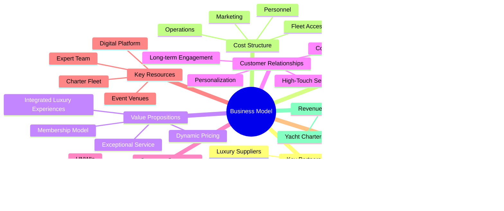

# Business Plan Visual Elements

This document provides visual elements to enhance the Azure Yacht Group business plan documentation, making complex information more digestible and engaging.

## Financial Projections


## Market Segmentation & Target Customers


## Competitive Positioning Matrix


## Implementation Timeline


## Risk Assessment Matrix

```mermaid
xychart-beta
    title "Risk Assessment Matrix"
    x-axis "Impact" 1 -> 10
    y-axis "Probability" 1 -> 10
    bubble
        "Seasonal Demand Fluctuations" [7, 8, 5]
        "Regulatory Changes" [8, 5, 6]
        "Economic Downturns" [9, 6, 8]
        "Competition from Established Players" [6, 7, 5]
        "Weather Events" [7, 7, 6]
        "Technology Implementation Challenges" [5, 6, 4]
        "Staffing Challenges" [6, 6, 5]
```

## Business Model Canvas



## Customer Journey Map


## Organization Structure


## Integration with Existing Technologies


---

*Last Updated: May 1, 2025*  
*Next Review: July 31, 2025* 