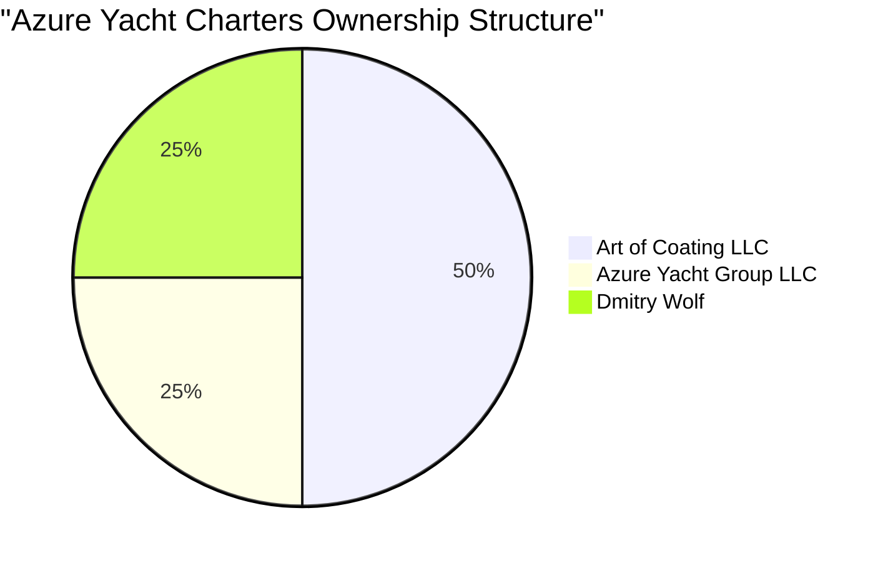

# Azure Yacht Charters - Capitalization Table

## Executive Summary

This document details the ownership structure of Azure Yacht Charters, a premium yacht charter business focused on luxury experiences with high service integration. The company is strategically structured with balanced ownership between corporate entities and individual stakeholders.

## Capitalization Structure

### Basic Ownership Allocation

| Stakeholder | Ownership Percentage | Ownership Type |
|-------------|---------------------|----------------|
| Art of Coating LLC | 50% | Corporate Entity |
| Azure Yacht Group LLC | 25% | Corporate Entity |
| Dmitry Wolf | 25% | Individual |
| **Total** | **100%** | |

### Detailed Cap Table

| Stakeholder | Class of Shares | Number of Shares | Percentage Ownership | Fully Diluted Percentage |
|-------------|----------------|------------------|---------------------|--------------------------|
| Art of Coating LLC | Class A Common | 500,000 | 50% | 50% |
| Azure Yacht Group LLC | Class A Common | 250,000 | 25% | 25% |
| Dmitry Wolf | Class A Common | 250,000 | 25% | 25% |
| **Total** | | **1,000,000** | **100%** | **100%** |

## Ownership Structure Visualization

## Governance Structure

### Voting Rights

| Stakeholder | Voting Shares | Voting Percentage |
|-------------|--------------|-------------------|
| Art of Coating LLC | 500,000 | 50% |
| Azure Yacht Group LLC | 250,000 | 25% |
| Dmitry Wolf | 250,000 | 25% |
| **Total** | **1,000,000** | **100%** |

### Board Composition

The Board of Directors consists of 3 members with the following representation:
- Art of Coating LLC: 2 board seats
- Azure Yacht Group LLC: 1 board seat (shared with Dmitry Wolf)

### Key Decisions

Certain major decisions require approval from shareholders representing at least 75% of the ownership, ensuring that no single entity can make unilateral decisions affecting the company's strategic direction.

## Investment Considerations

This ownership structure offers several advantages for potential investors:

1. **Balanced Corporate Governance**: The distribution of ownership ensures balanced decision-making with checks and balances between the stakeholders.

2. **Operational Expertise**: Azure Yacht Group LLC brings industry expertise and operational capabilities in the yacht charter sector.

3. **Strategic Leadership**: Dmitry Wolf provides individual leadership and entrepreneurial vision.

4. **Majority Stability**: Art of Coating LLC provides stable majority control, ensuring consistent strategic direction.

5. **Clear Decision Pathway**: The governance structure has clear protocols for both operational and strategic decisions.

## Future Equity Allocations

The company has reserved an option pool of up to 10% of additional shares for future key employees and strategic investors, which would dilute all existing shareholders proportionally.

---

*Last Updated: June 1, 2025*  
*Prepared By: Azure Yacht Group Finance Team*  
*Confidential - For Investor Review Only* 