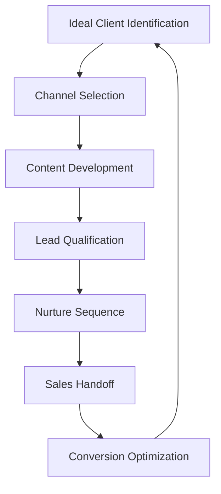

# Client Acquisition Strategies

This document outlines effective strategies for acquiring high-value yacht charter clients, aligned with Azure Yacht Group's sophisticated marketing approach.

## Overview

Client acquisition for luxury yacht charters requires a precision targeting approach that focuses on quality over quantity. This document provides detailed implementation guides for each acquisition channel, designed to attract qualified prospects with high booking potential.

## Strategic Acquisition Framework

## Key Acquisition Channels

### 1. SEO and Long-Tail Keyword Domination

**Implementation Guide:**

1. **Keyword Research Strategy**
   - Use Ahrefs/SEMrush to identify high-intent, low-competition keywords
   - Focus on long-tail phrases (e.g., "luxury catamaran charter Bahamas family")
   - Research competitor keyword gaps
   - Create keyword clusters around destinations, yacht types, and experiences

2. **Content Implementation**
   - Develop landing pages for each primary keyword cluster
   - Create detailed guides for each charter destination
   - Implement yacht-specific content optimized for search intent
   - Develop FAQ content addressing common charter questions

3. **Technical SEO Requirements**
   - Implement schema markup for yacht listings using PropertyRental schema
   - Create structured data for each vessel and destination
   - Optimize site speed to achieve 90+ PageSpeed score
   - Implement proper heading structure and keyword placement

4. **Measurement Framework**
   - Track organic traffic by landing page and keyword
   - Monitor position changes for target keywords
   - Measure organic conversion rate by keyword cluster
   - Calculate ROI by comparing organic acquisition costs to booking value

### 2. Strategic Partnership Development

**Implementation Guide:**

1. **Partnership Identification**
   - Research complementary luxury businesses (private aviation, concierge services)
   - Identify wealth management firms serving HNWI clients
   - Target luxury travel advisors specializing in high-end experiences
   - Find exclusive event planners and wedding coordinators

2. **Partnership Approach Process**
   - Create partner-specific value propositions
   - Develop tiered commission structures
   - Design co-branded marketing materials
   - Create partner portal for easy booking and tracking

3. **Partnership Enablement**
   - Develop partner training program
   - Create digital asset library for partners
   - Implement partner-specific tracking codes
   - Design exclusive partner offers

4. **Partnership Management**
   - Schedule quarterly partner review meetings
   - Create performance-based incentive programs
   - Develop educational webinars and resources
   - Implement partner recognition program

### 3. Precision-Targeted Paid Advertising

**Implementation Guide:**

1. **Platform Selection Strategy**
   - Google Search: Target high-intent keywords
   - Facebook/Instagram: Demographic and interest targeting
   - LinkedIn: Corporate and executive targeting
   - Programmatic Display: Luxury publication placement

2. **Audience Segmentation Framework**
   - Create custom audiences based on website behavior
   - Develop lookalike audiences from past clients
   - Implement income and net worth targeting
   - Target interests correlated with yacht charter preferences

3. **Campaign Structure**
   - Create destination-specific campaigns
   - Develop yacht-type campaigns
   - Implement occasion-based campaigns (anniversaries, celebrations)
   - Design corporate/event-focused campaigns

4. **Creative Development**
   - Create immersive imagery showcasing yacht interiors
   - Develop video content highlighting experiences
   - Design ad sets focusing on unique selling points
   - Create testimonial-focused creative elements

5. **Optimization Protocol**
   - Implement weekly bid adjustments
   - Perform A/B testing on all creative elements
   - Optimize based on lead quality, not just volume
   - Scale successful campaigns while testing new approaches

### 4. Content Marketing Excellence

**Implementation Guide:**

1. **Content Pillar Development**
   - Create cornerstone content around yacht types
   - Develop destination-specific comprehensive guides
   - Create experience-focused content (family charters, corporate events)
   - Develop educational content on charter planning

2. **Content Distribution Strategy**
   - Implement email drip campaigns for content promotion
   - Develop social sharing framework
   - Create content syndication relationships
   - Implement strategic content promotion

3. **Premium Content Assets**
   - Develop interactive yacht selection tools
   - Create charter cost calculators
   - Design digital destination guides
   - Develop virtual yacht tours

4. **Content Calendar Implementation**
   - Schedule weekly blog content
   - Plan monthly premium content pieces
   - Create quarterly data-driven research reports
   - Plan seasonal content strategies

### 5. Strategic Social Media Presence

**Implementation Guide:**

1. **Platform Strategy**
   - Instagram: Visual storytelling and lifestyle content
   - Facebook: Community building and targeted advertising
   - LinkedIn: Corporate and business development
   - YouTube: Immersive yacht and destination videos
   - Pinterest: Aspirational charter planning and destinations

2. **Content Planning Framework**
   - Create platform-specific content calendar
   - Develop content themes and series
   - Plan user-generated content campaigns
   - Schedule content around key booking periods

3. **Engagement Strategy**
   - Implement response protocols for all platforms
   - Create hashtag strategy for discovery
   - Develop influencer collaboration framework
   - Design social-specific calls to action

4. **Tracking and Analysis**
   - Monitor engagement metrics by platform
   - Track social-driven website traffic
   - Measure conversion rates from social channels
   - Calculate ROI by platform and campaign

### 6. Email Marketing Automation

**Implementation Guide:**

1. **List Building Strategy**
   - Create premium lead magnets for different segments
   - Develop progressive profiling through forms
   - Implement website email capture optimization
   - Create referral email collection program

2. **Segmentation Framework**
   - Segment by destination interest
   - Create yacht type preference segments
   - Develop budget-based segmentation
   - Implement behavior-based segmentation

3. **Automated Sequence Development**
   - Create welcome sequences (5-7 emails)
   - Develop consideration stage nurture sequences
   - Implement post-inquiry follow-up sequences
   - Design re-engagement sequences for inactive leads

4. **Personalization Strategy**
   - Implement dynamic content based on preferences
   - Create personalized subject lines
   - Develop time zone-based sending
   - Use behavioral triggers for targeted content

## Lead Qualification Framework

All acquisition channels should feed into a standardized lead qualification process:

1. **Lead Scoring Implementation**
   - Assign point values for demographic criteria
   - Score based on behavioral engagement
   - Weight actions by purchase intent
   - Create MQL (Marketing Qualified Lead) threshold

2. **CRM Integration Process**
   - Map lead source data to CRM fields
   - Automatically assign leads based on score
   - Track lead progression through stages
   - Implement lead aging and nurturing rules

3. **Sales Handoff Protocol**
   - Create clear MQL to SQL (Sales Qualified Lead) criteria
   - Develop standardized lead briefing information
   - Implement lead handoff notifications
   - Track post-handoff follow-up compliance

## Performance Measurement

Track acquisition performance using these key metrics:

| Channel | Primary KPIs | Secondary KPIs | Frequency |
|---------|-------------|----------------|-----------|
| SEO | Organic traffic, Keyword rankings | Organic conversion rate, Pages/session | Weekly |
| Partnerships | Referral volume, Conversion rate | Partner engagement, Commission payout | Monthly |
| Paid Advertising | ROAS, CPL | Click-through rate, Quality Score | Weekly |
| Content Marketing | Traffic, Downloads | Time on page, Social shares | Monthly |
| Social Media | Engagement rate, Follower growth | Click-through rate, Attribution | Weekly |
| Email Marketing | Open rate, Click rate | List growth, Unsubscribe rate | Weekly |

## Next Steps

To implement these acquisition strategies:

1. Conduct a full audit of current acquisition channels
2. Prioritize channels based on potential ROI and resource requirements
3. Create 90-day implementation plans for priority channels
4. Establish baseline metrics and set performance targets
5. Implement [Lead Magnets](./lead-magnets) system to support acquisition
6. Integrate with full [Client Funnel](./overview) framework 