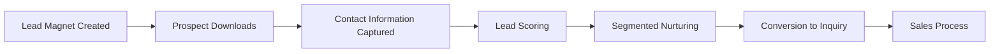

# Lead Magnets for Luxury Yacht Charters

This document provides a comprehensive guide to creating high-value lead magnets for the luxury yacht charter market that align with Azure Yacht Group's sophisticated client acquisition approach.

## Strategic Importance of Lead Magnets

Lead magnets are valuable resources offered to potential clients in exchange for their contact information. In the luxury yacht charter space, properly designed lead magnets serve multiple critical functions:

1. **Lead Generation**: Capturing contact details of qualified prospects
2. **Client Qualification**: Initial assessment of prospect interests and needs
3. **Authority Building**: Establishing expertise in the charter industry
4. **Relationship Initiation**: Beginning the nurturing sequence
5. **Market Segmentation**: Sorting prospects by interest/need

## Premium Lead Magnet Portfolio

### 1. Destination Master Guides

**Description**: Comprehensive, beautifully designed PDF guides to popular charter destinations that go beyond basic tourist information to provide insider knowledge.

**Implementation Guide**:

1. **Content Development**
   - Conduct research on hidden anchorages and exclusive attractions
   - Interview local experts and charter captains for insider tips
   - Create custom maps highlighting recommended routes
   - Include seasonality information and ideal charter periods
   - Feature local cuisine, cultural highlights, and activities

2. **Design Standards**
   - Use professional layout with brand styling
   - Include high-quality destination photography
   - Create custom infographics for at-a-glance information
   - Design interactive elements for digital version
   - Ensure mobile-friendly viewing

3. **Distribution System**
   - Create dedicated landing page for each guide
   - Design multi-step form to capture key qualification data
   - Implement automated delivery sequence
   - Set up tagging based on destination interest
   - Create follow-up nurture sequence specific to destination

**Promotion Strategy**:
- Feature on location-specific website pages
- Create social media ads targeting destination interest
- Develop blog content teasing guide highlights
- Share excerpts in relevant luxury travel groups

### 2. Interactive Yacht Selection Tool

**Description**: Web-based interactive tool allowing prospects to explore yacht options based on their specific requirements and preferences.

**Implementation Guide**:

1. **Tool Development**
   - Create requirement intake interface (party size, budget, preferences)
   - Develop matching algorithm based on fleet data
   - Design results presentation with yacht specifications
   - Implement save/compare functionality
   - Create email capture for saved results

2. **User Experience Design**
   - Ensure intuitive, step-by-step flow
   - Create mobile-responsive interface
   - Design luxury-level aesthetic
   - Include hover/click information features
   - Implement progress indication

3. **Lead Capture Integration**
   - Create multi-stage information gathering
   - Implement progressive profiling
   - Design results delivery email sequence
   - Set up lead scoring based on selections
   - Create tailored follow-up based on preferences

**Promotion Strategy**:
- Feature prominently on website homepage
- Create demonstration video for social channels
- Develop targeted ads for charter consideration phase
- Implement exit-intent promotion

### 3. Charter Planning & Budgeting Calculator

**Description**: Interactive tool allowing prospects to estimate total charter costs including base rates, provisions, fuel, and extras.

**Implementation Guide**:

1. **Calculator Development**
   - Create input fields for key cost variables
   - Develop calculation engine with accurate estimations
   - Design budget breakdown visualization
   - Include tips for cost optimization
   - Create printable/shareable results

2. **Financial Data Integration**
   - Incorporate accurate base charter rates
   - Include variable costs by yacht type and size
   - Add seasonal adjustment factors
   - Implement destination-specific cost variables
   - Create upsell opportunities within calculator

3. **Lead Generation Flow**
   - Require email for detailed results
   - Create budget preference tagging
   - Develop segment-specific follow-up sequence
   - Design personalized charter suggestions based on budget
   - Implement sales notification for high-budget calculations

**Promotion Strategy**:
- Feature in consideration phase content
- Highlight in charter planning articles
- Create social content addressing budget questions
- Position in FAQ sections

### 4. Sample Charter Itineraries

**Description**: Beautifully crafted day-by-day charter itineraries for popular routes, including anchorages, activities, and insider recommendations.

**Implementation Guide**:

1. **Itinerary Development**
   - Create multiple itineraries for each destination
   - Develop themed routes (family, romantic, adventure)
   - Include day-by-day breakdown with timings
   - Add activity suggestions and reservations needed
   - Include provisioning recommendations

2. **Design Execution**
   - Create branded itinerary template
   - Include maps with route visualization
   - Add high-quality images of key locations
   - Design mobile-friendly digital version
   - Create printable PDF format

3. **Customization Options**
   - Implement request form for customized itineraries
   - Create preference selection system
   - Design follow-up process for customization requests
   - Develop charter specialist handoff for serious inquiries
   - Create tagging based on itinerary interests

**Promotion Strategy**:
- Feature on destination pages
- Create social carousel previews
   - Include testimonials from guests who followed itineraries
   - Partner with local attractions mentioned in itineraries

### 5. Charter Experience Guide for First-Timers

**Description**: Comprehensive guide addressing common questions, concerns, and expectations for first-time charterers.

**Implementation Guide**:

1. **Content Creation**
   - Address common fears and misconceptions
   - Explain charter types and options
   - Create packing and preparation checklists
   - Include etiquette guidelines and expectations
   - Develop FAQ section with expert answers

2. **Format Optimization**
   - Design printable PDF version
   - Create online interactive version
   - Develop video companion series
   - Include downloadable checklists
   - Design mobile reference version

3. **Lead Nurturing Integration**
   - Create first-timer specific email sequence
   - Develop educational content series
   - Implement charter specialist introduction
   - Design experience-focused follow-up
   - Create segmentation based on experience level

**Promotion Strategy**:
- Feature in awareness stage content
- Target first-time charter search terms
- Create social content addressing beginner concerns
- Implement as response to basic inquiry questions

### 6. Seasonal Charter Opportunity Alerts

**Description**: Exclusive notification system for special offers, last-minute availability, and seasonal charter opportunities.

**Implementation Guide**:

1. **Alert System Development**
   - Create preference selection interface
   - Develop segmentation by destination, yacht type, budget
   - Implement seasonal content calendar
   - Design alert template with clear CTAs
   - Create urgency elements for time-sensitive offers

2. **Exclusivity Framework**
   - Design tiered access system
   - Create "first access" privileges
   - Implement countdown timers for offers
   - Develop VIP pre-release notifications
   - Design "forwarding" limits to maintain exclusivity

3. **Conversion Optimization**
   - Create one-click inquiry system from alerts
   - Implement saved preference profiles
   - Design friction-free booking initiation
   - Develop immediate response protocols
   - Create personalized follow-up system

**Promotion Strategy**:
- Feature signup across website
- Promote exclusivity in all marketing
- Create case studies of past "alert" successes
- Implement as exit-intent offer

## Lead Magnet Deployment Framework

For each lead magnet in your portfolio, follow this implementation process:

1. **Planning Phase**
   - Define clear target audience segment
   - Establish specific lead magnet objectives
   - Determine key qualification data to capture
   - Create value proposition statement
   - Set success metrics and KPIs

2. **Production Phase**
   - Allocate appropriate design resources
   - Establish quality control standards
   - Create marketing copy for promotion
   - Develop landing page and forms
   - Set up analytics tracking

3. **Launch Phase**
   - Create segmented promotional campaign
   - Establish A/B testing frameworks
   - Implement initial lead scoring rules
   - Create fulfillment automation
   - Develop immediate follow-up sequence

4. **Optimization Phase**
   - Monitor conversion rates by traffic source
   - Analyze form abandonment
   - Test lead magnet variations
   - Refine nurture sequences
   - Analyze sales pipeline impact

## Performance Measurement

Track lead magnet performance using these key metrics:

| Metric | Description | Target | Measurement Frequency |
|--------|-------------|--------|----------------------|
| Conversion Rate | % of visitors who download | 25%+ | Weekly |
| Cost Per Lead | Marketing cost per acquisition | <$15 | Monthly |
| Lead Quality Score | Avg. score based on qualification criteria | 60+ | Weekly |
| Nurture Engagement | % who engage with follow-up | 40%+ | Weekly |
| Pipeline Contribution | % of leads entering sales process | 15%+ | Monthly |
| Revenue Attribution | Revenue generated from lead magnet | Varies | Quarterly |

## Technology Requirements

Implement these systems to support your lead magnet strategy:

1. **Landing Page Platform**: Tilda with custom forms
2. **Email Marketing System**: Mailchimp/ActiveCampaign
3. **CRM Integration**: HubSpot with custom fields
4. **Analytics Setup**: Google Analytics with goal tracking
5. **Design Tools**: Adobe Creative Suite
6. **Marketing Automation**: HubSpot/Zapier integrations

## Next Steps

To implement this lead magnet strategy:

1. Audit existing lead generation assets
2. Prioritize lead magnets based on target segments
3. Create 90-day production calendar
4. Establish design standards and templates
5. Develop measurement dashboard
6. Integrate with [Acquisition Strategies](./acquisition-strategies)
7. Connect to full [Client Funnel](./overview) system 