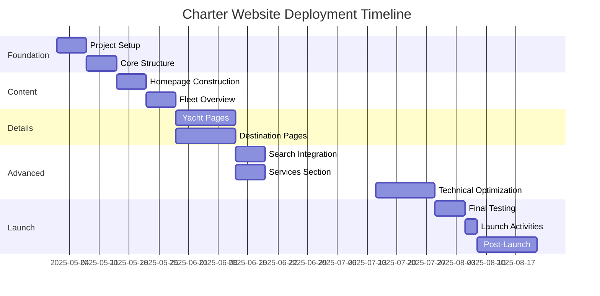
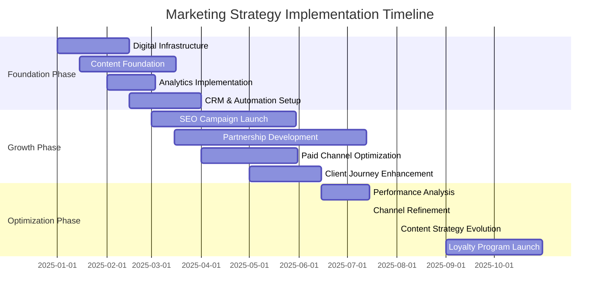
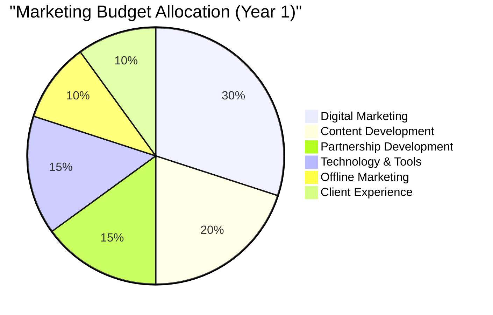
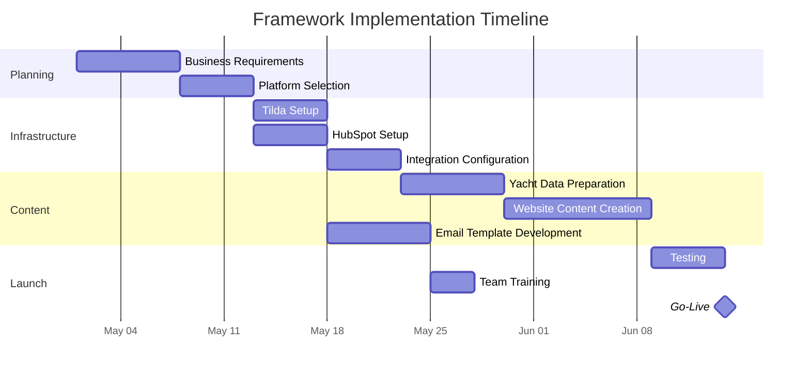
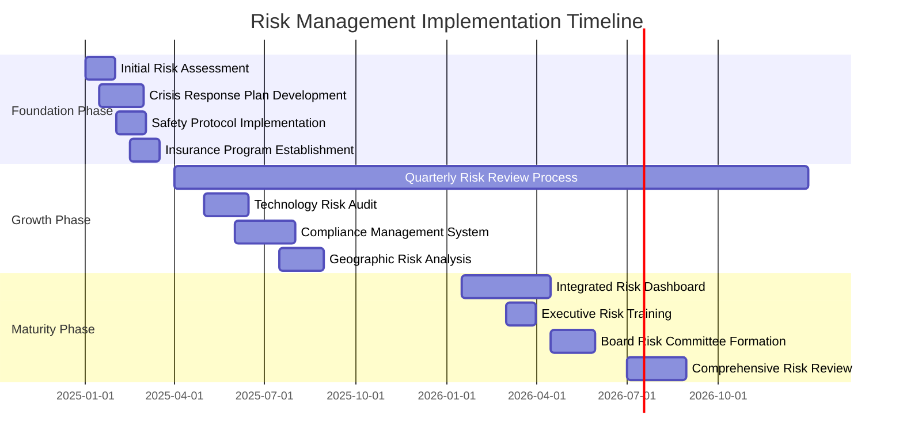

# Azure Yacht Group Consolidated Implementation Plans

This document provides a centralized reference for all implementation plans, project timelines, and status tracking across Azure Yacht Group's various business and technical initiatives.

## Table of Contents
- [Project Master Plan](#project-master-plan)
- [Website Development Plan](#website-development-plan)
- [Marketing Implementation Plan](#marketing-implementation-plan)
- [Technology & Documentation Plan](#technology--documentation-plan)
- [Online Presence Improvement Plan](#online-presence-improvement-plan)
- [Risk Management Plan](#risk-management-plan)

## Project Master Plan

| Phase | Status | Timeline |
|-------|--------|----------|
| **Foundation (Q2-Q3 2025)** | 🟡 In Progress - 45% Complete | Current |
| Enhancement (Q3-Q4 2025) | 🟡 Planning - 10% Complete | Q3-Q4 2025 |
| Expansion (Q1-Q2 2026) | 🔴 Conceptual - 5% Complete | Q1-Q2 2026 |
| Innovation (Q3-Q4 2026) | 🔴 Conceptual | Q3-Q4 2026 |

### Phase 1: Foundation (Current)

| Component | Status | Priority | Deadline | Owner |
|-----------|--------|----------|----------|-------|
| Core Website Structure | 🟢 85% Complete | High | June 30, 2025 | Web Team |
| Yacht Data Integration | 🟡 70% Complete | High | July 15, 2025 | Data Team |
| CRM Implementation | 🟡 50% Complete | High | July 30, 2025 | CRM Team |
| Documentation Framework | 🟡 60% Complete | Medium | August 15, 2025 | Doc Team |
| Initial SEO Implementation | 🟡 40% Complete | Medium | August 30, 2025 | Marketing |

### Phase 2: Enhancement (Q3-Q4 2025)

| Component | Status | Priority | Deadline | Owner |
|-----------|--------|----------|----------|-------|
| Booking System | 🟡 Planning | High | Sept 30, 2025 | Web Team |
| Marketing Automation | 🟡 Initial Setup | High | Oct 15, 2025 | Marketing |
| Analytics Integration | 🟡 Planning | Medium | Oct 30, 2025 | Data Team |
| Performance Optimization | 🔴 Not Started | Medium | Nov 15, 2025 | Web Team |
| Asset Enhancement | 🟡 Initial Review | Medium | Nov 30, 2025 | Content Team |

### Phase 3: Expansion (Q1-Q2 2026)

| Component | Status | Priority | Deadline | Owner |
|-----------|--------|----------|----------|-------|
| International Expansion | 🟡 Research | Medium | Jan 30, 2026 | Strategy Team |
| Mobile Application | 🔴 Concept | Medium | Feb 28, 2026 | Mobile Team |
| Advanced CRM Features | 🟡 Planning | High | Mar 30, 2026 | CRM Team |
| Partner Portal | 🔴 Concept | Medium | Apr 30, 2026 | Web Team |
| Business Intelligence | 🟡 Research | Medium | May 30, 2026 | Data Team |

## Website Development Plan

### Current Status: 🟡 In Progress

### Phase 1: Foundation and Setup (Weeks 1-2)
**Status: 🟢 Complete**

- ✅ Set up Tilda account and create a new project
- ✅ Configure domain settings and DNS
- ✅ Establish brand guidelines (colors, typography, logo usage)
- ✅ Create reusable design elements library
- ✅ Implement basic site navigation
- ✅ Build homepage skeleton
- ✅ Create site-wide header and footer
- ✅ Configure site analytics (Google Analytics)

### Phase 2: Content Development (Weeks 3-4)
**Status: 🟡 In Progress - 75% Complete**

- ✅ Develop hero banner with seasonal offers
- ✅ Create featured charters carousel
- ✅ Build destination highlights section
- 🟡 Implement testimonials slider
- 🟡 Add newsletter signup functionality
- ✅ Design fleet listing page layout
- ✅ Create yacht card template
- 🟡 Implement basic filtering functionality
- 🔴 Add "New Arrivals" section

### Phase 3: Detail Pages and Functionality (Weeks 5-7)
**Status: 🟡 In Progress - 40% Complete**

- 🟡 Develop detailed yacht page template
- ✅ Create image gallery with lightbox functionality
- 🟡 Build specifications display tables
- 🔴 Implement pricing calculator
- 🔴 Create availability calendar
- ✅ Add booking request form
- 🔴 Set up similar yachts recommendation engine
- 🔴 Create interactive destination map
- 🟡 Develop destination guide template
- 🔴 Build initial guides for primary regions

### Phase 4: Advanced Features and Optimization (Weeks 8-10)
**Status: 🔴 Not Started**

- 🔴 Implement advanced search filters
- 🔴 Create dynamic results display
- 🔴 Add saved search functionality
- 🔴 Optimize search performance
- 🔴 Create charter types comparison
- 🔴 Develop bareboat charter information pages
- 🔴 Build crewed charter details pages
- 🔴 Add service add-ons section
- 🔴 Perform site-wide SEO audit and optimization
- 🔴 Implement site performance improvements
- 🔴 Ensure mobile responsiveness
- 🔴 Test and fix cross-browser compatibility issues

### Phase 5: Launch and Marketing (Weeks 11-12)
**Status: 🔴 Not Started**

- 🔴 Conduct user acceptance testing
- 🔴 Perform security review
- 🔴 Test all forms and integrations
- 🔴 Review content for accuracy and consistency
- 🔴 Create 301 redirects (if migrating from previous site)
- 🔴 Submit sitemap to search engines
- 🔴 Implement launch marketing campaign
- 🔴 Monitor analytics and user behavior

## Marketing Implementation Plan

### Current Status: 🟡 In Progress

### Foundation Phase (Q1 2025)
**Status: 🟡 In Progress - 45% Complete**

#### Digital Infrastructure
- ✅ Website platform setup
- ✅ Basic SEO implementation
- 🟡 Mobile optimization (80% complete)
- 🟡 Tracking implementation (50% complete)
- 🔴 Landing page templates

#### Content Foundation
- ✅ Brand voice guidelines
- ✅ Initial yacht content creation
- 🟡 Destination guides (3 of 8 complete)
- 🟡 Photography catalogue development
- 🔴 Video content production

#### Analytics Implementation
- ✅ Google Analytics setup
- 🟡 Goal tracking configuration
- 🟡 Custom reports development
- 🔴 Attribution model setup
- 🔴 Performance dashboards

#### CRM & Automation Setup
- ✅ HubSpot implementation
- ✅ Contact database migration
- 🟡 Lead scoring development
- 🟡 Email template creation
- 🔴 Automated workflow setup

### Growth Phase (Q2 2025)
**Status: 🟡 Planning - 15% Complete**

#### SEO Campaign Launch
- 🟡 Keyword research and mapping
- 🟡 On-page optimization
- 🔴 Content calendar implementation
- 🔴 Backlink acquisition strategy
- 🔴 Local SEO optimization

#### Partnership Development
- 🟡 Partner identification
- 🟡 Value proposition development
- 🔴 Partner onboarding process
- 🔴 Co-marketing initiatives
- 🔴 Performance tracking

### Budget Allocation (Year 1)

## Technology & Documentation Plan

### Docusaurus Update Plan Status
**Status: 🟡 In Progress**

| Section | Status | Priority | Scheduled Completion |
|---------|--------|----------|----------------------|
| Configuration Updates | 🟡 In Progress | High | Week 1 |
| Theme Updates | 🔴 Not Started | Medium | Week 2 |
| Documentation Structure | 🟡 In Progress | High | Week 1 |
| Content Updates | 🟡 In Progress | High | Ongoing |
| Features Implementation | 🔴 Not Started | Medium | Week 2-3 |
| Performance Optimization | 🔴 Not Started | Low | Week 3 |
| Analytics and Monitoring | 🔴 Not Started | Medium | Week 3 |

### Core Infrastructure Development Status

| Component | Status | Priority |
|-----------|--------|----------|
| Initial server setup | ✅ Complete | High |
| Advanced server configuration | 🔴 Not Started | Medium |
| Database implementation | 🔴 Not Started | High |
| Basic API development | ✅ Complete | High |
| Advanced API features | 🔴 Not Started | Medium |
| Security implementation | 🔴 Not Started | High |
| Backup systems | 🔴 Not Started | Medium |

### Framework Implementation Timeline

## Online Presence Improvement Plan

### Current Status: 🔴 Critical Gaps Identified

This plan addresses critical gaps in Azure Yacht Group's online directory presence, focusing on establishing consistent NAP (Name, Address, Phone) information across major platforms.

#### Phase 1: Fix Critical Platforms (Weeks 1-2)
**Status: 🔴 Not Started**

1. **Google Business Profile**
   - 🟢 Exists but needs optimization
   - Action: Enhance with photos, business hours, services

2. **Property Capsule**
   - 🔴 Critical issue - Wrong business name and phone number
   - Action: Update from "Alexa Rosario Group" to "Azure Yacht Group"

3. **Facebook**
   - 🟡 Exists but missing phone number
   - Action: Complete business information

4. **Bing Places**
   - 🔴 Not present (high priority - 650.8M monthly visits)
   - Action: Create and verify listing

#### Phase 2: High-Traffic Directories (Weeks 3-4)
**Status: 🔴 Not Started**

5. **Yelp** (139.8M visits)
   - 🔴 Not present
   - Action: Create business profile with yacht photos

6. **TripAdvisor** (105.4M visits)
   - 🔴 Not present
   - Action: Create listing in "Boat Tours & Water Sports"

7. **Yahoo** (653.2K visits)
   - 🔴 Not present
   - Action: Create business listing

8. **MapQuest** (30.7M visits)
   - 🔴 Not present
   - Action: Add business listing

#### Phase 3: Social Media Expansion (Weeks 5-6)
**Status: 🔴 Not Started**

9. **Instagram**
   - 🟡 Status unknown (needs verification)
   - Action: Create/optimize business account

10. **Foursquare** (9M visits)
    - 🔴 Not present
    - Action: Create business listing

11. **Snapchat**
    - 🔴 Not present
    - Action: Create business account

#### Phase 4: Directory Consolidation (Weeks 7-10)
**Status: 🔴 Not Started**

12. **Business Directory Group 1**
    - MerchantCircle, eLocal, Citysearch, YP.com
    - 🔴 Not present in any
    - Action: Create consistent listings

13. **Business Directory Group 2**
    - HotFrog, ShowMeLocal, EZlocal, tellows
    - 🔴 Not present in any
    - Action: Create consistent listings

#### Phase 5: Listing Management Solution (Week 11)
**Status: 🔴 Not Started**

14. **Implement Listing Management Tool**
    - Options: Yext, BrightLocal, Moz Local, or Semrush
    - Benefit: Centralized control of business information

## Risk Management Plan

### Current Status: 🟡 Initial Planning

### Risk Categories

| Risk Category | Current Mitigation | Status | Owner |
|---------------|-------------------|--------|-------|
| Operational Risk | Basic safety protocols | 🟡 Partial | Operations Director |
| Regulatory/Compliance | Initial compliance review | 🟡 Partial | Legal Counsel |
| Market/Economic | Diverse pricing strategy | 🟡 Partial | Finance Director |
| Reputational | Customer satisfaction tracking | 🟡 Partial | Marketing Director |
| Business Continuity | Basic incident response | 🔴 Minimal | Operations Director |
| Technology | Data backup systems | 🟡 Partial | IT Director |
| Strategic | Market review process | 🟡 Partial | CEO |

---

*Last Updated: May 25, 2025*  
*Next Review: June 25, 2025* 