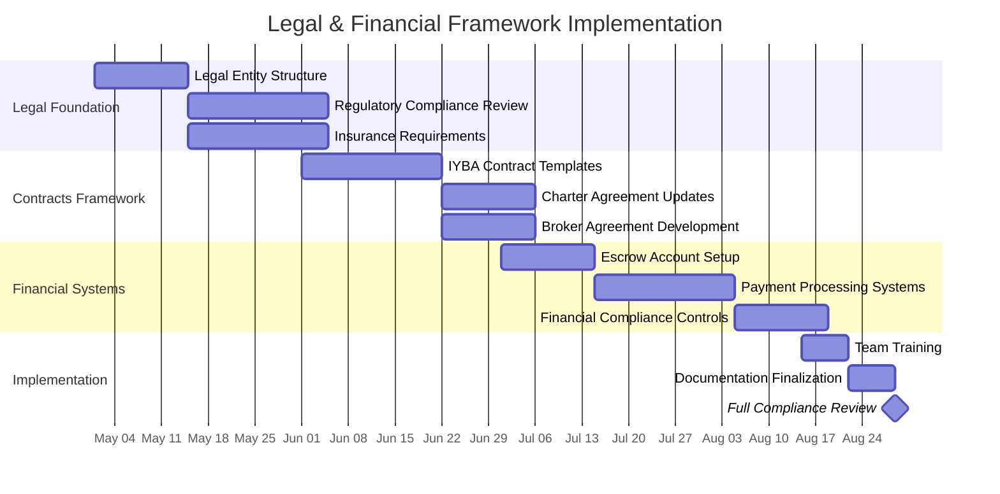
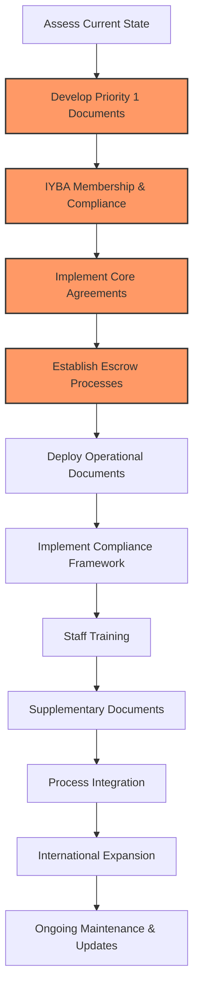

## Legal & Financial Framework Plan

### Current Status: 🟡 In Progress - 30% Complete

### Legal Framework Implementation
**Status: 🟡 In Progress - 35% Complete**

#### Regulatory Compliance
- ✅ Initial legal structure assessment
- ✅ Florida broker licensing requirements review
- 🟡 USCG and maritime regulations documentation
- 🟡 Insurance requirements documentation
- 🔴 International regulatory mapping

#### Contract Development
- ✅ Initial framework for charter contracts
- 🟡 IYBA-compliant charter agreement templates
- 🟡 Charter party waiver and acknowledgment forms
- 🔴 Crew employment and service agreements
- 🔴 Partner and vendor contract templates

#### Data Privacy & Compliance
- ✅ Initial privacy policy development
- 🟡 GDPR compliance assessment
- 🔴 CCPA/US state law compliance
- 🔴 Data handling procedures
- 🔴 Breach notification protocols

### Financial Transaction Framework
**Status: 🟡 Planning - 25% Complete**

#### Escrow Account Management
- ✅ Escrow requirement assessment per IYBA
- 🟡 Escrow service provider evaluation
- 🟡 Account structure documentation
- 🔴 Escrow SOP development
- 🔴 Staff training on escrow procedures

#### Payment Systems
- ✅ Payment processor evaluation
- 🟡 Merchant account setup
- 🔴 PCI compliance implementation
- 🔴 International payment solutions
- 🔴 Fee structure documentation

#### Financial Compliance
- ✅ AML requirements documentation
- 🟡 KYC procedure development
- 🔴 Transaction monitoring procedures
- 🔴 Suspicious activity reporting process
- 🔴 Record-keeping system implementation

### Detailed Legal & Financial Document Implementation Plan

The following prioritized task list organizes legal and financial documentation development from foundational requirements to complete process integration.

#### Priority 1: Core Framework Documents (June 1-30, 2025)
| Document | Status | Est. Completion | Dependencies | Owner |
|----------|--------|-----------------|--------------|-------|
| IYBA Membership Application & Documentation | 🟡 In Progress | June 15, 2025 | None | Legal Counsel |
| Broker-Owner Master Agreement Template | 🟡 In Progress | June 20, 2025 | IYBA membership | Legal Counsel |
| Standard Charter Agreement (IYBA-compliant) | 🟡 In Progress | June 25, 2025 | IYBA membership | Legal Counsel |
| Client Terms of Service | 🔴 Not Started | June 30, 2025 | None | Legal Counsel |
| Basic Escrow Account Documentation | 🟡 In Progress | June 30, 2025 | None | Finance Director |

#### Priority 2: Essential Operational Documents (July 1-31, 2025)
| Document | Status | Est. Completion | Dependencies | Owner |
|----------|--------|-----------------|--------------|-------|
| Charter Preference Sheet Template | 🔴 Not Started | July 10, 2025 | Charter Agreement | Operations Director |
| Standard Liability Waiver | 🔴 Not Started | July 15, 2025 | None | Legal Counsel |
| Crew Agreement Template | 🔴 Not Started | July 20, 2025 | None | Operations Director |
| Escrow Instruction Letter Template | 🔴 Not Started | July 20, 2025 | Escrow account setup | Finance Director |
| Yacht Specification Form | 🔴 Not Started | July 25, 2025 | None | Operations Director |
| Charter Deposit Receipt Template | 🔴 Not Started | July 31, 2025 | Escrow processes | Finance Director |

#### Priority 3: Compliance & Security Documents (August 1-31, 2025)
| Document | Status | Est. Completion | Dependencies | Owner |
|----------|--------|-----------------|--------------|-------|
| Insurance Verification Procedures | 🔴 Not Started | August 10, 2025 | Insurance requirements doc | Risk Manager |
| AML Policy Document | 🔴 Not Started | August 15, 2025 | Financial compliance review | Compliance Officer |
| Privacy Policy & Data Processing Documentation | 🔴 Not Started | August 20, 2025 | GDPR/CCPA assessment | Data Protection Officer |
| KYC Procedures Document | 🔴 Not Started | August 25, 2025 | AML Policy | Compliance Officer |
| Transaction Monitoring Procedures | 🔴 Not Started | August 31, 2025 | AML Policy | Finance Director |

#### Priority 4: Specialized & Supplementary Documents (September 1-30, 2025)
| Document | Status | Est. Completion | Dependencies | Owner |
|----------|--------|-----------------|--------------|-------|
| Co-Brokerage Agreement Template | 🔴 Not Started | September 10, 2025 | Broker-Owner Agreement | Legal Counsel |
| Catering & Service Addendum | 🔴 Not Started | September 15, 2025 | Charter Agreement | Operations Director |
| Charter Cancellation Policy Documentation | 🔴 Not Started | September 15, 2025 | IYBA standards review | Legal Counsel |
| Force Majeure Addendum | 🔴 Not Started | September 20, 2025 | Charter Agreement | Legal Counsel |
| Dispute Resolution Procedures | 🔴 Not Started | September 25, 2025 | IYBA arbitration review | Legal Counsel |
| Owner Requirements Document Template | 🔴 Not Started | September 30, 2025 | None | Operations Director |

#### Priority 5: Process Integration & Training (October 1-31, 2025)
| Document | Status | Est. Completion | Dependencies | Owner |
|----------|--------|-----------------|--------------|-------|
| Staff Training Manual: Legal Documents | 🔴 Not Started | October 10, 2025 | All P1-P3 documents | Training Manager |
| Staff Training Manual: Financial Processes | 🔴 Not Started | October 15, 2025 | All P1-P3 documents | Training Manager |
| Legal Document Management SOP | 🔴 Not Started | October 20, 2025 | Document template finalization | Operations Director |
| Financial Transaction Process Flowcharts | 🔴 Not Started | October 25, 2025 | Process testing | Process Manager |
| Contract Management System Configuration | 🔴 Not Started | October 31, 2025 | All core documents | IT Director |

#### Priority 6: International Expansion & Advanced Features (November 1-30, 2025)
| Document | Status | Est. Completion | Dependencies | Owner |
|----------|--------|-----------------|--------------|-------|
| EU-Specific Charter Documentation | 🔴 Not Started | November 10, 2025 | VAT compliance review | Legal Counsel |
| Caribbean-Specific Charter Documentation | 🔴 Not Started | November 15, 2025 | Regional compliance review | Legal Counsel |
| International Payment Processing Documentation | 🔴 Not Started | November 20, 2025 | Payment systems implementation | Finance Director |
| Multi-jurisdiction Compliance Matrix | 🔴 Not Started | November 25, 2025 | International regulatory mapping | Compliance Officer |
| Legal & Financial Framework Audit Plan | 🔴 Not Started | November 30, 2025 | All prior documentation | Risk Manager |

### Implementation Approach

#### Implementation Schedule
| Task | Start Date | Duration | Dependencies | Owner |
|------|------------|----------|--------------|-------|
| IYBA Membership Application | June 1, 2025 | 2 weeks | Legal entity setup | Legal Counsel |
| Escrow Account Setup | July 1, 2025 | 3 weeks | Banking relationship | Finance Director |
| Contract Template Implementation | June 15, 2025 | 4 weeks | IYBA membership | Legal Counsel |
| Staff IYBA Standards Training | August 15, 2025 | 2 weeks | All documentation | Operations Director |
| Financial Compliance Audit | September 1, 2025 | 3 weeks | All systems operational | Compliance Officer | 