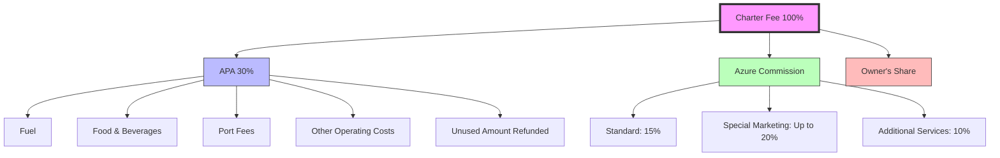
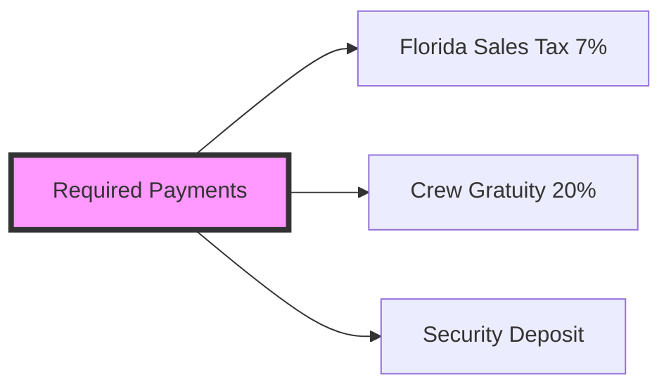
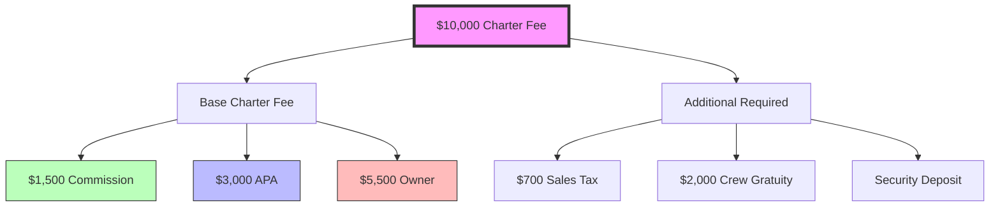

# Azure Yacht Group Fee Structure

## Charter Fee Breakdown

## Additional Required Payments

## Payment Flow Example
For a $10,000 Charter:

## Notes:
1. APA (Advanced Provisioning Allowance):
   - 30% of charter fee
   - Managed by captain
   - Unused portion refunded
   - Can be replenished if depleted

2. Commission Structure:
   - Standard: 15% of gross charter fee
   - Special Marketing: Up to 20%
   - Additional Services: 10%

3. Required Payments:
   - Florida Sales Tax: 7%
   - Recommended Crew Gratuity: 20%
   - Security Deposit: Amount varies by vessel

4. Payment Schedule:
   - Booking Deposit: 25-50% (vessel dependent)
   - Balance: 30 days before or day-of-charter
   - Security Deposit: With final payment or 48h before 