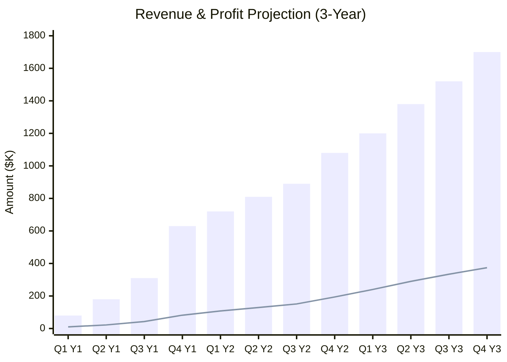
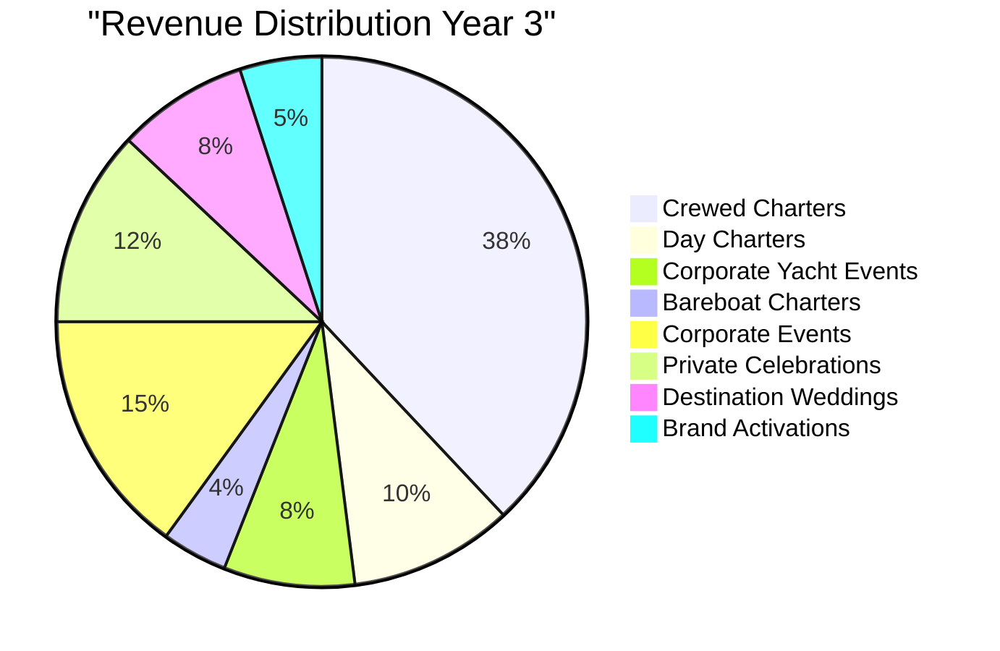
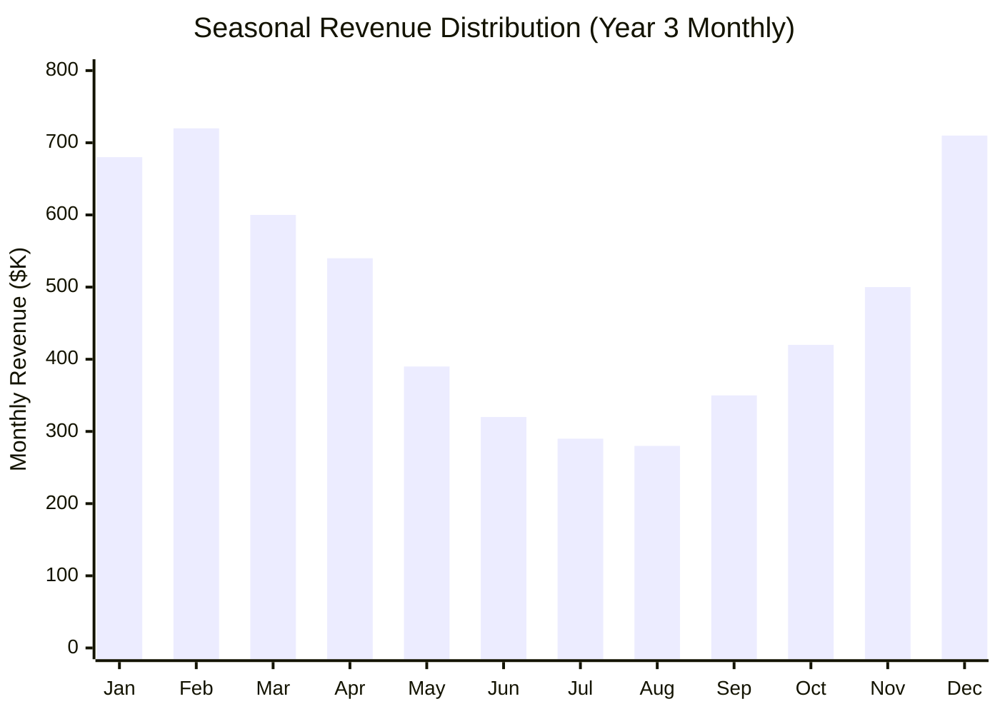
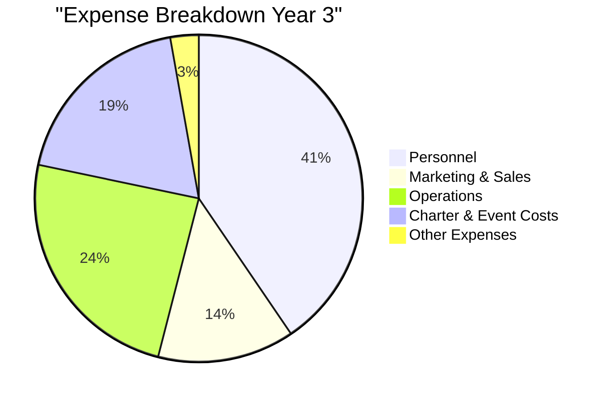
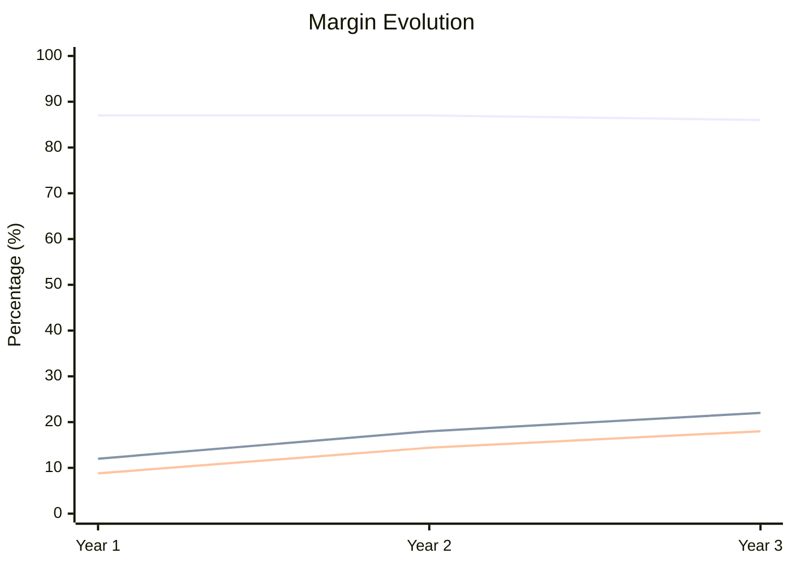
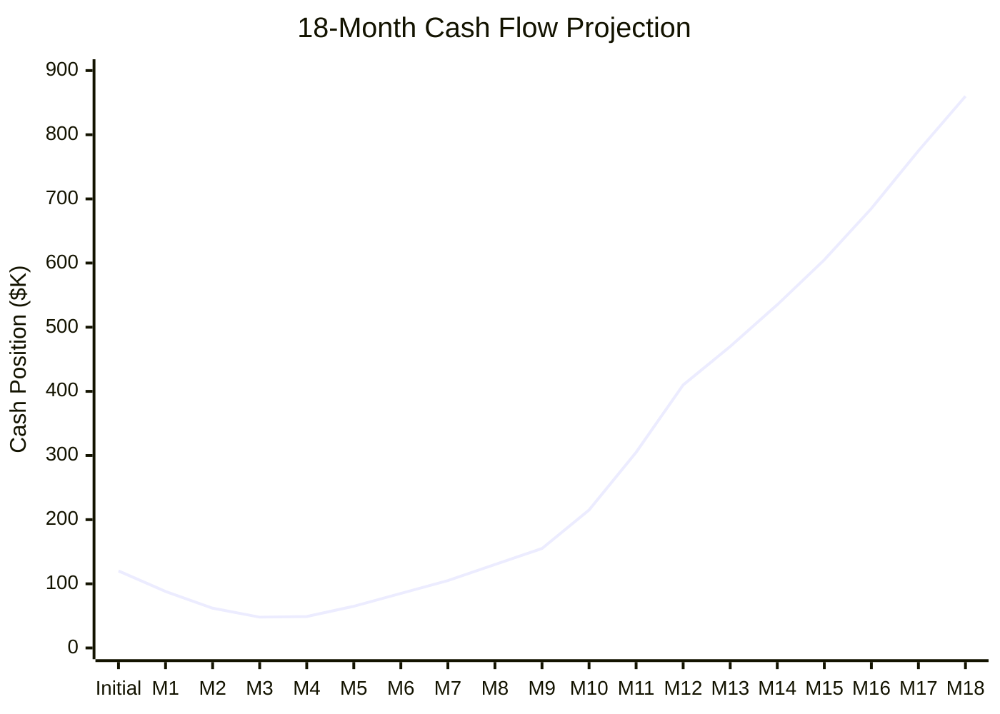

# Financial Projections

This document provides comprehensive financial projections for Azure Yacht Group, including revenue forecasts, expense analysis, profitability metrics, and investment considerations.

## Executive Financial Summary

Azure Yacht Group projects achieving $5.8 million in annual revenue by the end of year three, with a 22% profit margin. The business model combines yacht charter services (60% of revenue) with luxury event planning and management (40% of revenue).

Key financial highlights:
- Initial investment: $120,000 (foundation phase)
- Break-even point: Month 14
- Projected return on investment: 5 years
- Year 3 EBITDA: $1.28 million (22% margin)

## Revenue Projections

### Revenue Growth by Service Line

| Service Category | Year 1 | Year 2 | Year 3 |
|------------------|--------|--------|--------|
| **Yacht Charter Services** | $720,000 | $2,100,000 | $3,480,000 |
| - Crewed Charters | $360,000 | $1,260,000 | $2,204,000 |
| - Day Charters | $252,000 | $420,000 | $580,000 |
| - Corporate Yacht Events | $72,000 | $294,000 | $464,000 |
| - Bareboat Charters | $36,000 | $126,000 | $232,000 |
| **Event Planning Services** | $480,000 | $1,400,000 | $2,320,000 |
| - Corporate Events | $168,000 | $490,000 | $870,000 |
| - Private Celebrations | $144,000 | $420,000 | $696,000 |
| - Destination Weddings | $120,000 | $350,000 | $464,000 |
| - Brand Activations | $48,000 | $140,000 | $290,000 |
| **Total Revenue** | $1,200,000 | $3,500,000 | $5,800,000 |

### Membership Model Revenue Projections

| Membership Tier | Members Y1 | Revenue Y1 | Members Y2 | Revenue Y2 | Members Y3 | Revenue Y3 |
|-----------------|------------|------------|------------|------------|------------|------------|
| Platinum ($50K/yr) | 2 | $100,000 | 8 | $400,000 | 16 | $800,000 |
| Gold ($25K/yr) | 5 | $125,000 | 20 | $500,000 | 40 | $1,000,000 |
| Silver ($12K/yr) | 10 | $120,000 | 40 | $480,000 | 100 | $1,200,000 |
| **Total** | 17 | $345,000 | 68 | $1,380,000 | 156 | $3,000,000 |

*Note: Membership revenue is included within the service line projections above, primarily within the Crewed Charters and Corporate Events categories.*

### Booking Volume Projections

| Period | Yacht Charters | Avg. Charter Value | Events Planned | Avg. Event Value |
|--------|----------------|--------------------|--------------------|-----------------|
| Month 1 | 0 | $0 | 0 | $0 |
| Month 2 | 1-2 | $3,500 | 0 | $0 |
| Month 3 | 3-4 | $4,000 | 0 | $0 |
| Month 4 | 4-5 | $4,500 | 0 | $0 |
| Month 5-6 | 8-10 | $5,200 | 0 | $0 |
| Month 7-9 | 12-15 | $6,500 | 1-2 | $14,500 |
| Month 10-12 | 10-12 | $8,500 | 2 | $18,000 |
| Year 1 (monthly avg) | 8 | $6,200 | 1 | $16,000 |
| Year 2 (monthly avg) | 15-18 | $7,500 | 3-4 | $22,000 |
| Year 3 (monthly avg) | 22-25 | $8,800 | 5-6 | $28,000 |

### Seasonal Revenue Distribution

## Expense Projections

### Operating Expense Breakdown

| Expense Category | Year 1 | Year 2 | Year 3 |
|------------------|--------|--------|--------|
| **Personnel** | $480,000 | $1,155,000 | $1,740,000 |
| - Core Team Salaries | $420,000 | $840,000 | $1,320,000 |
| - Contractor Payments | $40,000 | $230,000 | $290,000 |
| - Benefits & Taxes | $20,000 | $85,000 | $130,000 |
| **Marketing & Sales** | $156,000 | $385,000 | $580,000 |
| - Digital Marketing | $84,000 | $210,000 | $290,000 |
| - PR & Events | $48,000 | $105,000 | $174,000 |
| - Sales Commissions | $24,000 | $70,000 | $116,000 |
| **Operations** | $264,000 | $665,000 | $1,044,000 |
| - Office/Workspace | $96,000 | $180,000 | $232,000 |
| - Technology | $60,000 | $105,000 | $174,000 |
| - Travel & Entertainment | $48,000 | $140,000 | $232,000 |
| - Insurance | $36,000 | $105,000 | $174,000 |
| - Professional Services | $24,000 | $135,000 | $232,000 |
| **Charter & Event Costs** | $156,000 | $455,000 | $812,000 |
| - Vessel Access Fees | $96,000 | $280,000 | $464,000 |
| - Event Venue Costs | $60,000 | $175,000 | $348,000 |
| **Other Expenses** | $24,000 | $70,000 | $116,000 |
| **Total Expenses** | $1,080,000 | $2,730,000 | $4,292,000 |

### Staffing Plan & Costs

| Position | Year 1 (FTE) | Year 2 (FTE) | Year 3 (FTE) | Avg. Annual Salary |
|----------|--------------|--------------|--------------|---------------------|
| Executive Leadership | 2 | 3 | 3 | $120,000 |
| Charter Specialists | 1 | 3 | 5 | $80,000 |
| Event Planners | 1 | 3 | 5 | $75,000 |
| Sales & Marketing | 1 | 3 | 5 | $70,000 |
| Operations & Support | 1 | 3 | 7 | $55,000 |
| Contract Crew & Staff | Variable | Variable | Variable | Project-based |
| **Total Team Size** | 6 | 15 | 25 | - |

## Profitability Analysis

### Margin Analysis

| Metric | Year 1 | Year 2 | Year 3 |
|--------|--------|--------|--------|
| Revenue | $1,200,000 | $3,500,000 | $5,800,000 |
| Gross Profit | $1,044,000 | $3,045,000 | $4,988,000 |
| Gross Margin % | 87% | 87% | 86% |
| Operating Expenses | $900,000 | $2,275,000 | $3,480,000 |
| EBITDA | $144,000 | $630,000 | $1,276,000 |
| EBITDA Margin % | 12% | 18% | 22% |
| Net Profit | $106,000 | $504,000 | $1,044,000 |
| Net Profit Margin % | 8.8% | 14.4% | 18% |

### Unit Economics

| Service Type | Revenue | Direct Costs | Gross Margin | Avg. Customer Acquisition Cost | Customer Lifetime Value |
|--------------|---------|--------------|-------------|--------------------------------|-------------------------|
| Crewed Charter (7 days) | $42,000 | $6,300 | 85% | $6,300 | $126,000 |
| Day Charter | $4,500 | $675 | 85% | $900 | $13,500 |
| Corporate Event | $35,000 | $7,000 | 80% | $5,250 | $87,500 |
| Private Celebration | $25,000 | $5,000 | 80% | $3,750 | $50,000 |
| Silver Membership (Annual) | $12,000 | $1,200 | 90% | $1,800 | $36,000 |
| Gold Membership (Annual) | $25,000 | $2,500 | 90% | $3,750 | $100,000 |
| Platinum Membership (Annual) | $50,000 | $5,000 | 90% | $7,500 | $250,000 |

### Break-Even Analysis

| Year 1 | Fixed Costs | Variable Costs | Revenue per Unit | Break-Even Units |
|--------|-------------|----------------|------------------|------------------|
| Yacht Charters | $480,000 | $930/charter | $6,200/charter | 91 charters |
| Events | $288,000 | $3,200/event | $16,000/event | 23 events |
| Combined | $768,000 | Variable | Variable | 14 months of operation |

## Cash Flow Projections

### 18-Month Cash Flow Overview

| Period | Cash Inflow | Cash Outflow | Net Cash Flow | Fleet Investment | Ending Cash Position |
|--------|------------|--------------|---------------|------------------|----------------------|
| Initial Investment | $120,000 | $0 | $120,000 | $0 | $120,000 |
| Month 1 | $0 | $32,000 | -$32,000 | $0 | $88,000 |
| Month 2 | $12,000 | $38,000 | -$26,000 | $0 | $62,000 |
| Month 3 | $28,000 | $42,000 | -$14,000 | $0 | $48,000 |
| Month 4 | $45,000 | $44,000 | $1,000 | $0 | $49,000 |
| Month 5 | $68,000 | $52,000 | $16,000 | $0 | $65,000 |
| Month 6 | $82,000 | $62,000 | $20,000 | $0 | $85,000 |
| Month 7 | $95,000 | $75,000 | $20,000 | $0 | $105,000 |
| Month 8 | $105,000 | $80,000 | $25,000 | $0 | $130,000 |
| Month 9 | $110,000 | $85,000 | $25,000 | $0 | $155,000 |
| Month 10 | $150,000 | $90,000 | $60,000 | $0 | $215,000 |
| Month 11 | $180,000 | $90,000 | $90,000 | $0 | $305,000 |
| Month 12 | $195,000 | $90,000 | $105,000 | $0 | $410,000 |
| Month 13 | $210,000 | $150,000 | $60,000 | $0 | $470,000 |
| Month 14 | $225,000 | $160,000 | $65,000 | $0 | $535,000 |
| Month 15 | $240,000 | $170,000 | $70,000 | $0 | $605,000 |
| Month 16 | $260,000 | $180,000 | $80,000 | $0 | $685,000 |
| Month 17 | $280,000 | $190,000 | $90,000 | $0 | $775,000 |
| Month 18 | $285,000 | $200,000 | $85,000 | $0 | $860,000 |

### Cash Flow Visualization

## Investment Requirements

### Initial Capital Requirements

| Investment Category | Amount | Percentage | Timing |
|--------------------|--------|------------|--------|
| Business Formation & Licensing | $15,000 | 12.5% | Pre-launch |
| Technology & Systems | $30,000 | 25% | Pre-launch, Month 1 |
| Marketing & Brand Development | $25,000 | 20.8% | Month 1-3 |
| Initial Staffing | $40,000 | 33.3% | Month 1-3 |
| Operating Reserve | $10,000 | 8.4% | Ongoing |
| **Total Initial Investment** | $120,000 | 100% | |

### Future Funding Rounds

| Funding Round | Expected Amount | Timing | Purpose | Equity Dilution |
|---------------|----------------|--------|---------|-----------------|
| Seed Round | $120,000 | Pre-launch | Initial setup & operations | Founders only |
| Series A | $500,000 | Month 18 | Expansion to new locations | 15-20% |
| Series B | $2,000,000 | Year 3 | Fleet acquisition, technology platform | 20-25% |

### Return on Investment Projections

| Investment Scenario | Year 1 ROI | Year 3 ROI | Year 5 ROI | Payback Period |
|---------------------|------------|------------|------------|----------------|
| Initial Investment ($120K) | 8.8% | 870% | 2,500%+ | 1.2 years |
| Series A ($500K) | N/A | 60% | 350% | 2.5 years |
| Series B ($2M) | N/A | N/A | 110% | 3.8 years |

## Financial Risk Analysis

### Sensitivity Analysis

| Variable | Base Case | Downside Case | Upside Case | Impact on Year 3 EBITDA |
|----------|-----------|---------------|-------------|--------------------------|
| Charter Booking Volume | 264/year | -20% (211/year) | +20% (317/year) | -$435K to +$435K |
| Average Charter Value | $8,800 | -15% ($7,480) | +15% ($10,120) | -$348K to +$348K |
| Event Booking Volume | 66/year | -25% (50/year) | +25% (83/year) | -$290K to +$290K |
| Average Event Value | $28,000 | -15% ($23,800) | +15% ($32,200) | -$174K to +$174K |
| Personnel Costs | $1.74M | +10% ($1.91M) | -5% ($1.65M) | -$174K to +$87K |
| Marketing Efficiency | Base CAC | +20% CAC | -20% CAC | -$116K to +$116K |

### Risk Mitigation Strategies

| Risk Category | Potential Impact | Mitigation Strategy |
|---------------|------------------|---------------------|
| Seasonal Revenue Fluctuation | Cash flow instability | Membership model, advance deposits, off-season promotions |
| Economic Downturn | Reduced luxury spending | Diverse service offerings, flexible pricing tiers |
| Operational Costs Increase | Margin pressure | Technology efficiency, contractor model for variable staffing |
| Competitive Pressure | Market share challenge | Service differentiation, loyalty incentives, proprietary offerings |
| Regulatory Changes | Compliance costs | Legal contingency fund, industry association participation |

## Valuation Projections

| Valuation Method | Year 1 | Year 3 | Year 5 |
|------------------|--------|--------|--------|
| Revenue Multiple (3-5x) | $3.6M-$6M | $17.4M-$29M | $35M-$58M |
| EBITDA Multiple (8-12x) | $1.15M-$1.72M | $10.2M-$15.3M | $22M-$33M |
| Discounted Cash Flow | $4.2M | $18.5M | $38M |
| **Blended Valuation** | $3.5M | $16.5M | $35M |

---

*Last Updated: May 1, 2025*  
*Next Review: July 31, 2025* 