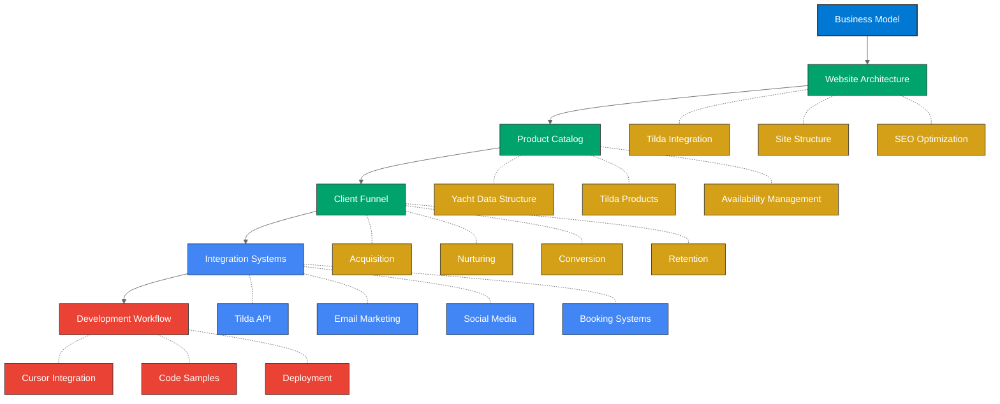
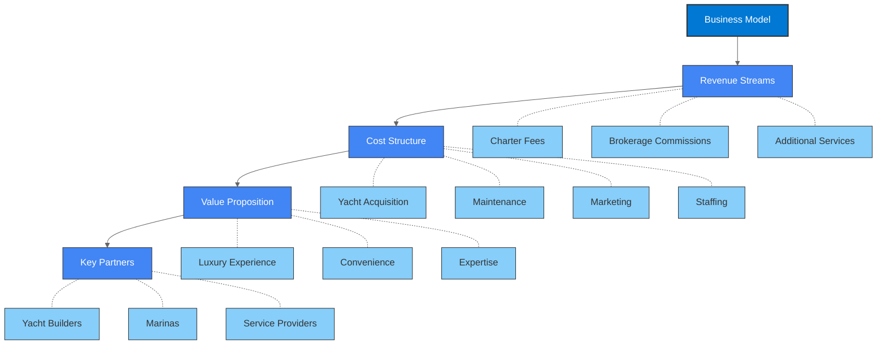
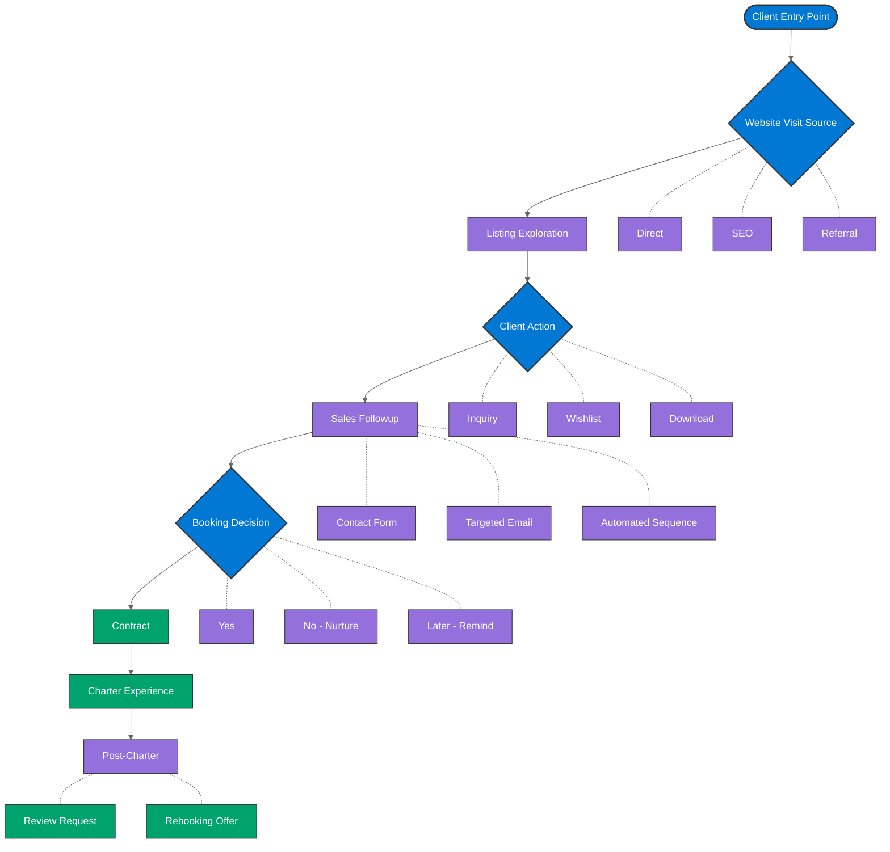

# Framework Visual Overview

This page provides a comprehensive visual overview of the Azure Yacht Group Charter Business Framework using enhanced Mermaid v2 diagrams.

## Complete Framework Map

## Business Model Components

## Client Journey Flow

These enhanced diagrams provide a clear visual representation of how the different components of the Charter Business Framework connect and work together to create a comprehensive system for running a successful yacht charter business.