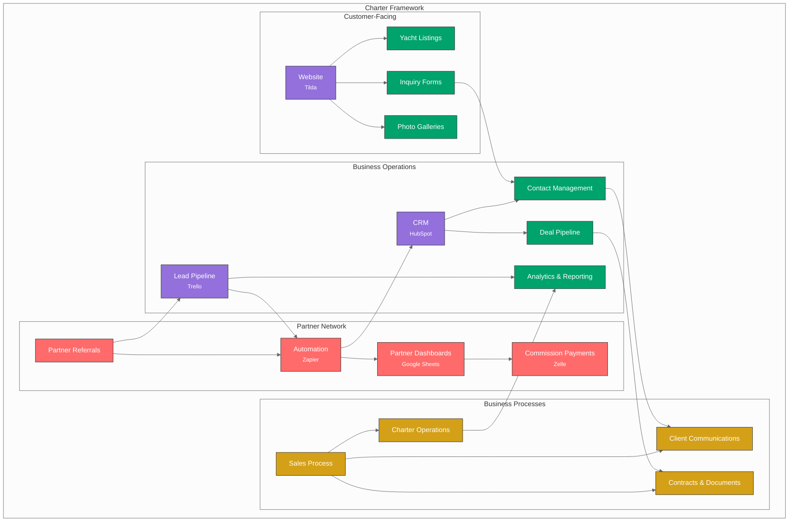
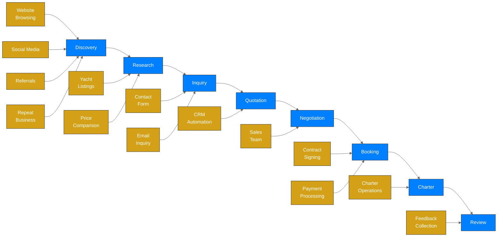
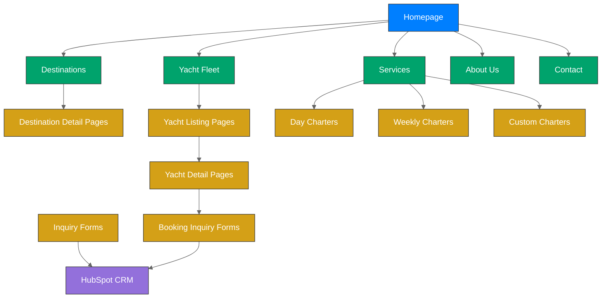
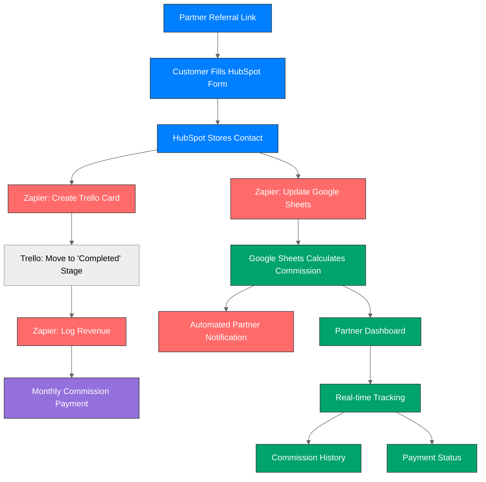
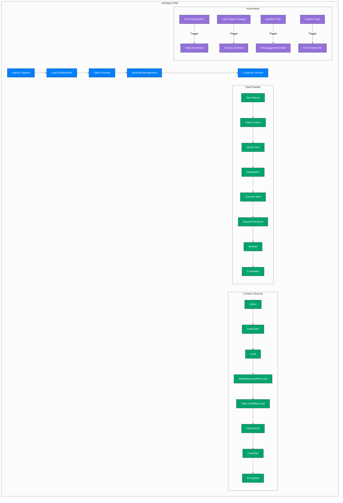
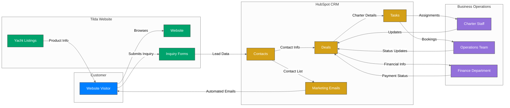
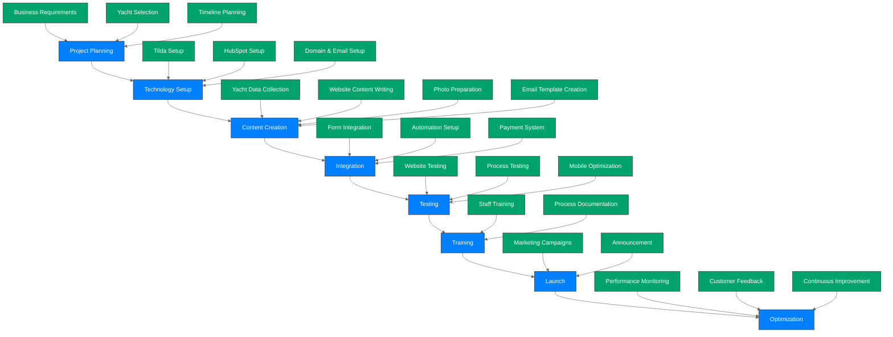

# Framework Overview

This document provides a visual overview of the Charter Framework components and how they interact to create a comprehensive charter business system.

## Framework Architecture

The Charter Framework architecture integrates three primary platforms with business processes to create a complete charter business solution:

## Customer Journey

The Charter Framework supports the complete customer journey from discovery to booking completion:

## Website Structure

The Tilda-based website structure organizes content for effective customer engagement:

## Yacht Listing Structure

The yacht listings follow a parent-child product structure for flexible charter options:

```mermaid
%%{init: {'theme': 'neutral'}}%%
flowchart TB
    ParentProduct["Parent Product<br/>(Yacht)"] --> Specifications["Specifications Tab"]
    ParentProduct --> PricingTab["Pricing Tab"]
    ParentProduct --> GalleryTab["Gallery Tab"]
    
    ParentProduct --> VariantA["Child Variant A<br/>(Day Charter)"]
    ParentProduct --> VariantB["Child Variant B<br/>(Week Charter)"]
    ParentProduct --> VariantC["Child Variant C<br/>(Custom Charter)"]
    
    Specifications --> TechnicalSpecs["Technical Specifications"]
    Specifications --> Amenities["Amenities & Features"]
    Specifications --> CrewDetails["Crew Details"]
    
    PricingTab --> SeasonalRates["Seasonal Rates"]
    PricingTab --> IncludedItems["Included Items"]
    PricingTab --> AdditionalCharges["Additional Charges"]
    
    GalleryTab --> ExteriorPhotos["Exterior Photos"]
    GalleryTab --> InteriorPhotos["Interior Photos"]
    GalleryTab --> LayoutPlans["Layout Plans"]
    
    classDef primary fill:#007FFF,color:#ffffff,stroke:#333,stroke-width:1px;
    classDef secondary fill:#00A36C,color:#ffffff,stroke:#333,stroke-width:1px;
    classDef tertiary fill:#D4A017,color:#ffffff,stroke:#333,stroke-width:1px;
    classDef detail fill:#9370DB,color:#ffffff,stroke:#333,stroke-width:1px;
    
    class ParentProduct primary;
    class Specifications,PricingTab,GalleryTab,VariantA,VariantB,VariantC secondary;
    class TechnicalSpecs,Amenities,CrewDetails,SeasonalRates,IncludedItems,AdditionalCharges,ExteriorPhotos,InteriorPhotos,LayoutPlans tertiary;
```

## Partner Network Architecture

The partner/referral system creates scalable lead generation through commission-based partnerships:

**Key Components:**
- **HubSpot Forms**: Lead capture with partner attribution via URL parameters
- **Zapier**: 3 automated workflows for data synchronization
- **Google Sheets**: Commission calculations and partner dashboards
- **Trello**: Lead management and stage tracking
- **Zelle**: Instant commission payments

**Integration Method:**
- Manual HubSpot property setup (15 minutes one-time)
- Form-based lead capture with partner tracking
- No API required - uses native platform features
- Zapier connectors for automation

**Commission Structure:**
- $100-300 per booking based on revenue
- Real-time tracking for complete transparency
- Monthly payment processing
- Zero monthly costs using free platform tiers

## CRM Process Flow

The HubSpot CRM integration manages sales and marketing processes:

## Data Flow Diagram

The data flow between different components of the Charter Framework:

## Implementation Workflow

The implementation process for the Charter Framework:

---

*Last Updated: April 30, 2025*  
*Next Review: May 31, 2025*