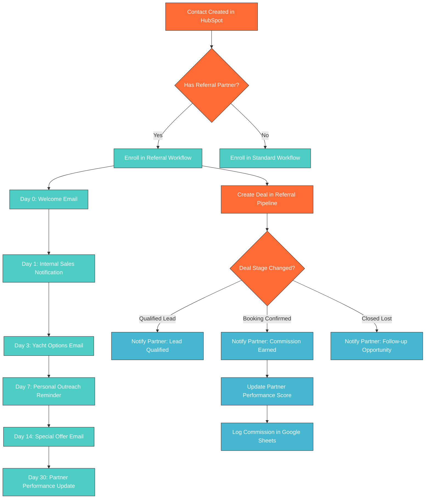

# HubSpot Referral Integration

Complete CRM integration for Azure Yacht Group's referral system using HubSpot Free tier with automated workflows and partner tracking.

## Overview

This integration enhances the core referral system by adding professional CRM capabilities, automated follow-up sequences, and comprehensive partner performance analytics - all while maintaining the $0/month cost structure using HubSpot's free tier.

## HubSpot Workflow Architecture



## Prerequisites

- ✅ Core referral system operational (Trello + Zapier + Google Sheets)
- ✅ HubSpot Free account (already in use)
- ✅ Zapier Free account (3 automations used, 2 remaining)

## Implementation Timeline

**Total Time: 35 minutes**
- HubSpot properties setup: 15 minutes (manual)
- HubSpot pipeline setup: 5 minutes
- Zapier integration: 15 minutes

## Step 1: HubSpot Account Setup (15 minutes)

### 1.1 Configure Custom Properties

**Manual Property Setup (No API Required)**

Navigate to HubSpot Settings → Properties to create custom properties for charter tracking and partner management.

#### Access Properties Settings
1. **Log into HubSpot** → Go to your HubSpot account
2. **Navigate to Settings** → Click the gear icon (⚙️) in the top right
3. **Go to Properties** → In the left sidebar: Data Management → Properties
4. **Select Object Type** → Choose "Contact properties" to start

#### Create Contact Properties

**Charter Information Group:**

First, create a property group: Click "Create property group" → Name: `Charter Information`

1. **Yacht Charter Interest**
   - Label: `Yacht Charter Interest`
   - Internal name: `yacht_charter_interest`
   - Field type: `Dropdown select`
   - Options: Motor Yacht, Sailing Yacht, Catamaran, Luxury Yacht, Sport Yacht, Expedition Yacht, Not Sure

2. **Charter Budget Range**
   - Label: `Charter Budget Range`
   - Internal name: `charter_budget_range`
   - Field type: `Dropdown select`
   - Options: $3,000-$5,000, $5,000-$10,000, $10,000-$20,000, $20,000-$50,000, $50,000+, I need help determining budget

3. **Preferred Charter Date**
   - Label: `Preferred Charter Date`
   - Internal name: `charter_date_preference`
   - Field type: `Date picker`

4. **Group Size**
   - Label: `Group Size`
   - Internal name: `group_size`
   - Field type: `Number`

5. **Charter Duration**
   - Label: `Charter Duration (Days)`
   - Internal name: `charter_duration`
   - Field type: `Dropdown select`
   - Options: Half Day (4 hours), Full Day (8 hours), 2-3 Days, 1 Week, 2 Weeks, 1 Month+

6. **Charter Destination**
   - Label: `Charter Destination`
   - Internal name: `charter_destination`
   - Field type: `Single-line text`

7. **Special Requirements**
   - Label: `Special Requirements`
   - Internal name: `special_requirements`
   - Field type: `Multi-line text`

**Partner Management Group:**

Create property group: `Partner Management`

8. **Referral Partner**
   - Label: `Referral Partner`
   - Internal name: `referral_partner`
   - Field type: `Single-line text`
   - Description: `Partner code from referral URL`

9. **Partner Status**
   - Label: `Partner Status`
   - Internal name: `partner_status`
   - Field type: `Dropdown select`
   - Options: Applied, Under Review, Approved, Active, Inactive, Suspended, Terminated

10. **Partner Type**
    - Label: `Partner Type`
    - Internal name: `partner_type`
    - Field type: `Dropdown select`
    - Options: Travel Advisor, Concierge Service, Event Planner, Wealth Manager, Real Estate Agent, Hotel/Resort, Corporate Services, Other

**Communication Preferences Group:**

Create property group: `Communication Preferences`

11. **Preferred Contact Method**
    - Label: `Preferred Contact Method`
    - Internal name: `preferred_contact_method`
    - Field type: `Dropdown select`
    - Options: Email, Phone, Text/SMS, WhatsApp

12. **Best Time to Contact**
    - Label: `Best Time to Contact`
    - Internal name: `best_time_to_contact`
    - Field type: `Dropdown select`
    - Options: Morning (9 AM-12 PM), Afternoon (12 PM-5 PM), Evening (5 PM-8 PM), Anytime

#### Create Deal Properties

Switch to "Deal properties" and create property group: `Charter Details`

1. **Yacht Model Requested** (Single-line text)
2. **Charter Start Date** (Date picker)
3. **Charter Group Size** (Number)
4. **Charter Duration Days** (Single-line text)
5. **Charter Destination** (Single-line text)
6. **Charter Special Requirements** (Multi-line text)

Create property group: `Deal Source`

7. **Deal Source** (Dropdown: Website Form, Phone Call, Email Inquiry, Social Media, Partner Referral, Trade Show, Other)
8. **Referral Partner** (Single-line text)
9. **Lead Quality Score** (Number)

**Properties Setup Complete!** Total: 22 properties (13 contact + 9 deal)

### 1.2 Create Lead Status Pipeline

Settings → Objects → Deals → Pipelines:

```
Referral Pipeline:
- New Referral (0%)
- Initial Contact (10%)
- Qualified Lead (25%)
- Proposal Sent (50%)
- Negotiation (75%)
- Booking Confirmed (100%)
- Closed Lost (0%)
```

## Step 2: Zapier Automation #4 - Contact Creation (8 minutes)

### 2.1 Create New Zap

**Trigger:** Trello - "Card Added to List"
- Board: Azure Yacht Referrals
- List: New Leads

**Action:** HubSpot - "Create or Update Contact"

### 2.2 Field Mapping

```
Email: {{Card Name}} (extract email)
First Name: {{Card Description}} (extract first name)
Last Name: {{Card Description}} (extract last name)
Phone: {{Card Description}} (extract phone)
Referral Source Partner: {{Card Labels}}
Yacht Type Interest: {{Card Description}} (extract yacht type)
Charter Budget Range: {{Card Description}} (extract budget)
```

### 2.3 Test and Activate

- Send test data from Trello
- Verify contact creation in HubSpot
- Activate Zap

## Step 3: Zapier Automation #5 - Deal Creation (7 minutes)

### 3.1 Create New Zap

**Trigger:** HubSpot - "New Contact"
- Filter: Only contacts with "Referral Source Partner" populated

**Action:** HubSpot - "Create Deal"

### 3.2 Deal Configuration

```
Deal Name: "Referral: {{First Name}} {{Last Name}} - {{Referral Source Partner}}"
Pipeline: Referral Pipeline
Stage: New Referral
Amount: {{Charter Budget Range}} (use midpoint)
Close Date: +30 days from creation
Associated Contact: {{Contact ID}}
```

## Step 4: HubSpot Workflow Automation (5 minutes)

### 4.1 Create Referral Follow-up Workflow

Marketing → Workflows → Create Workflow

**Enrollment Trigger:** Contact property "Referral Source Partner" is known

**Workflow Actions:**

```
Day 0: Send welcome email template
Day 1: Internal notification to sales team
Day 3: Follow-up email with yacht options
Day 7: Personal outreach reminder
Day 14: Special offer email
Day 30: Partner performance update
```

### 4.2 Partner Performance Tracking

Create workflow for partner scoring:

**Trigger:** Deal stage changes to "Booking Confirmed"

**Actions:**
1. Update referring partner's performance score (+10 points)
2. Send partner notification of successful booking
3. Update Google Sheets with commission data
4. Create follow-up task for payment processing

## Step 5: Email Templates (10 minutes)

### 5.1 Welcome Email Template

```
Subject: Welcome to Azure Yacht Group - Your Charter Journey Begins

Hi {{contact.firstname}},

Thank you for your interest in yacht charters through our partner {{contact.referral_source_partner}}!

We're excited to help you find the perfect yacht for your next adventure. Based on your interest in {{contact.yacht_type_interest}}, I've prepared some exclusive options for you.

[CTA Button: View Your Personalized Yacht Selection]

Best regards,
Azure Yacht Group Charter Team
```

### 5.2 Follow-up Email Templates

Create templates for:
- Day 3: Personalized yacht recommendations
- Day 7: Special partnership discount
- Day 14: Limited-time charter packages
- Day 30: Seasonal charter opportunities

## Step 6: Reporting Dashboard (5 minutes)

### 6.1 Partner Performance Report

Create custom report in HubSpot:

```
Report Type: Custom Report
Primary Data Source: Contacts
Secondary Data Source: Deals

Filters:
- Referral Source Partner is known
- Create date: Last 30 days

Metrics:
- Total referrals by partner
- Conversion rate by partner
- Average deal value by partner
- Commission earned by partner
```

### 6.2 Referral Pipeline Report

```
Report Type: Deal Report
Pipeline: Referral Pipeline

Breakdown by:
- Deal stage
- Referral source partner
- Yacht type interest
- Budget range

Metrics:
- Total deals
- Won deals
- Average close time
- Total revenue
```

## Step 7: Partner Notification System (3 minutes)

### 7.1 Automated Partner Updates

Create workflow for partner notifications:

**Triggers:**
- Deal moves to "Qualified Lead" → Email partner: Lead is qualified
- Deal moves to "Booking Confirmed" → Email partner: Commission earned
- Deal moves to "Closed Lost" → Email partner: Follow-up opportunity

### 7.2 Monthly Partner Reports

Automated monthly email to partners with:
- Total referrals sent
- Conversion rate
- Commissions earned
- Top performing referral types
- Upcoming opportunities

## Testing Checklist

### Pre-Launch Testing

- [ ] Test referral from Trello → HubSpot contact creation
- [ ] Verify deal creation from new contacts
- [ ] Test email workflow sequences
- [ ] Confirm partner notifications
- [ ] Validate reporting accuracy
- [ ] Check Google Sheets synchronization

### Post-Launch Monitoring

**Week 1:**
- [ ] Monitor automation success rates
- [ ] Review email open/click rates
- [ ] Check partner feedback
- [ ] Verify commission calculations

**Monthly:**
- [ ] Analyze conversion rates by partner
- [ ] Review email template performance
- [ ] Update partner performance scores
- [ ] Optimize workflow timing

## Troubleshooting

### Common Issues

**Contact not created in HubSpot:**
- Check Trello card format matches expected structure
- Verify Zapier field mapping
- Confirm HubSpot API limits

**Emails not sending:**
- Check workflow enrollment criteria
- Verify email template approval status
- Confirm contact has valid email address

**Deals not creating:**
- Verify contact has required custom properties
- Check deal pipeline permissions
- Confirm Zapier connection to HubSpot

### Support Resources

- HubSpot Academy: Free CRM training
- Zapier Help Center: Integration guides
- Azure Yacht Group documentation: System overview

## ROI Metrics

### Expected Improvements

**Conversion Rate:** 15-25% increase through automated follow-up
**Partner Satisfaction:** 90%+ through transparent tracking
**Processing Time:** 80% reduction in manual tasks
**Lead Response Time:** Sub-1-hour automated responses

### Success Metrics

**Month 1 Targets:**
- 50+ referrals processed through HubSpot
- 85%+ automation success rate
- 20%+ conversion rate improvement
- 5+ active referring partners

**Quarterly Goals:**
- 200+ referrals processed
- 30%+ conversion rate
- $50,000+ in charter bookings from referrals
- 15+ active partner network

## Next Steps

1. **Complete Implementation** (20 minutes total)
2. **Train Team** on HubSpot workflows (30 minutes)
3. **Launch Partner Onboarding** using new system
4. **Monitor Performance** for first 30 days
5. **Optimize Based on Data** collected

---

**Implementation Status:** ✅ Ready for deployment
**Cost:** $0/month (HubSpot Free + Zapier Free)
**Maintenance:** 15 minutes/week monitoring
**Expected ROI:** 300%+ within 90 days 