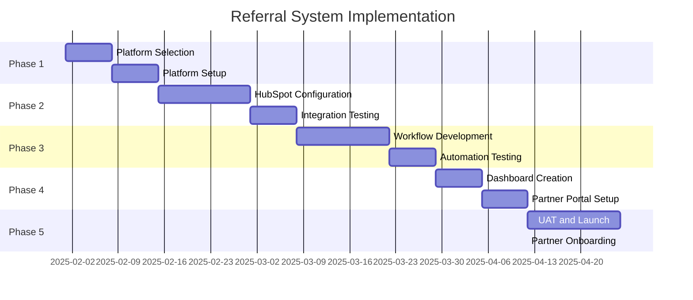

# HubSpot Referral System for Yacht Charter Influencers

## Executive Summary

This document evaluates and provides implementation guidance for creating a comprehensive referral system using HubSpot CRM to track influencer progress and commissions for Azure Yacht Group's charter business.

## System Overview

### Business Objectives
- Track influencer referrals and conversions
- Automate commission calculations and payments
- Provide real-time dashboard for influencer performance
- Maintain compliance with affiliate marketing regulations
- Scale influencer partnerships efficiently

### Key Requirements
- Unique tracking codes for each influencer
- Attribution tracking from initial click to booking
- Commission tier management
- Performance analytics and reporting
- Automated payout processing
- GDPR/privacy compliance

## HubSpot CRM Capabilities Assessment

### ✅ Native HubSpot Features Available

1. **Custom Properties**: Create influencer-specific fields
2. **Deal Pipeline**: Track referral progression
3. **Contact Management**: Manage influencer relationships
4. **Workflows**: Automate referral processing
5. **Reports & Dashboards**: Performance tracking
6. **Attribution Reporting**: Source tracking
7. **Custom Objects**: Referral program management

### ❌ Features Requiring Third-Party Integration

1. **Advanced Affiliate Tracking**: Need specialized affiliate software
2. **Commission Calculations**: Require custom logic
3. **Payment Processing**: Need payment gateway integration
4. **Unique Link Generation**: Require URL shortening/tracking service
5. **Fraud Detection**: Need advanced analytics

## Recommended Implementation Approach

### Option 1: HubSpot + Third-Party Affiliate Platform (Recommended)

**Best Solutions:**
- **Referral Rock** (HubSpot certified integration)
- **Referral Factory** (Native HubSpot integration)
- **Post Affiliate Pro** (Advanced tracking capabilities)
- **PartnerStack** (Enterprise-level solution)

**Advantages:**
- Purpose-built for affiliate/referral tracking
- Native HubSpot integration
- Automated commission calculations
- Built-in fraud protection
- Compliance features

### Option 2: Custom HubSpot Implementation

**Components:**
- Custom properties and objects
- Workflow automation
- Third-party integrations (Zapier)
- Custom dashboard creation

**Advantages:**
- Full control over system
- Lower ongoing costs
- Deep HubSpot integration

**Disadvantages:**
- Higher development complexity
- Limited tracking capabilities
- Manual commission management

## Detailed Implementation Plan (Option 1 - Recommended)

### Phase 1: Platform Selection and Setup

#### 1.1 Evaluate Affiliate Platforms

| Platform | HubSpot Integration | Commission Types | Pricing | Best For |
|----------|-------------------|------------------|---------|----------|
| **Referral Rock** | ✅ Native | Flat, %, Tiered | $95-$500/mo | Mid-size businesses |
| **Referral Factory** | ✅ Native | Flat, %, Tiered | $49-$299/mo | Small-medium businesses |
| **Post Affiliate Pro** | ✅ API | All types | $97-$497/mo | Advanced tracking needs |
| **PartnerStack** | ✅ Native | All types | Custom pricing | Enterprise |

#### 1.2 Platform Setup (Using Referral Rock as Example)

**Initial Configuration:**
```yaml
Referral Program Settings:
  Program Name: "Azure Yacht Charter Partners"
  Commission Structure:
    - Tier 1 (0-5 bookings): 8% commission
    - Tier 2 (6-15 bookings): 10% commission  
    - Tier 3 (16+ bookings): 12% commission
  Cookie Duration: 90 days
  Minimum Payout: $100
  Payment Schedule: Monthly
```

### Phase 2: HubSpot Integration Configuration

#### 2.1 Custom Properties Setup

**Contact Properties (Influencers):**
```javascript
// Influencer-specific properties
{
  "referral_partner_id": "text",
  "referral_tier": "dropdown", // Tier 1, 2, 3
  "total_referrals": "number",
  "total_commissions_earned": "number",
  "commission_rate": "number",
  "partner_status": "dropdown", // Active, Inactive, Suspended
  "onboarding_date": "date",
  "last_referral_date": "date",
  "payment_method": "dropdown", // PayPal, Bank Transfer, Check
  "tax_id": "text"
}
```

**Deal Properties (Charter Bookings):**
```javascript
// Referral tracking properties
{
  "referral_source": "text",
  "referring_partner_id": "text", 
  "referral_code": "text",
  "commission_amount": "number",
  "commission_rate_applied": "number",
  "commission_status": "dropdown", // Pending, Approved, Paid
  "original_referral_date": "datetime",
  "booking_confirmation_date": "datetime"
}
```

#### 2.2 Custom Objects Creation

**Referral Transactions Object:**
```yaml
Object Name: "Referral Transactions"
Properties:
  - transaction_id: Primary key
  - partner_contact_id: Associated contact
  - deal_id: Associated deal
  - commission_amount: Number
  - commission_rate: Number
  - transaction_date: Date
  - payment_date: Date
  - status: Dropdown (Pending, Approved, Paid, Disputed)
```

### Phase 3: Workflow Automation

#### 3.1 Influencer Onboarding Workflow

```yaml
Trigger: Contact property "Partner Status" = "New Application"

Actions:
1. Send welcome email with program details
2. Create deal in "Partner Onboarding" pipeline
3. Assign to partner manager
4. Generate unique referral code
5. Set enrollment date
6. Add to "New Partners" list for nurturing
```

#### 3.2 Referral Tracking Workflow

```yaml
Trigger: Deal created with "Referral Source" populated

Actions:
1. Validate referral code
2. Identify referring partner
3. Calculate commission based on tier
4. Create referral transaction record
5. Update partner's total referrals count
6. Send notification to partner
7. Add deal to commission tracking pipeline
```

#### 3.3 Commission Processing Workflow

```yaml
Trigger: Deal stage = "Closed Won" AND "Referral Source" is known

Actions:
1. Mark commission as "Approved"
2. Update partner's total commissions
3. Check if tier upgrade is needed
4. Schedule payment processing
5. Send commission earned notification
6. Update partner performance metrics
```

### Phase 4: Dashboard and Reporting Setup

#### 4.1 Influencer Performance Dashboard

**Key Metrics:**
- Total active partners
- Monthly referrals generated
- Conversion rates by partner
- Commission payouts (pending/paid)
- Top performing partners
- Revenue attributed to referrals

**Dashboard Components:**
```yaml
Reports:
1. Partner Performance Summary
   - Filters: Date range, Partner tier, Status
   - Metrics: Referrals, Conversions, Revenue, Commissions

2. Commission Tracking
   - Pending commissions by partner
   - Monthly payout summaries
   - Commission rate effectiveness

3. Referral Source Analysis
   - Traffic sources by partner
   - Conversion funnel performance
   - Attribution accuracy metrics
```

#### 4.2 Individual Partner Portals

**Partner Dashboard Features:**
- Real-time performance metrics
- Commission earnings (pending/paid)
- Referral link management
- Marketing materials download
- Payment history
- Tier progression tracking

### Phase 5: Implementation Timeline



## Technical Integration Details

### API Integration (Referral Rock + HubSpot)

#### 3.1 Webhook Configuration

**Referral Rock → HubSpot:**
```javascript
// New referral webhook
{
  "endpoint": "https://api.hubapi.com/contacts/v1/contact/",
  "events": ["referral.created", "referral.converted", "commission.approved"],
  "data_mapping": {
    "referrer_email": "email",
    "referral_code": "referral_code",
    "commission_amount": "commission_amount",
    "conversion_date": "conversion_date"
  }
}
```

**HubSpot → Referral Rock:**
```javascript
// Deal update webhook
{
  "endpoint": "https://api.referralrock.com/v1/conversions",
  "trigger": "deal.propertyChange",
  "conditions": {
    "dealstage": "closedwon",
    "referral_source": "not_empty"
  }
}
```

### 3.2 Custom Tracking Implementation

#### URL Generation for Influencers

```javascript
// Generate unique tracking URLs
function generateReferralURL(partnerId, destination) {
  const baseURL = "https://azurcharters.com";
  const trackingParams = {
    ref: partnerId,
    utm_source: "referral",
    utm_medium: "partner",
    utm_campaign: "influencer_program",
    utm_content: partnerId
  };
  
  return `${baseURL}${destination}?${new URLSearchParams(trackingParams)}`;
}

// Example output:
// https://azurcharters.com/fleet?ref=INF001&utm_source=referral&utm_medium=partner&utm_campaign=influencer_program&utm_content=INF001
```

#### Tracking Script for Website

```javascript
// Add to Tilda website
(function() {
  // Capture referral parameters
  const urlParams = new URLSearchParams(window.location.search);
  const referralCode = urlParams.get('ref');
  
  if (referralCode) {
    // Store in localStorage for attribution
    localStorage.setItem('azure_referral_code', referralCode);
    localStorage.setItem('azure_referral_timestamp', Date.now());
    
    // Send to HubSpot for tracking
    if (typeof _hsq !== 'undefined') {
      _hsq.push(['identify', {
        referral_source: referralCode,
        referral_timestamp: new Date().toISOString()
      }]);
    }
  }
})();
```

## Commission Structure Recommendations

### Tiered Commission System

```yaml
Tier 1 - New Partners (0-5 successful bookings):
  Commission Rate: 8%
  Benefits:
    - Basic marketing materials
    - Monthly performance reports
    - Email support

Tier 2 - Established Partners (6-15 successful bookings):
  Commission Rate: 10%
  Benefits:
    - Enhanced marketing materials
    - Bi-weekly performance reports
    - Priority email support
    - Quarterly strategy calls

Tier 3 - Elite Partners (16+ successful bookings):
  Commission Rate: 12%
  Benefits:
    - Custom marketing materials
    - Real-time dashboard access
    - Dedicated account manager
    - Monthly strategy calls
    - Early access to new yachts/destinations
```

### Special Incentives

```yaml
Bonus Structures:
  New Partner Bonus: $500 for first successful booking
  Volume Bonus: Additional 2% for 10+ bookings in a quarter
  Seasonal Bonus: 1.5x commission during peak season (June-August)
  Exclusive Event Bonus: $1,000 for bookings over $50,000
```

## Compliance and Legal Considerations

### 1. Affiliate Marketing Compliance

**FTC Requirements:**
- Clear disclosure of affiliate relationships
- Transparent commission structures
- Honest advertising standards

**Implementation:**
```html
<!-- Required disclosure on partner content -->
<div class="affiliate-disclosure">
  "This post contains affiliate links. If you book through these links, 
  we may earn a commission at no additional cost to you."
</div>
```

### 2. Data Privacy (GDPR/CCPA)

**Data Handling:**
- Explicit consent for tracking
- Right to data deletion
- Transparent privacy policies
- Secure data storage

**HubSpot Configuration:**
```javascript
// GDPR-compliant tracking
{
  "lawful_basis": "legitimate_interest",
  "consent_required": true,
  "data_retention": "24_months",
  "deletion_rights": true
}
```

### 3. Tax Compliance

**1099 Reporting:**
- Track payments over $600/year
- Collect W-9 forms from partners
- Generate 1099-MISC forms annually

## Performance Monitoring and Optimization

### Key Performance Indicators (KPIs)

```yaml
Partner Program KPIs:
  Acquisition Metrics:
    - New partner signups per month
    - Partner activation rate
    - Time to first referral

  Performance Metrics:
    - Average referrals per partner
    - Conversion rate by partner
    - Revenue per partner
    - Partner retention rate

  Financial Metrics:
    - Total commission payouts
    - Return on commission investment
    - Average commission per booking
    - Partner lifetime value
```

### Monthly Optimization Process

```yaml
Monthly Review Process:
  Week 1: Data Collection
    - Export partner performance data
    - Analyze conversion trends
    - Review commission payouts

  Week 2: Partner Outreach
    - Contact underperforming partners
    - Provide performance insights
    - Offer additional support

  Week 3: Program Optimization
    - Adjust commission rates if needed
    - Update marketing materials
    - Implement new tracking features

  Week 4: Reporting and Planning
    - Generate monthly reports
    - Plan next month's initiatives
    - Budget for commission payouts
```

## Cost Analysis

### Implementation Costs

```yaml
One-time Setup Costs:
  Referral Platform Setup: $2,000 - $5,000
  HubSpot Configuration: $3,000 - $7,000
  Custom Development: $5,000 - $15,000
  Testing and QA: $2,000 - $4,000
  Total: $12,000 - $31,000

Monthly Operational Costs:
  Referral Platform Subscription: $95 - $500
  Additional HubSpot Features: $50 - $200
  Payment Processing Fees: 2.9% + $0.30 per transaction
  Management Time: $2,000 - $5,000
  Total Monthly: $2,145 - $5,700
```

### ROI Projections

```yaml
Year 1 Projections:
  Target Partners: 50
  Average Bookings per Partner: 4
  Average Booking Value: $25,000
  Total Referred Revenue: $5,000,000
  Average Commission Rate: 10%
  Total Commission Payouts: $500,000
  Implementation Costs: $25,000
  Operational Costs: $60,000
  Net ROI: 588%
```

## Next Steps and Recommendations

### Immediate Actions (Next 30 Days)

1. **Platform Evaluation**
   - Demo Referral Rock and Referral Factory
   - Compare features and pricing
   - Check HubSpot integration capabilities

2. **Legal Review**
   - Review affiliate program terms
   - Ensure compliance requirements
   - Draft partner agreements

3. **Technical Planning**
   - Audit current HubSpot setup
   - Plan integration architecture
   - Estimate development timeline

### Short-term Implementation (Next 90 Days)

1. **Platform Setup**
   - Configure chosen referral platform
   - Set up HubSpot integration
   - Create partner onboarding process

2. **Pilot Program**
   - Recruit 5-10 initial partners
   - Test tracking and commission flows
   - Gather feedback and optimize

### Long-term Optimization (6-12 Months)

1. **Scale Operations**
   - Expand partner network to 50+ influencers
   - Implement advanced analytics
   - Automate partner communications

2. **Program Enhancement**
   - Add performance-based bonuses
   - Create exclusive partner events
   - Develop co-marketing opportunities

## Conclusion

Implementing a HubSpot-integrated referral system for yacht charter influencers is highly feasible and recommended. The combination of HubSpot CRM with a specialized affiliate platform like Referral Rock provides:

- **Comprehensive Tracking**: Full attribution from click to booking
- **Automated Processing**: Streamlined commission calculations and payments
- **Scalable Operations**: Support for growing partner network
- **Data-Driven Insights**: Performance analytics for optimization
- **Compliance Support**: Built-in features for legal requirements

**Recommended Next Step**: Schedule demos with Referral Rock and Referral Factory to evaluate which platform best fits Azure Yacht Group's specific needs and budget.

---

*Document Created: January 2025*
*Last Updated: January 2025*
*Next Review: March 2025* 