# Simple Partner Referral Solutions (No Webhooks Required)

## Overview

Most referral partners (travel advisors, concierges, etc.) don't have technical expertise to set up webhooks or API integrations. Here are practical, user-friendly solutions.

### Solutions Comparison Schematic:

```mermaid
graph TD
    A[Partner Referral Solutions] --> B[Solution 1: Email System]
    A --> C[Solution 2: Google Form]
    A --> D[Solution 3: Shared Sheet]
    A --> E[Solution 4: WhatsApp/SMS]
    A --> F[Solution 5: Partner Portal]
    
    B --> B1[✅ Easiest for partners<br/>✅ No technical setup<br/>✅ Works with any email<br/>⚠️ Manual logging required]
    
    C --> C1[✅ Structured data collection<br/>✅ Automatic Google Sheets<br/>✅ Mobile-friendly<br/>⚠️ Partners need internet]
    
    D --> D1[✅ Real-time collaboration<br/>✅ Partners see status<br/>✅ Good for regular partners<br/>⚠️ Requires Google account]
    
    E --> E1[✅ Instant communication<br/>✅ Works internationally<br/>✅ Partners always have phones<br/>⚠️ Less structured data]
    
    F --> F1[✅ Professional appearance<br/>✅ Full tracking dashboard<br/>✅ Commission transparency<br/>⚠️ Requires development]
    
    style A fill:#e3f2fd
    style B fill:#e8f5e8
    style C fill:#fff3e0
    style D fill:#f3e5f5
    style E fill:#e1f5fe
    style F fill:#fce4ec
    style B1 fill:#f1f8e9
    style C1 fill:#fff8e1
    style D1 fill:#fdf2ff
    style E1 fill:#e8f4fd
    style F1 fill:#fff3e0
```



### Implementation Complexity vs Partner Experience:


---

## Solution 1: Email-Based Referral System ⭐ **RECOMMENDED**

### System Schematic:


### How It Works:
1. Partner sends referral via simple email template
2. You manually log it in your system
3. Partner gets confirmation and updates

### Partner Process:
**Step 1:** Partner sends email to `referrals@azureyachtgroup.com`

**Email Template for Partners:**
```
Subject: New Referral - [Client Name]

Partner Information:
- Partner Name: [Your Name]
- Partner Code: [Your assigned code, e.g., AZURE-JOHN]
- Company: [Your Company]

Client Information:
- Client Name: [Full Name]
- Email: [Client Email]
- Phone: [Client Phone]
- Preferred Charter Date: [Date]
- Group Size: [Number of guests]
- Budget Range: [Budget if known]
- Special Requirements: [Any special needs]

Additional Notes:
[Any additional information about the client or their preferences]
```

**Step 2:** You receive email and log in Trello/HubSpot manually

**Step 3:** You send confirmation back to partner

### Advantages:
- ✅ No technical setup required
- ✅ Works with any email system
- ✅ Partners already know how to use email
- ✅ Easy to track and manage
- ✅ Can include attachments (client photos, requirements)

---

## Solution 2: Google Form Integration

### System Schematic:


### Setup (One-time for you):
Create a Google Form that partners can use to submit referrals

### Google Form Fields:
```
Partner Information:
- Partner Name*
- Partner Code*
- Company Name
- Your Email*

Client Information:
- Client Full Name*
- Client Email*
- Client Phone*
- Preferred Charter Dates
- Group Size*
- Estimated Budget Range
- Charter Type Preference (Half-day, Full-day, Multi-day)
- Destination Preference
- Special Requirements
- How did client hear about charter services?

Additional Information:
- Client's level of interest (High/Medium/Low)
- Timeline for booking
- Additional notes
```

### Form Settings:
- **Response Collection:** Google Sheets
- **Email Notifications:** Send to you when form submitted
- **Confirmation Message:** "Thank you! We'll contact your client within 24 hours and keep you updated."

### Partner Process:
1. Partner receives simple form link: `forms.gle/your-referral-form`
2. Partner fills out form (takes 2-3 minutes)
3. Form automatically creates entry in your tracking sheet
4. You get email notification
5. You follow up with client and partner

### Advantages:
- ✅ Simple web form - no apps needed
- ✅ Automatic data collection
- ✅ Mobile-friendly
- ✅ Can be embedded in partner emails/websites
- ✅ Free to use

---

## Solution 3: Shared Google Sheet (For Regular Partners)

### System Schematic:


### Setup:
Create a shared Google Sheet with regular partners who send multiple referrals

### Sheet Structure:
| Date | Partner Name | Client Name | Client Email | Client Phone | Charter Date | Status | Notes |
|------|--------------|-------------|--------------|--------------|--------------|---------|-------|
| [Auto] | [Partner] | [Client] | [Email] | [Phone] | [Date] | New | [Notes] |

### Partner Access:
- Share sheet with "Editor" access to trusted partners
- Partners add new rows when they have referrals
- You get notifications when sheet is updated
- You update "Status" column as you process leads

### Sheet Features:
- **Data Validation:** Dropdown menus for common fields
- **Conditional Formatting:** Color-code by status
- **Email Notifications:** Alert you when new referrals added
- **Comments:** Partners can add context in comments

### Advantages:
- ✅ Real-time collaboration
- ✅ Partners can see their referral history
- ✅ No forms to fill out repeatedly
- ✅ Easy to track multiple referrals
- ✅ Partners can check status anytime

---

## Solution 4: WhatsApp/Text Message System

### System Schematic:


### How It Works:
Partners send referrals via WhatsApp or text using a simple format

### Message Template:
```
NEW REFERRAL 🛥️

Partner: [Your Name - Your Code]
Client: [Client Name]
Email: [Client Email]  
Phone: [Client Phone]
Date: [Preferred charter date]
Group: [Number of guests]
Budget: [If known]
Notes: [Special requirements]
```

### Your Process:
1. Receive WhatsApp/text
2. Copy information to Trello/system
3. Reply with confirmation
4. Send updates as you process the lead

### Advantages:
- ✅ Instant communication
- ✅ Partners always have phones
- ✅ Can include photos/documents
- ✅ Easy to send quick updates
- ✅ Works internationally

---

## Solution 5: Partner Portal (Simple Website)

### System Schematic:


### Create Simple Partner Login:
- Basic website with login for partners
- Simple form to submit referrals
- Dashboard to see their referral history
- Commission tracking

### Features:
- **Login System:** Username/password for each partner
- **Referral Form:** Simple web form
- **Dashboard:** See submitted referrals and status
- **Resources:** Download marketing materials
- **Commission Tracker:** See pending/paid commissions

### Partner Experience:
1. Login to partner portal
2. Click "Submit New Referral"
3. Fill out simple form
4. See confirmation and tracking number
5. Check dashboard for updates

### Advantages:
- ✅ Professional appearance
- ✅ Partners can track their own referrals
- ✅ Automated confirmation emails
- ✅ Can include marketing resources
- ✅ Commission transparency

---

## Recommended Implementation Strategy

### Implementation Timeline Schematic:

```mermaid
gantt
    title Partner Referral System Implementation
    dateFormat  X
    axisFormat %s
    
    section Phase 1: Start Simple
    Email System Setup           :done, email, 0, 1w
    Create Email Templates       :done, templates, 0, 3d
    Set Up Manual Logging        :done, logging, 0, 2d
    Partner Onboarding          :done, onboard1, 0, 1w
    
    section Phase 2: Add Options
    Google Form Creation        :form, 1w, 2w
    WhatsApp Setup             :whatsapp, 1w, 1w
    Partner Choice Integration  :choice, 2w, 1w
    Testing & Feedback         :test1, 3w, 3d
    
    section Phase 3: Scale Up
    Shared Sheet for Regulars   :sheet, 4w, 2w
    Partner Portal Development  :portal, 6w, 4w
    Advanced Features          :advanced, 8w, 2w
    Full System Integration    :integration, 10w, 1w
```

### Phase-by-Phase Flow:

```mermaid
graph TD
    A[Week 1: Launch Email System] --> B[All Partners Use Email]
    B --> C{Week 2-3: Add Options}
    C --> D[Tech-Savvy Partners → Google Form]
    C --> E[International Partners → WhatsApp]
    C --> F[Traditional Partners → Keep Email]
    D --> G{Month 2: Evaluate Usage}
    E --> G
    F --> G
    G --> H[High-Volume Partners → Shared Sheet]
    G --> I[Occasional Partners → Keep Simple Options]
    H --> J{Month 3+: Scale Decision}
    I --> J
    J --> K[Many Active Partners → Build Portal]
    J --> L[Few Partners → Keep Current System]
    
    style A fill:#e8f5e8
    style B fill:#fff3e0
    style D fill:#e3f2fd
    style E fill:#e1f5fe
    style F fill:#f3e5f5
    style H fill:#fce4ec
    style I fill:#fff8e1
    style K fill:#ffccbc
    style L fill:#e0f2f1
```



### Phase 1: Start Simple (Week 1)
- **Email-based system** for all partners
- Create email template for partners
- Set up manual logging process

### Phase 2: Add Efficiency (Week 2-3)  
- **Google Form** for partners who prefer forms
- **WhatsApp** for partners who prefer messaging
- Continue email option for others

### Phase 3: Scale Up (Month 2)
- **Shared Google Sheet** for high-volume partners
- **Partner Portal** if you have many active partners
- Keep simpler options for occasional partners

---

## Partner Onboarding Communication

### Welcome Email to New Partners:
```
Subject: Welcome to Azure Yacht Group Partner Program

Dear [Partner Name],

Welcome to our referral partner network! Here's how to send us referrals:

OPTION 1 - EMAIL (Easiest)
Send referrals to: referrals@azureyachtgroup.com
Use the template attached to this email.

OPTION 2 - ONLINE FORM  
Use this link: [Google Form URL]
Takes 2-3 minutes to complete.

OPTION 3 - WHATSAPP
Text referrals to: [Your WhatsApp number]
Use the format in the attached guide.

What happens next:
✅ We contact your client within 24 hours
✅ We send you confirmation with tracking info
✅ We keep you updated throughout the process
✅ We handle all charter arrangements
✅ We process your commission after booking

Questions? Reply to this email or call [phone number].

Best regards,
Azure Yacht Group Partner Team
```

---

## Tracking & Management

### Your Internal Process:
1. **Receive Referral** (email/form/WhatsApp)
2. **Log in Trello** (create card with partner info)
3. **Send Confirmation** to partner
4. **Contact Client** within 24 hours
5. **Update Partner** on progress
6. **Process Commission** when deal closes

### Simple Tracking Sheet:
| Referral ID | Date | Partner | Client | Contact Method | Status | Commission Due |
|-------------|------|---------|---------|----------------|---------|----------------|
| REF-001 | 1/15/25 | John Smith | Mary Jones | Email | Booked | $150 |

---

## Summary: Best Approach

**For Most Partners:** Start with **email-based system**
- Easiest to implement
- No technical barriers
- Partners already use email
- You control the process

**For Tech-Savvy Partners:** Add **Google Form option**
- More structured data
- Automatic collection
- Still very simple

**For High-Volume Partners:** Consider **shared Google Sheet**
- Real-time collaboration
- Better for ongoing relationships

**Avoid:** Complex webhook setups for partners - save those for your internal systems only.

The key is making it **as easy as possible** for partners to send referrals while giving you the information you need to follow up effectively. 