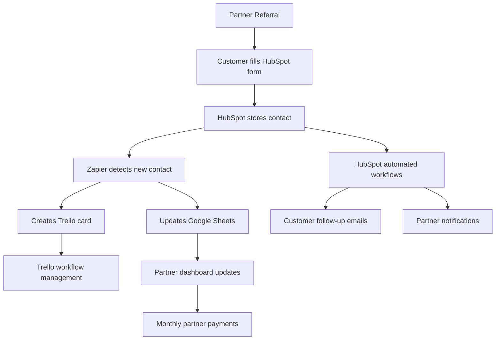

# Azure Yacht Group Referral System

## 🎯 System Overview

Our referral system rewards partners for bringing quality yacht charter leads with complete transparency and automated tracking. Built entirely on the Google Sheets-HubSpot-Trello-Zapier stack with zero monthly costs for up to 100 referrals per month.

**Key Features:**
- ✅ **$100-300 commission per booking**
- ✅ **Real-time partner dashboards** via Google Sheets filtered views
- ✅ **Automated tracking** integrated with your Trello workflow
- ✅ **HubSpot CRM integration** for professional lead management
- ✅ **Monthly Zelle payments** with full transparency
- ✅ **Zero monthly costs** - scales to 100+ partners

## 💰 Commission Structure

Our hybrid commission model based on your actual revenue:

| Your Revenue | Partner Commission | Typical Booking Value |
|-------------|-------------------|----------------------|
| $300 | **$100** | ~$5,000 |
| $500 | **$150** | ~$7,500 |
| $800 | **$200** | ~$10,000+ |
| $1000+ | **$300** | ~$15,000+ |

**How it works:**
- Revenue = Retail Price - Yacht Owner's Cut
- Commission triggers when booking moves to "Proposal" stage in Trello
- Payments processed monthly via Zelle

## 🏗️ System Architecture

### Architecture Overview

The Azure Yacht Group referral system is built on a modern, scalable architecture that integrates multiple platforms to create a seamless partner experience while maintaining zero monthly costs.



### Data Flow Architecture

**Primary Data Flow:**
1. **Partner Referral** → Customer clicks partner referral link with tracking code
2. **HubSpot Form** → Customer fills inquiry form (partner code captured automatically)
3. **HubSpot Contact** → Lead stored with partner attribution and charter details
4. **Zapier Automation** → Detects new HubSpot contact and processes data
5. **Trello Card** → Lead created in workflow board with partner tracking
6. **Google Sheets** → Real-time partner commission tracking and dashboard updates
7. **HubSpot Workflows** → Automated customer follow-up and partner notifications

**Secondary Processes:**
- **Partner Payments** → Monthly Zelle transfers based on Google Sheets data
- **Customer Nurturing** → HubSpot email sequences for lead conversion
- **Partner Analytics** → Performance tracking and commission reporting
- **Workflow Management** → Trello-based charter booking process

## 🛠️ Technology Stack

### Core Platforms

#### **Trello** - Lead Management Hub
- **Purpose**: Central workflow management for all yacht charter inquiries
- **Integration**: Receives all partner referrals and direct inquiries
- **Data Format**: Standardized card format with partner attribution
- **Workflow**: Inquiry → Proposal → Confirmed → Completed
- **Cost**: Free (unlimited personal boards)

#### **Zapier** - Automation Engine
- **Purpose**: Connects HubSpot, Trello, and Google Sheets
- **Automations**: 3 total (1 for contact processing, 1 for Trello sync, 1 for Google Sheets)
- **Capacity**: 100 tasks/month on free plan (≈30 referrals)
- **Triggers**: HubSpot form submissions, Trello card movements
- **Cost**: Free for up to 100 tasks/month

#### **Google Sheets** - Partner Dashboard
- **Purpose**: Real-time partner commission tracking and payments
- **Features**: Filtered views, automated calculations, payment tracking
- **Access**: Personalized partner dashboards via filtered links
- **Data**: Referrals, commissions, payments, performance metrics
- **Cost**: Free (unlimited sheets)

#### **HubSpot CRM** - Customer Management
- **Purpose**: Professional lead management and customer relationship tracking
- **Setup**: Manual property configuration (15 minutes one-time setup)
- **Features**: Contact management, deal pipeline, automated workflows
- **Integration**: Receives leads via embedded forms with partner tracking
- **Automation**: Email sequences, lead scoring, partner notifications
- **Cost**: Free for up to 1,000 contacts
- **API Required**: None - uses forms and Zapier connectors

#### **Gmail** - Communication Hub
- **Purpose**: Automated partner notifications and customer communication
- **Integration**: Zapier triggers for partner updates
- **Features**: Automated emails, custom templates, professional branding
- **Cost**: Free (existing Gmail account)

#### **Zelle** - Payment Processing
- **Purpose**: Monthly commission payments to partners
- **Features**: Instant transfers, payment tracking, receipt generation
- **Integration**: Manual process based on Google Sheets data
- **Cost**: Free (bank-to-bank transfers)

## 🔄 Automated Workflow

### Step-by-Step Process

1. **Partner sends referral** - Customer mentions partner code during booking
2. **Create Trello card** - Add card with standardized format:
   ```
   PARTNER: AZURE-JOHN
   CUSTOMER: john.doe@email.com
   RETAIL: 5000
   REVENUE: 300
   CHARTER: 2/15/2025
   ```
3. **Move to "Proposal"** - Triggers dual automation:
   - **Zapier → Google Sheets**: Logs referral data, calculates commission
   - **Zapier → HubSpot**: Creates contact record, triggers lead scoring
4. **Google Sheets Dashboard** - Real-time partner tracking updates
5. **HubSpot Automation** - Professional client follow-up sequences begin
6. **Partner notification** - Instant email: "Referral logged - $X commission"
7. **Move to "Completed"** - When charter confirmed
8. **Monthly payment** - Zelle transfer with payment status update

### How Partners Track Commissions

**Personal Dashboard Access:**
Each partner gets a personalized Google Sheets link showing only their data:
- Real-time referral status updates
- Commission calculations
- Payment history
- Performance metrics

**Partner Experience:**
- Instant email notifications when referrals are logged
- Live dashboard updates via filtered Google Sheets views
- Monthly payment summaries
- Complete transparency into the referral process

## 📋 Data Architecture

### Partner Data Structure

#### **Partners Table** (Google Sheets)
```
Partner ID | Name | Email | Phone | Status | Join Date | Zelle Info | 
Referral Code | Total Referrals | Total Earned | Last Payment | Notes
```

#### **Referrals Table** (Google Sheets)
```
Date | Customer | Customer Email | Partner Code | Retail Price | 
Your Revenue | Commission | Status | Charter Date | Payment Date | 
Payment Ref | Notes
```

#### **HubSpot Contact Properties**
- Partner attribution fields
- Lead source tracking
- Commission calculation data
- Performance metrics
- See [HubSpot Integration Guide](/docs/integration/hubspot-referral-integration) for complete details

### Automation Logic

#### **Partner Attribution**
```
HubSpot Form URL:
https://azureyachtgroup.com/charter-inquiry?partner=AZURE-JOHN

Form automatically captures:
- Partner code: AZURE-JOHN
- Customer details: Name, email, phone
- Charter preferences: Date, budget, yacht type
```

#### **Commission Calculation**
```javascript
// Automated formula in Google Sheets
=IF(G2="","",IF(G2<=300,100,IF(G2<=500,150,IF(G2<=800,200,300))))
```

## 🔐 Security & Access Control

### Data Security
- **Google Sheets**: Filtered views ensure partners only see their data
- **HubSpot**: Role-based access control for team members
- **Trello**: Board-level permissions and member access control
- **Zapier**: Encrypted connections between all platforms

### Partner Access
- **Limited Scope**: Partners only access their personal dashboard
- **Read-Only**: Partners cannot modify system data
- **Secure Links**: Personalized filtered view URLs
- **Data Privacy**: No access to other partners' information

### Administrative Control
- **Full Access**: Complete system visibility for administrators
- **Audit Trail**: All changes tracked across platforms
- **Backup Strategy**: Data redundancy across multiple platforms
- **Recovery Plan**: System restoration procedures documented

## 📈 Scalability Architecture

### Growth Capacity

#### **Free Tier Limits**
- **Zapier**: 100 tasks/month (≈30 referrals)
- **Google Sheets**: Unlimited rows and sheets
- **HubSpot**: 1,000 contacts
- **Trello**: Unlimited personal boards

#### **Paid Tier Expansion**
- **Zapier Starter**: $19.99/month for 750 tasks (≈200 referrals)
- **HubSpot Starter**: $45/month for advanced features
- **Google Workspace**: $6/month for enhanced collaboration
- **Trello Premium**: $5/month for advanced features

### Performance Optimization
- **Automated Calculations**: Google Sheets formulas for real-time updates
- **Filtered Views**: Optimized partner dashboard loading
- **Batch Processing**: Monthly payment processing for efficiency
- **Data Archiving**: Historical data management strategies

## 🔄 Integration Points

### Trello → Zapier Integration
- **Trigger**: Card moved to "Proposal" list
- **Data Extraction**: Partner code, customer info, revenue data
- **Processing**: Commission calculation and partner notification
- **Output**: Google Sheets update and partner email

### Zapier → Google Sheets Integration
- **Action**: Add new row to Referrals table
- **Data Mapping**: Trello card data to spreadsheet columns
- **Calculations**: Automated commission formulas
- **Notifications**: Partner dashboard updates

### Zapier → HubSpot Integration
- **Trigger**: New contact created in HubSpot (from form submission)
- **Contact Data**: Customer details with partner attribution automatically captured
- **Deal Creation**: Automated deal pipeline entry with charter details
- **Workflow Triggers**: HubSpot workflows activated for follow-up sequences
- **Partner Tracking**: Referral partner code preserved throughout process

### Google Sheets → Partner Dashboard
- **Filtered Views**: Personalized partner data access
- **Real-time Updates**: Live commission and status tracking
- **Performance Metrics**: Partner analytics and reporting
- **Payment Tracking**: Commission history and payment status

## 📊 Partner Benefits

### For Partners
- **Competitive commissions** - $100-300 per successful booking
- **Real-time tracking** - Live dashboard with instant updates
- **Professional materials** - Marketing booklet and agreement
- **Reliable payments** - Monthly Zelle transfers
- **Complete transparency** - See every step of the process

### For Your Business
- **Zero monthly costs** - Built on free platform tiers
- **Minimal maintenance** - 30 minutes monthly management
- **Automated tracking** - No manual spreadsheet updates
- **Quality control** - Partner application and review process
- **Scalable system** - Handles 100+ partners easily

## 🎯 Success Metrics & Analytics

### Target Performance
- **Month 1:** 5 partners, 2 bookings, $15K referral revenue
- **Month 3:** 15 partners, 8 bookings, $50K referral revenue
- **Month 6:** 25 partners, 15 bookings, $100K referral revenue
- **Year 1:** 50 partners, 30 monthly bookings, $200K+ referral revenue

### Key Performance Indicators
- **Partner Acquisition**: New partners per month
- **Referral Volume**: Total referrals and conversion rates
- **Revenue Impact**: Partner-generated revenue percentage
- **Partner Retention**: Active partner engagement rates
- **System Performance**: Automation success rates and error tracking

### Reporting Dashboard
- **Partner Performance**: Individual partner analytics
- **System Health**: Automation status and error monitoring
- **Financial Tracking**: Commission calculations and payment status
- **Growth Metrics**: Monthly and quarterly performance trends

## 📋 Implementation Process

### Quick Start Setup

**Complete Implementation (35 minutes total):**
1. **[Zapier Implementation Guide](/docs/integration/zapier-implementation-guide)** (20 minutes) - Complete partner tracking system
2. **[HubSpot Integration Guide](/docs/integration/hubspot-referral-integration)** (15 minutes) - CRM integration
3. **[Google Sheets Filtered Views Setup](/docs/integration/google-sheets-filtered-views-setup)** (15 minutes) - Partner dashboards
4. **[Create partner materials](/docs/integration/partner-application)** (10 minutes) - Partner onboarding

### Partner Onboarding
1. **Partner applies** using application form
2. **You review and approve** qualified partners
3. **Create filtered view** for new partner (2 minutes)
4. **Send welcome package** with dashboard link and materials
5. **Partner starts promoting** and earning commissions

### Implementation Roadmap

#### **Phase 1: Core System Setup (Week 1)**
1. [Zapier Implementation Guide](/docs/integration/zapier-implementation-guide)
2. [Google Sheets Filtered Views Setup](/docs/integration/google-sheets-filtered-views-setup)
3. [HubSpot Integration Setup](/docs/integration/hubspot-referral-integration)

#### **Phase 2: Partner Onboarding (Week 2)**
1. [Partner Application Process](/docs/integration/partner-application)
2. [Partner Agreement Framework](/docs/integration/partner-agreement)
3. [Partner Marketing Materials](/docs/integration/partner-booklet)

#### **Phase 3: System Optimization (Week 3-4)**
1. Performance monitoring and optimization
2. Partner feedback integration
3. System scaling preparation
4. Advanced reporting implementation

## 🔧 Maintenance & Support

### System Maintenance
- **Monthly Tasks**: Commission processing and payment reconciliation
- **Quarterly Reviews**: Partner performance and system optimization
- **Annual Planning**: Capacity planning and system upgrades
- **Ongoing Monitoring**: Automation health and error resolution

### Support Structure
- **Partner Support**: Dedicated support for partner inquiries
- **Technical Support**: System troubleshooting and maintenance
- **Documentation**: Comprehensive guides and training materials
- **Training**: Partner onboarding and system education

## 📚 Documentation Guide

### Essential Setup Guides
- **[Zapier Implementation Guide](/docs/integration/zapier-implementation-guide)** - Complete automation setup
- **[Google Sheets Filtered Views Setup](/docs/integration/google-sheets-filtered-views-setup)** - Partner dashboard configuration
- **[HubSpot Integration Guide](/docs/integration/hubspot-referral-integration)** - CRM integration

### Partner Materials
- **[Partner Application](/docs/integration/partner-application)** - Partner onboarding form
- **[Partner Agreement](/docs/integration/partner-agreement)** - Legal framework and terms
- **[Partner Booklet](/docs/integration/partner-booklet)** - Marketing materials for partners

### System Management
- Monthly commission processing workflow
- Partner performance review procedures
- Quality control and fraud prevention
- System scaling and growth planning

## 🔧 System Advantages

### Why This Solution Works
- **Zero Monthly Costs** - Built entirely on free tiers
- **Professional Integration** - HubSpot CRM for lead management
- **Complete Automation** - Minimal manual intervention required
- **Scalable Architecture** - Handles growth from 5 to 100+ partners
- **Partner Transparency** - Real-time dashboards and notifications
- **Data Ownership** - Your data stays in your systems

### Upgrade Path
- **Current:** Free plan supports 30 referrals/month
- **Growth:** Zapier Starter ($19.99/month) supports 250+ referrals/month
- **Enterprise:** Professional tools available when needed

This referral system provides professional-grade partner management while maintaining zero monthly costs and requiring minimal maintenance time. The architecture provides a robust, scalable foundation for partner referral management with complete transparency and automated tracking. 