# Azure Yacht Group Referral System

## 🎯 System Overview

Our referral system rewards partners for bringing quality yacht charter leads with complete transparency and automated tracking. Built entirely on free tools with zero monthly costs.

**Key Features:**
- ✅ **$100-300 commission per booking**
- ✅ **Real-time partner dashboards** via Google Sheets filtered views
- ✅ **Automated tracking** integrated with your Trello workflow
- ✅ **Monthly Zelle payments** with full transparency
- ✅ **Zero monthly costs** - scales to 100+ partners

## 💰 Commission Structure

Our hybrid commission model based on your actual revenue:

| Your Revenue | Partner Commission | Typical Booking Value |
|-------------|-------------------|----------------------|
| $300 | **$100** | ~$5,000 |
| $500 | **$150** | ~$7,500 |
| $800 | **$200** | ~$10,000+ |
| $1000+ | **$300** | ~$15,000+ |

**How it works:**
- Revenue = Retail Price - Yacht Owner's Cut
- Commission triggers when booking moves to "Proposal" stage in Trello
- Payments processed monthly via Zelle

## 🏗️ System Architecture

### Technology Stack Options

**Option 1: Zapier Free (Recommended for Beginners)**
- **Zapier Free** - 3 automations, 100 tasks/month
- **Google Sheets** - Partner dashboards, filtered views & financial tracking
- **Trello** - Lead management integration
- **Gmail** - Automated partner notifications
- **Zelle** - Commission payments

**Option 2: Google Apps Script (Unlimited Capacity)**
- **Google Apps Script** - Custom automation code
- **Google Sheets** - Partner dashboards, filtered views & financial tracking
- **Trello** - Lead management with webhooks
- **Gmail** - Partner notifications
- **Zelle** - Commission payments

### How Partners Track Commissions

**Personal Dashboard Access:**
Each partner gets a personalized Google Sheets link showing only their data:
- Real-time referral status updates
- Commission calculations and payment tracking
- Performance metrics and history
- Mobile-friendly access from any device

**Sample Partner View:**
```
John's Referral Dashboard
━━━━━━━━━━━━━━━━━━━━━━━━━━━━━━━━━━━━━━━━━━━━━━

📈 PERFORMANCE SUMMARY
Total Referrals: 8
Total Earned: $1,250
This Month: $450
Pending Payments: $350

📋 RECENT REFERRALS
Date      Customer      Status       Revenue   Commission   Payment
1/28/25   Mike Smith    Qualified    $800      $200         Pending
1/22/25   Jane Doe      Active       $500      $150         Pending  
1/15/25   Bob Wilson    Paid         $300      $100         ✅ 2/1/25
```

## 🔄 Workflow Integration

### System Flow Diagram

```mermaid
graph TD
    A["🎯 Partner Submits Referral<br/>Email/Phone/Form"] --> B["📝 You Create Trello Card<br/>Format: PARTNER: CODE<br/>RETAIL: Amount<br/>REVENUE: Your Cut"]
    
    B --> C["📋 Move Card to 'Proposal'"]
    C --> D["⚡ Zap 1: Trello → Sheets<br/>Logs referral data<br/>Calculates commission"]
    
    D --> E["📊 Google Sheets<br/>- Partners tab<br/>- Referrals tab<br/>- Monthly Summary<br/>- Financial Records"]
    
    E --> F["⚡ Zap 2: Sheets → Gmail<br/>Notify partner:<br/>'Referral logged!'<br/>Commission amount"]
    
    B --> G["📋 Move Card to 'Completed'<br/>When charter confirmed"]
    G --> H["⚡ Zap 3: Trello → Sheets<br/>Log revenue in<br/>Financial Records"]
    
    E --> I["💰 You Pay Partner<br/>Via Zelle monthly<br/>Update payment status"]
    
    E --> J["📱 Partner Dashboard<br/>Filtered Google Sheets view<br/>Real-time commission tracking"]
    
    style A fill:#e1f5fe
    style E fill:#f3e5f5
    style J fill:#e8f5e8
    style D fill:#fff3e0
    style F fill:#fff3e0
    style H fill:#fff3e0
```



### Current Trello Process
Your existing workflow remains unchanged:
**New Lead** → **Proposal** ⚡*Auto-trigger* → **Review** → **Scheduled** → **Follow up** → **Completed**

### Automated Processing
1. **Referral received** - Partner submits via email template
2. **You create Trello card** with referral data in description
3. **Move to "Proposal"** - System automatically logs referral
4. **Partner notified** - Instant email with tracking details
5. **Commission calculated** - Based on your revenue amount
6. **Monthly payment** - Processed via Zelle with confirmation

## 📊 Partner Benefits

### For Partners
- **Competitive commissions** - $100-300 per successful booking
- **Real-time tracking** - Live dashboard with instant updates
- **Professional materials** - Marketing booklet and agreement
- **Reliable payments** - Monthly Zelle transfers
- **Complete transparency** - See every step of the process

### For Your Business
- **Zero monthly costs** - Built on free platform tiers
- **Minimal maintenance** - 30 minutes monthly management
- **Automated tracking** - No manual spreadsheet updates
- **Quality control** - Partner application and review process
- **Scalable system** - Handles 100+ partners easily

## 📋 Implementation Process

### Quick Start Options

**Option A: Zapier Setup (25 minutes total)**
1. **[Zapier Implementation Guide](/docs/integration/zapier-implementation-guide)** (15 minutes)
2. **[Create partner materials](/docs/integration/partner-application)** (10 minutes)

**Option B: Google Apps Script (45 minutes total)**
1. **[Set up Google Sheets](/docs/integration/google-sheets-filtered-views-setup)** (15 minutes)
2. **[Configure Trello integration](/docs/integration/implementation-checklist)** (20 minutes)
3. **[Create partner materials](/docs/integration/partner-application)** (10 minutes)

### Partner Onboarding
1. **Partner applies** using application form
2. **You review and approve** qualified partners
3. **Create filtered view** for new partner (2 minutes)
4. **Send welcome package** with dashboard link and materials
5. **Partner starts promoting** and earning commissions

## 🎯 Success Metrics

### Target Performance
- **Month 1:** 5 partners, 2 bookings, $15K referral revenue
- **Month 3:** 15 partners, 8 bookings, $50K referral revenue
- **Month 6:** 25 partners, 15 bookings, $100K referral revenue
- **Year 1:** 50 partners, 30 monthly bookings, $200K+ referral revenue

### Key Metrics Tracked
- Partner conversion rates (referrals to bookings)
- Average commission per partner per month
- Referral revenue as percentage of total revenue
- Partner retention and satisfaction rates

## 📚 Documentation Guide

### Essential Setup Guides
- **[Zapier Implementation Guide](/docs/integration/zapier-implementation-guide)** - No-code automation setup (Recommended)
- **[Partner Dashboard Setup](/docs/integration/google-sheets-filtered-views-setup)** - Complete Google Sheets configuration
- **[Implementation Checklist](/docs/integration/implementation-checklist)** - Google Apps Script system setup
- **[Partner Application](/docs/integration/partner-application)** - Partner onboarding form
- **[Partner Agreement](/docs/integration/partner-agreement)** - Legal framework and terms
- **[Partner Booklet](/docs/integration/partner-booklet)** - Marketing materials for partners

### System Management
- Monthly commission processing workflow
- Partner performance review procedures
- Quality control and fraud prevention
- System scaling and growth planning

This referral system provides professional-grade partner management while maintaining zero monthly costs and requiring minimal maintenance time. The filtered views approach ensures partners have complete transparency while keeping your data secure and centralized. 