# Azure Yacht Group Referral System

## 🎯 System Overview

Our referral system rewards partners for bringing quality yacht charter leads with complete transparency and automated tracking. Built entirely on free tools with zero monthly costs.

**Key Features:**
- ✅ **$100-300 commission per booking**
- ✅ **Real-time partner dashboards** via Google Sheets filtered views
- ✅ **Automated tracking** integrated with your Trello workflow
- ✅ **Monthly Zelle payments** with full transparency
- ✅ **Zero monthly costs** - scales to 100+ partners

## 💰 Commission Structure

Our hybrid commission model based on your actual revenue:

| Your Revenue | Partner Commission | Typical Booking Value |
|-------------|-------------------|----------------------|
| $300 | **$100** | ~$5,000 |
| $500 | **$150** | ~$7,500 |
| $800 | **$200** | ~$10,000+ |
| $1000+ | **$300** | ~$15,000+ |

**How it works:**
- Revenue = Retail Price - Yacht Owner's Cut
- Commission triggers when booking moves to "Proposal" stage in Trello
- Payments processed monthly via Zelle

## 🏗️ System Architecture

### Technology Stack

**Complete System Components:**
- **Zapier** - 5 automations, 100 tasks/month
- **Google Sheets** - Partner dashboards, filtered views & financial tracking
- **Trello** - Lead management integration
- **HubSpot** - CRM integration, lead scoring, automated follow-up sequences
- **Gmail** - Automated partner notifications
- **Zelle** - Commission payments

**System Integration:**
Partner referrals automatically integrate with your existing HubSpot CRM for unified contact management and professional client follow-up. See [HubSpot Integration Guide](/docs/integration/hubspot-referral-integration) for setup details.

### How Partners Track Commissions

**Personal Dashboard Access:**
Each partner gets a personalized Google Sheets link showing only their data:
- Real-time referral status updates
- Commission calculations and payment tracking
- Performance metrics and history
- Mobile-friendly access from any device

**Sample Partner View:**
```
John's Referral Dashboard
━━━━━━━━━━━━━━━━━━━━━━━━━━━━━━━━━━━━━━━━━━━━━━

📈 PERFORMANCE SUMMARY
Total Referrals: 8
Total Earned: $1,250
This Month: $450
Pending Payments: $350

📋 RECENT REFERRALS
Date      Customer      Status       Revenue   Commission   Payment
1/28/25   Mike Smith    Qualified    $800      $200         Pending
1/22/25   Jane Doe      Active       $500      $150         Pending  
1/15/25   Bob Wilson    Paid         $300      $100         ✅ 2/1/25
```

## 🔄 Workflow Integration

### System Flow Diagram

```mermaid
graph TD
    A["🎯 Partner Submits Referral"] --> B["📝 Create Trello Card<br/>PARTNER: CODE<br/>RETAIL: Amount<br/>REVENUE: Your Cut"]
    
    B --> C["📋 Move to 'Proposal'"]
    C --> D["⚡ Zapier: Log to Sheets<br/>Calculate commission"]
    C --> E["⚡ Zapier: Create HubSpot contact<br/>CRM integration"]
    
    D --> F["📊 Google Sheets Dashboard<br/>Real-time partner tracking"]
    E --> G["🤖 HubSpot: Lead scoring<br/>Automated client follow-up"]
    
    F --> H["📧 Partner notification<br/>'Referral logged - $X commission'"]
    
    B --> I["📋 Move to 'Completed'"]
    I --> J["💰 Monthly Zelle payment<br/>Update payment status"]
    
    style A fill:#e1f5fe
    style F fill:#f3e5f5
    style G fill:#fff3e0
```



### Current Trello Process
Your existing workflow remains unchanged:
**New Lead** → **Proposal** ⚡*Auto-trigger* → **Review** → **Scheduled** → **Follow up** → **Completed**

### Automated Processing
1. **Partner submits referral** - Via email template or direct contact
2. **Create Trello card** - Add referral data (PARTNER: CODE, RETAIL: Amount, REVENUE: Your Cut)
3. **Move to "Proposal"** - Triggers dual automation:
   - **Zapier → Google Sheets**: Logs referral data, calculates commission
   - **Zapier → HubSpot**: Creates contact record, triggers lead scoring
4. **Google Sheets Dashboard** - Real-time partner tracking updates
5. **HubSpot Automation** - Professional client follow-up sequences begin
6. **Partner notification** - Instant email: "Referral logged - $X commission"
7. **Move to "Completed"** - When charter confirmed
8. **Monthly payment** - Zelle transfer with payment status update

## 📊 Partner Benefits

### For Partners
- **Competitive commissions** - $100-300 per successful booking
- **Real-time tracking** - Live dashboard with instant updates
- **Professional materials** - Marketing booklet and agreement
- **Reliable payments** - Monthly Zelle transfers
- **Complete transparency** - See every step of the process

### For Your Business
- **Zero monthly costs** - Built on free platform tiers
- **Minimal maintenance** - 30 minutes monthly management
- **Automated tracking** - No manual spreadsheet updates
- **Quality control** - Partner application and review process
- **Scalable system** - Handles 100+ partners easily

## 📋 Implementation Process

### Quick Start Setup

**Complete Implementation (45 minutes total):**
1. **[Zapier Implementation Guide](/docs/integration/zapier-implementation-guide)** (25 minutes) - Partner tracking system
2. **[HubSpot Integration Guide](/docs/integration/hubspot-referral-integration)** (20 minutes) - CRM integration
3. **[Create partner materials](/docs/integration/partner-application)** (10 minutes) - Partner onboarding

### Partner Onboarding
1. **Partner applies** using application form
2. **You review and approve** qualified partners
3. **Create filtered view** for new partner (2 minutes)
4. **Send welcome package** with dashboard link and materials
5. **Partner starts promoting** and earning commissions

## 🎯 Success Metrics

### Target Performance
- **Month 1:** 5 partners, 2 bookings, $15K referral revenue
- **Month 3:** 15 partners, 8 bookings, $50K referral revenue
- **Month 6:** 25 partners, 15 bookings, $100K referral revenue
- **Year 1:** 50 partners, 30 monthly bookings, $200K+ referral revenue

### Key Metrics Tracked
- Partner conversion rates (referrals to bookings)
- Average commission per partner per month
- Referral revenue as percentage of total revenue
- Partner retention and satisfaction rates

## 📚 Documentation Guide

### Essential Setup Guides
- **[Zapier Implementation Guide](/docs/integration/zapier-implementation-guide)** - Complete automation setup
- **[Partner Dashboard Setup](/docs/integration/google-sheets-filtered-views-setup)** - Google Sheets configuration
- **[Partner Application](/docs/integration/partner-application)** - Partner onboarding form
- **[Partner Agreement](/docs/integration/partner-agreement)** - Legal framework and terms
- **[Partner Booklet](/docs/integration/partner-booklet)** - Marketing materials for partners

### System Integration Guides
- **[HubSpot Integration](/docs/integration/hubspot-referral-integration)** - Connect referral system to your existing HubSpot CRM

### System Management
- Monthly commission processing workflow
- Partner performance review procedures
- Quality control and fraud prevention
- System scaling and growth planning

This referral system provides professional-grade partner management while maintaining zero monthly costs and requiring minimal maintenance time. The filtered views approach ensures partners have complete transparency while keeping your data secure and centralized. 