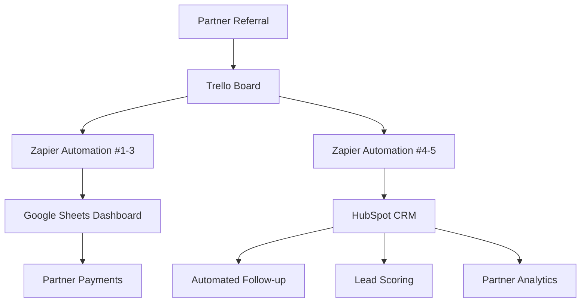

# Azure Yacht Group Referral System Architecture

## 🏗️ System Overview

The Azure Yacht Group referral system is built on a modern, scalable architecture that integrates multiple platforms to create a seamless partner experience while maintaining zero monthly costs for up to 100 referrals per month.

## 📊 System Architecture Diagram



## 🔄 Data Flow Architecture

### Primary Data Flow
1. **Partner Referral** → Customer contacts Azure Yacht Group with partner code
2. **Trello Board** → Lead is logged as Trello card with standardized format
3. **Zapier Automation #1-3** → Processes Trello data for partner tracking
4. **Zapier Automation #4-5** → Syncs lead data to HubSpot CRM
5. **Google Sheets Dashboard** → Real-time partner commission tracking
6. **HubSpot CRM** → Professional lead management and automation

### Secondary Processes
- **Partner Payments** → Monthly Zelle transfers based on Google Sheets data
- **Automated Follow-up** → HubSpot sequences for lead nurturing
- **Lead Scoring** → HubSpot scoring based on partner quality and lead value
- **Partner Analytics** → Performance tracking and optimization

## 🛠️ Technology Stack

### Core Platforms

#### **Trello** - Lead Management Hub
- **Purpose**: Central workflow management for all yacht charter inquiries
- **Integration**: Receives all partner referrals and direct inquiries
- **Data Format**: Standardized card format with partner attribution
- **Workflow**: Inquiry → Proposal → Confirmed → Completed
- **Cost**: Free (unlimited personal boards)

#### **Zapier** - Automation Engine
- **Purpose**: Connects Trello, Google Sheets, and HubSpot
- **Automations**: 5 total (3 for partner tracking, 2 for HubSpot sync)
- **Capacity**: 100 tasks/month on free plan
- **Triggers**: Trello card movements, Google Sheets updates
- **Cost**: Free for up to 100 tasks/month

#### **Google Sheets** - Partner Dashboard
- **Purpose**: Real-time partner commission tracking and payments
- **Features**: Filtered views, automated calculations, payment tracking
- **Access**: Personalized partner dashboards via filtered links
- **Data**: Referrals, commissions, payments, performance metrics
- **Cost**: Free (unlimited sheets)

#### **HubSpot CRM** - Customer Management
- **Purpose**: Professional lead management and customer relationship tracking
- **Features**: Contact management, deal pipeline, automated sequences
- **Integration**: Receives all leads with partner attribution
- **Automation**: Lead scoring, follow-up sequences, analytics
- **Cost**: Free for up to 1,000 contacts

#### **Gmail** - Communication Hub
- **Purpose**: Automated partner notifications and customer communication
- **Integration**: Zapier triggers for partner updates
- **Features**: Automated emails, custom templates, professional branding
- **Cost**: Free (existing Gmail account)

#### **Zelle** - Payment Processing
- **Purpose**: Monthly commission payments to partners
- **Features**: Instant transfers, payment tracking, receipt generation
- **Integration**: Manual process based on Google Sheets data
- **Cost**: Free (bank-to-bank transfers)

## 📋 Data Architecture

### Partner Data Structure

#### **Partners Table** (Google Sheets)
```
Partner ID | Name | Email | Phone | Status | Join Date | Zelle Info | 
Referral Code | Total Referrals | Total Earned | Last Payment | Notes
```

#### **Referrals Table** (Google Sheets)
```
Date | Customer | Customer Email | Partner Code | Retail Price | 
Your Revenue | Commission | Status | Charter Date | Payment Date | 
Payment Ref | Notes
```

#### **HubSpot Contact Properties**
- Partner attribution fields
- Lead source tracking
- Commission calculation data
- Performance metrics
- See [HubSpot Properties Setup](/docs/hubspot-properties-setup) for complete details

### Automation Logic

#### **Commission Calculation**
```javascript
// Automated formula in Google Sheets
=IF(G2="","",IF(G2<=300,100,IF(G2<=500,150,IF(G2<=800,200,300))))
```

#### **Partner Attribution**
```
Trello Card Format:
PARTNER: AZURE-JOHN
CUSTOMER: john.doe@email.com  
RETAIL: 5000
REVENUE: 300
CHARTER: 2/15/2025
```

## 🔐 Security & Access Control

### Data Security
- **Google Sheets**: Filtered views ensure partners only see their data
- **HubSpot**: Role-based access control for team members
- **Trello**: Board-level permissions and member access control
- **Zapier**: Encrypted connections between all platforms

### Partner Access
- **Limited Scope**: Partners only access their personal dashboard
- **Read-Only**: Partners cannot modify system data
- **Secure Links**: Personalized filtered view URLs
- **Data Privacy**: No access to other partners' information

### Administrative Control
- **Full Access**: Complete system visibility for administrators
- **Audit Trail**: All changes tracked across platforms
- **Backup Strategy**: Data redundancy across multiple platforms
- **Recovery Plan**: System restoration procedures documented

## 📈 Scalability Architecture

### Growth Capacity

#### **Free Tier Limits**
- **Zapier**: 100 tasks/month (≈30 referrals)
- **Google Sheets**: Unlimited rows and sheets
- **HubSpot**: 1,000 contacts
- **Trello**: Unlimited personal boards

#### **Paid Tier Expansion**
- **Zapier Starter**: $19.99/month for 750 tasks (≈200 referrals)
- **HubSpot Starter**: $45/month for advanced features
- **Google Workspace**: $6/month for enhanced collaboration
- **Trello Premium**: $5/month for advanced features

### Performance Optimization
- **Automated Calculations**: Google Sheets formulas for real-time updates
- **Filtered Views**: Optimized partner dashboard loading
- **Batch Processing**: Monthly payment processing for efficiency
- **Data Archiving**: Historical data management strategies

## 🔄 Integration Points

### Trello → Zapier Integration
- **Trigger**: Card moved to "Proposal" list
- **Data Extraction**: Partner code, customer info, revenue data
- **Processing**: Commission calculation and partner notification
- **Output**: Google Sheets update and partner email

### Zapier → Google Sheets Integration
- **Action**: Add new row to Referrals table
- **Data Mapping**: Trello card data to spreadsheet columns
- **Calculations**: Automated commission formulas
- **Notifications**: Partner dashboard updates

### Zapier → HubSpot Integration
- **Contact Creation**: New customer records with partner attribution
- **Deal Pipeline**: Automated deal creation and stage management
- **Lead Scoring**: Partner quality and lead value assessment
- **Automation**: Follow-up sequences and nurturing campaigns

### Google Sheets → Partner Dashboard
- **Filtered Views**: Personalized partner data access
- **Real-time Updates**: Live commission and status tracking
- **Performance Metrics**: Partner analytics and reporting
- **Payment Tracking**: Commission history and payment status

## 🎯 Success Metrics & Analytics

### Key Performance Indicators
- **Partner Acquisition**: New partners per month
- **Referral Volume**: Total referrals and conversion rates
- **Revenue Impact**: Partner-generated revenue percentage
- **Partner Retention**: Active partner engagement rates
- **System Performance**: Automation success rates and error tracking

### Reporting Dashboard
- **Partner Performance**: Individual partner analytics
- **System Health**: Automation status and error monitoring
- **Financial Tracking**: Commission calculations and payment status
- **Growth Metrics**: Monthly and quarterly performance trends

## 🔧 Maintenance & Support

### System Maintenance
- **Monthly Tasks**: Commission processing and payment reconciliation
- **Quarterly Reviews**: Partner performance and system optimization
- **Annual Planning**: Capacity planning and system upgrades
- **Ongoing Monitoring**: Automation health and error resolution

### Support Structure
- **Partner Support**: Dedicated support for partner inquiries
- **Technical Support**: System troubleshooting and maintenance
- **Documentation**: Comprehensive guides and training materials
- **Training**: Partner onboarding and system education

## 📚 Implementation Roadmap

### Phase 1: Core System Setup (Week 1)
1. [Zapier Implementation Guide](/docs/integration/zapier-implementation-guide)
2. [Google Sheets Filtered Views Setup](/docs/integration/google-sheets-filtered-views-setup)
3. [HubSpot Integration Setup](/docs/integration/hubspot-referral-integration)

### Phase 2: Partner Onboarding (Week 2)
1. [Partner Application Process](/docs/integration/partner-application)
2. [Partner Agreement Framework](/docs/integration/partner-agreement)
3. [Partner Marketing Materials](/docs/integration/partner-booklet)

### Phase 3: System Optimization (Week 3-4)
1. Performance monitoring and optimization
2. Partner feedback integration
3. System scaling preparation
4. Advanced reporting implementation

This architecture provides a robust, scalable foundation for partner referral management while maintaining zero monthly costs and minimal maintenance requirements. 