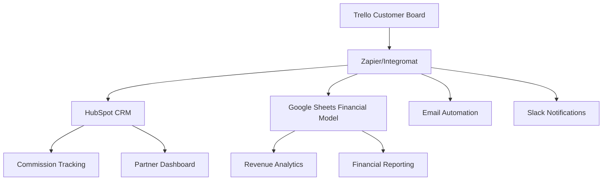

# Trello Customer Tracking Integration

## Overview

This guide provides comprehensive integration between your Trello customer tracking system and your business operations, including HubSpot CRM, financial systems, Google Sheets, and automated workflows. The integration creates a seamless flow from customer tracking to revenue management.

## Integration Architecture

### System Flow Diagram


## Trello Board Structure for Business Integration

### Primary Customer Tracking Board

#### Lists Configuration
```yaml
List 1: "Leads Received"
  Purpose: New customer inquiries
  Automation: Auto-create HubSpot contact
  
List 2: "Qualification"
  Purpose: Lead qualification process
  Automation: Update HubSpot deal stage
  
List 3: "Proposal Sent"
  Purpose: Proposals under review
  Automation: Set follow-up reminders
  
List 4: "Negotiation"
  Purpose: Active negotiations
  Automation: Alert sales team
  
List 5: "Booking Confirmed"
  Purpose: Confirmed charters
  Automation: Process commission, update financials
  
List 6: "Charter Completed"
  Purpose: Completed charters
  Automation: Generate invoices, collect feedback
  
List 7: "Lost/Cancelled"
  Purpose: Unsuccessful leads
  Automation: Document reasons, update analytics
```

#### Card Template Structure
```yaml
Card Template: "Customer Charter Request"
Fields:
  - Customer Name
  - Contact Information (Email, Phone)
  - Charter Type (Day/Multi-day/Weekly)
  - Preferred Dates
  - Guest Count
  - Budget Range
  - Yacht Preference
  - Special Requirements
  - Referral Source
  - Partner ID (if applicable)
  - Commission Rate
  - Estimated Value
  - Priority Level
  - Assigned Team Member

Labels:
  - Charter Type: Day Charter, Multi-Day, Weekly
  - Value: High Value ($50k+), Medium ($20-50k), Standard (<$20k)
  - Source: Referral, Direct, Website, Social Media
  - Priority: Hot Lead, Warm, Cold
  - Status: New, In Progress, Stalled, Urgent
```

## HubSpot Integration

### Zapier Integration Setup

#### Trigger 1: New Trello Card → Create HubSpot Contact
```yaml
Trigger: New card added to "Leads Received"
Action: Create HubSpot Contact

Field Mapping:
  Trello Card Name → HubSpot Contact Name
  Card Description Email → HubSpot Email
  Card Description Phone → HubSpot Phone
  Card Label "Referral" → HubSpot Lead Source
  Card Custom Field "Partner ID" → HubSpot Referral Partner ID
  Card Custom Field "Budget" → HubSpot Charter Budget
  Card Custom Field "Charter Type" → HubSpot Charter Type
  Card Due Date → HubSpot Charter Date Start
  Card Member → HubSpot Deal Owner

Additional Actions:
  - Create HubSpot Deal
  - Set Deal Stage: "Referral Received"
  - Calculate Progress Percentage: 10%
  - Send welcome email sequence
```

#### Trigger 2: Card Moved Between Lists → Update HubSpot Deal Stage
```yaml
Trigger: Card moved to different list
Action: Update HubSpot Deal Stage

List Mapping:
  "Leads Received" → Deal Stage: "Referral Received" (10%)
  "Qualification" → Deal Stage: "Initial Contact" (25%)
  "Proposal Sent" → Deal Stage: "Proposal Sent" (50%)
  "Negotiation" → Deal Stage: "Negotiation" (75%)
  "Booking Confirmed" → Deal Stage: "Closed Won" (100%)
  "Lost/Cancelled" → Deal Stage: "Closed Lost" (0%)

Additional Actions:
  - Update progress percentage
  - Set stage entry date
  - Update estimated completion date
  - Send progress notification to partner (if applicable)
  - Create internal task for next action
```

#### Trigger 3: Card Completed → Process Commission & Financials
```yaml
Trigger: Card moved to "Booking Confirmed"
Action: Multi-step business process

Actions Sequence:
1. Update HubSpot Deal
   - Set deal amount from Trello card value
   - Mark as closed won
   - Set close date

2. Calculate Commission (if referral)
   - Get partner commission rate from HubSpot
   - Calculate commission amount
   - Create commission transaction record
   - Update partner total earnings

3. Update Google Sheets Financial Model
   - Add booking to revenue tracking
   - Update yacht utilization
   - Refresh financial projections
   - Update partner performance metrics

4. Send Notifications
   - Booking confirmation to customer
   - Commission notification to partner
   - Revenue alert to finance team
   - Update team dashboard

5. Create Follow-up Tasks
   - Charter preparation checklist
   - Payment processing
   - Insurance verification
   - Crew assignment
```

### Advanced Zapier Workflows

#### Multi-Step Customer Journey Automation
```javascript
// Zapier Code Step: Process Trello Card Data
const cardData = inputData.card;
const customFields = cardData.customFields;

// Extract structured data
const customerInfo = {
  name: cardData.name,
  email: extractEmail(cardData.desc),
  phone: extractPhone(cardData.desc),
  charterType: getLabel(cardData.labels, 'Charter Type'),
  value: getCustomField(customFields, 'Estimated Value'),
  partnerID: getCustomField(customFields, 'Partner ID'),
  priority: getLabel(cardData.labels, 'Priority')
};

// Calculate commission if referral
let commission = 0;
if (customerInfo.partnerID) {
  const partnerRate = await getPartnerCommissionRate(customerInfo.partnerID);
  commission = customerInfo.value * (partnerRate / 100);
}

// Determine automation path
const automationPath = {
  isReferral: !!customerInfo.partnerID,
  isHighValue: customerInfo.value > 50000,
  isUrgent: customerInfo.priority === 'Hot Lead',
  requiresApproval: customerInfo.value > 100000
};

output = {
  customer: customerInfo,
  commission: commission,
  automation: automationPath
};
```

## Google Sheets Integration

### Financial Model Sync

#### Revenue Tracking Sheet Update
```yaml
Trigger: Trello card moved to "Booking Confirmed"
Action: Update Google Sheets Financial Model

Sheet: "Charter Bookings"
Data Mapping:
  - Booking Date: Trello card due date
  - Customer Name: Trello card name
  - Charter Type: Trello card label
  - Booking Value: Trello custom field "Estimated Value"
  - Commission Amount: Calculated from partner rate
  - Yacht Assigned: Trello custom field "Yacht Preference"
  - Source: Trello custom field "Referral Source"
  - Partner ID: Trello custom field "Partner ID"
  - Deal Owner: Trello card member

Formulas Updated:
  - Monthly Revenue Totals
  - Partner Commission Calculations
  - Yacht Utilization Rates
  - Conversion Rate Metrics
  - Pipeline Value Projections
```

#### Partner Performance Tracking
```yaml
Sheet: "Partner Performance"
Auto-Update Fields:
  - Partner ID
  - Total Referrals (count from Trello)
  - Total Revenue Generated
  - Total Commission Earned
  - Average Deal Size
  - Conversion Rate
  - Last Activity Date
  - Current Tier Status

Calculated Metrics:
  - ROI per Partner
  - Partner Lifetime Value
  - Performance Trends
  - Tier Upgrade Eligibility
```

## Slack Integration

### Team Notifications

#### Real-Time Updates
```yaml
Trigger: Various Trello card actions
Action: Send Slack notifications

Notification Types:

1. New High-Value Lead
   Channel: #sales-alerts
   Trigger: Card added with value >$50k
   Message: "🚨 High-value lead: {Customer Name} - ${Value} charter request"

2. Booking Confirmed
   Channel: #revenue-updates
   Trigger: Card moved to "Booking Confirmed"
   Message: "💰 New booking: {Customer} - ${Value} - {Charter Type}"

3. Commission Earned
   Channel: #partner-success
   Trigger: Commission calculated for referral
   Message: "🎯 Commission earned: {Partner} referred {Customer} - ${Commission}"

4. Stalled Deals
   Channel: #sales-management
   Trigger: Card hasn't moved in 7 days
   Message: "⚠️ Stalled deal: {Customer} - {Days} days in {Current Stage}"

5. Lost Opportunities
   Channel: #sales-analysis
   Trigger: Card moved to "Lost/Cancelled"
   Message: "❌ Lost opportunity: {Customer} - Reason: {Loss Reason}"
```

## Email Automation Integration

### Customer Communication Workflows

#### Automated Email Sequences
```yaml
Sequence 1: New Lead Welcome
Trigger: Card added to "Leads Received"
Emails:
  Day 0: Welcome & Charter Information
  Day 1: Yacht Portfolio & Availability
  Day 3: Customer Testimonials
  Day 7: Special Offers (if no response)

Sequence 2: Proposal Follow-up
Trigger: Card moved to "Proposal Sent"
Emails:
  Day 1: Proposal delivery confirmation
  Day 3: Follow-up with additional options
  Day 7: Personal call request
  Day 14: Final offer with incentive

Sequence 3: Booking Confirmation
Trigger: Card moved to "Booking Confirmed"
Emails:
  Day 0: Booking confirmation & next steps
  Day 1: Charter preparation checklist
  Day 7: Pre-charter briefing
  Day -1: Final charter details & contacts

Sequence 4: Post-Charter
Trigger: Card moved to "Charter Completed"
Emails:
  Day 1: Thank you & feedback request
  Day 7: Photo sharing & testimonial request
  Day 30: Future charter opportunities
  Day 90: Loyalty program invitation
```

## Financial System Integration

### QuickBooks/Accounting Integration

#### Automated Invoice Generation
```yaml
Trigger: Trello card moved to "Booking Confirmed"
Action: Create QuickBooks invoice

Invoice Data:
  Customer: From Trello card name
  Service: Charter service description
  Amount: From Trello custom field "Final Value"
  Due Date: Charter date - 7 days
  Terms: Net 30
  Reference: Trello card ID

Additional Actions:
  - Create payment schedule
  - Set up automatic reminders
  - Track payment status
  - Update cash flow projections
```

#### Commission Payment Processing
```yaml
Trigger: Monthly commission calculation
Action: Create partner payment records

Process:
1. Calculate total commissions per partner
2. Generate payment vouchers
3. Create accounting entries
4. Send payment notifications
5. Update partner payment history
6. Generate 1099 data (if applicable)
```

## Mobile Integration

### Trello Mobile Optimization

#### Field Team Updates
```yaml
Mobile Workflow: Charter Completion
Process:
1. Captain/crew updates Trello card from mobile
2. Add completion photos to card
3. Update customer satisfaction rating
4. Note any issues or special requests
5. Trigger post-charter automation

Mobile Features:
  - Quick status updates
  - Photo uploads
  - GPS location tracking
  - Customer feedback collection
  - Expense reporting
  - Time tracking
```

## Analytics & Reporting Integration

### Power BI/Tableau Dashboard

#### Data Sources Integration
```yaml
Data Connections:
  - Trello API: Customer pipeline data
  - HubSpot API: CRM and deal data
  - Google Sheets: Financial model data
  - QuickBooks: Accounting data
  - Slack: Communication metrics

Dashboard Widgets:
1. Sales Pipeline Overview
   - Cards by stage
   - Conversion rates
   - Average deal size
   - Time in each stage

2. Partner Performance
   - Referral volume by partner
   - Commission earnings
   - Conversion rates
   - Partner tier distribution

3. Financial Metrics
   - Monthly revenue trends
   - Profit margins
   - Cash flow projections
   - Yacht utilization rates

4. Customer Analytics
   - Customer acquisition cost
   - Lifetime value
   - Satisfaction scores
   - Repeat booking rates
```

## Implementation Roadmap

### Phase 1: Basic Integration (Week 1-2)
```yaml
Tasks:
  - Set up Trello board structure
  - Configure basic Zapier workflows
  - Connect HubSpot integration
  - Test card → contact/deal creation
  - Implement basic notifications

Success Metrics:
  - 100% of Trello cards create HubSpot records
  - Stage changes sync correctly
  - Team receives notifications
```

### Phase 2: Financial Integration (Week 3-4)
```yaml
Tasks:
  - Connect Google Sheets automation
  - Set up commission calculations
  - Implement QuickBooks integration
  - Create financial reporting
  - Add partner payment processing

Success Metrics:
  - Automated financial updates
  - Accurate commission calculations
  - Seamless invoice generation
```

### Phase 3: Advanced Automation (Week 5-6)
```yaml
Tasks:
  - Implement email sequences
  - Add advanced workflows
  - Create mobile optimizations
  - Build analytics dashboards
  - Set up performance monitoring

Success Metrics:
  - Fully automated customer journey
  - Real-time analytics
  - Mobile field updates
  - Comprehensive reporting
```

### Phase 4: Optimization & Scaling (Week 7-8)
```yaml
Tasks:
  - Performance optimization
  - Advanced analytics
  - AI/ML integration opportunities
  - Scalability improvements
  - Team training & documentation

Success Metrics:
  - System handles 10x current volume
  - Sub-second response times
  - 95%+ automation rate
  - Team fully trained
```

## Security & Compliance

### Data Protection
```yaml
Security Measures:
  - API key encryption
  - GDPR compliance for customer data
  - PCI compliance for payment processing
  - Regular security audits
  - Access control and permissions
  - Data backup and recovery

Privacy Controls:
  - Customer data anonymization options
  - Consent management
  - Data retention policies
  - Right to deletion
  - Data portability
```

## Monitoring & Maintenance

### System Health Monitoring
```yaml
Monitoring Points:
  - Zapier workflow success rates
  - API connection status
  - Data sync accuracy
  - Response times
  - Error rates
  - User adoption metrics

Alerts:
  - Failed integrations
  - Data discrepancies
  - Performance degradation
  - Security incidents
  - Quota limits reached

Maintenance Schedule:
  - Daily: Health checks
  - Weekly: Performance review
  - Monthly: Security audit
  - Quarterly: System optimization
```

This comprehensive integration transforms your Trello customer tracking into a powerful business automation engine that connects all your systems and processes for maximum efficiency and growth. 