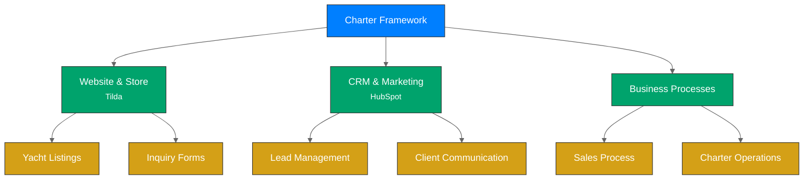
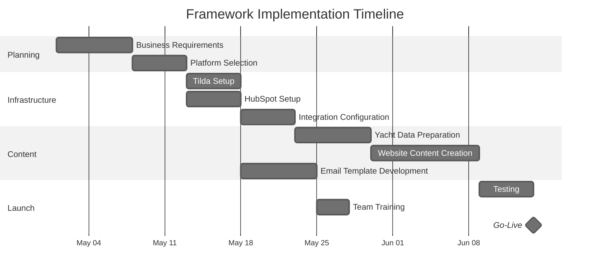

# Introduction to the Charter Framework

Welcome to the Charter Framework documentation. This comprehensive system provides everything you need to run a successful yacht charter business.

## What is the Charter Framework?

The Charter Framework is an integrated business solution designed specifically for yacht charter companies. It combines website, CRM, and business processes into a cohesive system that streamlines operations from initial customer inquiry through booking completion.

## Key Benefits

The Charter Framework offers numerous advantages:

1. **Streamlined Operations**: Automated workflows reduce manual tasks and minimize errors
2. **Increased Visibility**: Clear process tracking from lead generation to booking completion
3. **Enhanced Customer Experience**: Professional-looking website with consistent communication
4. **Sales Optimization**: Structured sales pipeline with automated follow-ups
5. **Scalability**: Easily add more yachts or destinations as your business grows
6. **Cost Efficiency**: Utilizes affordable, user-friendly platforms that integrate seamlessly

## Core Components

The Charter Framework consists of three core components:

### 1. Website & Store (Tilda)

The Tilda-based website serves as your customer-facing platform, featuring:
- Yacht listings with specifications, pricing, and galleries
- Parent-child product structure for different charter options
- Inquiry forms that integrate with your CRM
- Mobile-responsive design with modern aesthetics

### 2. CRM & Marketing (HubSpot)

HubSpot serves as the operational hub for your charter business:
- Contact management for leads and customers
- Deal pipeline to track booking progress
- Email automation for follow-ups and marketing
- Performance analytics and reporting

### 3. Business Processes

Documented workflows guide your team through every aspect of the charter business:
- Lead qualification process
- Booking and contract procedures
- Charter preparation checklist
- Post-charter follow-up sequence

## Who is This For?

The Charter Framework is designed for:
- Yacht charter companies looking to modernize their operations
- Charter brokers managing multiple vessels
- Marina operators expanding into charter services
- Entrepreneurs entering the yacht charter market

## Getting Started

Follow these steps to implement the Charter Framework:

1. **Setup Platforms**: Create accounts for Tilda and HubSpot
2. **Configure Website**: Set up your yacht listings and inquiry forms
3. **Implement CRM**: Configure your sales pipeline and automation
4. **Connect Systems**: Integrate your website forms with HubSpot
5. **Train Team**: Ensure your staff understands the workflows
6. **Launch**: Go live with your new charter business system

## Implementation Timeline

A typical implementation follows this timeline:

## Support and Maintenance

Once implemented, the Charter Framework requires minimal maintenance:
- Regular content updates as yacht availability changes
- Periodic review of email sequences and automation
- Monitoring of lead and booking metrics for optimization

For additional support, consult the [framework documentation](framework-overview.md) or contact the support team.

---

*Last Updated: April 30, 2025*  
*Next Review: May 31, 2025* 