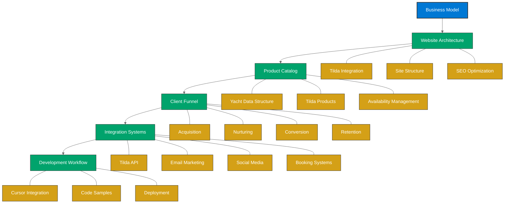

# Introduction to the Charter Business Framework

Welcome to the Azure Yacht Group Charter Business Framework documentation. This comprehensive guide outlines the complete system for building and operating a successful yacht charter business using modern web technologies, with a focus on Tilda as the core website platform.

## What Is This Framework?

This framework is a complete business system that includes:

- **Website Architecture**: How to structure and build your charter website on Tilda
- **Product Catalog Management**: Systems for managing yacht listings and details
- **Client Acquisition Funnel**: End-to-end process for attracting and converting clients
- **Integration Systems**: How to connect your charter business with external tools
- **Documentation Strategy**: Building knowledge resources for clients and team
- **Development Workflow**: Using Cursor and other tools to implement technical solutions

## Who Is This For?

This framework is designed for:

- **Charter Business Owners**: Looking to establish or grow their online presence
- **Marketing Teams**: Responsible for promoting charter services
- **Developers**: Implementing technical solutions for charter businesses
- **Content Creators**: Producing charter-related content for websites and knowledge bases

## Key Framework Principles

Our charter business framework is built on these core principles:

1. **Client-Centered Design**: All systems prioritize the client experience
2. **Scalable Architecture**: Solutions that grow with your business
3. **Integration-Ready**: Open systems that connect with industry tools
4. **SEO-Optimized**: Built with search visibility as a core requirement
5. **Conversion-Focused**: Every element designed to drive bookings

## Technology Stack

The framework is built on these key technologies:

| Component | Primary Technology | Alternatives |
|-----------|-------------------|-------------|
| Website Platform | Tilda | WordPress, Webflow |
| CRM | HubSpot Free | Zoho CRM, Salesforce |
| Email Marketing | Mailchimp | Sendinblue, ConvertKit |
| Documentation | Docusaurus | GitBook, ReadTheDocs |
| Development | Cursor IDE | VSCode, IntelliJ |
| Automation | Zapier | Make.com, n8n |

## Getting Started

To begin implementing this framework:

1. Review the [Business Model](./business-model) to understand the charter business structure
2. Explore the [Technology Stack](./technology-stack) to prepare your tools
3. Follow the [Getting Started Guide](./getting-started) for step-by-step implementation
4. Use the [Website Architecture](./website-architecture/overview) to build your Tilda site

## Framework Map

## Support and Updates

This framework is actively maintained and updated with:

- New Tilda features and capabilities
- Charter industry best practices
- Emerging marketing and conversion techniques
- Technology advancements

For support with implementing this framework, contact [support@azureyachtgroup.com](mailto:support@azureyachtgroup.com). 