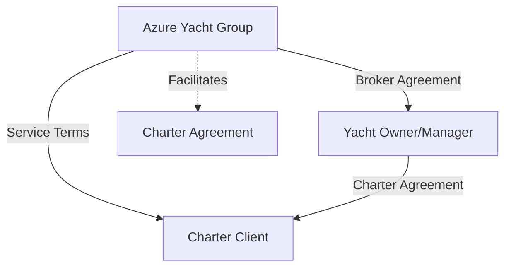
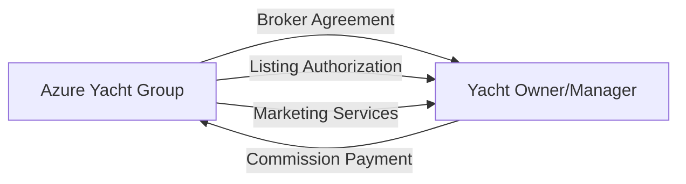
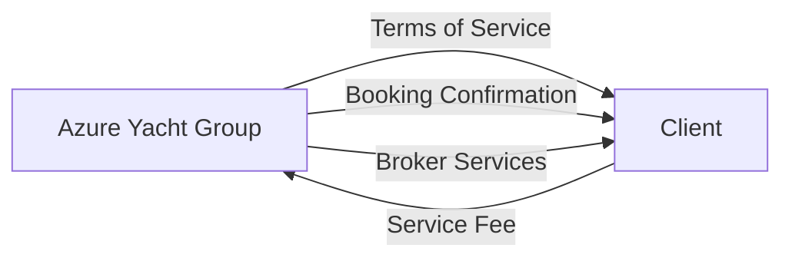
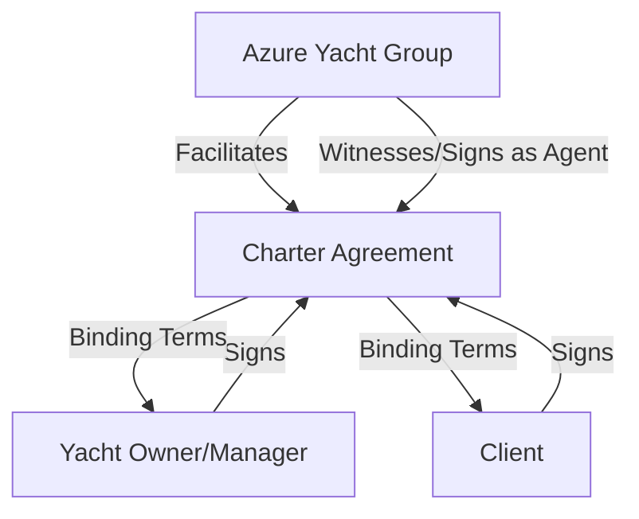
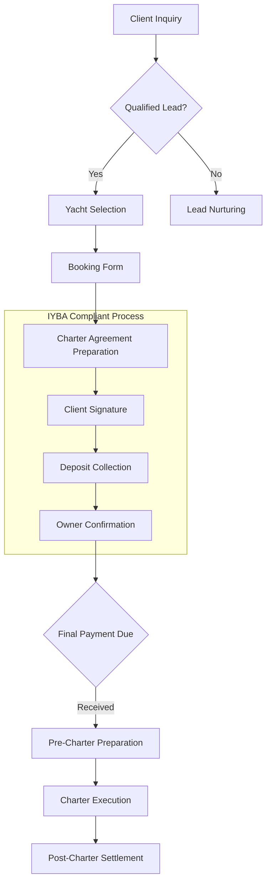

# Charter Broker Legal Framework

This document outlines the legal and regulatory framework for Azure Yacht Group's operations as a yacht charter broker in Florida, detailing the relationships with yacht owners and management companies.

## Contractual Relationships Overview

## Key Contractual Relationships

### 1. Broker-Owner Relationship

#### Key Document: Master Broker Agreement

**Essential Provisions:**
- Clearly defined 10-20% commission structure
- Exclusive vs. non-exclusive representation terms
- Accurate yacht specifications and condition disclosure requirements
- Marketing authorization and usage rights for images/content
- Clear cancellation and deposit policies
- Commission protection clauses (prevent direct bookings)
- Dispute resolution procedures
- Maintenance status disclosure requirements
- Minimum service standards guarantee

### 2. Broker-Client Relationship

#### Key Document: Terms of Service & Broker Service Agreement

**Essential Provisions:**
- Clear delineation of broker vs. owner responsibilities
- Service fee structure and payment terms
- Disclosure of broker status (not yacht owner)
- Communication protocols
- Cancellation and refund policies
- Client information privacy protection
- Dispute resolution procedures

### 3. Charter Agreement (Three-Party)

#### Key Document: Charter Agreement

**Essential Provisions:**
- Charter period and delivery/redelivery terms
- Payment schedule and method
- Security deposit requirements
- Advanced Provisioning Allowance (APA) terms
- Permitted cruising area
- Maximum passenger count
- Crew responsibilities
- Insurance requirements
- Force majeure provisions
- Governing law (Florida)
- Tax compliance requirements
- Damage and liability terms

## IYBA Membership and Compliance

### 1. IYBA Membership Requirements

The International Yacht Brokers Association (IYBA, formerly FYBA) sets standards for professional yacht brokers that Azure Yacht Group adheres to.

**Membership Qualifications:**
- Minimum two years of yacht brokerage experience
- Sponsorship by two active IYBA members
- Completion of IYBA ethics course
- Adherence to IYBA Code of Ethics
- Maintenance of required insurance coverage
- Payment of annual membership dues
- Compliance with ongoing education requirements

**Continuing Education:**
- Minimum annual required hours of approved education
- Participation in IYBA seminars and workshops
- Legal and regulatory updates
- Documentation of completed courses
- Ethics training renewal

### 2. IYBA Code of Ethics

Azure Yacht Group adheres to the IYBA Code of Ethics in all charter operations:

**Key Ethical Requirements:**
1. **Duty to Clients**:
   - Full disclosure of all material facts
   - Highest level of honesty and integrity
   - Protection of client interests
   - Accurate representation of vessels

2. **Duty to the Public**:
   - Fair and honest advertising
   - No misleading statements
   - Transparency in all communications
   - Qualified professional service

3. **Duty to the Industry**:
   - Cooperation with other brokers
   - Fair competition practices
   - Maintenance of professional standards
   - Support of industry development

4. **Duty to IYBA**:
   - Compliance with all bylaws and rules
   - Participation in association activities
   - Promotion of IYBA standards
   - Reporting of unethical conduct

### 3. IYBA Standard Forms and Contracts

Azure Yacht Group utilizes IYBA-approved documentation for all charter transactions:

**IYBA Forms Utilized:**
- IYBA Charter Agreement
- IYBA Broker/Owner Agreement
- IYBA Escrow Instructions
- IYBA Offer Form
- IYBA Deposit Receipt
- IYBA Charter Preference Sheet
- IYBA Broker Commission Agreement

**Compliance Requirements:**
- No unauthorized modification of standard forms
- Proper execution and documentation
- Accurate completion of all fields
- Secure storage of executed agreements
- Prompt submission of required documentation

### 4. IYBA Dispute Resolution Process

Azure Yacht Group follows IYBA's arbitration procedures for resolving disputes:

**Arbitration Process:**
1. **Initial Submission**:
   - Filing of complaint with IYBA
   - Payment of required fees
   - Selection of arbitration panel

2. **Documentation Phase**:
   - Submission of all relevant documents
   - Witness statements
   - Evidence compilation
   - Response from opposing party

3. **Arbitration Hearing**:
   - Presentation of case
   - Witness testimony
   - Panel deliberation
   - Binding decision

4. **Resolution Implementation**:
   - Execution of panel decision
   - Financial settlement if required
   - Documentation of resolution
   - Compliance verification

## Required Documentation Package

1. **Master Broker Agreement** (Azure Yacht Group ↔ Owner/Manager)
2. **Terms of Service** (Azure Yacht Group ↔ Client)
3. **Charter Agreement** (Three-party document)
4. **Yacht Specification Sheet** (verified by owner with attestation)
5. **Crew Details & Certifications** (if crewed charter)
6. **Insurance Certificate** (with broker named as additional insured)
7. **USCG Documentation/Registration** (compliance verification)
8. **Charter Guest Information Form** (client details)
9. **Florida Sales Tax Documentation**
10. **Proof of Deposit & Payment** (receipts/transfers)
11. **IYBA Membership Certification** (current year)
12. **IYBA Compliance Attestation** (annual)

## Business Process Flow

## IYBA-Specific Transaction Requirements

### 1. IYBA Marketing Standards

When marketing charter yachts, Azure Yacht Group adheres to IYBA standards for accurate representation:

**Marketing Requirements:**
- Accurate specifications and photos
- Clear disclosure of charter rates and terms
- No misleading statements about availability
- Proper attribution and permission for all content
- Clear documentation of special features or limitations
- Transparent disclosure of included/excluded items
- Proper representation of crew qualifications

### 2. IYBA Co-Brokerage Standards

When working with other brokers, Azure Yacht Group follows IYBA co-brokerage protocols:

**Co-Brokerage Requirements:**
- Written co-brokerage agreements
- Clear commission split terms (typically 50/50)
- Defined responsibilities for each broker
- Communication protocols with clients
- Agreement on marketing restrictions
- Dispute resolution procedures
- Client confidentiality protections

### 3. IYBA Financial Transaction Standards

All financial aspects of charter transactions adhere to IYBA requirements:

**Financial Standards:**
- Use of IYBA-approved escrow accounts
- Proper deposit handling procedures
- Clear documentation of all transactions
- Transparent fee disclosure to clients
- Prompt payment of commissions
- Accurate accounting for all funds
- Proper tax documentation and reporting

## Florida-Specific Regulatory Considerations

### Tax Compliance

Florida imposes a 6% state sales tax plus local option taxes (potentially totaling 7-8%) on yacht charters. Key considerations:

- Collection process must be documented in all charter agreements
- Tax must be clearly identified in all client invoices
- Monthly remittance to Florida Department of Revenue required
- Potential exemptions must be properly documented (rare)
- Charter broker responsible for compliance verification

### USCG Requirements

All charter vessels must comply with U.S. Coast Guard regulations:

- Proper documentation/registration (verified by broker)
- Appropriate USCG certifications for crew members
- Adherence to passenger capacity regulations
- Safety equipment requirements
- Compliance with inspection schedules
- Drug testing program for crew members

### Local Regulations

Charter operations must adhere to various local regulations:

- Marina and anchorage restrictions in Florida waters
- Environmental protection requirements (no-discharge zones)
- Local noise ordinances
- Special protected areas (coral reefs, marine reserves)
- Local permitting where applicable

## Major Legal Risks & Mitigation

| Risk Area | Description | Mitigation Strategy |
|-----------|-------------|---------------------|
| **Yacht Misrepresentation** | Inaccurate specifications or condition information | Independent verification protocol and liability clause in owner agreement |
| **Service Quality** | Client dissatisfaction with yacht/crew performance | Clear disclaimer of broker responsibility and complaint procedure |
| **Payment Disputes** | Disagreements over deposits, refunds, or damages | Escrow account, clear contract terms, dispute resolution process |
| **Tax Liability** | Improper handling of Florida sales tax | Documented collection and remittance process, regular compliance audits |
| **Regulatory Violations** | Non-compliance with USCG or maritime regulations | Comprehensive compliance checklist, verification procedures |
| **Commission Bypassing** | Owner-client direct booking on future charters | Strong non-circumvention clauses with monetary penalties |
| **Insurance Coverage Gaps** | Inadequate insurance for charter activities | Insurance verification process, coverage requirements in contracts |
| **IYBA Standards Violation** | Non-compliance with IYBA requirements | Regular IYBA compliance audits, staff training, updated procedures |

## IYBA Best Practices Implementation

### Staff Training on IYBA Standards

Azure Yacht Group maintains a comprehensive IYBA standards training program:

**Training Components:**
- IYBA Code of Ethics orientation
- Contract documentation training
- Escrow handling procedures
- Anti-Money Laundering (AML) training
- IYBA form completion workshop
- Co-brokerage cooperation procedures
- Client confidentiality requirements

### IYBA Compliance Documentation

Azure Yacht Group maintains documentation demonstrating IYBA compliance:

**Compliance Documentation:**
- Annual IYBA membership certification
- Proof of required insurance coverage
- Staff IYBA training records
- IYBA continuing education certificates
- Self-assessment compliance checklist
- IYBA seminar attendance records
- Ethics certification and renewal

### IYBA Networking and Relationship Management

Professional relationships within IYBA are cultivated to enhance service quality:

**Relationship Development:**
- Active participation in IYBA events
- Committee participation when applicable
- Contribution to IYBA publications
- Cooperation with fellow IYBA members
- Promotion of IYBA standards to clients
- Support of IYBA legislative initiatives
- Participation in IYBA educational opportunities

---

*Note: This framework is intended as a guide. All final legal documents should be reviewed by qualified legal counsel specializing in maritime law in Florida before implementation.* 

**Last Updated**: April 30, 2024  
**Next Review**: May 31, 2024 