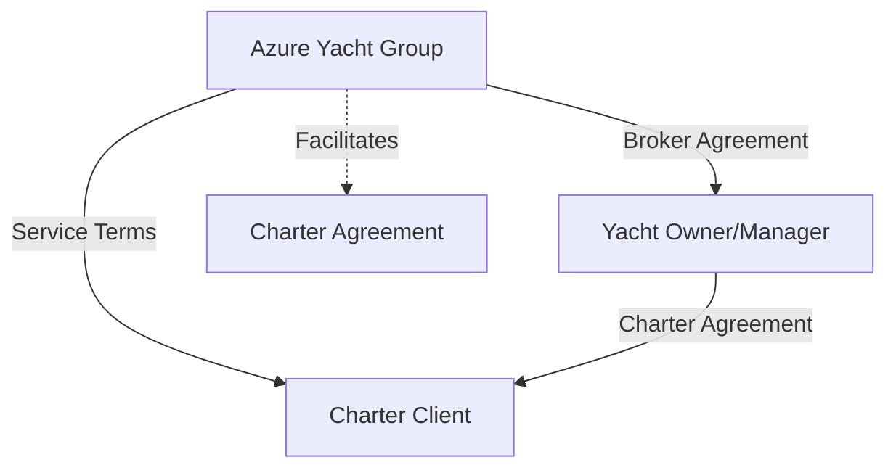
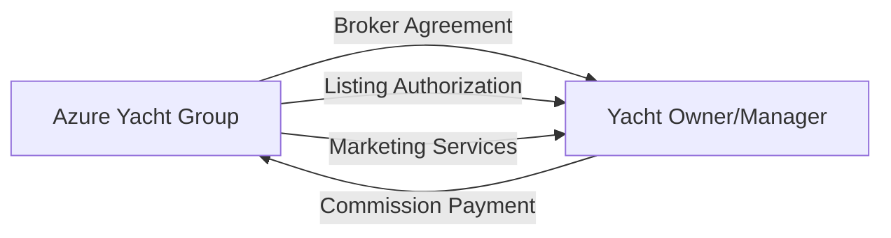
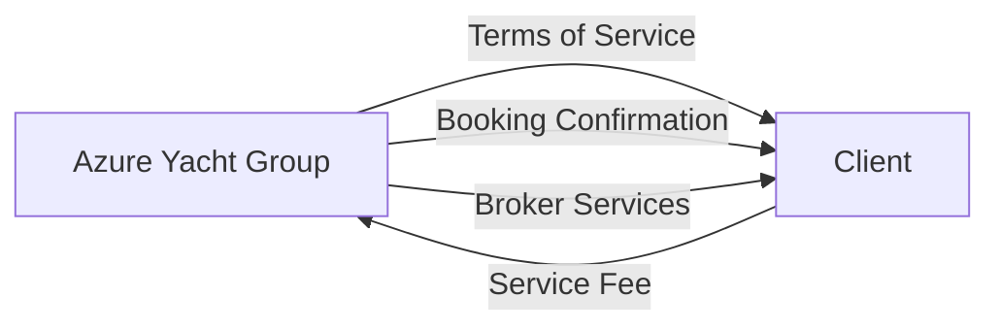
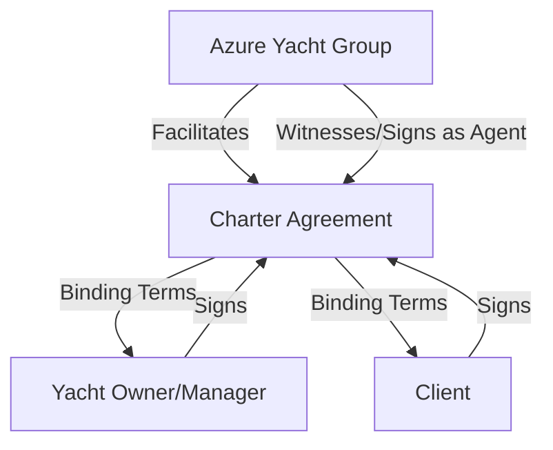
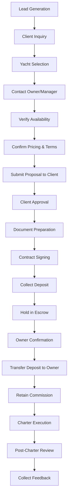
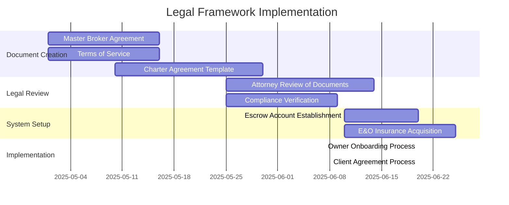

# Charter Broker Legal Framework

This document outlines the legal and regulatory framework for Azure Yacht Group's operations as a yacht charter broker in Florida, detailing the relationships with yacht owners and management companies.

## Contractual Relationships Overview

## Key Contractual Relationships

### 1. Broker-Owner Relationship

#### Key Document: Master Broker Agreement

**Essential Provisions:**
- Clearly defined 10-20% commission structure
- Exclusive vs. non-exclusive representation terms
- Accurate yacht specifications and condition disclosure requirements
- Marketing authorization and usage rights for images/content
- Clear cancellation and deposit policies
- Commission protection clauses (prevent direct bookings)
- Dispute resolution procedures
- Maintenance status disclosure requirements
- Minimum service standards guarantee

### 2. Broker-Client Relationship

#### Key Document: Terms of Service & Broker Service Agreement

**Essential Provisions:**
- Clear delineation of broker vs. owner responsibilities
- Service fee structure and payment terms
- Disclosure of broker status (not yacht owner)
- Communication protocols
- Cancellation and refund policies
- Client information privacy protection
- Dispute resolution procedures

### 3. Charter Agreement (Three-Party)

#### Key Document: Charter Agreement

**Essential Provisions:**
- Charter period and delivery/redelivery terms
- Payment schedule and method
- Security deposit requirements
- Advanced Provisioning Allowance (APA) terms
- Permitted cruising area
- Maximum passenger count
- Crew responsibilities
- Insurance requirements
- Force majeure provisions
- Governing law (Florida)
- Tax compliance requirements
- Damage and liability terms

## Required Documentation Package

1. **Master Broker Agreement** (Azure Yacht Group ↔ Owner/Manager)
2. **Terms of Service** (Azure Yacht Group ↔ Client)
3. **Charter Agreement** (Three-party document)
4. **Yacht Specification Sheet** (verified by owner with attestation)
5. **Crew Details & Certifications** (if crewed charter)
6. **Insurance Certificate** (with broker named as additional insured)
7. **USCG Documentation/Registration** (compliance verification)
8. **Charter Guest Information Form** (client details)
9. **Florida Sales Tax Documentation**
10. **Proof of Deposit & Payment** (receipts/transfers)

## Business Process Flow

## Risk Mitigation Strategies

### 1. Legal Structure Protection

- **LLC Formation**: Maintain Azure Yacht Group LLC as separate legal entity
- **Insurance**: Dedicated broker E&O (Errors & Omissions) insurance
- **Liability Limitations**: Clear contract language limiting broker liability

### 2. Financial Risk Management

- **Escrow Account**: Use dedicated escrow account for all client payments
- **Deposit Protection**: Clear documentation of deposit terms
- **Payment Timing**: Only release payment to owners after confirmation
- **Commission Protection**: Anti-circumvention clauses with penalties

### 3. Service Quality Control

- **Yacht Inspection**: Pre-charter inspection protocols
- **Specification Verification**: Independent verification process
- **Client Feedback System**: Documented post-charter review
- **Owner Rating System**: Internal quality tracking

### 4. Compliance Requirements

- **USCG Compliance**: Documentation verification checklist
- **Sales Tax**: Florida sales tax collection and remittance procedures
- **Business Licensing**: Florida broker licensing requirements
- **Maritime Regulations**: Compliance verification process

## Implementation Timeline

## Florida-Specific Regulatory Considerations

### Tax Compliance

Florida imposes a 6% state sales tax plus local option taxes (potentially totaling 7-8%) on yacht charters. Key considerations:

- Collection process must be documented in all charter agreements
- Tax must be clearly identified in all client invoices
- Monthly remittance to Florida Department of Revenue required
- Potential exemptions must be properly documented (rare)
- Charter broker responsible for compliance verification

### USCG Requirements

All charter vessels must comply with U.S. Coast Guard regulations:

- Proper documentation/registration (verified by broker)
- Appropriate USCG certifications for crew members
- Adherence to passenger capacity regulations
- Safety equipment requirements
- Compliance with inspection schedules
- Drug testing program for crew members

### Local Regulations

Charter operations must adhere to various local regulations:

- Marina and anchorage restrictions in Florida waters
- Environmental protection requirements (no-discharge zones)
- Local noise ordinances
- Special protected areas (coral reefs, marine reserves)
- Local permitting where applicable

## Major Legal Risks & Mitigation

| Risk Area | Description | Mitigation Strategy |
|-----------|-------------|---------------------|
| **Yacht Misrepresentation** | Inaccurate specifications or condition information | Independent verification protocol and liability clause in owner agreement |
| **Service Quality** | Client dissatisfaction with yacht/crew performance | Clear disclaimer of broker responsibility and complaint procedure |
| **Payment Disputes** | Disagreements over deposits, refunds, or damages | Escrow account, clear contract terms, dispute resolution process |
| **Tax Liability** | Improper handling of Florida sales tax | Documented collection and remittance process, regular compliance audits |
| **Regulatory Violations** | Non-compliance with USCG or maritime regulations | Comprehensive compliance checklist, verification procedures |
| **Commission Bypassing** | Owner-client direct booking on future charters | Strong non-circumvention clauses with monetary penalties |
| **Insurance Coverage Gaps** | Inadequate insurance for charter activities | Insurance verification process, coverage requirements in contracts |

---

*Note: This framework is intended as a guide. All final legal documents should be reviewed by qualified legal counsel specializing in maritime law in Florida before implementation.* 