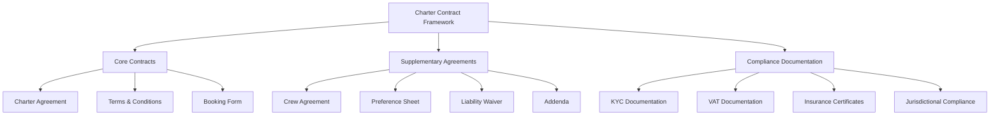

# Charter Contracts & Legal Documentation

This document outlines the essential contracts, legal documentation, and management processes required for Azure Yacht Group's charter operations.

## Contract Framework Overview

## Core Contract Components

### Charter Agreement Structure

The charter agreement is the primary contract governing the relationship between the charter client, broker, and yacht owner. The agreement structure varies based on the contract form used (MYBA, AYCA, etc.) but contains the following essential components:

| Contract Section | Purpose | Key Elements | Risk Considerations |
|-----------------|---------|--------------|---------------------|
| Parties | Defines contracting entities | Owner, charterer, broker details | Entity verification, authority to contract |
| Vessel Details | Identifies charter vessel | Name, registration, specifications | Accuracy of specifications, condition |
| Charter Particulars | Outlines charter parameters | Dates, cruising area, delivery/redelivery | Weather contingency, itinerary changes |
| Payment Terms | Establishes financial obligations | Charter fee, APA, payment schedule | Payment security, default provisions |
| Cancellation Policy | Defines cancellation rights | Notice periods, refund schedule | Force majeure, broker responsibilities |
| Charterer Obligations | Establishes charterer responsibilities | Use limitations, guest conduct | Liability allocation, guest screening |
| Owner Obligations | Establishes owner responsibilities | Vessel condition, crew, insurance | Performance standards, remedies |
| Insurance | Outlines insurance requirements | Coverage types, proof of insurance | Coverage verification, claims process |
| Dispute Resolution | Establishes resolution mechanism | Governing law, arbitration, mediation | Jurisdiction selection, enforceability |
| Signatures | Executes the agreement | Signature blocks, witness requirements | Electronic signatures, counterparts |

**Key Contract Clauses:**
- Delivery and redelivery conditions
- Advanced Provisioning Allowance (APA) management
- Cruising area limitations
- Force majeure provisions
- Damage deposit requirements
- Broker commission structure
- Crew gratuity recommendations
- Delay provisions
- Substitution rights
- Early termination conditions

### Terms & Conditions

Terms and conditions supplement the charter agreement with detailed operational provisions, often standardized across charters.

**Essential Terms & Conditions Elements:**
- Definition of technical terms
- Detailed payment process requirements
- Cancellation fee calculation methodology
- Insurance coverage specifications
- Limitation of liability provisions
- Indemnification requirements
- Confidentiality obligations
- Intellectual property provisions
- Compliance with laws requirements
- Amendment process

### Booking Form

The booking form initiates the charter process and captures essential information required for contract preparation.

**Key Booking Form Components:**
- Client contact information
- Charterer company details (if applicable)
- Charter date preferences
- Number and details of guests
- Budget parameters
- Destination preferences
- Special requests
- Preferred yacht characteristics
- Preliminary agreement to terms
- Broker details and disclosures

## Standard Contract Forms

### Industry Standard Contract Comparison

| Contract Form | Jurisdiction Origin | Best Used For | Key Distinctive Features |
|---------------|---------------------|--------------|--------------------------|
| MYBA Charter Agreement | Mediterranean/European | Mediterranean charters | Detailed APA provisions, European tax considerations |
| AYCA Charter Agreement | American | Caribbean/Americas charters | US legal compliance, simpler structure |
| IYBA Charter Agreement | International | Global charters | Flexible jurisdiction provisions, international standards |
| Custom House Agreements | Varies | Specific yacht fleets | Owner-specific provisions, yacht-specific terms |

**Standard Form Customization Areas:**
- Jurisdiction-specific addenda
- Vessel-specific provisions
- Owner-required special terms
- Charter area-specific regulations
- Tax compliance provisions
- Insurance requirements
- Damage deposit adjustments

### Contract Selection Criteria

**Factors Influencing Contract Selection:**
- Charter location (cruising area)
- Vessel flag state
- Owner requirements
- Charterer nationality
- Insurance requirements
- Tax considerations
- Broker standard practices
- Legal risk management
- Jurisdictional compliance

## Supplementary Agreements

### Crew Employment Documentation

**Key Crew Documents:**
- Crew agreement with owner
- Crew conduct guidelines
- Confidentiality provisions
- Employment/contractor status
- Insurance coverage
- Certification requirements
- Dispute resolution procedure

### Charter Preference Sheet

The preference sheet details client preferences and special requirements, forming part of the operational contract documentation.

**Essential Preference Sheet Sections:**
- Food and beverage preferences
- Dietary restrictions and allergies
- Activity preferences
- Special occasion details
- Children's requirements
- Medical considerations
- Itinerary preferences
- Special equipment requests
- Communication preferences
- Privacy requirements

### Liability Waivers

**Types of Required Waivers:**
- Water sports activity waivers
- Scuba diving releases
- Tender usage agreements
- Third-party services acknowledgments
- Medical emergency authorization
- Photography/media releases
- Children's activity permissions

### Charter Addenda

**Common Addenda Types:**
- Specific cruising area authorizations
- Special equipment provisions
- Additional guest agreements
- Pet policy agreements
- Special events permissions
- Extended charter provisions
- Delivery/redelivery modifications
- Crew change agreements

## Contract Language & Format Requirements

### Multilingual Considerations

**Language Requirements by Region:**
- Mediterranean: English with local language supplements
- Caribbean: English dominant
- Asia-Pacific: English with local translations
- Middle East: English with Arabic supplements
- South America: English with Spanish/Portuguese supplements

**Translation Certification Requirements:**
- Certified translation procedures
- Governing language designation
- Translation discrepancy resolution
- Local law compliance translations
- Dual-language execution process

### Digital Contract Format Standards

**Technical Requirements:**
- Electronic signature compliance (by jurisdiction)
- Document format standards
- Digital security requirements
- Backup and redundancy systems
- Version control methodology
- Timestamp verification
- Execution verification

**Digital Contract Advantages:**
- Rapid execution across time zones
- Automatic tracking of versions
- Integrated compliance verification
- Streamlined client experience
- Environmental considerations
- Secure storage and retrieval
- Integration with CRM systems

## Compliance Documentation Requirements

### Know Your Customer (KYC) Requirements

**Essential KYC Components:**
- Client identification verification process
- Ultimate beneficial owner determination
- PEP (Politically Exposed Person) screening
- Source of funds verification (when required)
- Risk-based approach framework
- Enhanced due diligence triggers
- Documentation retention requirements

**Documentation Required by Risk Level:**
- Standard risk: Basic identification
- Medium risk: Enhanced verification
- High risk: Comprehensive documentation

### VAT Documentation

**VAT-Related Documentation Requirements:**
- VAT registration certificates
- Commercial vs. private use declarations
- Time/distance logs for partial exemption
- Cruising area verification documents
- Vessel commercial certification
- Charter party nationality documentation
- Fiscal representative arrangements

**VAT Documentation by Region:**
- EU: Commercial exemption certificates, cruising area documentation
- UK: Post-Brexit VAT status verification
- Caribbean: Local tax exemption documentation
- Other regions: Country-specific requirements

### Insurance Verification

**Required Insurance Documentation:**
- Hull & machinery coverage verification
- Protection & indemnity (P&I) certificates
- Passenger liability confirmation
- Crew coverage documentation
- Pollution liability certification
- Territorial coverage confirmation
- Charter use authorization

**Verification Process Requirements:**
- Certificate currency verification
- Broker/underwriter confirmation
- Coverage adequacy assessment
- Deductible verification
- Named insured confirmation
- Additional insured requirements
- Cancellation notification provisions

## Contract Negotiation & Execution

### Standard vs. Negotiable Terms

**Typically Non-Negotiable Terms:**
- Basic safety provisions
- Insurance requirements
- Regulatory compliance requirements
- Vessel operation restrictions
- Basic delivery/redelivery conditions
- Governing law fundamentals

**Commonly Negotiated Terms:**
- Cancellation schedules
- Payment timing
- Cruising area specifications
- Crew complement adjustments
- Damage deposit amount
- Special equipment availability
- Itinerary modification rights
- Force majeure provisions

### Negotiation Process Management

**Negotiation Best Practices:**
- Clear identification of authority
- Documentation of all changes
- Consistent use of change tracking
- Legal review thresholds
- Escalation procedures
- Approval workflow management
- Terms database maintenance
- Negotiation limits guidance

**Contract Redline Management:**
- Version control procedures
- Approval tracking process
- Change summary documentation
- Final version verification
- Substantive change notification
- Risk-based approval requirements

### Execution Requirements

**Standard Execution Process:**
- Signatory verification
- Authority confirmation
- Witness requirements (jurisdiction-specific)
- Dating protocol
- Counterpart management
- Deposit collection timing
- Fully executed distribution procedure
- Execution deadline management

**Electronic Execution Standards:**
- Approved e-signature platforms
- Authentication requirements
- Audit trail preservation
- Regulatory compliance verification
- Backup procedures
- Notification management
- Revocation prevention measures

## Special Provisions & Clauses

### Force Majeure Provisions

**Modern Force Majeure Considerations:**
- Pandemic/epidemic language
- Civil unrest provisions
- Severe weather events
- Political instability
- Travel restrictions
- Regulatory changes
- Infrastructure failures
- Crew availability issues

**Force Majeure Management:**
- Event notification requirements
- Mitigation obligations
- Alternative performance options
- Cancellation rights
- Refund management
- Documentation requirements
- Insurance coordination

### Limited Liability & Indemnification

**Liability Limitation Structures:**
- Monetary caps on liability
- Exclusion of consequential damages
- Sole remedy provisions
- Insurance-based limitations
- Activity-specific limitations
- Time limitations on claims
- Notice requirements

**Indemnification Framework:**
- Scope of indemnification
- Procedure for claiming indemnity
- Defense obligations
- Settlement authority
- Insurance coordination
- Indemnity limitations
- Exclusions from indemnity

### Dispute Resolution Mechanisms

**Resolution Hierarchy:**
- Informal negotiation requirement
- Structured mediation provisions
- Arbitration procedures
- Litigation as last resort
- Emergency relief exceptions
- Coordination with insurance claims
- Confidentiality requirements

**Jurisdiction Selection Considerations:**
- Maritime law expertise
- Enforceability of judgments
- Neutrality considerations
- Cost and efficiency
- Language considerations
- Confidentiality protections
- Industry standard practices

## Contract Management System

### Contract Lifecycle Management

**Key Lifecycle Phases:**
- Initial inquiry documentation
- Pre-contract due diligence
- Contract preparation
- Negotiation management
- Execution process
- Contract implementation
- Modification management
- Contract fulfillment
- Post-charter review
- Documentation archiving

**Technology Requirements:**
- Contract template management
- Version control and comparison
- Approval workflow management
- Electronic signature integration
- Document security protocols
- Compliance verification tools
- Expiration/deadline management
- Integration with CRM/booking systems

### Risk Management Integration

**Contract Risk Assessment Framework:**
- Risk scoring methodology
- Jurisdiction-based risk factors
- Client risk profile integration
- Vessel-specific risk considerations
- Cruising area risk analysis
- Financial risk evaluation
- Compliance risk assessment

**Risk Mitigation Strategies:**
- Enhanced contract provisions
- Additional documentation requirements
- Modified approval workflows
- Increased financial security
- Insurance requirement adjustments
- Alternative dispute resolution
- Operational restrictions

## Charter Contract Amendments

### Amendment Process

**Standard Amendment Procedure:**
- Change request documentation
- Assessment of contract impact
- Legal review thresholds
- Pricing impact evaluation
- Operational feasibility confirmation
- Approval workflow management
- Amendment execution requirements
- Documentation distribution

**Common Amendment Scenarios:**
- Charter date modifications
- Guest list changes
- Cruising area adjustments
- Special equipment additions
- Itinerary modifications
- Payment schedule adjustments
- Delivery/redelivery changes
- Special event accommodations

### Cancellation Management

**Cancellation Documentation Requirements:**
- Written cancellation notice
- Date and time documentation
- Acknowledgment procedures
- Refund calculation documentation
- Force majeure determination (if applicable)
- Alternative charter options
- Rebooking provisions
- Fee retention documentation

**Cancellation Fee Structure:**
- Time-based sliding scale
- Rebooking credit options
- Administrative fee considerations
- Broker commission implications
- Insurance claim coordination
- Alternative charter mitigation
- Documentation requirements

## Special Scenarios

### Corporate Charter Considerations

**Corporate-Specific Requirements:**
- Corporate authority documentation
- Multiple authorizing signatures
- Purchase order integration
- Special billing requirements
- Corporate tax considerations
- Insurance coordination
- Corporate responsibility policies
- Client entertainment compliance

**Corporate Documentation Additions:**
- Authority resolutions
- Corporate insurance certificates
- Billing instruction documentation
- Tax exemption certificates
- Corporate guest lists
- Corporate event permissions
- Special activity waivers

### Group & Event Charters

**Event Charter Documentation:**
- Event specification addendum
- Guest capacity verification
- Special equipment provisions
- Additional crew requirements
- Dockage specifications
- Vendor access agreements
- Photography/media permissions
- Noise/time restrictions
- Alcohol service provisions

**Event Risk Management:**
- Enhanced insurance requirements
- Additional deposit requirements
- Vendor insurance verification
- Capacity monitoring provisions
- Safety plan documentation
- Weather contingency planning
- Regulatory compliance verification

### Long-Term Charter Arrangements

**Long-Term Contract Modifications:**
- Extended payment schedules
- Crew rotation provisions
- Maintenance scheduling requirements
- Periodic inspection rights
- Consumables replenishment
- Owner use periods
- Rate adjustment mechanisms
- Early termination provisions
- Damage accounting procedures

**Long-Term Documentation Additions:**
- Extended maintenance records
- Crew change documentation
- Progressive condition reporting
- Periodic financial reconciliation
- Consumables inventory management
- Wear and tear standards
- Component replacement protocols

## Implementation & Training

### Contract Template Management

**Template Management System:**
- Template version control
- Jurisdiction-specific variations
- Approved clause library
- Alternative language versions
- Compliance verification process
- Update distribution protocol
- Legal review requirements
- User access controls

**Template Customization Process:**
- Mandatory vs. optional sections
- Pre-approved alternate language
- Risk-based approval requirements
- Documentation of variations
- Regulatory update incorporation
- Industry standard alignments

### Staff Training Program

**Training Components:**
- Contract fundamentals training
- Jurisdiction-specific requirements
- Negotiation parameters
- Risk assessment methodology
- Red flag identification
- Approval process training
- Documentation management
- Compliance verification

**Training Implementation:**
- Initial comprehensive training
- Role-specific modules
- Annual refresher training
- Regulatory update training
- New contract form training
- Incident-driven training
- Self-certification process

## Appendix: Contract Checklists

### Pre-Contract Checklist

**Essential Pre-Contract Verification:**
- Client identification verification
- Entity verification (if applicable)
- Vessel availability confirmation
- Contract form selection
- Jurisdiction determination
- Risk assessment completion
- Pricing confirmation
- Essential terms documentation
- Special requirements notation
- Initial compliance screening

### Contract Review Checklist

**Contract Review Process:**
- Completeness verification
- Consistency across documents
- Correct rates and dates
- Accurate vessel details
- Proper party information
- Required terms inclusion
- Non-standard term review
- Signature authority verification
- Payment term verification
- Insurance requirement confirmation

### Post-Charter Contract Review

**Post-Charter Documentation:**
- Charter completion verification
- Condition assessment documentation
- Damage claim processing
- Final financial reconciliation
- Client feedback documentation
- Dispute documentation (if any)
- Performance evaluation
- Future charter recommendations
- Document archiving

---

*Note: This charter contract framework is intended as a guide. All contract forms and provisions should be reviewed by qualified legal professionals with maritime and jurisdictional expertise before implementation.* 