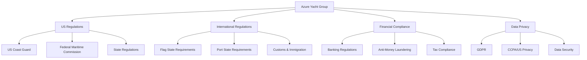
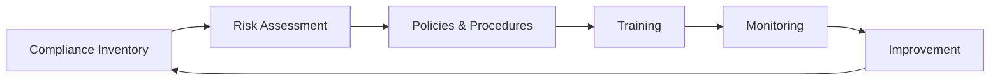

# Regulatory Compliance Requirements

This document outlines the regulatory compliance requirements for Azure Yacht Group's charter broker operations in Florida and international waters.

## Compliance Framework Overview

## U.S. Federal Regulatory Requirements

### Federal Maritime Commission (FMC)

**Registration Requirements:**
- FMC registration as an Ocean Transportation Intermediary (OTI)
- Bond requirements: $75,000 OTI bond
- Annual renewal and reporting

**Compliance Activities:**
- Maintain accurate booking records
- Clear disclosure of terms and conditions
- Compliance with truth in advertising regulations
- Documentation of charter agreements

### U.S. Coast Guard Requirements

**Documentation Requirements:**
- Verification of vessel documentation
- Certificate of Documentation validation
- Verification of Commercial Passenger Vessel compliance (if applicable)
- Safety equipment certification verification

**Operational Considerations:**
- Passenger capacity limitations
- Crew licensing and certification verification
- Safety equipment requirements
- Drug and alcohol testing program verification

### Internal Revenue Service (IRS)

**Tax Compliance:**
- Proper classification of charter revenue
- 1099 issuance for vessel owners (when applicable)
- Foreign Account Tax Compliance Act (FATCA) considerations
- Excise tax collection and remittance (when applicable)

## Florida State Regulations

### Florida Department of Business & Professional Regulation

**Licensing Requirements:**
- Seller of Travel registration (if applicable)
- Florida business registration
- County/city business licenses

**Operational Requirements:**
- Compliance with Florida Deceptive and Unfair Trade Practices Act
- Compliance with Florida consumer protection statutes
- Accurate advertising and promotion

### Florida Department of Revenue

**Tax Collection Requirements:**
- Sales tax collection and remittance
- Tourist development tax considerations
- Documentary stamp tax compliance (when applicable)

### Florida Fish and Wildlife Conservation Commission

**Environmental Compliance:**
- Protection of marine sanctuaries
- Proper disposal of waste
- Environmental protection area awareness
- Protected species regulations

## International Regulatory Considerations

### Flag State Requirements

**Verification Responsibilities:**
- Verification of vessel flag registration
- Compliance with flag state regulations
- Charter permitting requirements by flag
- Commercial registration verification

**Documentation Review:**
- International certifications verification
- Safety Management Certificate (SMC)
- Document of Compliance (DOC)
- International Ship Security Certificate (ISSC)

### Port State Requirements

**Destination Compliance:**
- Charter permits for specific jurisdictions
- Cabotage considerations by destination
- Local agent requirements
- Chartering restrictions by location

**Common Requirements by Region:**
- Caribbean: charter permits, cruising permits
- Mediterranean: VAT compliance, charter licenses
- Asia-Pacific: cabotage restrictions, agent requirements

### Customs and Immigration

**Entry/Exit Procedures:**
- Customs clearance requirements
- Immigration procedures for guests and crew
- Temporary importation of vessels
- Cruising permit requirements

**Documentation Requirements:**
- Passenger manifests
- Crew lists
- Ship's papers
- Customs declarations

## Financial Compliance

### Banking Regulations

**Transaction Requirements:**
- Know Your Customer (KYC) procedures
- Client funds handling
- Payment processing compliance
- International wire transfer regulations

### Anti-Money Laundering (AML)

**AML Program Requirements:**
- Customer Due Diligence (CDD)
- Enhanced Due Diligence for high-value transactions
- Suspicious Activity Reports (SARs) when required
- Record keeping requirements

**Risk Assessment:**
- Client risk profiling
- Transaction monitoring
- Red flags identification
- Compliance training

### Escrow and Trust Accounts

**Fund Management:**
- Proper segregation of client funds
- Escrow account management
- Trust account compliance
- Accurate fund accounting

## Data Privacy and Security

### Global Privacy Requirements

**General Data Protection Regulation (GDPR):**
- Lawful basis for processing
- Data subject rights
- Data protection impact assessments
- International data transfers

**California Consumer Privacy Act (CCPA) / State Privacy Laws:**
- Notice requirements
- Consumer rights
- Data inventory requirements
- Service provider requirements

### Information Security

**Data Security Requirements:**
- Data encryption
- Access controls
- Security incident response
- Vendor security management

**Documentation Requirements:**
- Privacy policies
- Data processing agreements
- Records of processing activities
- Security policies

## Compliance Management System

### Compliance Program Elements

1. **Compliance Inventory**
   - Regulatory mapping
   - Obligation register
   - Jurisdictional analysis
   - Compliance calendar

2. **Risk Assessment**
   - Risk identification
   - Impact analysis
   - Likelihood assessment
   - Control evaluation

3. **Policies and Procedures**
   - Compliance manual
   - Standard operating procedures
   - Documentation requirements
   - Role assignments

4. **Training and Awareness**
   - Staff compliance training
   - Owner/operator education
   - Client communications
   - Ongoing updates

5. **Monitoring and Testing**
   - Compliance audits
   - Control testing
   - Documentation review
   - Regulatory updates tracking

6. **Continuous Improvement**
   - Incident analysis
   - Remediation tracking
   - Regulatory change management
   - Best practice implementation

## Compliance Documentation Requirements

| Document Type | Purpose | Retention Period |
|---------------|---------|------------------|
| Charter Agreements | Define charter terms and conditions | 7 years |
| Vessel Documentation | Verify vessel compliance and registration | Duration of relationship + 3 years |
| Client KYC Documentation | Verify client identity and screening | 5 years from end of relationship |
| Transaction Records | Document financial transactions | 7 years |
| Compliance Policies | Document compliance procedures | Current version + prior version |
| Training Records | Document staff compliance training | Duration of employment + 3 years |
| Audit Reports | Document compliance reviews | 5 years |
| Incident Reports | Document compliance incidents | 5 years |

## Implementation Action Plan

### Phase 1: Compliance Foundation (Months 1-3)

1. **Regulatory Mapping**
   - Identify all applicable regulations
   - Create regulatory inventory
   - Establish compliance calendar

2. **Documentation Development**
   - Create compliance manual
   - Develop standard operating procedures
   - Create compliance checklists

3. **Registration and Licensing**
   - Complete FMC registration
   - Obtain state/local licenses
   - Establish financial accounts

### Phase 2: Operational Integration (Months 4-6)

1. **Staff Training**
   - Conduct compliance training
   - Role-specific training
   - Documentation procedures

2. **System Implementation**
   - Implement compliance monitoring tools
   - Establish documentation management
   - Develop reporting processes

3. **Vendor Management**
   - Establish due diligence procedures
   - Create vendor compliance requirements
   - Implement service agreements

### Phase 3: Monitoring and Improvement (Months 7-12)

1. **Compliance Testing**
   - Conduct initial compliance audit
   - Test control effectiveness
   - Identify improvement opportunities

2. **Continuous Improvement**
   - Implement audit recommendations
   - Update procedures as needed
   - Monitor regulatory changes

3. **Reporting**
   - Establish management reporting
   - Create compliance dashboards
   - Document compliance status

## Special Compliance Considerations for Yacht Charters

### Charter Party Compliance

**Charter Agreement Requirements:**
- Clear definition of party responsibilities
- Cancellation and refund policies
- Disclosure of fees and charges
- Compliance with consumer protection laws

**Booking Process Compliance:**
- Transparent pricing
- Clear disclosure of terms
- Documented booking confirmation
- Payment handling compliance

### Crew Compliance

**Crew Certification Verification:**
- STCW certification verification
- License verification
- Medical certification
- Safety training verification

**Employment Compliance:**
- Crew employment agreements
- Maritime labor compliance
- Work hours documentation
- Crew welfare requirements

### Incident Management and Reporting

**Incident Response:**
- Incident documentation procedures
- Regulatory reporting requirements
- Investigation procedures
- Corrective action documentation

**Compliance Reporting:**
- Internal reporting procedures
- Regulatory reporting requirements
- Documentation standards
- Retention requirements

---

*Note: This compliance framework is intended as a guide. All regulatory requirements should be reviewed by qualified legal professionals with maritime expertise before implementation.* 