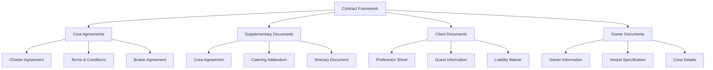
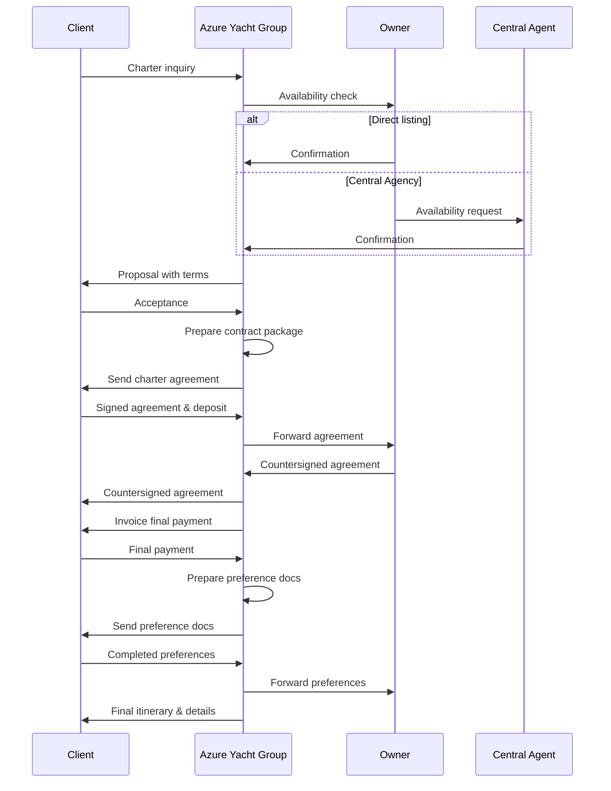

# Contract Templates for Yacht Charter Operations

This document provides standard contract templates and guidelines for yacht charter agreements used by Azure Yacht Group.

## Contract Framework Overview



## 1. Charter Agreement Templates

### 1.1 MYBA Charter Agreement

The Mediterranean Yacht Brokers Association (MYBA) Charter Agreement is the industry standard for professional yacht charters and is our primary contract template.

#### Key Components:

1. **Charter Parties**: Identification of Owner, Charterer, Broker, and Stakeholder details
2. **Vessel Details**: Complete technical specifications and inventory
3. **Charter Period**: Precise delivery and redelivery times and locations
4. **Charter Fee and Payment Schedule**: Breakdown of costs and payment timeline
5. **Advanced Provisioning Allowance (APA)**: Explanation and calculation
6. **Cancellation Policy**: Terms and conditions for cancellation
7. **Security Deposit**: Amount and conditions for return
8. **Insurance**: Required coverage and limitations
9. **Signature Blocks**: For all relevant parties

#### MYBA Adaptation Guidelines:

| Section | Standard Text | Customization Options | Legal Considerations |
|---------|---------------|------------------------|----------------------|
| Parties | Template text identifying all parties | Company/entity structure specifics | Ensure legal entity accuracy |
| Delivery/Redelivery | Standard delivery clause | Port-specific requirements | Local maritime regulations |
| Payment Terms | Standard 50/25/25 schedule | Payment milestone adjustments | Currency and banking regulations |
| Cancellation | Sliding scale based on notice | Modification of percentage retention | Force majeure provisions |
| APA | Standard 30-35% calculation | Adjustment based on itinerary | Clear accounting procedures |
| Jurisdiction | English law and arbitration | Alternative jurisdiction options | Enforceability in charter region |

### 1.2 US Charter Agreement

For charters operating primarily in US waters, we use a modified agreement compliant with US maritime law.

#### Key Differences from MYBA:

1. **Jones Act Compliance**: Additional provisions for cabotage law compliance
2. **Passenger Vessel Safety Act**: References to relevant regulations
3. **Arbitration Clause**: US-based arbitration provisions
4. **Tax Treatment**: Modified tax clauses for US operations
5. **Liability Language**: Enhanced liability provisions

### 1.3 Day Charter Agreement

Simplified agreement for charters of less than 24 hours duration.

#### Template Components:

1. **Basic Parties Information**: Streamlined identification
2. **Vessel Information**: Essential specifications
3. **Charter Duration**: Specific hours of operation
4. **Charter Route**: Defined cruising area
5. **Fee Structure**: All-inclusive pricing model
6. **Cancellation Terms**: Modified for short-term booking
7. **Safety Briefing Acknowledgment**: Required safety information
8. **Liability Limitations**: Enhanced for day operations

## 2. Terms and Conditions

### 2.1 Standard Terms and Conditions

Our standard terms and conditions document accompanies all charter agreements and covers:

1. **Definitions**: Clear terminology definitions
2. **Broker Responsibilities**: Scope of Azure Yacht Group services
3. **Owner Obligations**: Vessel presentation and maintenance requirements
4. **Charterer Obligations**: Proper use and care of vessel
5. **Cruise Itinerary**: Flexibility and limitation provisions
6. **Force Majeure**: Definition and implications
7. **Insurance Coverage**: Requirements and exclusions
8. **Complaint Procedure**: Process for resolving issues
9. **Privacy Policy Reference**: Data handling practices
10. **Governing Law**: Applicable jurisdiction

### 2.2 Jurisdiction-Specific Addenda

Supplementary terms may be added based on charter location:

#### Mediterranean Addendum:

- VAT treatment by country
- Local navigation restrictions
- Environmental regulations
- Specific anchorage limitations

#### Caribbean Addendum:

- Hurricane season provisions
- Island-specific requirements
- Marine park regulations
- Customs and immigration procedures

#### Asia-Pacific Addendum:

- Regional cabotage restrictions
- Environmental sensitivities
- Cultural considerations
- Local authority requirements

## 3. Broker Agreements

### 3.1 Central Agency Agreement

Template for exclusive representation of yacht owners.

#### Key Sections:

1. **Appointment**: Exclusive representation terms
2. **Services Provided**: Marketing, booking, and administration
3. **Commission Structure**: Base rates and incentives
4. **Term and Termination**: Duration and notice requirements
5. **Owner Obligations**: Information provision and updates
6. **Broker Obligations**: Marketing commitments and reporting
7. **Confidentiality**: Information handling requirements
8. **Dispute Resolution**: Process for resolving disagreements

### 3.2 Co-Brokerage Agreement

Template for cooperation with other charter brokers.

#### Key Components:

1. **Roles Definition**: Clear delineation of responsibilities
2. **Commission Split**: Standard 50/50 or alternative structure
3. **Client Relationship**: Communication protocols
4. **Booking Process**: Procedure for confirmations
5. **Payment Handling**: Collection and disbursement process
6. **Marketing Guidelines**: Approved vessel presentation
7. **Confidentiality**: Client information protection
8. **Term**: Duration of cooperation

## 4. Supplementary Agreements

### 4.1 Crew Agreement Addendum

Details regarding crew services, expectations, and limitations.

#### Template Sections:

1. **Crew Composition**: Guaranteed positions and qualifications
2. **Duty Hours**: Working time expectations and limitations
3. **Special Services**: Additional skills or services offered
4. **Gratuity Guidelines**: Standard practice information
5. **Crew Accommodation**: Specifications and limitations
6. **Dietary Restrictions**: Accommodation capabilities
7. **References**: Past client experiences

### 4.2 Catering and Service Addendum

Detailed provisions for food, beverage, and service expectations.

#### Template Components:

1. **Menu Planning**: Process and timeline
2. **Beverage Provisions**: Standard inclusions and special requests
3. **Special Dietary Requirements**: Accommodation process
4. **Formal Entertainment**: Capabilities and limitations
5. **Service Standards**: Expected level of service
6. **Provisioning Process**: Pre-charter preference collection
7. **Special Occasion Planning**: Event capabilities

### 4.3 Itinerary and Activities Agreement

Framework for planning and executing charter activities.

#### Template Sections:

1. **Itinerary Development**: Planning process and timeline
2. **Weather Contingencies**: Alternative planning
3. **Port Reservations**: Booking process and guarantees
4. **Water Sports Equipment**: Available activities and safety requirements
5. **Shore Excursions**: Organization and responsibility
6. **Special Activity Requests**: Accommodation process
7. **Local Regulations**: Compliance requirements

## 5. Client Documentation

### 5.1 Charter Guest Information Form

Template for collecting essential guest information.

#### Required Information:

1. **Personal Details**: Names, DOB, nationality, passport information
2. **Travel Information**: Arrival/departure details
3. **Emergency Contacts**: For all guests
4. **Health Information**: Medical conditions, allergies, medications
5. **Preference Indicators**: Basic likes/dislikes
6. **Special Occasions**: Birthdays, anniversaries during charter
7. **Previous Charter Experience**: Expectations management

### 5.2 Preference Sheet

Comprehensive template for collecting detailed guest preferences.

#### Template Sections:

1. **Food Preferences**: Detailed likes, dislikes, and restrictions
2. **Beverage Preferences**: Alcoholic and non-alcoholic selections
3. **Activities Interests**: Desired water sports and excursions
4. **Entertainment Preferences**: Music, movies, games
5. **Daily Schedule Preferences**: Typical routine expectations
6. **Special Requests**: Specific items or experiences
7. **Children's Requirements**: Ages, preferences, safety needs

### 5.3 Liability Waiver and Assumption of Risk

Template for guest acknowledgment of inherent risks.

#### Key Components:

1. **Activity Risks**: Water sports and excursion acknowledgments
2. **Health Declaration**: Fitness for activities
3. **Equipment Usage**: Proper use agreement
4. **Safety Briefing**: Acknowledgment of instruction
5. **Medical Authorization**: Emergency treatment permission
6. **Media Release**: Photo/video usage permission
7. **Legal Release Language**: Liability limitation terms

## 6. Owner Documentation

### 6.1 Vessel Specification Sheet

Standardized template for collecting comprehensive vessel information.

#### Template Sections:

1. **Technical Specifications**: Dimensions, capacities, performance
2. **Accommodation Layout**: Cabin configuration and features
3. **Deck Areas**: Entertainment and relaxation spaces
4. **Mechanical Systems**: Engines, generators, water makers
5. **Navigation Equipment**: Communications and navigation technology
6. **Tender and Toys**: Complete inventory with specifications
7. **AV/Entertainment Systems**: Technology and capabilities
8. **Safety Equipment**: Life-saving and emergency equipment
9. **Recent Refits/Upgrades**: Maintenance history highlights
10. **Operational Limitations**: Range, capacity, or usage restrictions

### 6.2 Crew Profile Template

Standardized format for presenting crew information to clients.

#### Template Components:

1. **Crew Photo**: Professional image guidelines
2. **Professional Background**: Relevant experience summary
3. **Certifications**: Required and additional qualifications
4. **Specialties and Skills**: Unique service offerings
5. **Languages**: Proficiency levels
6. **Personal Statement**: Hospitality philosophy
7. **Interests**: Relevant hobbies and activities

### 6.3 Owner Requirements Document

Template for documenting owner preferences and restrictions.

#### Template Sections:

1. **Operational Limitations**: Areas, activities, or usage restrictions
2. **Owner Use Periods**: Blocked dates and notice requirements
3. **Maintenance Schedule**: Required service periods
4. **Guest Vetting Requirements**: Any specific restrictions
5. **Off-Limits Areas/Equipment**: Protected owner spaces or items
6. **Reporting Expectations**: Communication frequency and content
7. **Charter Area Preferences**: Preferred or restricted cruising grounds

## 7. Contract Management Process



### 7.1 Contract Preparation Process

1. **Initial Inquiry Review**: Matching client requirements to vessel
2. **Availability Confirmation**: Verifying calendar availability
3. **Term Sheet Preparation**: Outline of key agreement points
4. **Client Approval**: Confirmation of material terms
5. **Contract Drafting**: Selection and customization of appropriate template
6. **Internal Review**: Legal check of completed contract
7. **Delivery to Client**: Contract package submission
8. **Negotiation Support**: Process for handling requested changes
9. **Execution Process**: Signing, witness, and dating procedures
10. **Document Distribution**: Final agreement distribution to all parties

### 7.2 Contract Modification Procedures

1. **Change Request Submission**: Format for requesting modifications
2. **Evaluation Process**: Assessment of feasibility and impact
3. **Owner Consultation**: Process for gaining owner approval
4. **Amendment Drafting**: Standard format for contract amendments
5. **Execution Requirements**: Signature process for amendments
6. **Documentation**: Record-keeping procedures

## Appendix A: Sample Contract Clauses

### Force Majeure

```
Neither Owner nor Charterer shall be responsible for any loss, damage, delay or failure in performance hereunder resulting from any force majeure event, including but not limited to acts of God, war, civil unrest, terrorist actions, labor disputes, government actions, severe weather conditions, or any other cause beyond the reasonable control of such party. In the event of a force majeure occurrence making it impossible to commence the charter as scheduled, the parties shall negotiate in good faith to reschedule the charter at a mutually agreeable time. If rescheduling is not possible, the charter may be cancelled with an appropriate refund as determined based on the circumstances and expenses already incurred.
```

### Delivery/Redelivery

```
The VESSEL shall be delivered to the CHARTERER at [PORT] at [TIME] on the first day of the Charter Period and redelivered to the OWNER at [PORT] by [TIME] on the final day of the Charter Period, in clean and good condition, with all equipment stowed in its proper place, normal wear and tear excepted. Any delay in delivery or redelivery caused by weather conditions or force majeure shall not be considered a breach of this Agreement.
```

### Cruising Area Limitations

```
The CHARTERER agrees to restrict the cruising of the VESSEL to the Cruising Area specified in this Agreement and to waters safe, navigable and within the capabilities of the VESSEL. The CHARTERER further agrees not to enter the waters of any country not included in the Cruising Area without first obtaining permission from the OWNER and ensuring compliance with all necessary visas, permits and other documentation. The CHARTERER acknowledges that the captain has the final authority to determine whether specific locations or conditions are safe for the VESSEL and its passengers.
```

## Appendix B: Document Checklist

### Pre-Charter Documentation Checklist

| Document | Responsibility | Timeline | Format |
|----------|----------------|----------|--------|
| Charter Agreement | Azure Yacht Group | Upon booking | Digital & Hard Copy |
| Terms & Conditions | Azure Yacht Group | Upon booking | Digital |
| First Payment Invoice | Azure Yacht Group | Upon booking | Digital |
| Guest Information Form | Client | 30 days pre-charter | Digital |
| Preference Sheet | Client | 30 days pre-charter | Digital |
| Crew Profiles | Owner/Central Agent | Upon booking | Digital |
| Vessel Specifications | Owner/Central Agent | Upon booking | Digital |
| Final Payment Invoice | Azure Yacht Group | 30 days pre-charter | Digital |
| APA Invoice | Azure Yacht Group | 30 days pre-charter | Digital |
| Liability Waiver | Client | 14 days pre-charter | Digital |
| Final Itinerary | Azure Yacht Group | 14 days pre-charter | Digital |
| Embarkation Details | Azure Yacht Group | 7 days pre-charter | Digital |

---

**Last Updated**: April 30, 2024  
**Next Review**: May 31, 2024 