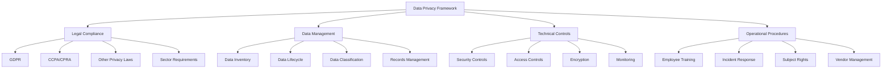
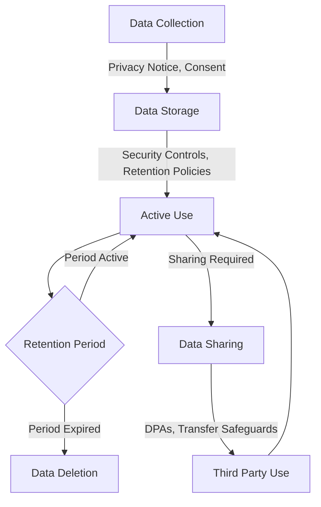
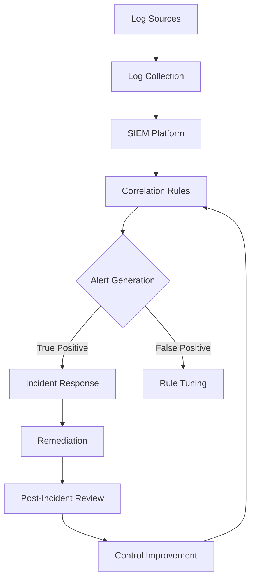
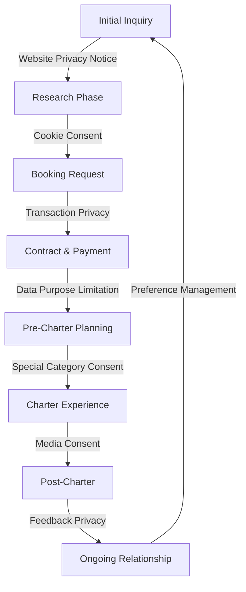

# Data Privacy & GDPR Compliance

This document outlines the data privacy and information security requirements for Azure Yacht Group's yacht charter operations.

## Data Privacy Framework Overview



## 1. Privacy Regulatory Framework

### 1.1 GDPR Compliance

The General Data Protection Regulation (GDPR) applies to businesses processing personal data of EU residents, regardless of the business location.

#### Key GDPR Requirements:

1. **Lawful Basis for Processing**:
   - Document lawful basis for all data processing activities
   - Implement proper consent mechanisms where required
   - Maintain records of consent and preference management

2. **Data Subject Rights**:
   - Implement procedures for handling access requests
   - Ensure capability to export data in machine-readable format
   - Develop processes for data correction and deletion
   - Establish mechanisms for handling objections to processing

3. **Transparency Requirements**:
   - Provide clear, concise privacy notices
   - Disclose all data processing activities
   - Explain data sharing with third parties
   - Detail data retention policies

4. **Data Protection Impact Assessments**:
   - Conduct DPIAs for high-risk processing activities
   - Document assessment methodology and results
   - Implement risk mitigation measures
   - Consult with supervisory authorities when necessary

#### GDPR Implementation Checklist:

| Requirement | Implementation Status | Responsible Party | Documentation |
|-------------|----------------------|-------------------|---------------|
| Data Mapping | Complete & Ongoing | Data Protection Officer | Data Inventory Document |
| Privacy Notices | Implemented | Marketing & Legal | Website & Booking Materials |
| Consent Management | Implemented | IT & Marketing | Digital Platforms |
| Data Subject Rights Process | Implemented | Customer Service | Rights Request SOP |
| Breach Response Plan | Implemented | Security Team | Incident Response Plan |
| Processor Agreements | Ongoing | Legal | Data Processing Agreements |
| Records of Processing | Implemented | Data Protection Officer | Processing Activity Register |

### 1.2 CCPA/CPRA Compliance (California)

The California Consumer Privacy Act (CCPA) and California Privacy Rights Act (CPRA) provide privacy rights to California residents.

#### Key CCPA/CPRA Requirements:

1. **Consumer Rights**:
   - Right to know what personal information is collected
   - Right to delete personal information
   - Right to opt-out of sale/sharing of personal information
   - Right to non-discrimination for exercising rights

2. **Business Obligations**:
   - Provide privacy notice at collection
   - Implement "Do Not Sell My Personal Information" option
   - Respond to consumer requests within specified timeframes
   - Maintain reasonable security procedures

#### CCPA/CPRA Implementation:

| Requirement | Implementation Approach |
|-------------|------------------------|
| Privacy Notice | Separate California privacy notice section |
| Opt-Out Mechanism | "Do Not Sell/Share My Information" link in footer |
| Rights Request Process | Online form and dedicated email address |
| Verification Process | ID verification protocol based on sensitivity |
| Training | Staff training on handling California resident requests |

### 1.3 Other Privacy Regulations

Various other privacy regulations may apply based on client nationality and business operations.

#### Key Global Privacy Regulations:

| Jurisdiction | Regulation | Key Requirements | Application to Charter Business |
|--------------|------------|------------------|--------------------------------|
| UK | UK GDPR | Similar to EU GDPR | UK client data processing |
| Canada | PIPEDA | Consent-based framework | Canadian client data |
| Australia | Privacy Act | Australian Privacy Principles | Australian client data |
| Brazil | LGPD | Similar to GDPR | Brazilian client data |
| UAE | PDPL | Consent and notification | UAE operations and clients |

### 1.4 Sector-Specific Requirements

The luxury travel and maritime sectors may have specific privacy considerations.

#### Key Sector Requirements:

1. **Travel Industry Standards**:
   - IATA data protection standards
   - Travel agent association guidelines
   - Hospitality industry best practices

2. **Maritime-Specific Considerations**:
   - Crew personal data protection
   - Passenger manifest requirements
   - Port authority data submission requirements
   - Maritime security regulations

## 2. Data Management Framework

### 2.1 Personal Data Inventory

A comprehensive inventory of all personal data processed by the charter business.

#### Data Inventory Components:

1. **Client Data Categories**:
   - Identity information (name, passport details)
   - Contact information (email, phone, address)
   - Preference information (dietary, activities)
   - Financial information (payment details)
   - Special categories (health information, dietary requirements)

2. **Crew/Staff Data Categories**:
   - Employment information
   - Certification and qualifications
   - Performance records
   - Financial information
   - Health information

3. **Business Contact Data**:
   - Yacht owner information
   - Supplier contact details
   - Partner organization contacts
   - Marketing leads information

#### Data Inventory Matrix:

| Data Category | Purpose | Legal Basis | Retention Period | Security Controls | Access Restrictions |
|---------------|---------|-------------|------------------|-------------------|---------------------|
| Client Identity | Charter booking, Legal requirements | Contract, Legal obligation | 7 years post-charter | Encryption, Access control | Charter team, Accounting |
| Client Preferences | Personalized service | Consent, Contract | 3 years post-charter | Access control | Charter team, Crew |
| Payment Information | Transaction processing | Contract | 7 years | Encryption, PCI DSS controls | Accounting only |
| Health Information | Safety, Special accommodations | Explicit consent | Duration of charter + 1 year | Encryption, Strict access | Medical need-to-know |
| Crew Certifications | Compliance, Quality assurance | Legal obligation, Contract | Duration of employment + 3 years | Access control | Management |

### 2.2 Data Lifecycle Management

Procedures for managing data throughout its lifecycle, from collection to deletion.

#### Data Lifecycle Stages:

1. **Collection**:
   - Collect minimum necessary data
   - Provide privacy notice at collection
   - Obtain appropriate consent
   - Use secure collection methods

2. **Processing**:
   - Process according to stated purpose
   - Implement purpose limitation
   - Ensure data accuracy
   - Maintain processing records

3. **Storage**:
   - Implement appropriate security
   - Apply retention schedules
   - Minimize duplicate storage
   - Ensure appropriate backup

4. **Sharing**:
   - Share only with authorized parties
   - Use appropriate transfer mechanisms
   - Maintain sharing records
   - Ensure recipient compliance

5. **Deletion**:
   - Apply retention schedule
   - Implement secure deletion
   - Document deletion process
   - Handle exceptions appropriately

#### Data Lifecycle Implementation:



### 2.3 Data Classification

Framework for classifying data based on sensitivity and required protection.

#### Classification Levels:

| Classification | Definition | Examples | Security Requirements |
|----------------|------------|----------|----------------------|
| Public | Information that can be freely shared | Yacht specifications, General services | Basic security controls |
| Internal | Business information not for public | Operational procedures, Pricing structures | Standard access controls |
| Confidential | Sensitive business or personal data | Client contact details, Payment records | Encryption, Access restrictions |
| Highly Confidential | Extremely sensitive information | Passport details, Health information | Strong encryption, Strict access, Audit logs |

### 2.4 Records Management

Policies and procedures for maintaining records required for legal, regulatory, and business purposes.

#### Records Management Components:

1. **Retention Schedule**:
   - Define retention periods by record type
   - Align with legal requirements
   - Document business necessity for retention
   - Implement automatic deletion where possible

2. **Records Storage**:
   - Secure storage solutions
   - Appropriate access controls
   - Backup and recovery processes
   - Archive procedures

3. **Records Destruction**:
   - Secure destruction methods
   - Documentation of destruction
   - Exception handling
   - Legal hold procedures

#### Retention Schedule Examples:

| Record Type | Retention Period | Retention Justification | Destruction Method |
|-------------|------------------|-------------------------|-------------------|
| Charter Contracts | 7 years post-charter | Legal, Tax requirements | Secure shredding/deletion |
| Client Preference Data | 3 years post-charter | Business relationship | Secure deletion |
| Payment Records | 7 years | Tax regulations | Secure deletion |
| Incident Reports | 10 years | Liability period | Secure shredding/deletion |
| Marketing Consent | Duration of consent + 2 years | Proof of compliance | Secure deletion |
| Crew Information | Duration of employment + 3 years | Legal requirements | Secure shredding/deletion |

## 3. Technical Security Controls

### 3.1 Data Security Framework

Technical controls to protect personal data from unauthorized access, disclosure, alteration, or destruction.

#### Key Security Controls:

1. **Network Security**:
   - Perimeter firewalls
   - Network segmentation
   - Intrusion detection/prevention
   - Secure remote access (VPN)
   - Wireless network security

2. **Endpoint Security**:
   - Endpoint protection platforms
   - Device encryption
   - Mobile device management
   - Patch management
   - Secure configuration

3. **Application Security**:
   - Secure development practices
   - Application firewalls
   - Vulnerability management
   - Penetration testing
   - Code review

4. **Cloud Security**:
   - Cloud access security brokers
   - Cloud configuration management
   - Cloud data protection
   - Identity and access management
   - Vendor security assessment

#### Security Implementation Matrix:

| Security Domain | Control Implementation | Monitoring Method | Testing Frequency |
|-----------------|------------------------|-------------------|-------------------|
| Network Security | Next-gen firewalls, VPN | SIEM, Log analysis | Quarterly |
| Endpoint Protection | EDR solution, Disk encryption | Centralized management console | Monthly |
| Access Control | MFA, Role-based access | Access reviews, Logs | Quarterly |
| Cloud Security | CASB, IAM | Cloud security posture management | Monthly |
| Data Protection | DLP, Encryption | DLP monitoring | Continuous |

### 3.2 Access Control

Procedures for ensuring only authorized individuals can access personal data.

#### Access Control Framework:

1. **Identity Management**:
   - Unique user identification
   - Authentication mechanisms
   - Identity lifecycle management
   - Directory services
   - Single sign-on implementation

2. **Authorization Controls**:
   - Role-based access control
   - Principle of least privilege
   - Segregation of duties
   - Access request and approval workflow
   - Privileged access management

3. **Access Governance**:
   - Regular access reviews
   - Attestation processes
   - Access monitoring and logging
   - Access change management
   - Unauthorized access detection

#### Access Matrix Example:

| Role | Client Personal Data | Payment Data | Operational Data | Marketing Data | HR Data |
|------|---------------------|--------------|------------------|----------------|---------|
| Charter Consultant | Full Access | No Access | Read Access | Read Access | No Access |
| Finance Staff | Limited Access | Full Access | Limited Access | No Access | No Access |
| Marketing Team | Limited Access | No Access | No Access | Full Access | No Access |
| IT Administrator | Emergency Access Only | Emergency Access Only | System Access | System Access | System Access |
| Management | Full Access | Summary Access | Full Access | Full Access | Full Access |

### 3.3 Encryption Strategy

Comprehensive approach to protecting data through encryption.

#### Encryption Implementation:

1. **Data at Rest**:
   - Full disk encryption
   - Database encryption
   - File-level encryption
   - Backup encryption
   - Key management

2. **Data in Transit**:
   - TLS for web applications
   - VPN for remote access
   - Secure file transfer protocols
   - Email encryption
   - API encryption

3. **Encryption Standards**:
   - AES-256 for symmetric encryption
   - RSA-2048 or higher for asymmetric
   - SHA-256 or higher for hashing
   - Perfect forward secrecy
   - Modern cipher suites

#### Encryption Requirements by Data Type:

| Data Type | At Rest | In Transit | Keys | Responsibility |
|-----------|---------|------------|------|----------------|
| PII | Required | Required | Hardware Security Module | IT Security |
| Payment Card Data | Required (PCI DSS) | Required (PCI DSS) | HSM, PCI Compliant | Payment Processor |
| Health Information | Required | Required | HSM | IT Security |
| Credentials | Required | Required | HSM | IT Security |
| Business Data | Recommended | Required | Software | Department Owner |

### 3.4 Monitoring and Detection

Systems and procedures for monitoring data access and detecting potential security incidents.

#### Monitoring Components:

1. **Security Monitoring**:
   - Security information and event management (SIEM)
   - Log collection and analysis
   - Behavioral analytics
   - Anomaly detection
   - Alerting mechanisms

2. **Privacy Monitoring**:
   - Data access logging
   - Data export tracking
   - Consent change monitoring
   - Rights request tracking
   - Data processing monitoring

3. **Incident Detection**:
   - Data leakage detection
   - Unauthorized access detection
   - Malware detection
   - Account compromise detection
   - Suspicious activity detection

#### Monitoring Implementation:



## 4. Operational Privacy Procedures

### 4.1 Employee Training and Awareness

Programs to ensure staff understand privacy requirements and their responsibilities.

#### Training Components:

1. **General Privacy Training**:
   - Privacy regulation overview
   - Company policies and procedures
   - Data handling requirements
   - Security awareness
   - Incident reporting

2. **Role-Based Training**:
   - Job-specific privacy responsibilities
   - System-specific data protection
   - Client data handling procedures
   - Specialized compliance requirements
   - Advanced security training

3. **Awareness Program**:
   - Regular privacy communications
   - Simulated phishing exercises
   - Privacy reminders and tips
   - Policy updates and notifications
   - Privacy culture development

#### Training Implementation:

| Training Type | Audience | Frequency | Delivery Method | Verification |
|---------------|----------|-----------|-----------------|--------------|
| General Privacy | All staff | Annual | Online learning | Quiz |
| Security Awareness | All staff | Quarterly | Online + Newsletter | Acknowledgment |
| GDPR Fundamentals | Customer-facing | Annual | Instructor-led | Assessment |
| Incident Response | Response team | Biannual | Tabletop exercise | Performance evaluation |
| New Policy Training | Affected staff | As needed | Department meetings | Acknowledgment |

### 4.2 Data Breach Response

Procedures for detecting, responding to, and recovering from privacy incidents and data breaches.

#### Incident Response Process:

1. **Preparation**:
   - Response team designation
   - Response plan documentation
   - Tool and resource allocation
   - Regular testing and exercises
   - Stakeholder communication planning

2. **Detection and Analysis**:
   - Incident verification
   - Scope determination
   - Impact assessment
   - Evidence collection
   - Containment strategy development

3. **Containment and Eradication**:
   - Immediate containment actions
   - Long-term containment
   - Threat removal
   - Systems restoration
   - Vulnerability remediation

4. **Recovery**:
   - Service restoration
   - Monitoring implementation
   - Confirmed eradication
   - User notification
   - Normal operations resumption

5. **Post-Incident Activities**:
   - Lessons learned
   - Plan updates
   - Control improvements
   - Training updates
   - Documentation

#### Notification Requirements:

| Regulation | Notification Timeframe | Authority | Affected Individuals | Documentation |
|------------|------------------------|-----------|----------------------|---------------|
| GDPR | 72 hours | Supervisory Authority | Without undue delay if high risk | Breach register |
| CCPA/CPRA | Most expedient time | Attorney General (>500 CA residents) | Most expedient time | Breach records |
| UK GDPR | 72 hours | ICO | Without undue delay if high risk | Breach register |
| PIPEDA (Canada) | As soon as feasible | Privacy Commissioner | As soon as feasible | Breach records |

### 4.3 Data Subject Rights Management

Procedures for handling data subject/consumer rights requests under privacy regulations.

#### Rights Request Process:

1. **Request Intake**:
   - Multiple intake channels
   - Request documentation
   - Identity verification
   - Request categorization
   - Acknowledgment to requestor

2. **Request Processing**:
   - Scope determination
   - Data location identification
   - Data retrieval
   - Review and redaction
   - Response preparation

3. **Request Fulfillment**:
   - Response delivery
   - Action implementation
   - Verification of completion
   - Documentation
   - Follow-up if necessary

#### Rights Request SLA:

| Right Type | Acknowledgment | Verification | Response | Extension |
|------------|----------------|--------------|----------|-----------|
| Access/Portability | 3 business days | 5 business days | 30 calendar days | +60 days if complex |
| Correction | 3 business days | 5 business days | 30 calendar days | +60 days if complex |
| Deletion | 3 business days | 5 business days | 30 calendar days | +60 days if complex |
| Opt-Out | 3 business days | 5 business days | 15 calendar days | N/A |
| Objection | 3 business days | 5 business days | 30 calendar days | +60 days if complex |

### 4.4 Vendor Management

Procedures for ensuring third-party service providers maintain appropriate data protection standards.

#### Vendor Privacy Management:

1. **Vendor Assessment**:
   - Pre-engagement privacy due diligence
   - Data protection capability assessment
   - Compliance verification
   - Security control evaluation
   - Risk assessment

2. **Contractual Requirements**:
   - Data processing agreements
   - Standard contractual clauses
   - Compliance representations
   - Audit rights
   - Breach notification requirements

3. **Ongoing Monitoring**:
   - Regular reassessment
   - Compliance certification review
   - Security assessment updates
   - Processing activity verification
   - Incident monitoring

#### Vendor Classification Matrix:

| Vendor Type | Data Access Level | Risk Level | Contract Requirements | Monitoring Frequency |
|-------------|-------------------|------------|----------------------|---------------------|
| CRM Provider | Full client data | High | DPA, SCCs, Audit rights | Annual assessment |
| Payment Processor | Payment data | High | DPA, PCI compliance | Annual certification review |
| Marketing Platform | Contact data | Medium | DPA, Marketing controls | Annual review |
| IT Service Provider | Potential access | Medium-High | DPA, Security requirements | Annual assessment |
| Local Charter Agent | Client details | Medium | DPA, Confidentiality | Annual reminder |

## 5. Privacy by Design Framework

### 5.1 Privacy Impact Assessment

Methodology for assessing and mitigating privacy risks in new initiatives, systems, or processes.

#### PIA Process:

1. **Necessity and Proportionality**:
   - Purpose specification
   - Data minimization assessment
   - Retention limitation evaluation
   - Alternatives consideration

2. **Risk Assessment**:
   - Risk identification
   - Likelihood determination
   - Impact assessment
   - Risk calculation
   - Risk acceptance criteria

3. **Control Identification**:
   - Existing control mapping
   - Control gap analysis
   - Additional control requirements
   - Implementation planning
   - Residual risk assessment

4. **Documentation and Approval**:
   - PIA documentation
   - Stakeholder review
   - DPO/Privacy team approval
   - Management signoff
   - Implementation verification

#### PIA Triggers:

| Business Change | PIA Required | Approval Level | Reassessment Trigger |
|-----------------|--------------|----------------|----------------------|
| New system implementation | Yes | Privacy Officer | Major system change |
| New data collection | Yes | Privacy Officer | Collection expansion |
| New marketing initiative | Yes | Marketing + Privacy | Annual |
| New third-party sharing | Yes | Privacy Officer + Legal | Contract renewal |
| Process modification | Case-by-case | Department + Privacy | Significant change |

### 5.2 Privacy in Marketing Activities

Procedures for ensuring marketing activities comply with privacy regulations and respect customer preferences.

#### Marketing Compliance Requirements:

1. **Consent Management**:
   - Preference center implementation
   - Consent collection mechanisms
   - Consent records management
   - Preference change processes
   - Consent expiration/refresh

2. **Email Marketing**:
   - Opt-in requirement compliance
   - Unsubscribe functionality
   - List hygiene practices
   - Suppression list management
   - Third-party list usage restrictions

3. **Digital Marketing**:
   - Cookie consent management
   - Do Not Track respect
   - Ad targeting compliance
   - Remarketing limitations
   - Analytics data anonymization

4. **Telemarketing**:
   - Do Not Call compliance
   - Consent verification
   - Call time restrictions
   - Script compliance
   - Record-keeping requirements

#### Marketing Privacy Checklist:

| Marketing Activity | Privacy Requirements | Documentation | Monitoring |
|-------------------|----------------------|---------------|------------|
| Email Campaign | Valid consent, Unsubscribe option | Consent records | Bounce/complaint rates |
| Website | Cookie notice, Privacy policy link | Consent logs | Cookie audit |
| Social Media | Privacy notice, Data usage disclosure | Platform settings | Engagement review |
| Events | Registration consent, Photo/video notice | Consent forms | Post-event review |
| Partner Marketing | Data sharing agreements, Joint notices | Contracts | Campaign audit |

### 5.3 Privacy in Customer Experience

Integrating privacy protections into the customer journey while maintaining excellent service.

#### Privacy Touchpoints in Customer Journey:

1. **Research and Discovery**:
   - Website privacy notice
   - Cookie consent management
   - Marketing preference capture
   - Privacy-first analytics
   - Browsing without tracking option

2. **Booking and Reservation**:
   - Layered privacy information
   - Consent for optional data
   - Secure payment processing
   - Minimal data collection
   - Clear data usage explanation

3. **Pre-Charter Experience**:
   - Preference form privacy notice
   - Special categories consent
   - Secure document collection
   - Data sharing transparency
   - Purpose limitation

4. **Charter Experience**:
   - Crew privacy training
   - Photo/video consent
   - WiFi privacy
   - Location data usage notice
   - Social media guidelines

5. **Post-Charter Engagement**:
   - Feedback privacy
   - Retention period notice
   - Marketing opt-in refresh
   - Data minimization
   - Right to be forgotten option

#### Privacy Integration in Client Lifecycle:



## Appendix A: Privacy Documentation Templates

### A.1 Data Subject Request Form

```
AZURE YACHT GROUP
DATA SUBJECT/CONSUMER RIGHTS REQUEST FORM

Personal Information:
Full Name: _______________________
Email Address: ___________________
Phone Number: ____________________

Verification Information:
(We require this information to verify your identity)
□ Previous charter date (if applicable): ___________________
□ Booking reference (if known): _________________________
□ Other identification information: ______________________

Request Type:
□ Access my personal data
□ Receive a copy of my personal data (data portability)
□ Correct my personal data
□ Delete my personal data
□ Object to processing of my personal data
□ Restrict processing of my personal data
□ Withdraw consent
□ Opt-out of sale/sharing of personal information
□ Other (please specify): ______________________________

Request Details:
Please provide any additional details about your request:
_________________________________________________
_________________________________________________
_________________________________________________

Preferred Response Method:
□ Email
□ Postal Mail (please provide address): _________________
□ Other (please specify): _____________________________

Signature: _________________________
Date: _____________________________

Submit this form to privacy@azureyachtgroup.com or by mail to:
Azure Yacht Group
[ADDRESS]
Attn: Privacy Team
```

### A.2 Breach Response Checklist

```
INCIDENT RESPONSE CHECKLIST

Initial Detection:
□ Incident reported/detected on: ____/____/____ at ____:____ AM/PM
□ Reported by: ___________________________
□ Incident description: ___________________
□ Systems/data potentially affected: ________

Initial Assessment:
□ Incident response team notified
□ Initial severity assessment: □ Low □ Medium □ High □ Critical
□ Is this a confirmed data breach? □ Yes □ No □ Unknown
□ Personal data potentially affected? □ Yes □ No □ Unknown

Containment Actions:
□ Systems isolated
□ Access credentials changed
□ Vulnerability patched
□ Other containment measures: _______________

Investigation:
□ Forensic investigation initiated
□ Scope of affected data determined
□ Number of affected individuals: __________
□ Categories of affected data: ____________
□ Cause identified: ____________________

Notification Assessment:
□ GDPR notification required? □ Yes □ No
   □ If yes, deadline: ____/____/____
□ CCPA/CPRA notification required? □ Yes □ No
□ Other regulatory notifications required? □ Yes □ No
□ Individual notifications required? □ Yes □ No

Regulatory Notification:
□ Authority notified: _________________
□ Date and time: ____/____/____ at ____:____ AM/PM
□ Reference number: ________________

Individual Notification:
□ Notification method: □ Email □ Mail □ Phone □ Other: _______
□ Date notification sent: ____/____/____
□ Notification content approved by legal: □ Yes □ No

Remediation:
□ Short-term remediation complete
□ Long-term remediation actions: ______________
□ Verification testing performed: □ Yes □ No

Documentation:
□ Incident timeline documented
□ Evidence preserved
□ Response actions recorded
□ Lessons learned session scheduled for: ____/____/____

Completed by: _________________________
Role: ________________________________
Date: ________________________________
```

## Appendix B: International Data Transfer Mechanisms

| Mechanism | Applicability | Implementation Requirements | Documentation |
|-----------|--------------|----------------------------|---------------|
| Standard Contractual Clauses | EU/UK to non-adequate countries | Signed SCCs, Transfer Impact Assessment | Executed SCCs, TIA |
| Adequacy Decision | Transfers to countries with adequacy (e.g., Canada) | Verification of adequacy coverage | Transfer register |
| Binding Corporate Rules | Intra-group transfers | Regulatory approval, Implementation | Approved BCRs |
| Derogations | Limited specific circumstances | Case-by-case assessment | Derogation justification |
| UK International Data Transfer Agreement | UK to non-adequate countries | Signed IDTA | Executed IDTA |
| Swiss-specific clauses | Swiss data transfers | Swiss-approved mechanisms | Transfer documentation |

---

**Last Updated**: April 30, 2024  
**Next Review**: May 31, 2024 