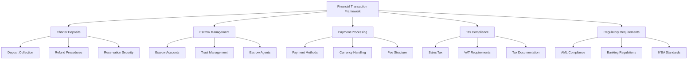
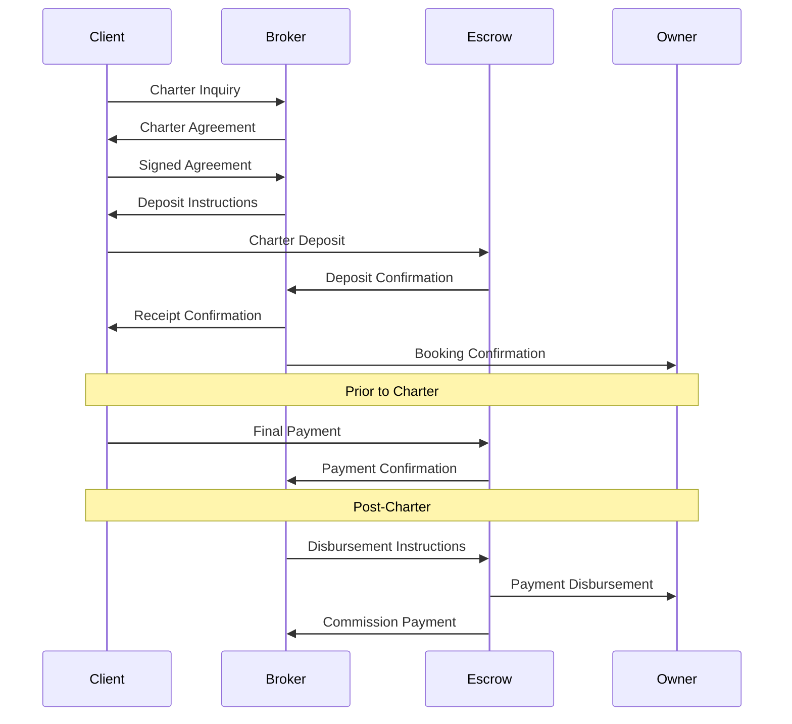

# Financial Transaction Framework

This document outlines the financial transaction procedures, escrow management, and compliance requirements for Azure Yacht Group's charter operations in accordance with IYBA standards.

## Financial Transaction Overview



## 1. IYBA Financial Standards & Requirements

### 1.1 IYBA Escrow Account Standards

The International Yacht Brokers Association (IYBA) provides specific guidelines for escrow management in yacht charter transactions that all member brokers must follow.

#### Key IYBA Requirements:

1. **Separate Escrow Accounts**:
   - Maintain dedicated escrow accounts separate from operating accounts
   - Accounts must be properly designated as escrow/trust accounts
   - Only use escrow accounts for client funds, not business operations
   - Account must be with an FDIC-insured institution

2. **Transaction Documentation**:
   - Maintain complete records of all escrow transactions
   - Ensure clear documentation of deposit terms in charter contracts
   - Keep detailed records of all client communications regarding funds
   - Document all deposit movements with appropriate authorizations

3. **Reconciliation Procedures**:
   - Conduct monthly escrow account reconciliation
   - Maintain separate ledgers for each client transaction
   - Document all interest accrual and distribution
   - Conduct annual third-party verification/audit

4. **Dispute Management**:
   - Follow IYBA-approved procedures for disputed funds
   - Implement clear documentation for dispute resolution
   - Obtain written authorization before fund disbursement in disputed cases
   - Maintain appropriate insurance for escrow management

### 1.2 IYBA Deposit Guidelines

IYBA provides standardized guidance for charter deposit structures and management.

#### Deposit Structure Standards:

1. **Amount Guidelines**:
   - First deposit: 25-50% of charter fee (typically 50%)
   - Second deposit: Remaining balance (typically due 30-60 days before charter)
   - APA (Advanced Provisioning Allowance): 25-35% of charter fee
   - Security deposit: As specified in charter agreement

2. **Timing Requirements**:
   - Initial deposit: Due within 7 business days of contract signing
   - Final payment: Due 30-60 days prior to charter commencement
   - APA payment: Due with final charter fee payment
   - Security deposit: Due before charter commencement or as agreed

3. **Cancellation Terms**:
   - Follow IYBA standard cancellation schedule
   - Document all cancellation policies in the charter agreement
   - Include force majeure provisions as per IYBA standards
   - Process refunds according to IYBA disbursement procedures

#### Documentation Requirements:

| Document | Purpose | Required Elements | Timing |
|----------|---------|-------------------|--------|
| Charter Booking Form | Initiates deposit process | Charter details, deposit terms, cancellation policy | Prior to deposit |
| Deposit Confirmation | Documents receipt of funds | Amount, date, escrow account details | Within 24 hours of receipt |
| Escrow Instruction Letter | Authorizes fund movement | Specific instructions, authorizations, conditions | Before fund transfers |
| Disbursement Authorization | Confirms final payment distribution | Owner/manager details, amount, timing | Prior to release |

## 2. Escrow Account Management

### 2.1 Escrow Account Setup

Proper setup and management of escrow accounts according to IYBA standards and regulatory requirements.

#### Account Structure:

1. **Primary Escrow Account**:
   - Maintained with established banking institution
   - FDIC-insured up to applicable limits
   - Designated as "Azure Yacht Group Client Trust Account" or similar
   - Properly registered with appropriate regulatory authorities

2. **Escrow Agent Options**:
   - Internal escrow management with proper controls
   - Third-party escrow agent (law firm, specialized agent)
   - Banking institution trust services
   - IYBA-recommended escrow service providers

3. **Account Controls**:
   - Dual control requirement for disbursements over specified threshold
   - Segregation of duties between reconciliation and disbursement
   - Regular independent review of account activity
   - Electronic monitoring for unusual activity

#### Approved Escrow Agent Options:

| Escrow Agent Type | Advantages | Considerations | Documentation |
|------------------|------------|----------------|---------------|
| Internal Management | Cost-effective, direct control | Requires strict controls, additional liability | Internal policies, bond |
| Law Firm | Professional oversight, legal protection | Higher fees, additional process layer | Escrow agreement |
| Specialized Yacht Escrow | Industry expertise, established processes | Service fees, relationship management | Service agreement |
| Banking Trust Department | Institutional security, established controls | Less flexibility, potentially slower | Trust agreement |

### 2.2 Deposit Management Procedures

Comprehensive procedures for managing deposits throughout the charter lifecycle.

#### Deposit Workflow:



#### Key Security Controls:

1. **Verification Procedures**:
   - Verify client identity before accepting funds (KYC)
   - Confirm bank account ownership before disbursement
   - Independent verification of disbursement instructions
   - Multi-factor authentication for digital transactions

2. **Reconciliation Process**:
   - Daily transaction review
   - Weekly pending deposit/disbursement reconciliation
   - Monthly complete account reconciliation
   - Quarterly third-party review

3. **Documentation Requirements**:
   - Standardized deposit receipts
   - Written disbursement authorizations
   - Transaction logs with approvals
   - Client confirmation communications

### 2.3 Disbursement Protocols

Secure and compliant procedures for disbursing funds from escrow accounts.

#### Standard Disbursements:

1. **Owner/Charter Company Payments**:
   - Release according to charter agreement terms
   - Typically 50% upon signing (from initial deposit)
   - Remaining 50% upon charter commencement or per agreement
   - Verification of charter commencement before final disbursement

2. **Broker Commission Handling**:
   - Commission disbursement timing as specified in broker agreement
   - Typical timing: upon receipt of full charter payment
   - Split commission handling for co-brokerage arrangements
   - Documentation of all commission calculations

3. **Refund Processing**:
   - Follow IYBA cancellation policy standards
   - Document all refund authorizations
   - Process within specified timeframes (typically 7-10 business days)
   - Maintain records of cancellation circumstances

#### Special Circumstances:

| Scenario | Protocol | Required Documentation | Timeframe |
|----------|----------|------------------------|-----------|
| Disputed Funds | Hold in escrow pending resolution | Written claim, response, resolution | As per contract |
| Charter Modification | Document agreement, adjust disbursements | Amendment to charter agreement | Before scheduled disbursement |
| Owner Default | Return funds to client | Default documentation, client communication | Immediate processing |
| Force Majeure | Follow contract provisions | Force majeure determination, documentation | As per contract |

## 3. Payment Processing Framework

### 3.1 Accepted Payment Methods

Standardized payment methods accepted for charter transactions with appropriate security controls.

#### Approved Payment Methods:

1. **Wire Transfers**:
   - Primary method for large transactions
   - Specific routing instructions provided to clients
   - Verification procedures for incoming transfers
   - Transaction monitoring for regulatory compliance

2. **Credit Card Payments**:
   - Accepted for smaller transactions (typically under $10,000)
   - PCI DSS compliant processing
   - Chargeback risk management procedures
   - Fee responsibilities clearly documented

3. **Alternative Payment Methods**:
   - ACH transfers where appropriate
   - Approved digital payment platforms
   - Escrow service platforms
   - No cryptocurrency payments accepted

#### Payment Security Protocols:

| Payment Method | Security Controls | Verification Process | Documentation |
|----------------|-------------------|----------------------|---------------|
| Wire Transfer | Dedicated account, confirmation procedures | Call-back verification, reference numbers | Transaction receipts, confirmation logs |
| Credit Card | PCI DSS compliance, fraud monitoring | Address verification, security codes | Processing receipts, authorization forms |
| ACH | Bank account verification, transfer limits | Pre-notification, account validation | Transfer authorization, confirmation records |

### 3.2 Currency Management

Procedures for handling multiple currencies in charter transactions.

#### Currency Handling:

1. **Base Currency**:
   - USD as primary transaction currency
   - Euro for Mediterranean operations
   - Clear documentation of currency in all agreements

2. **Exchange Considerations**:
   - Exchange rate determination timing
   - Rate source documentation
   - Exchange risk disclosure
   - Fixed vs. floating rate options

3. **Currency Conversion Fees**:
   - Transparent disclosure of all conversion costs
   - Responsibility for fees clearly documented
   - Minimization of multiple conversions
   - Banking partner relationship management

### 3.3 Fee Structure and Transparency

Clear documentation and disclosure of all fees involved in charter transactions.

#### Fee Documentation:

1. **Charter Fee Components**:
   - Base charter fee
   - VAT/tax requirements
   - Customary crew gratuity guidelines
   - Delivery/redelivery fees if applicable

2. **Broker Compensation**:
   - Commission structure (typically 15-25%)
   - Any additional broker service fees
   - Split commission arrangements
   - Booking fee differentiation from commission

3. **Additional Costs**:
   - Advanced Provisioning Allowance (APA) explanation
   - Canal transit fees
   - Cruising permits and licenses
   - Special equipment or services

## 4. Tax Compliance Framework

### 4.1 Sales Tax Collection

Procedures for complying with sales tax requirements in various jurisdictions.

#### Florida Sales Tax Compliance:

1. **Collection Requirements**:
   - 6% state sales tax plus applicable county surtax
   - Documentation of payment and remittance
   - Quarterly reporting requirements
   - Audit preparation procedures

2. **Exemption Handling**:
   - Criteria for exempt transactions
   - Documentation requirements for exemptions
   - Record retention for exempt transactions
   - Periodic exemption certificate review

### 4.2 International VAT Considerations

Compliance with Value Added Tax requirements in international charter operations.

#### Key VAT Jurisdictions:

| Region | VAT Rate | Documentation Requirements | Collection Process |
|--------|----------|----------------------------|-------------------|
| France | 20% | Commercial registration, charter agreement | Collected with charter fee |
| Italy | 22% | Commercial registration, invoicing requirements | Collected with charter fee |
| Spain | 21% | Charter license, matriculation tax compliance | Collected with charter fee |
| Greece | 12% | Commercial vessel proof, charter license | Collected with charter fee |
| Croatia | 13% | Commercial endorsement, documentation | Collected with charter fee |

#### VAT Compliance Procedures:

1. **Documentation Requirements**:
   - Maintain verification of commercial registration
   - Document charter commencement location
   - Record itinerary for partial exemption situations
   - Maintain evidence of payment and remittance

2. **Collection Process**:
   - Include VAT in initial charter quotation
   - Separate line item in charter agreement
   - Collection with charter fee payments
   - Proper invoicing format per jurisdiction

## 5. IYBA Compliance & Best Practices

### 5.1 IYBA Financial Transaction Standards

Adherence to IYBA's specific guidelines for financial transactions in yacht charter operations.

#### IYBA-Specific Requirements:

1. **Contract Documentation**:
   - Use IYBA-approved charter agreement forms
   - Include IYBA-standard deposit and payment terms
   - Follow IYBA cancellation policy structure
   - Maintain executed agreements as required

2. **Financial Disclosures**:
   - Clear commission disclosure
   - Transparent fee structure
   - Written confirmation of deposit receipt
   - Written disbursement schedules

3. **Dispute Resolution**:
   - Follow IYBA arbitration procedures
   - Document all dispute communications
   - Maintain escrow during dispute resolution
   - Implement IYBA-compliant resolution documentation

### 5.2 Anti-Money Laundering (AML) Compliance

Comprehensive AML procedures aligned with IYBA standards and regulatory requirements.

#### AML Program Components:

1. **Client Due Diligence**:
   - Risk-based customer verification procedures
   - Enhanced due diligence for high-risk transactions
   - Beneficial ownership identification for entity clients
   - Ongoing monitoring of client relationships

2. **Transaction Monitoring**:
   - Screening for unusual transaction patterns
   - Large transaction reporting procedures
   - Cash transaction limitations
   - Source of funds verification

3. **Record Keeping**:
   - Five-year minimum retention policy
   - Secure document storage system
   - Transaction documentation standards
   - Due diligence documentation requirements

#### Red Flag Indicators:

| Red Flag Category | Specific Indicators | Response Protocol | Documentation |
|-------------------|---------------------|-------------------|---------------|
| Client Behavior | Reluctance to provide information, unusual urgency | Enhanced due diligence, management review | Additional verification, approval records |
| Transaction Structure | Complex ownership structures, third-party payments | Beneficial ownership verification, source of funds | Ownership documentation, fund source records |
| Geographic Risk | High-risk jurisdictions, sanctions concerns | Screening against sanction lists, enhanced controls | Screening results, risk assessment |
| Payment Methods | Unusual payment methods, structured transactions | Payment method verification, transaction review | Payment documentation, review records |

### 5.3 Risk Management Framework

Comprehensive approach to managing financial transaction risks in charter operations.

#### Risk Assessment Process:

1. **Transaction Risk Factors**:
   - Transaction size and complexity
   - Client risk profile
   - Jurisdictional considerations
   - Payment method risks

2. **Control Implementation**:
   - Risk-based control application
   - Escalation procedures for high-risk transactions
   - Regular control testing and assessment
   - Documentation of risk decisions

3. **Insurance Coverage**:
   - Escrow account insurance
   - Employee dishonesty coverage
   - Professional liability insurance
   - Cyber liability protection

## 6. Operational Implementation

### 6.1 Staff Roles and Responsibilities

Clear definition of roles and responsibilities in financial transaction management.

#### Key Roles:

1. **Financial Compliance Officer**:
   - Overall responsibility for financial compliance
   - Escrow account oversight
   - AML program management
   - Final approval for high-risk transactions

2. **Charter Broker Responsibilities**:
   - Client relationship management
   - Initial deposit collection coordination
   - Basic KYC verification
   - Documentation of charter terms

3. **Accounting/Finance Staff**:
   - Daily transaction processing
   - Reconciliation procedures
   - Record keeping
   - Reporting requirements

4. **Management Oversight**:
   - Approval for exceptions
   - Resolution of disputes
   - Policy development
   - Compliance program review

### 6.2 Technology Systems

Secure technology infrastructure for managing financial transactions and escrow accounts.

#### System Requirements:

1. **Escrow Management Software**:
   - Client fund tracking
   - Automated reconciliation
   - Secure access controls
   - Audit trail functionality

2. **Payment Processing Systems**:
   - PCI DSS compliant platforms
   - Secure integration with banking systems
   - Multi-factor authentication
   - Encryption for data transmission

3. **Record Management**:
   - Secure document storage
   - Retention policy enforcement
   - Search and retrieval capabilities
   - Access control and monitoring

### 6.3 Audit and Compliance Review

Regular review and assessment of financial transaction processes and controls.

#### Review Schedule:

| Review Type | Frequency | Scope | Documentation |
|-------------|-----------|-------|---------------|
| Internal Reconciliation | Daily/Weekly | Transaction verification, balance confirmation | Reconciliation reports |
| Compliance Self-Assessment | Quarterly | Procedure adherence, documentation review | Assessment results, action items |
| Independent Review | Annual | Control effectiveness, regulatory compliance | Audit report, remediation plan |
| IYBA Compliance Verification | Annual | IYBA standards adherence | Compliance certification |

## Appendix A: Financial Transaction Templates

### A.1 Escrow Instruction Letter

```
AZURE YACHT GROUP
ESCROW INSTRUCTION LETTER

Date: [DATE]
Charter: M/Y [VESSEL NAME] - [CHARTER DATES]
Client: [CLIENT NAME]
Owner: [OWNER NAME/COMPANY]

INSTRUCTIONS TO ESCROW AGENT

Azure Yacht Group hereby instructs [ESCROW AGENT] to handle the escrow funds for the above-referenced charter as follows:

1. DEPOSITS TO BE RECEIVED:
   - Initial Deposit: $[AMOUNT] - Due by [DATE]
   - Final Payment: $[AMOUNT] - Due by [DATE]
   - APA Payment: $[AMOUNT] - Due by [DATE]
   - Security Deposit: $[AMOUNT] - Due by [DATE]

2. DISBURSEMENT INSTRUCTIONS:
   Upon receipt of Initial Deposit:
   - Hold in escrow until confirmation of fully executed charter agreement
   - Upon confirmation, disburse $[AMOUNT] to Owner per charter agreement
   - Retain $[AMOUNT] in escrow pending charter commencement

   Upon receipt of Final Payment:
   - Disburse $[AMOUNT] to Owner per charter agreement
   - Disburse $[AMOUNT] to Azure Yacht Group as commission
   - Retain APA and Security Deposit in escrow pending charter completion

3. CANCELLATION PROVISIONS:
   In the event of cancellation, funds shall be disbursed according to the cancellation terms in the charter agreement, specifically:
   [INSERT CANCELLATION TERMS FROM AGREEMENT]

4. DISPUTE PROVISIONS:
   In the event of a dispute regarding the funds held in escrow, [ESCROW AGENT] shall:
   - Continue to hold all disputed funds until:
     a) Receipt of joint written instructions from all parties, or
     b) Receipt of a binding arbitration decision, or
     c) Receipt of a court order directing disbursement

These instructions are issued in accordance with the Charter Agreement dated [DATE] between the parties referenced above.

Authorized by:

________________________
[NAME]
Azure Yacht Group
```

### A.2 Deposit Receipt Template

```
AZURE YACHT GROUP
CHARTER DEPOSIT RECEIPT

Receipt Number: [REFERENCE NUMBER]
Date: [DATE]

CHARTER DETAILS:
Vessel: M/Y [VESSEL NAME]
Charter Period: [START DATE] to [END DATE]
Charter Fee: $[TOTAL CHARTER FEE]
Client: [CLIENT NAME]

DEPOSIT INFORMATION:
Amount Received: $[AMOUNT]
Payment Method: [WIRE/CREDIT CARD/ACH]
Date Received: [DATE]
Escrow Account: [ACCOUNT DETAILS]

This deposit represents:
□ Initial Deposit ([X]% of charter fee)
□ Final Payment ([X]% of charter fee)
□ Advanced Provisioning Allowance (APA)
□ Security Deposit
□ Other: ___________________________

PAYMENT SCHEDULE:
Initial Deposit (50%): $[AMOUNT] - [RECEIVED/DUE BY DATE]
Final Payment (50%): $[AMOUNT] - Due by [DATE]
APA ([X]%): $[AMOUNT] - Due by [DATE]
Security Deposit: $[AMOUNT] - Due by [DATE]

This deposit is subject to the terms and conditions of the Charter Agreement dated [DATE], including cancellation terms and refund policies.

Receipt Issued By:

________________________
[NAME]
Azure Yacht Group

This receipt should be retained for your records.
```

## Appendix B: IYBA-Compliant Escrow Agents

The following escrow agents have been vetted and comply with IYBA standards for yacht charter transactions:

| Escrow Agent | Services | Contact Information | Features |
|--------------|----------|---------------------|----------|
| Maritime Escrow International | Charter and sale escrow, international transactions | contact@maritimeescrow.com, (555) 123-4567 | 24-hour online access, dedicated account managers |
| Yacht Escrow Services | Charter deposits, multi-currency support | info@yachtescrow.com, (555) 987-6543 | Fast disbursement, competitive rates |
| Nautical Trust Services | Full-service escrow, legal support | service@nauticaltrust.com, (555) 456-7890 | Legal oversight, dispute resolution services |
| International Maritime Trust | Global escrow services, banking solutions | escrow@intmaritime.com, (555) 789-0123 | Multiple currency accounts, institutional security |

---

**Last Updated**: April 30, 2024  
**Next Review**: May 31, 2024 