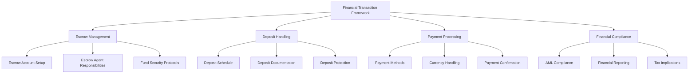
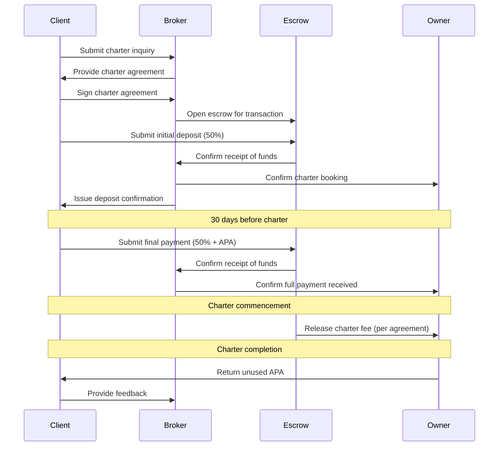

# Financial Transaction Framework for Yacht Charters

## Overview

The financial transaction framework governs all monetary aspects of the yacht charter process, ensuring security, compliance, and transparency for all parties involved. This framework adheres to International Yacht Brokers Association (IYBA) standards and best practices.



## Escrow Management

### Escrow Account Setup

All charter transactions must utilize properly established escrow accounts that comply with IYBA standards:

1. **Dedicated Accounts**: Each escrow account must be separate from operational accounts
2. **Banking Requirements**: Escrow accounts must be maintained at FDIC-insured financial institutions
3. **Documentation**: Proper documentation of account setup and authorized signatories
4. **Client Disclosure**: Clear disclosure to clients regarding escrow account details

### Escrow Agent Responsibilities

The escrow agent (typically the charter broker) must:

1. Hold client funds in trust until disbursement conditions are met
2. Maintain accurate records of all transactions
3. Provide regular statements to all parties
4. Release funds only according to the terms of the charter agreement
5. Return funds promptly in case of cancellation (subject to cancellation terms)

### Fund Security Protocols

To ensure maximum security of client funds:

1. **Verification Procedures**: Implement multi-step verification for all fund transfers
2. **Signatory Controls**: Require multiple signatories for disbursements above $50,000
3. **Insurance**: Maintain proper insurance coverage for escrow activities
4. **Regular Audits**: Conduct quarterly internal audits and annual external audits

## Deposit Handling

### Deposit Schedule

The standard deposit schedule for yacht charters under IYBA guidelines:

| Payment | Timing | Percentage |
|---------|--------|------------|
| Initial Deposit | Upon signing charter agreement | 50% of total charter fee |
| Final Payment | 30 days before charter commencement | Remaining 50% plus APA* |

*APA: Advanced Provisioning Allowance

### Deposit Documentation

For each deposit received:

1. **Receipt Issuance**: Provide formal receipt within 24 hours
2. **Deposit Confirmation**: Send written confirmation to all parties
3. **Terms Documentation**: Include clear reference to applicable cancellation terms
4. **Banking Details**: Maintain secure records of all transaction details

### Deposit Protection

Protocols for deposit protection:

1. **Segregation of Funds**: Client deposits must never be commingled with operational funds
2. **Interest Management**: Any interest accrued must be handled according to the charter agreement
3. **Cancellation Protocols**: Clear procedures for deposit refunds in case of cancellation
4. **Dispute Resolution**: Established process for resolving financial disputes

## Payment Processing

### Payment Methods

Accepted payment methods:

1. **Wire Transfers**: Primary method for all international transactions
2. **Credit Cards**: Accepted with appropriate fee disclosure (typically 2.5-3.5%)
3. **ACH Transfers**: For domestic transactions where available
4. **Digital Payments**: Selected secure platforms as approved by compliance

### Currency Handling

Guidelines for handling multiple currencies:

1. **Default Currency**: USD is the standard currency for international charters
2. **Exchange Rates**: Use mid-market rates plus 1% for currency conversions
3. **Rate Fluctuations**: Protocols for handling significant rate changes between agreement and payment
4. **Documentation**: Clear documentation of the currency of record in all agreements

### Payment Confirmation

Process for confirming payments:

1. **Verification Timeline**: All payments verified within 24 hours of receipt
2. **Multi-point Confirmation**: Both banking and internal verification
3. **Client Notification**: Standard notification templates for payment confirmation
4. **Record Keeping**: Comprehensive transaction logs maintained for 7 years

## Financial Compliance

### AML Compliance

Anti-Money Laundering procedures:

1. **Client Verification**: KYC (Know Your Client) procedures for all new clients
2. **Source of Funds**: Documentation requirements for charter payments
3. **Reporting Thresholds**: Compliance with reporting requirements for large transactions
4. **Red Flag Protocols**: Procedures for identifying and responding to suspicious transactions

### Financial Reporting

Reporting standards:

1. **Transaction Reports**: Monthly summaries of all escrow transactions
2. **Client Statements**: Regular statements for clients with active charters
3. **Audit Support**: Documentation maintained to support both internal and external audits
4. **Regulatory Reporting**: Compliance with all applicable financial reporting regulations

### Tax Implications

Guidelines for tax considerations:

1. **VAT Collection**: Procedures for collecting and remitting VAT where applicable
2. **Documentation**: Required tax documentation for various jurisdictions
3. **Withholding Requirements**: Protocols for any required tax withholding
4. **Annual Reporting**: Year-end tax reporting for clients and owners

## Sample Escrow Clause

The following sample clause should be included in all charter agreements:

```
All funds received by the Broker in connection with this Charter Agreement shall be held in an escrow account established and maintained in accordance with IYBA standards at [Banking Institution]. These funds shall be held in trust and only disbursed in accordance with the terms of this Charter Agreement. The Broker, acting as escrow agent, shall not be liable for any loss of funds while in escrow due to bank failure or similar event outside the Broker's control, provided the Broker has acted in accordance with this Agreement and applicable fiduciary standards.
```

## IYBA Escrow Standards Reference

This framework follows the escrow standards published by the International Yacht Brokers Association (IYBA), specifically:

1. IYBA Escrow Account Guidelines (2023 Edition)
2. IYBA Model Yacht Charter Agreement Sections 2-4
3. IYBA Best Practices for Financial Transactions in Yacht Brokerage

## Escrow Agent Selection Criteria

When selecting an escrow agent, the following criteria must be considered:

1. IYBA or equivalent professional association membership
2. Minimum of $1M in professional liability insurance
3. Established history of yacht transaction escrow management
4. Compliance with all relevant banking regulations
5. Clear and transparent fee structure

## Financial Transaction Flow



---

*Last updated: April 30, 2024*  
*Next review: May 31, 2024*