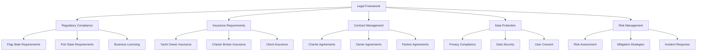

# Legal Framework for Yacht Charter Operations

This section provides a comprehensive overview of the legal, insurance, and compliance requirements essential for the successful operation of Azure Yacht Group's charter business.

## Framework Components

## Purpose of This Section

This documentation provides Azure Yacht Group with essential guidance on navigating the complex legal landscape of the yacht charter industry across multiple jurisdictions. The legal framework is designed to:

1. **Ensure Compliance**: Maintain compliance with all relevant international and local regulations
2. **Mitigate Risk**: Implement comprehensive risk management strategies
3. **Protect Clients**: Ensure proper insurance coverage and contractual protections
4. **Safeguard the Business**: Establish robust legal foundations for business operations
5. **Enable Growth**: Create scalable legal frameworks that support business expansion

## How to Use This Documentation

Each subsection covers a specific aspect of the legal framework:

- **Regulatory Compliance**: Comprehensive guide to regulatory requirements across jurisdictions
- **Insurance Requirements**: Detailed insurance coverage requirements and verification processes
- **Contract Management**: Templates, requirements, and best practices for all contractual relationships
- **Data Protection**: Guidelines for maintaining compliance with privacy regulations
- **Risk Management**: Frameworks for identifying, assessing, and mitigating operational risks

## Implementation Approach

For effective implementation of the legal framework:

1. **Review Thoroughly**: Understand all requirements relevant to your operational areas
2. **Consult Professionals**: Engage maritime attorneys to review and customize requirements
3. **Develop Checklists**: Create jurisdiction-specific compliance checklists
4. **Train Staff**: Ensure all team members understand their compliance responsibilities
5. **Regular Updates**: Schedule periodic reviews of the legal framework to incorporate regulatory changes

## Disclaimer

*This legal framework is intended as a guide only. All legal documentation, insurance policies, and compliance programs should be reviewed by qualified legal professionals with maritime expertise before implementation.*

---

**Last Updated**: April 30, 2024  
**Next Review**: May 31, 2024 