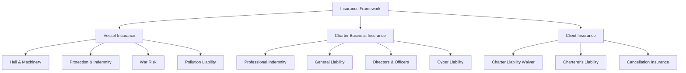

# Insurance Requirements for Yacht Charter Operations

This document outlines the insurance requirements and best practices for Azure Yacht Group's charter operations.

## Insurance Framework Overview



## 1. Vessel Insurance Requirements

### 1.1 Hull and Machinery Insurance

Hull and Machinery (H&M) insurance provides coverage for physical damage to the yacht.

#### Minimum Requirements:

1. **Coverage Amount**: Full market value of the vessel
2. **Deductible Maximum**: 1% of insured value
3. **Navigation Limits**: Must cover all charter cruising areas
4. **Named Windstorm Coverage**: Required for vessels operating in hurricane-prone regions
5. **Machinery Breakdown**: Must include coverage for main engines and essential systems
6. **Tender and Toys**: Must include coverage for all water toys and tenders
7. **Agreed Value Policy**: Required to avoid depreciation disputes

#### Documentation Required:

- Certificate of Insurance
- Policy schedule showing coverage limits
- Named assured endorsement
- Charter use approval

### 1.2 Protection and Indemnity Insurance (P&I)

P&I insurance covers third-party liability, including injury to persons and damage to property.

#### Minimum Requirements:

1. **Coverage Limit**: Minimum $5,000,000 for vessels under 80ft, $10,000,000 for vessels over 80ft
2. **Crew Coverage**: Must include coverage for all crew members
3. **Passenger Coverage**: Must cover the maximum number of allowed charter guests
4. **Charter Use**: Must explicitly permit commercial charter operations
5. **Legal Defense Costs**: Must include coverage for legal costs
6. **Wreck Removal**: Coverage for wreck removal obligations

#### Recommended P&I Clubs/Insurers:

- Skuld
- Gard
- The Shipowners' Club
- Yacht Mariners Insurance
- Pantaenius Yacht Insurance

### 1.3 War Risk Insurance

Coverage for damage caused by war, terrorism, strikes, political violence, and similar risks.

#### Minimum Requirements:

1. **Coverage Limit**: Equal to hull value plus P&I limit
2. **Territorial Scope**: All charter cruising areas
3. **Cancellation Clause**: Minimum 7-day notice period

### 1.4 Pollution Liability Insurance

Coverage for environmental damage caused by fuel, oil, or other pollutant discharge.

#### Minimum Requirements:

1. **Coverage Limit**: Minimum $1,000,000
2. **Scope**: Must cover clean-up costs, third-party claims, and fines
3. **Compliance**: Must meet or exceed local regulatory requirements in all cruising areas

## 2. Charter Business Insurance Requirements

### 2.1 Professional Indemnity (Errors & Omissions) Insurance

Coverage for claims arising from professional advice or services provided.

#### Minimum Requirements:

1. **Coverage Limit**: Minimum $2,000,000
2. **Scope**: Must cover all brokerage and charter management activities
3. **Claims-Made Basis**: Extended reporting period preferred
4. **Legal Defense Costs**: Must be included within coverage

### 2.2 General Liability Insurance

Coverage for third-party bodily injury and property damage claims.

#### Minimum Requirements:

1. **Coverage Limit**: Minimum $2,000,000 per occurrence
2. **Aggregate Limit**: Minimum $5,000,000
3. **Premises Coverage**: Must include office locations
4. **Products/Completed Operations**: Must be included
5. **Personal Injury**: Must include libel, slander, defamation

### 2.3 Directors and Officers Liability Insurance

Coverage for claims against company executives for wrongful acts in their capacity as directors and officers.

#### Minimum Requirements:

1. **Coverage Limit**: Minimum $1,000,000
2. **Entity Coverage**: Must include the company entity
3. **Outside Directorship Liability**: Recommended
4. **Employment Practices Liability**: Must be included

### 2.4 Cyber Liability Insurance

Coverage for data breaches, network security failures, and other cyber incidents.

#### Minimum Requirements:

1. **Coverage Limit**: Minimum $1,000,000
2. **First-Party Coverage**: Business interruption, data recovery, crisis management
3. **Third-Party Coverage**: Privacy liability, network security liability
4. **Regulatory Defense**: Coverage for regulatory investigations and fines
5. **Social Engineering Fraud**: Coverage for phishing and similar attacks

## 3. Client Insurance Requirements

### 3.1 Charterer's Liability Insurance

Optional but recommended coverage for charterers to protect against potential liabilities.

#### Recommended Coverage:

1. **Third-Party Liability**: Minimum $1,000,000
2. **Personal Effects**: Coverage for guests' personal belongings
3. **Medical Payments**: Emergency medical coverage for all guests
4. **Trip Cancellation**: Reimbursement for charter cancellation due to covered reasons

### 3.2 Charter Cancellation Insurance

Insurance to protect clients against financial loss from necessary charter cancellation.

#### Key Features to Recommend:

1. **Covered Reasons**: Illness, injury, death, travel delays, weather events
2. **Reimbursement Level**: Up to 100% of charter fee
3. **Trip Interruption**: Coverage for partial charter cancellation
4. **Medical Evacuation**: Coverage for emergency medical transportation

### 3.3 Charterer Liability Waiver

Document required from charterers acknowledging risks and waiving certain liability claims.

#### Essential Components:

1. **Activity Risks**: Acknowledgment of inherent risks in water sports and other activities
2. **Personal Responsibility**: Acceptance of responsibility for personal behavior
3. **Property Damage**: Responsibility for damage caused by charterer or guests
4. **Assumption of Risk**: Explicit statement of risk assumption
5. **Medical Authorization**: Permission for emergency medical treatment

## 4. Insurance Verification Procedures

### 4.1 Vessel Insurance Verification

Process for verifying adequate vessel insurance coverage.

#### Verification Checklist:

1. **Current Certificates**: Verify all certificates are current and valid
2. **Coverage Limits**: Confirm minimum coverage requirements are met
3. **Charter Use**: Verify explicit permission for charter operations
4. **Geographic Coverage**: Confirm all cruising areas are covered
5. **Named Insured**: Verify ownership entity matches documentation
6. **Additional Insureds**: Confirm broker is named as additional insured where appropriate

### 4.2 Owner Insurance Attestation

Document for yacht owners to attest to insurance compliance.

#### Key Attestation Points:

1. **Coverage Maintenance**: Commitment to maintain required coverage
2. **Notification of Changes**: Agreement to notify of any material policy changes
3. **Claims Reporting**: Process for reporting incidents and claims
4. **Renewal Documentation**: Commitment to provide updated certificates upon renewal

### 4.3 Broker Insurance Documentation

Internal procedures for maintaining and documenting broker insurance coverage.

#### Documentation Requirements:

1. **Certificate Repository**: Central storage of all insurance certificates
2. **Renewal Calendar**: Tracking system for policy renewal dates
3. **Coverage Review**: Annual review of coverage adequacy
4. **Claims Register**: Documentation of all insurance claims

## 5. Insurance Claims Management

### 5.1 Vessel Incident Response Protocol

Procedure for responding to incidents that may result in insurance claims.

#### Protocol Steps:

1. **Immediate Response**: Safety measures and authorities notification
2. **Documentation**: Incident reports, photographs, witness statements
3. **Insurer Notification**: Process and timing for notifying insurers
4. **Claims Coordination**: Coordination between multiple insurers if applicable
5. **Client Communication**: Guidelines for communicating with charter clients

### 5.2 Business Claims Management

Procedure for managing claims against the brokerage business.

#### Management Process:

1. **Claim Receipt and Documentation**: Procedure for receiving and documenting claims
2. **Insurer Notification**: Timeline and process for insurer notification
3. **Legal Counsel Engagement**: Guidelines for engaging legal counsel
4. **Settlement Authority**: Decision-making process for claim settlements
5. **Lessons Learned**: Post-claim analysis and process improvement

## 6. Insurance Market Relationships

### 6.1 Recommended Insurance Brokers

Specialized marine insurance brokers with yacht charter expertise.

#### Preferred Brokers:

1. **International Markets**:
   - Pantaenius Yacht Insurance
   - Willis Towers Watson
   - Marsh
   - Aon

2. **Regional Specialists**:
   - Mediterranean: Pantaenius, Nautic Insurance
   - Caribbean: Caribbean Marine Insurance Center
   - Asia-Pacific: Howden Insurance Brokers

### 6.2 Market Relationship Management

Strategy for maintaining productive relationships with insurers.

#### Key Practices:

1. **Annual Reviews**: Schedule annual meetings with key insurers
2. **Market Updates**: Regular updates on business development and risk management
3. **Claims Performance**: Tracking and communicating loss ratios
4. **Risk Improvements**: Documenting and sharing risk management enhancements

## 7. Risk Management Best Practices

### 7.1 Vessel Risk Assessment

Framework for assessing insurance risks associated with charter vessels.

#### Assessment Criteria:

1. **Vessel Age and Condition**: Impact on insurability and premiums
2. **Captain Experience**: Minimum requirements and documentation
3. **Maintenance Records**: Required documentation and standards
4. **Safety Equipment**: Requirements beyond regulatory minimums
5. **Classification Status**: Preference for classed vessels

### 7.2 Charter Risk Management Guidelines

Risk mitigation strategies for charter operations.

#### Key Guidelines:

1. **Pre-Charter Inspection**: Standardized vessel inspection protocol
2. **Guest Briefings**: Required safety and operation briefings
3. **Weather Monitoring**: Procedures for weather risk assessment
4. **Incident Reporting**: Requirements for prompt reporting of all incidents
5. **Emergency Response**: Documented emergency response procedures

### 7.3 Business Risk Control Measures

Risk management practices for brokerage operations.

#### Control Measures:

1. **Contract Review Process**: Legal review requirements for charter agreements
2. **Document Retention**: Policies for secure maintenance of records
3. **Data Security**: Protocols for protecting client and vessel data
4. **Staff Training**: Required training on risk management practices
5. **Compliance Monitoring**: Process for tracking regulatory compliance

## 8. Insurance Budget Planning

### 8.1 Insurance Cost Benchmarks

Typical insurance costs as percentage of vessel value and charter revenue.

#### Benchmark Ranges:

1. **Hull and Machinery**: 0.8-1.5% of vessel value annually
2. **P&I Coverage**: 0.2-0.5% of vessel value annually
3. **Business Liability**: 0.5-1% of annual revenue
4. **Professional Indemnity**: 0.5-2% of annual revenue

### 8.2 Insurance Budget Allocation

Guidelines for allocating insurance costs.

#### Allocation Framework:

1. **Operating Expenses**: Insurance premiums as percentage of operating budget
2. **Cost Recovery**: Methods for recovering insurance costs in charter pricing
3. **Deductible Reserves**: Recommended reserves for covering deductibles
4. **Premium Financing**: Guidelines for premium financing when appropriate

## Appendix A: Insurance Certificates and Endorsements

### Required Certificate Formats

| Document Type | Required Elements | Verification Frequency |
|---------------|------------------|------------------------|
| Certificate of Insurance (H&M) | Vessel details, coverage limits, named insureds, policy period | Annual and upon renewal |
| P&I Certificate | Member details, coverage limits, approval for charter use | Annual and upon renewal |
| Additional Insured Endorsement | Named additional insureds, scope of coverage | With each charter contract |
| Charter Use Endorsement | Explicit permission for commercial charter operations | Annual |
| Territorial Navigation Warranty | Approved cruising areas | With each itinerary change |

### Sample Certificate Request Language

```
Please provide a Certificate of Insurance evidencing Hull & Machinery and Protection & Indemnity coverage for the vessel [VESSEL NAME], [OFFICIAL NUMBER], with the following requirements:

1. Hull & Machinery coverage for full market value of $[AMOUNT]
2. P&I coverage with minimum limit of $[AMOUNT]
3. Named Additional Insured: Azure Yacht Group, [ADDRESS]
4. Territorial limits including: [CRUISING AREA]
5. Express permission for charter use
6. Certificate Holder: Azure Yacht Group, [ADDRESS]
7. Notice of cancellation: Minimum 30 days written notice to Certificate Holder

The certificate must be provided at least 14 days prior to charter commencement.
```

## Appendix B: Insurance Requirements by Region

### Mediterranean Requirements

| Country | Specific Requirements | Minimum P&I | Local Regulations |
|---------|------------------------|-------------|-------------------|
| Spain | Spanish translation of certificates | €5,000,000 | Royal Decree 607/1999 |
| France | French translation available | €5,000,000 | Maritime Code Art. L5122-1 |
| Italy | Italian "attestato" format | €5,000,000 | Navigation Code Art. 123 |
| Greece | Greek translation for commercial yachts | €5,000,000 | Law 4256/2014 |
| Croatia | Croatian translation available | €5,000,000 | Maritime Code Art. 743 |

### Caribbean Requirements

| Country | Specific Requirements | Minimum P&I | Local Regulations |
|---------|------------------------|-------------|-------------------|
| BVI | Commercial Charter License insurance requirements | $5,000,000 | BVI Shipping Registry requirements |
| St. Maarten | Both Dutch and French requirements for dual-flag | $5,000,000 | St. Maarten Civil Code |
| Bahamas | Approved by Bahamas Maritime Authority | $5,000,000 | Bahamas Commercial Yacht Code |
| Antigua | Approved for Antigua Charter License | $5,000,000 | Antigua maritime regulations |

### Asia-Pacific Requirements

| Country | Specific Requirements | Minimum P&I | Local Regulations |
|---------|------------------------|-------------|-------------------|
| Thailand | Thai translation available | $5,000,000 | Thailand Maritime Department |
| Indonesia | Special endorsement for Indonesian waters | $5,000,000 | Indonesian Maritime Law |
| Australia | AMSA-compliant certificates | $10,000,000 | Marine Safety (Domestic Commercial Vessel) National Law Act |
| New Zealand | Maritime NZ compliance | $10,000,000 | Maritime Transport Act |

---

**Last Updated**: April 30, 2024  
**Next Review**: May 31, 2024