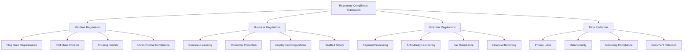
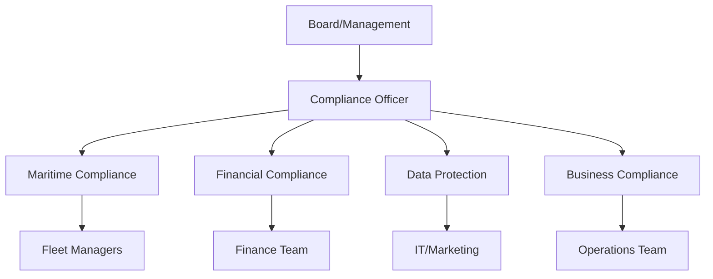
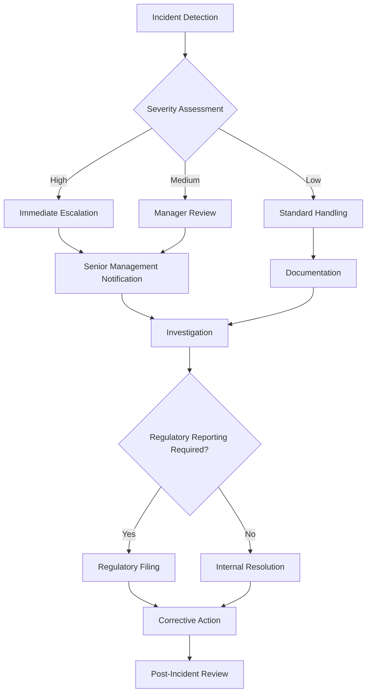

# Regulatory Compliance for Yacht Charter Operations

This document outlines the regulatory compliance requirements that Azure Yacht Group must adhere to when operating a yacht charter brokerage business.

## Regulatory Framework Overview



## 1. Maritime Regulatory Compliance

### 1.1 Flag State Requirements

Flag state compliance refers to the regulations imposed by the country where a yacht is registered.

#### Key Compliance Areas:

1. **Vessel Registration**: 
   - Ensure valid registration documentation for all listed vessels
   - Verify renewal requirements and expiration dates
   - Maintain records of registration certificates

2. **Commercial Endorsements**:
   - Verify that vessels have commercial charter endorsements
   - Ensure compliance with passenger capacity limitations
   - Confirm appropriate commercial certification for vessel size and type

3. **Safety Certification**:
   - Verify compliance with ISM Code requirements (for vessels over 500GT)
   - Ensure Small Commercial Vessel (SCV) Code compliance where applicable
   - Maintain records of safety equipment certificates

4. **Crew Certification**:
   - Verify appropriate crew qualifications for vessel size and type
   - Ensure valid STCW certification for all crew members
   - Confirm flag state endorsements for all licenses

#### Documentation Requirements:

| Document Type | Renewal Frequency | Verification Requirement |
|---------------|-------------------|--------------------------|
| Registration Certificate | 1-5 years (varies by flag) | Prior to listing |
| Commercial Endorsement | Annual | Prior to listing |
| Safety Construction Certificate | 5 years + annual inspection | Prior to charter |
| Safety Equipment Certificate | Annual | Prior to charter |
| Minimum Safe Manning Document | With registration changes | Prior to listing |
| Radio License | 5 years | Prior to listing |

### 1.2 Port State Controls

Port state control refers to the inspection of foreign ships in national ports to verify compliance with international regulations.

#### Key Compliance Areas:

1. **Pre-Arrival Requirements**:
   - Ensure vessels comply with notice of arrival requirements
   - Verify customs and immigration procedures are followed
   - Confirm compliance with local reporting requirements

2. **Inspections**:
   - Understand port state inspection protocols in charter destinations
   - Maintain records of previous inspections and any deficiencies
   - Ensure correction of any previously noted deficiencies

3. **Local Navigation Restrictions**:
   - Document local navigation restrictions in charter destinations
   - Ensure charter itineraries comply with local regulations
   - Verify awareness of restricted areas and seasonal limitations

#### Priority Port State Requirements by Region:

| Region | Key Authorities | Pre-Arrival Notice | Special Requirements |
|--------|----------------|--------------------|-----------------------|
| Mediterranean | Paris MOU | 24-48 hours | EU Advance Passenger Data |
| Caribbean | Caribbean MOU | 24-72 hours | eSeaClear in some islands |
| United States | USCG | 96 hours (APIS) | ESTA/Visa requirements for passengers |
| Asia-Pacific | Tokyo MOU | 48-72 hours | Varies significantly by country |

### 1.3 Cruising Permits and Local Authorizations

Many jurisdictions require specific permits for charter operations within their waters.

#### Key Compliance Areas:

1. **Charter Permits**:
   - Identify permit requirements for each charter destination
   - Ensure timely application for necessary permits
   - Maintain records of permits and authorizations

2. **Customs Procedures**:
   - Document customs entry/exit requirements for all destinations
   - Ensure compliance with temporary importation regulations
   - Verify VAT/tax status for charters in relevant jurisdictions

3. **Cabotage Restrictions**:
   - Identify cabotage limitations in charter destinations
   - Ensure charter contracts comply with local cabotage laws
   - Develop compliant charter structures for restricted markets

#### Regional Permit Requirements:

| Region | Permit Type | Validity | Application Timeframe |
|--------|------------|----------|------------------------|
| Greece | Greek Charter License | Per charter | 45 days before charter |
| Croatia | Charter License | Annual | 30 days before season |
| Bahamas | Charter Permit | Per charter | 14 days before charter |
| Thailand | Charter License | Per charter | 30 days before charter |
| Spain | Charter Authorization | Annual | 30 days before season |
| Italy | Commercial Endorsement | Annual | 45 days before season |

### 1.4 Environmental Compliance

Environmental regulations for yacht operations are increasingly stringent globally.

#### Key Compliance Areas:

1. **Discharge Regulations**:
   - Document MARPOL compliance requirements by region
   - Verify vessels have appropriate discharge equipment
   - Ensure proper recording of waste management activities

2. **Emissions Control**:
   - Monitor compliance with emissions regulations
   - Identify Emission Control Areas (ECAs) in charter regions
   - Verify fuel sulfur content compliance

3. **Protected Areas**:
   - Document marine protected areas in charter destinations
   - Ensure charter itineraries respect environmental restrictions
   - Verify anchoring restrictions are observed

#### Environmental Compliance Matrix:

| Requirement | Mediterranean | Caribbean | US Waters | Asia-Pacific |
|-------------|---------------|-----------|-----------|--------------|
| Sewage Discharge | No discharge within 3nm | Varies by island | No discharge within 3nm | Varies by country |
| Garbage Disposal | No discharge | No discharge | No discharge | No discharge |
| Fuel Sulfur Limit | 0.1% in EU ports | 0.5% (global) | 0.1% in ECA | 0.5% (global) |
| Ballast Water | BWM Convention | BWM Convention | USCG regulations | BWM Convention |
| Special Areas | Various MPAs | Various MPAs | National Marine Sanctuaries | Various MPAs |

## 2. Business Regulatory Compliance

### 2.1 Business Licensing and Registration

Ensure proper business registration and licensing in jurisdictions of operation.

#### Key Compliance Areas:

1. **Corporate Structure**:
   - Maintain appropriate business entity registration
   - Ensure compliance with annual filing requirements
   - Verify directors' and officers' responsibilities

2. **Broker Licensing**:
   - Identify jurisdictions requiring broker licensing
   - Ensure all brokers maintain required licenses
   - Document continuing education requirements

3. **Local Business Permits**:
   - Obtain necessary local business permits
   - Comply with local zoning and operational regulations
   - Maintain tax registrations in relevant jurisdictions

#### License Requirements by Jurisdiction:

| Jurisdiction | License Type | Renewal | Special Requirements |
|--------------|--------------|---------|----------------------|
| Florida, USA | Yacht Broker License | Biennial | Fingerprinting, background check |
| California, USA | Yacht Broker License | Annual | Bond requirement |
| Monaco | Commercial License | Annual | Local presence requirement |
| Spain | Travel Agency License | Annual | Financial guarantee |
| UK | ABTA Membership | Annual | Client money protection |
| Australia | Travel Agent License | Annual | Varies by state |

### 2.2 Consumer Protection Compliance

Adhere to consumer protection laws in all client interactions.

#### Key Compliance Areas:

1. **Charter Contracts**:
   - Ensure contracts comply with consumer protection laws
   - Verify clear disclosure of terms and conditions
   - Include mandatory consumer rights notifications

2. **Marketing Practices**:
   - Ensure marketing materials are not misleading
   - Verify pricing transparency
   - Comply with advertising regulations in target markets

3. **Complaint Handling**:
   - Establish compliant dispute resolution procedures
   - Document complaint handling processes
   - Maintain records of all client disputes

#### Key Consumer Protection Regulations:

| Jurisdiction | Key Regulations | Impact on Charter Business |
|--------------|----------------|----------------------------|
| European Union | EU Package Travel Directive | Requires detailed pre-contractual information |
| United States | FTC Act, State Consumer Protection Laws | Prohibits unfair or deceptive practices |
| United Kingdom | Consumer Rights Act | Requires services to be as described |
| Australia | Australian Consumer Law | Mandatory consumer guarantees |
| Canada | Consumer Protection Act | Cooling-off periods for some bookings |

### 2.3 Employment and Contractor Regulations

Ensure compliance with employment laws in jurisdictions of operation.

#### Key Compliance Areas:

1. **Employment Classification**:
   - Correctly classify employees vs. independent contractors
   - Comply with relevant labor laws for employees
   - Verify appropriate agreements are in place

2. **Payroll Compliance**:
   - Ensure proper tax withholding and reporting
   - Comply with minimum wage and overtime regulations
   - Maintain accurate time and attendance records

3. **Workplace Policies**:
   - Develop compliant workplace policies
   - Ensure anti-discrimination and harassment prevention
   - Implement required safety training

#### Employment Compliance Checklist:

| Requirement | US Operations | EU Operations | UK Operations |
|-------------|---------------|---------------|---------------|
| Employee Classification | W-2 vs 1099 distinction | Employment contract requirements | Worker status tests |
| Minimum Wage | Federal and state compliance | National minimums | National Living Wage |
| Paid Time Off | State-specific requirements | Minimum 4 weeks | 5.6 weeks minimum |
| Work Hours | FLSA overtime rules | Working Time Directive | Working Time Regulations |
| Benefits | ACA compliance for 50+ employees | Mandatory benefits vary by country | Pension auto-enrollment |

### 2.4 Health and Safety Compliance

Maintain safe working environments for staff and safe experiences for clients.

#### Key Compliance Areas:

1. **Office Safety**:
   - Comply with workplace safety regulations
   - Conduct required safety assessments
   - Provide safety training for employees

2. **Charter Safety**:
   - Verify vessel safety compliance
   - Ensure proper briefing procedures for clients
   - Document safety incidents and near-misses

3. **Crisis Management**:
   - Develop emergency response procedures
   - Establish communication protocols for emergencies
   - Conduct regular crisis management training

#### Health and Safety Documentation Requirements:

| Document Type | Office Operations | Yacht Operations | Client Interactions |
|---------------|-------------------|------------------|---------------------|
| Risk Assessments | Workplace hazards | Charter activity risks | Client medical conditions |
| Safety Policies | Office safety manual | Pre-charter briefing procedures | Waiver protocols |
| Incident Reporting | Workplace incident log | Charter incident reports | Client complaint protocol |
| Emergency Procedures | Office evacuation plans | Crisis response procedures | Emergency contact system |

## 3. Financial Regulatory Compliance

### 3.1 Payment Processing and Financial Services

Ensure compliance with financial services regulations when handling client funds.

#### Key Compliance Areas:

1. **Payment Processing**:
   - Comply with PCI DSS requirements for credit card processing
   - Verify secure handling of financial information
   - Maintain appropriate financial controls

2. **Client Funds Handling**:
   - Establish client trust accounts where required
   - Ensure proper segregation of client funds
   - Maintain accurate financial records

3. **Currency Regulations**:
   - Comply with currency control regulations
   - Document international payment procedures
   - Verify compliance with cross-border payment regulations

#### Payment Compliance Requirements:

| Requirement | Description | Verification Method |
|-------------|-------------|---------------------|
| PCI DSS | Credit card data security standards | Annual assessment or self-attestation |
| Client Trust Accounts | Segregated accounts for client deposits | Financial auditing |
| Payment Processor Compliance | Proper setup of merchant accounts | Processor agreements review |
| Financial Records | Transaction documentation | Regular financial audits |
| Currency Declaration | Reporting large currency transactions | Transaction monitoring |

### 3.2 Anti-Money Laundering (AML) Compliance

Implement procedures to prevent money laundering and terrorist financing.

#### Key Compliance Areas:

1. **Client Due Diligence**:
   - Implement Know Your Customer (KYC) procedures
   - Verify client identity for significant transactions
   - Screen against sanctions and PEP lists

2. **Suspicious Activity Monitoring**:
   - Identify suspicious transaction patterns
   - Establish reporting procedures for suspicious activity
   - Train staff on red flag indicators

3. **Record Keeping**:
   - Maintain required AML documentation
   - Ensure appropriate retention periods
   - Secure storage of sensitive information

#### AML Program Components:

| Component | Requirements | Implementation |
|-----------|--------------|----------------|
| Written Policy | Comprehensive AML procedures | Company compliance manual |
| Risk Assessment | Evaluation of business risk factors | Annual risk assessment |
| Customer Due Diligence | Client identification procedures | KYC forms and verification |
| Transaction Monitoring | Process to identify suspicious activities | Transaction review procedures |
| Reporting | SAR/STR filing procedures | Compliance officer designation |
| Training | Staff awareness and procedure training | Annual compliance training |
| Independent Testing | Review of AML program effectiveness | Periodic compliance audits |

### 3.3 Tax Compliance

Ensure compliance with tax regulations in all jurisdictions of operation.

#### Key Compliance Areas:

1. **Corporate Taxation**:
   - Comply with corporate income tax requirements
   - Ensure proper reporting of international operations
   - Maintain accurate financial records for tax purposes

2. **Sales and VAT Taxes**:
   - Implement proper VAT/sales tax collection and remittance
   - Understand place of supply rules for charter services
   - Document tax status of charters in various jurisdictions

3. **Withholding Requirements**:
   - Identify and comply with withholding obligations
   - Document tax residency status of vessels and owners
   - Maintain required tax certifications

#### Charter Tax Considerations by Region:

| Region | VAT/Sales Tax | Withholding Requirements | Documentation Needed |
|--------|---------------|--------------------------|----------------------|
| European Union | VAT on charter fees (rates vary by country) | Possible withholding on owner payments | Commercial registration, VAT registration |
| Caribbean | Varies by island (0-15%) | Usually minimal | Local charter licenses |
| United States | State sales tax where charter begins | 30% FDAP withholding for foreign owners | EIN, state tax registrations |
| Mediterranean (non-EU) | Various consumption taxes | Possible withholding requirements | Country-specific registrations |

### 3.4 Financial Reporting

Maintain accurate financial records and reporting as required by regulations.

#### Key Compliance Areas:

1. **Accounting Standards**:
   - Adhere to appropriate accounting standards (GAAP, IFRS)
   - Ensure proper revenue recognition
   - Maintain accurate financial statements

2. **Regulatory Reporting**:
   - Identify and comply with financial reporting requirements
   - Submit required reports to regulatory authorities
   - Ensure timely filing of all reports

3. **Audit Requirements**:
   - Comply with any mandatory audit requirements
   - Prepare for and facilitate financial audits
   - Implement recommendations from audit findings

#### Financial Reporting Calendar:

| Reporting Requirement | Frequency | Deadline | Authority |
|------------------------|-----------|----------|-----------|
| Corporate Tax Returns | Annual | Varies by jurisdiction | Tax authorities |
| VAT/Sales Tax Returns | Monthly/Quarterly | Varies by jurisdiction | Tax authorities |
| Financial Statements | Annual | Varies by entity type | Corporate registry |
| Business Activity Statements | Quarterly | Varies by jurisdiction | Tax/statistical authorities |
| Foreign Account Reporting | Annual | Varies by country | Financial regulatory authorities |

## 4. Data Protection and Privacy Compliance

### 4.1 Privacy Laws and Regulations

Comply with privacy regulations in jurisdictions where clients reside and business operates.

#### Key Compliance Areas:

1. **Privacy Policies**:
   - Develop comprehensive privacy policies
   - Ensure transparent disclosure of data practices
   - Regularly review and update privacy notices

2. **Data Subject Rights**:
   - Implement procedures for handling data subject requests
   - Ensure ability to provide, correct, and delete personal data
   - Document all data subject requests and responses

3. **Cross-Border Data Transfers**:
   - Identify and comply with restrictions on data transfers
   - Implement appropriate safeguards for international transfers
   - Document data flow across jurisdictions

#### Key Privacy Regulations:

| Regulation | Territorial Scope | Key Requirements | Penalties |
|------------|------------------|------------------|-----------|
| GDPR (EU) | Applies to EU residents' data | Explicit consent, data subject rights, DPIAs | Up to 4% of global revenue |
| CCPA/CPRA (California) | California residents | Disclosure, opt-out rights, data deletion | $2,500-$7,500 per violation |
| LGPD (Brazil) | Brazilian residents | Similar to GDPR but with Brazilian nuances | Up to 2% of Brazil revenue |
| POPIA (South Africa) | South African residents | Processing limitations, consent requirements | Up to R10 million |
| Privacy Act (Australia) | Australian operations | APP compliance, breach notification | Court-determined penalties |

### 4.2 Data Security

Implement appropriate security measures to protect client and business data.

#### Key Compliance Areas:

1. **Security Controls**:
   - Implement technical security measures
   - Develop administrative security policies
   - Conduct regular security assessments

2. **Breach Response**:
   - Develop data breach response procedures
   - Understand breach notification requirements
   - Conduct breach response training

3. **Vendor Management**:
   - Assess vendor security practices
   - Implement appropriate data processing agreements
   - Regularly review vendor compliance

#### Data Security Implementation:

| Security Element | Technical Measures | Administrative Measures | Verification Method |
|------------------|--------------------|-----------------------|---------------------|
| Access Control | Role-based access, MFA | Access management policies | Regular access audits |
| Data Encryption | Transport and storage encryption | Encryption standards policy | Security testing |
| Network Security | Firewalls, intrusion detection | Network security policy | Vulnerability scanning |
| Mobile Device Security | Device management, remote wipe | BYOD policy | Device audit |
| Backup and Recovery | Regular backups, tested recovery | Backup procedures | Recovery testing |

### 4.3 Marketing and Communications Compliance

Ensure marketing activities comply with privacy and electronic communication regulations.

#### Key Compliance Areas:

1. **Consent Management**:
   - Obtain appropriate consent for marketing communications
   - Maintain records of consent
   - Provide easy opt-out mechanisms

2. **Email and SMS Marketing**:
   - Comply with anti-spam regulations
   - Include required disclosures in marketing communications
   - Honor unsubscribe requests promptly

3. **Digital Advertising**:
   - Implement proper cookie consent mechanisms
   - Disclose tracking technologies
   - Comply with online behavioral advertising regulations

#### Marketing Compliance Requirements:

| Regulation | Scope | Consent Requirement | Required Disclosures |
|------------|-------|---------------------|----------------------|
| CAN-SPAM (US) | Commercial emails | Opt-out mechanism | Physical address, unsubscribe option |
| CASL (Canada) | Electronic messages | Express or implied consent | Sender identification, unsubscribe mechanism |
| ePrivacy Directive (EU) | Electronic communications | Explicit opt-in | Sender details, purpose, opt-out method |
| Australian Spam Act | Commercial messages | Express or inferred consent | Sender identification, unsubscribe functionality |
| TCPA (US) | Phone/SMS marketing | Prior express written consent | Call/message identification |

### 4.4 Document Retention and Information Governance

Establish appropriate document retention policies in compliance with legal requirements.

#### Key Compliance Areas:

1. **Retention Schedules**:
   - Develop document retention schedules
   - Identify legal retention requirements
   - Implement secure destruction procedures

2. **Business Records**:
   - Classify and manage business records
   - Ensure retrievability of important documents
   - Maintain chain of custody for critical records

3. **Electronic Discovery Readiness**:
   - Prepare for potential litigation holds
   - Ensure ability to search and produce records
   - Train staff on document handling procedures

#### Document Retention Requirements:

| Document Category | Minimum Retention Period | Format Requirements | Destruction Method |
|-------------------|--------------------------|---------------------|-------------------|
| Charter Contracts | 7 years after completion | Original or certified copy | Secure shredding/deletion |
| Financial Records | 7 years (varies by jurisdiction) | Original where required | Secure shredding/deletion |
| Corporate Records | Permanent for key documents | Original for certain documents | N/A for permanent records |
| Client Identity Records | 5 years after relationship end | Original or verified copy | Secure shredding/deletion |
| Marketing Consent | Duration of consent plus 2 years | Electronic or paper records | Secure deletion |
| Employment Records | Varies by type and jurisdiction | As required by law | Secure shredding/deletion |

## 5. Compliance Management Framework

### 5.1 Compliance Governance Structure

Establish a framework for managing regulatory compliance across the organization.

#### Key Components:

1. **Compliance Leadership**:
   - Designate compliance oversight responsibility
   - Define reporting relationships
   - Allocate appropriate resources

2. **Policies and Procedures**:
   - Develop comprehensive compliance policies
   - Ensure procedures for key compliance areas
   - Regularly review and update documentation

3. **Training and Awareness**:
   - Implement compliance training program
   - Ensure staff awareness of key requirements
   - Document training completion

#### Governance Structure:



### 5.2 Compliance Monitoring and Testing

Implement procedures to monitor and test compliance with regulatory requirements.

#### Key Components:

1. **Compliance Calendar**:
   - Develop calendar of compliance deadlines
   - Track filing and renewal requirements
   - Monitor regulatory changes

2. **Self-Assessment**:
   - Conduct regular compliance assessments
   - Document compliance status
   - Identify and address gaps

3. **Compliance Testing**:
   - Test key compliance controls
   - Verify effectiveness of procedures
   - Document testing results

#### Compliance Monitoring Framework:

| Compliance Area | Monitoring Frequency | Testing Method | Responsible Party |
|-----------------|----------------------|----------------|-------------------|
| Maritime Documentation | Monthly review | Document verification | Fleet Manager |
| Financial Compliance | Quarterly review | Transaction testing | Finance Director |
| Data Protection | Annual assessment | Process audit, security testing | Data Protection Officer |
| Marketing Compliance | Quarterly review | Campaign audit | Marketing Director |
| AML Compliance | Monthly transaction review | Sample testing, customer due diligence audit | Compliance Officer |

### 5.3 Incident Management and Reporting

Establish procedures for managing and reporting compliance incidents.

#### Key Components:

1. **Incident Identification**:
   - Define compliance incidents
   - Establish reporting channels
   - Promote culture of transparency

2. **Investigation Procedures**:
   - Document investigation process
   - Define escalation criteria
   - Ensure proper documentation

3. **Regulatory Reporting**:
   - Identify reporting obligations
   - Establish reporting timelines
   - Document reporting decisions

#### Incident Response Workflow:



### 5.4 Third-Party Risk Management

Manage compliance risks associated with third-party relationships.

#### Key Components:

1. **Due Diligence**:
   - Conduct pre-engagement due diligence
   - Assess third-party compliance capabilities
   - Document due diligence findings

2. **Contractual Protections**:
   - Include appropriate compliance requirements in contracts
   - Define compliance responsibilities
   - Establish right to audit

3. **Ongoing Monitoring**:
   - Periodically review third-party compliance
   - Establish key risk indicators
   - Document monitoring activities

#### Third-Party Assessment Criteria:

| Third-Party Type | Key Risk Areas | Assessment Frequency | Documentation Required |
|------------------|----------------|----------------------|------------------------|
| Charter Vessels/Owners | Maritime compliance, insurance | Annual and pre-charter | Compliance attestation, certificates |
| Payment Processors | Data security, financial compliance | Annual | SOC reports, certifications |
| Marketing Partners | Data protection, advertising compliance | Annual | Privacy policies, marketing practices |
| Local Agents | Licensing, anti-corruption | Annual | License verification, compliance attestation |
| Technology Vendors | Data security, service reliability | Initial and annual | Security assessments, uptime guarantees |

## Appendix A: Compliance Documentation Templates

### A.1 Compliance Attestation Form

```
AZURE YACHT GROUP
REGULATORY COMPLIANCE ATTESTATION

Vessel Name: _______________________
Registration Number: ________________
Flag State: _________________________

I, ___________________________, as the authorized representative of the above vessel, 
hereby attest that:

1. The vessel maintains all required certifications for commercial charter operations
2. All crew members hold valid qualifications as required by flag state
3. The vessel complies with all applicable maritime safety regulations
4. The vessel carries insurance meeting Azure Yacht Group's requirements
5. The vessel complies with environmental regulations in all charter jurisdictions

I understand that this attestation will be relied upon by Azure Yacht Group and its clients,
and I agree to promptly notify Azure Yacht Group of any changes affecting the accuracy
of this attestation.

Signature: _________________________
Name: _____________________________
Title: _____________________________
Date: _____________________________
```

### A.2 Compliance Monitoring Checklist

```
QUARTERLY COMPLIANCE REVIEW

Period: _________________
Reviewer: _______________

MARITIME COMPLIANCE
[ ] Vessel documentation current for all charter vessels
[ ] Crew certification verified and documented
[ ] Charter permits obtained for upcoming destinations
[ ] Environmental compliance requirements reviewed for upcoming season
[ ] Port state requirements verified for upcoming destinations

FINANCIAL COMPLIANCE
[ ] Customer due diligence procedures followed for new clients
[ ] Transaction monitoring completed with no unresolved issues
[ ] Tax filings completed on schedule
[ ] Client funds handled according to requirements
[ ] Financial reporting requirements met

DATA PROTECTION
[ ] Privacy notices reviewed and current
[ ] Data subject requests properly handled
[ ] Data security measures tested
[ ] Marketing consent practices reviewed
[ ] Data processing agreements current with all vendors

BUSINESS COMPLIANCE
[ ] Licensing requirements reviewed and current
[ ] Consumer protection requirements incorporated in contracts
[ ] Employment practices reviewed for compliance
[ ] Health and safety procedures followed
[ ] Complaint handling procedures followed

CORRECTIVE ACTIONS REQUIRED:
1. _______________________________________________________________
2. _______________________________________________________________
3. _______________________________________________________________

Review Completed By: ____________________________ Date: ___________
```

## Appendix B: Key Regulatory Contacts by Jurisdiction

| Jurisdiction | Maritime Authority | Financial Authority | Data Protection Authority | Business Registry |
|--------------|-------------------|---------------------|---------------------------|------------------|
| United States | USCG | FinCEN, SEC | FTC, State AGs | State Secretaries of State |
| European Union | EMSA, National authorities | EBA, National authorities | EDPB, National DPAs | National registries |
| United Kingdom | MCA | FCA | ICO | Companies House |
| Caribbean | Various island authorities | Island financial authorities | Limited DPA presence | Island registries |
| Australia | AMSA | ASIC, AUSTRAC | OAIC | ASIC |
| Mediterranean | National maritime authorities | National financial authorities | National DPAs | National registries |

---

**Last Updated**: April 30, 2024  
**Next Review**: May 31, 2024 