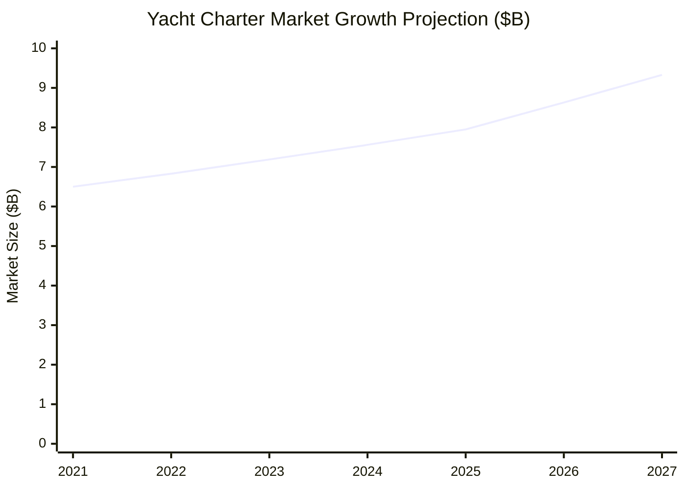
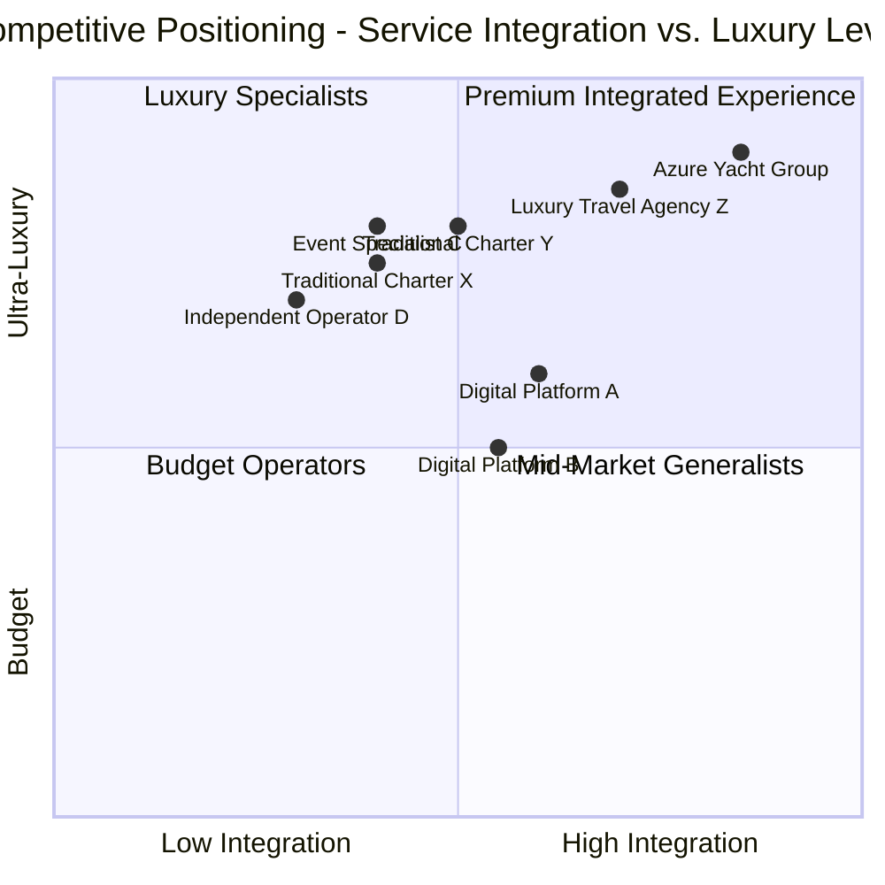

# Market Analysis

This document provides a detailed analysis of the luxury yacht charter market, including competitive landscape, target customer segments, and market trends affecting Azure Yacht Group.

## Market Size & Growth Projections

The global yacht charter market was valued at $6.5 billion in 2021 and is projected to reach $9.33 billion by 2027, growing at a CAGR of 5.2%. Key growth factors include:

- Rising disposable income among high-net-worth individuals
- Increasing interest in experiential luxury over material possessions
- Growing demand for privacy and exclusivity in travel experiences
- Expansion of yacht charter destinations globally

The luxury event planning market is valued at approximately $4.8 billion and growing at 7.1% annually. Our combined addressable market represents a significant opportunity, particularly in our initial focus area of South Florida, which accounts for approximately 15% of the U.S. yacht charter market and hosts over 5,000 luxury events annually.

## Regional Market Analysis

| Region | Market Share | Growth Rate | Seasonality | Key Charter Types |
|--------|--------------|-------------|-------------|-------------------|
| Florida/Caribbean | 35% | 6.8% | Dec-Apr (High) | Crewed, Day, Corporate |
| Mediterranean | 42% | 4.5% | May-Sep (High) | Crewed, Bareboat |
| Pacific/Asia | 12% | 8.2% | Year-round | Crewed, Corporate |
| Other Regions | 11% | 3.7% | Varies | Mixed |

South Florida represents a strategic market entry point due to:
- Year-round favorable weather conditions
- High concentration of ultra-high-net-worth individuals
- Established yacht infrastructure (marinas, maintenance)
- Strong connection to Caribbean charter destinations
- Robust corporate event market

## Competitive Landscape

The yacht charter and luxury event market includes several types of competitors:

### Direct Competitors Analysis

| Competitor Type | Market Share | Strengths | Weaknesses | Threat Level |
|-----------------|--------------|-----------|------------|--------------|
| Traditional Charter Companies | 45% | Established reputation, Fleet access | Limited service innovation, Fragmented offerings | High |
| Luxury Travel Agencies | 20% | Broad service range, Strong client base | Limited yacht expertise, Less specialized | Medium |
| Digital Platforms | 15% | Technology focus, Wide reach | Impersonal service, Quality inconsistency | Medium-High |
| Event Planning Specialists | 12% | Event expertise, Strong venue relationships | Limited yacht knowledge, Narrow focus | Medium-Low |
| Independent Operators | 8% | Flexibility, Low overhead | Limited scale, Inconsistent availability | Low |

### Competitive Positioning Map

## Target Market Segments

Our market research has identified four primary customer segments for yacht charters and three for event services:

### Yacht Charter Clients

1. **Luxury Vacation Seekers (45%)**
   - Ultra-high-net-worth individuals and families
   - Average age: 45-65
   - Average charter duration: 7-10 days
   - Average spend: $45,000-$120,000 per charter
   - Key needs: Privacy, exceptional service, unique experiences

2. **Celebration Groups (25%)**
   - Multi-generational families, friend groups
   - Special occasions (birthdays, anniversaries, reunions)
   - Average charter duration: 3-7 days
   - Average spend: $30,000-$75,000 per charter
   - Key needs: Customization, memorable experiences, activities for diverse groups

3. **Corporate Clients (20%)**
   - Executive retreats, client entertainment, team building
   - Average charter duration: 1-3 days
   - Average spend: $15,000-$50,000 per charter
   - Key needs: Professional service, business facilities, impressive venues

4. **Wedding Parties (10%)**
   - Couples and wedding groups
   - Average charter duration: 1-5 days
   - Average spend: $25,000-$60,000 per charter
   - Key needs: Romantic settings, photography opportunities, seamless planning

### Event Services Clients

1. **Corporate Event Planners (35%)**
   - Fortune 500 companies, financial services, technology firms
   - Average event size: 50-200 guests
   - Average spend: $75,000-$250,000 per event
   - Key needs: Brand alignment, logistics expertise, unique venues

2. **Luxury Private Events (30%)**
   - High-net-worth individuals, celebrities
   - Average event size: 30-100 guests
   - Average spend: $50,000-$150,000 per event
   - Key needs: Privacy, exclusivity, personalization

3. **Destination Celebrations (25%)**
   - Weddings, milestone celebrations
   - Average event size: 40-120 guests
   - Average spend: $60,000-$200,000 per event
   - Key needs: Location beauty, accommodation coordination, experience curation

4. **Luxury Brand Activations (10%)**
   - Fashion, jewelry, automotive brands
   - Average event size: 30-150 guests
   - Average spend: $100,000-$300,000 per event
   - Key needs: Brand alignment, high-impact environments, media opportunities

## Customer Needs Analysis

Our research has identified key pain points in the current market:

### Unmet Customer Needs

| Pain Point | Customer Impact | Our Solution |
|------------|-----------------|--------------|
| Fragmented Services | Multiple vendors to coordinate | Integrated yacht and event services |
| Inconsistent Quality | Unpredictable experiences | Standardized service protocols |
| Lack of Transparency | Unclear pricing and inclusions | Transparent pricing and packages |
| Booking Complexity | Time-consuming process | Streamlined digital platform |
| Limited Customization | Standardized experiences | Personalized service design |
| Expertise Gaps | Incomplete knowledge | Specialized team expertise |

### Voice of Customer Research

Recent interviews with 50 potential clients revealed these key insights:

- 72% value seamless experiences over price considerations
- 85% would pay a premium for guaranteed service quality
- 68% find current booking processes frustrating
- 91% desire more personalization options
- 77% want more transparency in pricing
- 64% seek unique experiences not available to general tourists

## Market Trends Analysis

### Current Trends Impacting the Market

1. **Experience Economy**
   - Growing preference for unique, memorable experiences over material possessions
   - Increasing willingness to pay premium for exceptional service
   - Rising interest in "Instagram-worthy" moments and settings

2. **Integrated Luxury Services**
   - Increasing demand for seamless, end-to-end luxury experiences
   - Market shift toward single-source service providers
   - Growing importance of concierge-style support

3. **Digital Transformation**
   - Shift toward online research and booking for luxury services
   - Increased expectations for digital convenience even in high-touch markets
   - Growing importance of virtual tours and digital presentations

4. **Sustainable Luxury**
   - Growing concern for environmental impact among luxury consumers
   - Increasing demand for eco-friendly options and carbon offsets
   - Rising interest in responsible luxury experiences

5. **Changing Luxury Demographics**
   - Younger HNWI entering the market with different preferences
   - Multigenerational travel increasing in popularity
   - Growing diversity in the luxury consumer base

### Emerging Opportunity Areas

1. **Membership Models**
   - Subscription-based access to yachts and services
   - Guaranteed availability during peak seasons
   - Member-only events and experiences

2. **Dynamic Pricing Optimization**
   - AI-driven pricing based on demand patterns
   - Yield management across diverse service offerings
   - Personalized pricing based on customer profiles

3. **Experiential Packages**
   - Themed charter experiences (wellness, adventure, culinary)
   - Celebrity partnerships (chefs, wellness experts, photographers)
   - Exclusive access to private venues and events

4. **Technology Integration**
   - Enhanced onboard technology experiences
   - Virtual reality pre-charter experiences
   - Integrated service technology platforms

## Market Entry Strategy

Based on our analysis, our market entry strategy focuses on:

1. **Geographic Focus**: Initial concentration on South Florida/Caribbean market to establish brand presence and operational excellence before expanding to other regions

2. **Service Prioritization**: Launch sequence prioritizing day charters and corporate events initially, followed by crewed charters and private celebrations, and finally expanding to full service range

3. **Differentiation Strategy**: Emphasizing our integrated service model, membership options, and technological advantages to distinguish from traditional operators

4. **Partnership Approach**: Strategic alliances with yacht owners, premium venues, and luxury service providers to quickly build service capacity without capital-intensive asset acquisition

---

*Last Updated: May 1, 2025*  
*Next Review: July 31, 2025* 