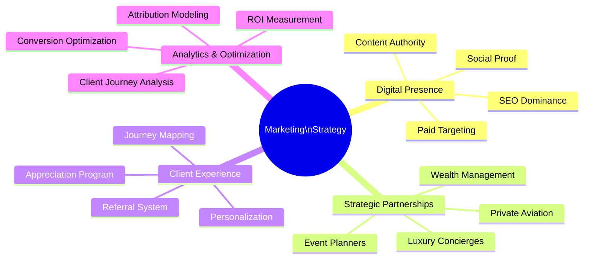
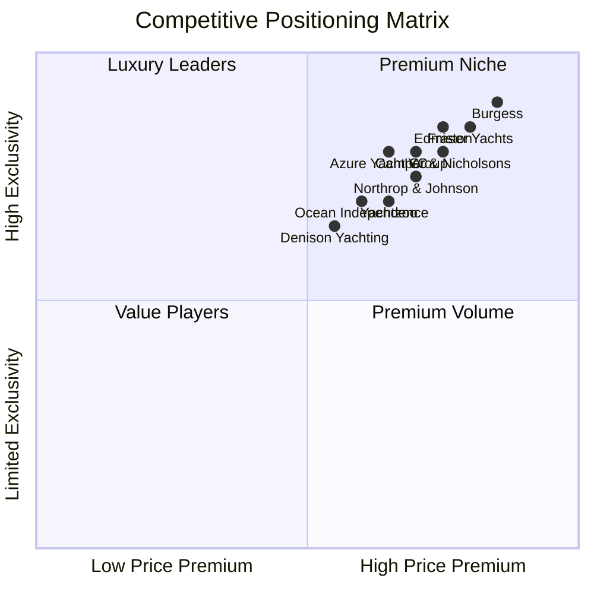
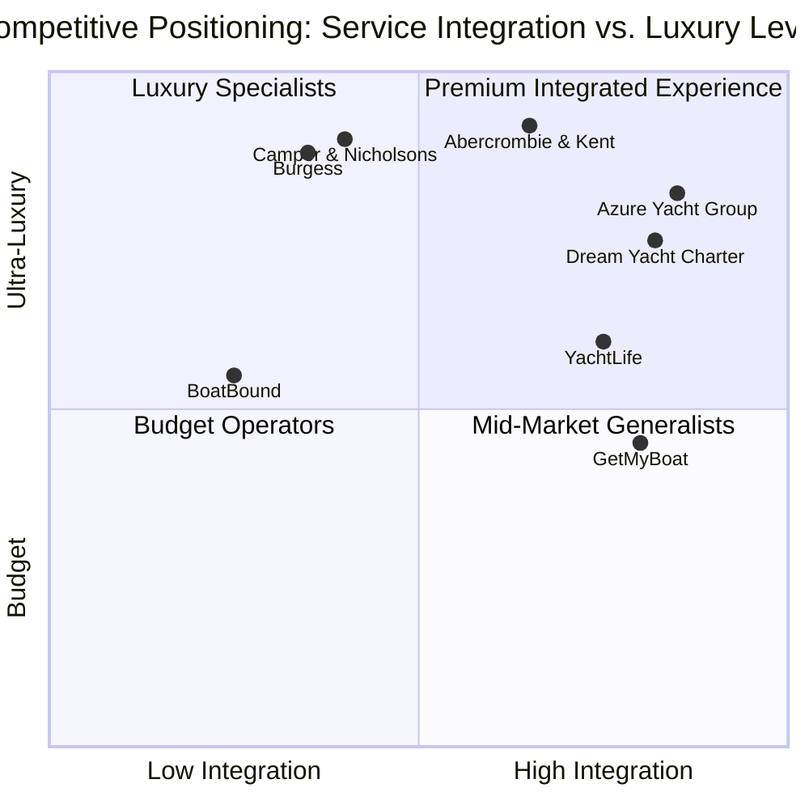
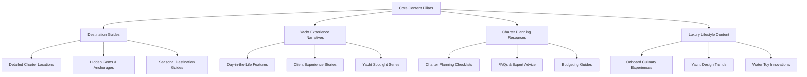
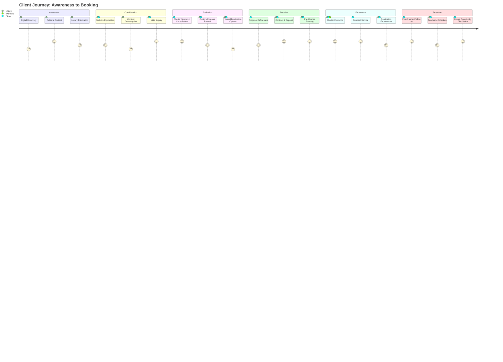
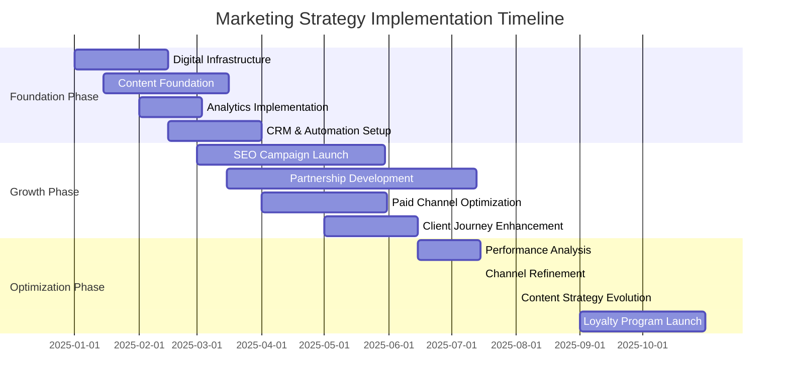
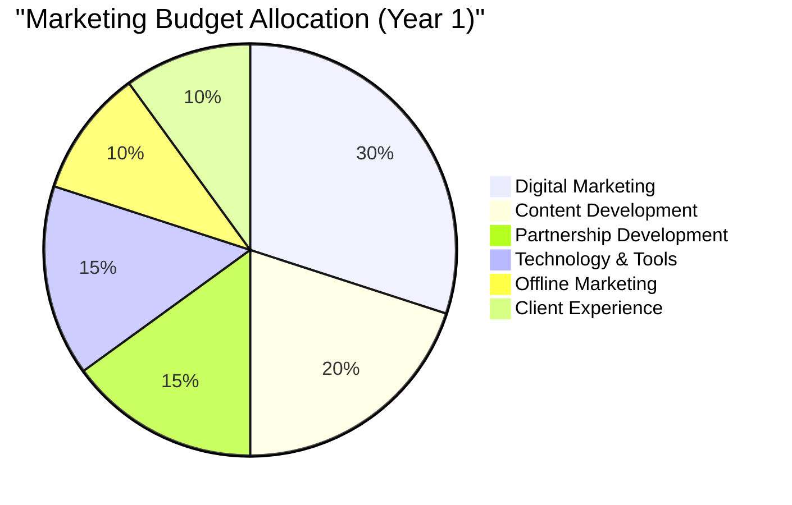

# Marketing & Client Acquisition Strategy

This document outlines a sophisticated approach to client acquisition, search engine optimization (SEO), and client relationship management for Azure Yacht Group, designed to maximize visibility among high-net-worth individuals and create enduring client relationships.

## Executive Summary

Azure Yacht Group's marketing strategy follows a precision targeting approach, focusing on quality leads over quantity through a combination of digital excellence, strategic partnerships, and white-glove client experiences. We aim to acquire 240+ qualified leads in year one, with a 15% conversion rate, while maintaining a client satisfaction rating of 90%+ and achieving a 40% repeat booking rate.

## Competitive Positioning Matrix

This matrix maps Azure Yacht Group against key competitors in the luxury yacht charter industry based on price premium and service exclusivity.

### Competitive Analysis

| Competitor | Strengths | Weaknesses | Opportunity |
|------------|-----------|------------|-------------|
| **Burgess** | Global presence, heritage brand, extensive fleet | Less innovation in digital experience, higher pricing | Differentiate with superior digital tools and value-add services |
| **Northrop & Johnson** | Strong brand recognition, traditional client base | Limited growth in new client demographics | Target emerging wealth with more accessible luxury positioning |
| **Fraser Yachts** | Large international fleet, extensive broker network | Less personalized service model | Emphasize white-glove personalization and bespoke experiences |
| **Camper & Nicholsons** | Historic brand with high credibility | Less modern marketing approach | Lead with cutting-edge digital presence and content marketing |
| **IYC** | Well-established in Mediterranean and Caribbean | Less emphasis on experiential aspects | Focus on holistic travel experiences and event integration |

### Differentiation Strategy

Azure Yacht Group will carve out a distinctive position through:

1. **Technology-Enhanced Experience**: Offering superior digital tools and virtual experiences 
2. **Integrated Event Services**: Providing seamless yacht-to-shore event coordination
3. **Personalization Excellence**: Implementing detailed preference tracking and anticipatory service
4. **Content Leadership**: Establishing authority through exceptional destination and experience content
5. **Partnership Ecosystem**: Creating exclusive relationships with luxury partners outside the marine industry

### Competitive Positioning Map: Service Integration vs. Luxury

The following map positions Azure Yacht Group against competitors based on their level of service integration (yacht charters with events, concierge, etc.) and luxury positioning:

In this positioning map:

- **Premium Integrated Experience**: Azure Yacht Group leads with high integration of services and premium luxury positioning, alongside Dream Yacht Charter
- **Luxury Specialists**: Traditional operators Burgess and Camper & Nicholsons, along with luxury travel company Abercrombie & Kent focus on high-end experiences but with less integrated services
- **Mid-Market Generalists**: Digital platforms YachtLife and GetMyBoat offer more integrated booking and planning services but at a lower luxury tier
- **Budget Operators**: Peer-to-peer platform BoatBound serves the more accessible segment with fewer integrated services

Our strategic advantage lies in combining ultra-luxury experiences with highly integrated services, creating a distinctive position in the premium integrated quadrant that few competitors can match.

## Search Engine Optimization (SEO) Strategy

### Keyword Strategy: Long-Tail Precision

Rather than competing for broad, high-competition terms, we'll dominate specific, high-intent keywords with significant conversion potential.

| Keyword Category | Examples | Search Volume | Competition | Priority |
|------------------|----------|--------------|-------------|----------|
| **Location-Specific** | "luxury yacht charter South Florida", "Caribbean private yacht charter" | Medium | Medium | High |
| **Experience-Based** | "family yacht vacation with crew", "corporate yacht retreat planning" | Low-Medium | Low | Very High |
| **Yacht-Specific** | "60-80ft yacht charter with captain", "catamaran charter for 10 guests" | Low | Low | High |
| **Occasion-Based** | "anniversary yacht charter", "milestone birthday yacht celebration" | Low | Low | Medium |
| **Luxury Qualifiers** | "exclusive yacht charter experience", "VIP yacht charter services" | Medium | High | Medium |

### Technical SEO Implementation

1. **Site Architecture Optimization**
   - Implement schema markup for yacht listings (PropertyRental schema)
   - Create yacht-specific structured data for each vessel
   - Develop location-based landing pages for each charter destination
   - Implement AMP versions for key landing pages

2. **Mobile Optimization**
   - Ensure 100/100 Google PageSpeed score on mobile
   - Implement click-to-call functionality throughout
   - Create mobile-specific CTAs for inquiry generation
   - Develop simplified mobile booking journey

3. **Website Authority Building**
   - Secure relevant backlinks from luxury travel publications
   - Develop relationships with marine industry websites
   - Create shareable research/reports on yacht charter trends
   - Guest posting on yacht owner forums and luxury lifestyle blogs

### Content Authority Strategy

1. **Content Calendar Implementation**
   - Weekly blog posts alternating between pillars
   - Monthly in-depth guides (2,000+ words)
   - Quarterly interactive content (yacht selector tools, budget calculators)
   - Bi-annual research reports on yacht charter industry trends

2. **Content Distribution Strategy**
   - Repurpose content across owned channels
   - Develop content syndication relationships with luxury publications
   - Create gated premium content for lead generation
   - Implement email nurturing sequences based on content consumption

## Client Acquisition Channels

### Digital Acquisition Strategy

1. **Paid Search Optimization**
   - Focus on high-intent, low-competition keywords
   - Implement RLSA (Remarketing Lists for Search Ads) for past visitors
   - Create yacht-specific ad groups with custom landing pages
   - Develop location-based bid strategies for target markets

2. **Programmatic Display Targeting**
   - Implement contextual targeting on luxury travel websites
   - Use lookalike modeling based on existing client profiles
   - Deploy behavioral targeting focusing on luxury purchase indicators
   - Create custom audience segments based on income, net worth, and travel behavior

3. **Social Media Precision Targeting**
   - Instagram: Lifestyle-focused content showcasing experiences
   - Facebook: Custom audience targeting using wealth indicators and interest matching
   - LinkedIn: Corporate decision-maker targeting for corporate events
   - YouTube: Immersive yacht experience videos with search optimization

4. **Email Marketing Sophistication**
   - Implement behavioral email triggers based on website activity
   - Develop personalized nurture sequences by customer segment
   - Create seasonal promotion campaigns for off-peak periods
   - Implement VIP preview campaigns for new yacht additions

### Strategic Partnerships

1. **Luxury Ecosystem Integration**
   - Forge partnerships with private aviation companies
   - Develop relationships with luxury hotel concierges
   - Create co-marketing opportunities with premium spirits brands
   - Establish referral programs with high-end real estate agents

2. **Wealth Management Channel**
   - Develop educational programs for wealth managers
   - Create white-labeled charter recommendation tools
   - Host exclusive events for wealth management clients
   - Provide commission structures for qualified referrals

3. **Event Planner Network**
   - Create certified partner program for luxury event planners
   - Develop specialized training on yacht event capabilities
   - Provide commission structure for yacht event bookings
   - Host familiarization trips for qualified planners

### Offline Acquisition Tactics

1. **Luxury Event Presence**
   - Exhibit at select international yacht shows
   - Sponsor exclusive cultural and sporting events
   - Host invitation-only showcase events in key markets
   - Create pop-up experiences at luxury shopping destinations

2. **Print Media Strategy**
   - Targeted placements in ultra-luxury publications
   - Create custom inserts with yacht showcase features
   - Develop QR-enabled print materials linking to digital experiences
   - Measure print campaign effectiveness through custom landing pages

## Client Journey Optimization

### Awareness to Consideration

1. **Conversion Path Optimization**
   - Implement progressive inquiry forms capturing key details
   - Create yacht-specific landing pages with clear CTAs
   - Develop interactive yacht selection tools
   - Implement live chat with charter specialists

2. **Lead Nurturing Framework**
   - Score leads based on behavior and demographic fit
   - Implement automated nurturing sequences for each lead segment
   - Create triggered specialist outreach based on engagement thresholds
   - Develop retargeting campaigns for abandoned inquiries

3. **Proposal Experience Enhancement**
   - Create interactive digital proposal platform
   - Develop custom video presentations for premium inquiries
   - Implement virtual yacht tours for key vessels
   - Create detailed destination briefings for proposed itineraries

## Client Retention & Appreciation

### Client Experience Elevation

1. **Personalization Framework**
   - Create detailed client preference profiles
   - Implement pre-charter preference gathering
   - Develop custom welcome packages based on past behavior
   - Track and anticipate special occasions and preferences

2. **Post-Charter Engagement**
   - Implement structured post-charter follow-up sequence
   - Create custom photo/video packages of client experiences
   - Develop seasonal greeting programs for past clients
   - Implement anniversary recognition program for past charters

3. **VIP Client Program**
   - Create tiered loyalty program with exclusive benefits
   - Develop invitation-only events for repeat clients
   - Implement preferred access to new vessels and destinations
   - Offer dedicated concierge services for top-tier clients

### Client Referral System

1. **Referral Program Structure**
   - Implement structured referral tracking system
   - Create value-based incentives for successful referrals
   - Develop recognition program for top referrers
   - Train team on appropriate referral solicitation timing

2. **Client Advocacy Development**
   - Create content featuring client experiences (with permission)
   - Develop case studies highlighting unique charter experiences
   - Implement testimonial collection and publishing process
   - Create social sharing capabilities for client experiences

## Analytics & Performance Measurement

### Key Performance Indicators

| KPI Category | Metrics | Targets | Measurement Frequency |
|--------------|---------|---------|----------------------|
| **Acquisition** | - Qualified leads - Channel conversion rates - Cost per acquisition - Lead-to-client conversion | - 240+ qualified leads (Y1) - 15%+ avg. conversion rate - $2,500 CPA - 15% lead-to-client | Monthly |
| **Engagement** | - Website engagement - Content consumption - Email engagement - Social interaction | - 3:30+ avg. session duration - 70%+ content completion - 35%+ email open rate - 5%+ social engagement | Weekly |
| **Conversion** | - Inquiry-to-proposal rate - Proposal acceptance - Contract completion - Upsell acceptance | - 40%+ inquiry-to-proposal - 35%+ proposal acceptance - 90%+ contract completion - 25%+ upsell acceptance | Monthly |
| **Retention** | - Client satisfaction - Repeat booking rate - Referral generation - Lifetime value | - 90%+ satisfaction rating - 40%+ repeat booking - 1.5+ referrals per client - $125,000+ avg. LTV | Quarterly |

### Attribution Modeling

1. **Multi-Touch Attribution Implementation**
   - Deploy custom attribution model tracking all touchpoints
   - Weight touchpoints based on their influence on conversion
   - Track offline-to-online conversion paths
   - Measure partner attribution accurately

2. **ROI Optimization Framework**
   - Analyze channel performance by client value potential
   - Optimize spending based on projected lifetime value
   - Develop dynamic budget allocation based on performance
   - Create predictive models for marketing investment returns

## Implementation Timeline

## Budget Allocation

### Year 1 Marketing Investment

| Category | Allocation | Key Investments |
|----------|------------|----------------|
| **Digital Marketing** | 30% | - SEO implementation - Paid search campaigns - Social media advertising - Programmatic display |
| **Content Development** | 20% | - Website content creation - Visual asset development - Video production - Interactive tools |
| **Partnership Development** | 15% | - Partnership program development - Commission structures - Familiarization experiences - Co-marketing initiatives |
| **Technology & Tools** | 15% | - CRM implementation - Marketing automation - Analytics infrastructure - Proposal platform |
| **Offline Marketing** | 10% | - Print advertising - Event presence - Direct mail campaigns - Promotional materials |
| **Client Experience** | 10% | - Welcome packages - Loyalty program - Custom gifts - Experience enhancement |

## Conclusion

This sophisticated marketing and client acquisition strategy leverages precision targeting, content authority, strategic partnerships, and exceptional client experiences to position Azure Yacht Group as the premier luxury yacht charter provider. By focusing on quality over quantity in lead generation while building long-term client relationships, we create a sustainable growth engine that drives both immediate bookings and long-term business value.

The strategy prioritizes measurable outcomes and ROI optimization, ensuring that marketing investments deliver tangible business results while continuously enhancing our market position and client relationships.

---

*Last Updated: May 1, 2025*  
*Next Review: August 31, 2025* 