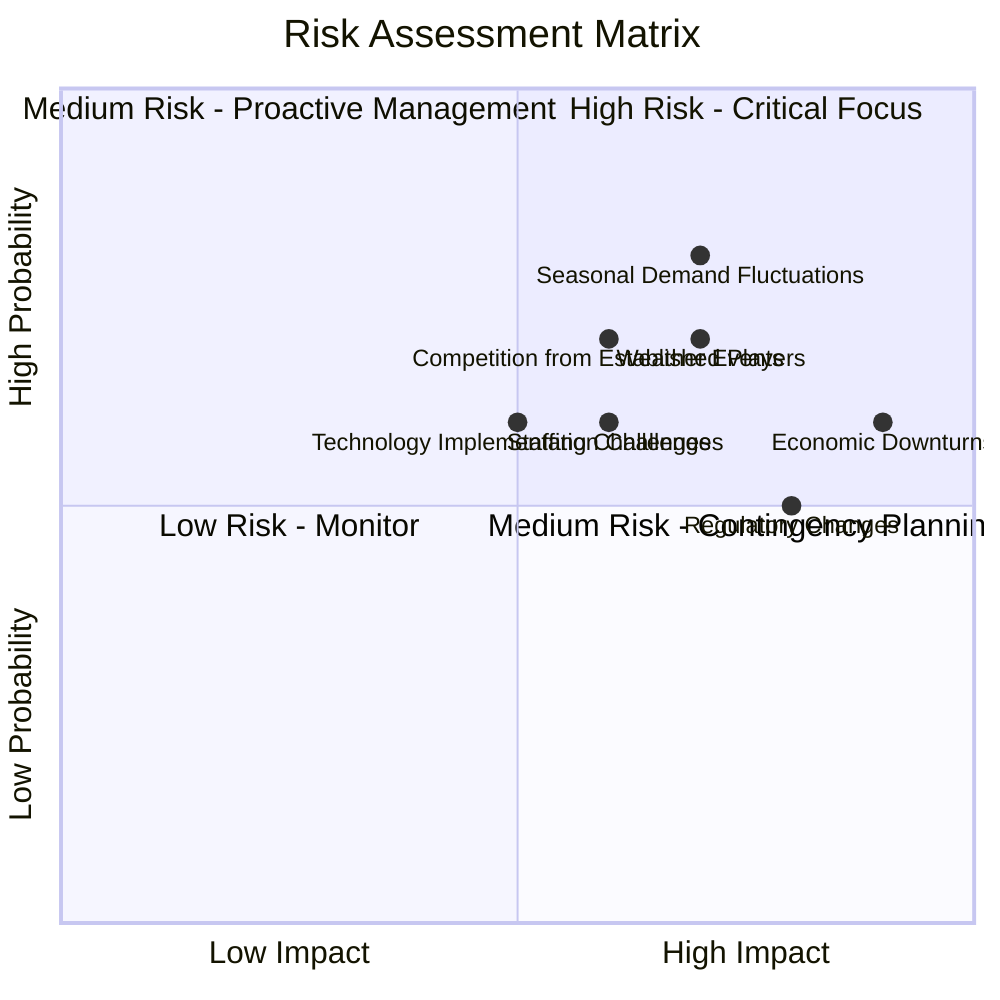
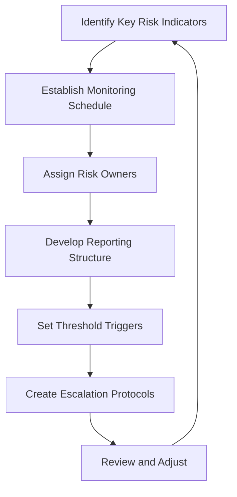
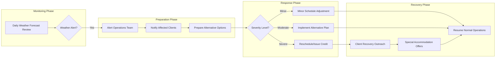
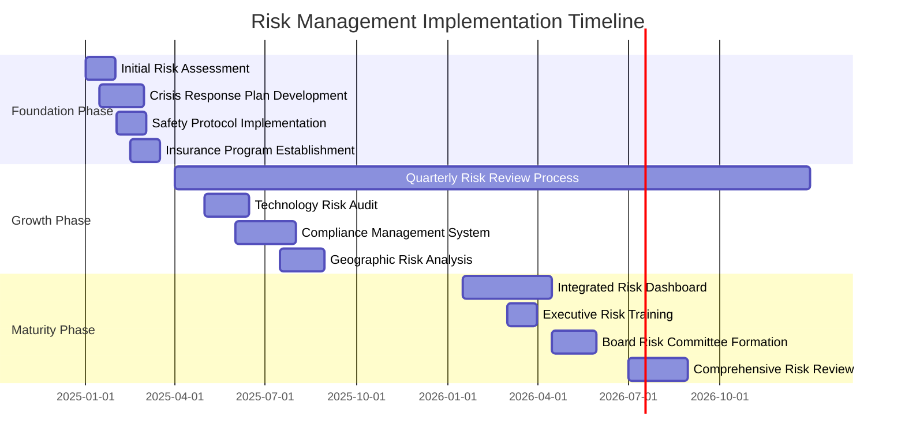

# Risk Assessment

This document provides a thorough assessment of potential risks facing the Azure Yacht Group charter business, along with detailed mitigation strategies to address these challenges proactively.

## Risk Assessment Matrix

The following matrix evaluates key business risks by their potential impact and probability:

## Strategic Business Risks

### Market & Economic Risks

| Risk | Probability | Impact | Risk Score | Description |
|------|------------|--------|------------|-------------|
| Economic Downturn | Medium (6) | High (9) | 54 | Reduced luxury spending during recessions or economic uncertainty |
| Competition | High (7) | Medium (6) | 42 | Established charter companies offering similar services or dropping prices |
| Market Saturation | Medium (5) | Medium (6) | 30 | Increasing number of charter options in key markets |
| Changing Consumer Preferences | Medium (5) | Medium (6) | 30 | Shifts in luxury travel trends away from yacht experiences |

**Mitigation Strategies:**
1. **Diversified Service Portfolio:** Offer varying price points and service levels to appeal to different market segments and remain resilient during economic changes
2. **Membership Model Implementation:** Create predictable revenue streams and customer loyalty through subscription services
3. **Unique Value Proposition:** Focus on integrated yacht-event services that differentiate from standard charter offerings
4. **Market Research Program:** Establish ongoing monitoring of market trends and customer preferences to adapt offerings
5. **Strategic Partnerships:** Form alliances with luxury brands and service providers to enhance value and reach

### Financial Risks

| Risk | Probability | Impact | Risk Score | Description |
|------|------------|--------|------------|-------------|
| Cash Flow Volatility | High (8) | High (8) | 64 | Seasonal business with potential gaps in bookings |
| Exchange Rate Fluctuations | Medium (5) | Medium (5) | 25 | International client base with multiple currencies |
| Interest Rate Changes | Medium (6) | Medium (5) | 30 | Impact on financing costs for expansion |
| Rising Operational Costs | High (7) | Medium (6) | 42 | Increasing costs for yacht access, fuel, and premium services |

**Mitigation Strategies:**
1. **Cash Reserve Policy:** Maintain 3-6 months of operating expenses in reserve
2. **Currency Hedging:** Implement hedging strategies for international transactions
3. **Flexible Cost Structure:** Develop high proportion of variable costs vs. fixed costs
4. **Advance Deposits and Booking Policies:** Require substantial deposits to improve cash flow
5. **Financial Scenario Planning:** Regular modeling of financial performance under various scenarios

## Operational Risks

### Service Delivery Risks

| Risk | Probability | Impact | Risk Score | Description |
|------|------------|--------|------------|-------------|
| Yacht Availability Issues | Medium (5) | High (8) | 40 | Owner cancellations or maintenance issues restricting fleet availability |
| Quality Control Challenges | Medium (6) | High (7) | 42 | Inconsistent service quality across partner vessels and events |
| Vendor Performance Issues | Medium (5) | Medium (6) | 30 | Subpar performance from catering, entertainment, or other service providers |
| Weather-Related Disruptions | High (7) | High (7) | 49 | Storms, high winds, or other conditions affecting charters |

**Mitigation Strategies:**
1. **Redundant Supplier Network:** Maintain relationships with multiple yacht owners and service providers
2. **Service Level Agreements:** Establish clear performance expectations with all partners
3. **Quality Assurance Program:** Implement standardized inspection and service verification processes
4. **Weather Contingency Plans:** Develop alternative experiences and flexible rescheduling policies
5. **Real-time Monitoring:** Implement systems to track service delivery and client satisfaction

### Safety & Compliance Risks

| Risk | Probability | Impact | Risk Score | Description |
|------|------------|--------|------------|-------------|
| Client Safety Incidents | Low (3) | Very High (10) | 30 | Injuries or emergencies during charters or events |
| Maritime Regulation Changes | Medium (5) | High (8) | 40 | New compliance requirements affecting operations |
| Insurance Coverage Gaps | Low (3) | High (8) | 24 | Insufficient coverage for specific incidents or claims |
| Environmental Compliance Issues | Medium (4) | High (7) | 28 | Violations of environmental regulations or standards |

**Mitigation Strategies:**
1. **Comprehensive Safety Protocols:** Develop and enforce strict safety standards for all operations
2. **Regular Compliance Audits:** Conduct quarterly reviews of all regulatory requirements
3. **Insurance Program Review:** Annual assessment of coverage with specialized marine insurance experts
4. **Staff Training Program:** Regular safety and emergency response training for all personnel
5. **Environmental Management System:** Implement protocols for eco-friendly operations

### Personnel & Management Risks

| Risk | Probability | Impact | Risk Score | Description |
|------|------------|--------|------------|-------------|
| Key Person Dependency | Medium (5) | High (8) | 40 | Reliance on founder or key executives for client relationships |
| Staffing Challenges | Medium (6) | Medium (6) | 36 | Difficulty recruiting qualified personnel, especially seasonal staff |
| Knowledge Management | Medium (5) | Medium (6) | 30 | Loss of institutional knowledge with staff turnover |
| Management Capacity | Medium (5) | Medium (6) | 30 | Leadership bandwidth constraints during rapid growth |

**Mitigation Strategies:**
1. **Succession Planning:** Develop plans for all key positions
2. **Recruitment Pipeline:** Establish relationships with hospitality schools and training programs
3. **Knowledge Management System:** Document processes, relationships, and best practices
4. **Leadership Development:** Identify and develop internal talent for future management roles
5. **Advisory Board:** Establish board with industry experts to provide guidance and oversight

## Technology & Infrastructure Risks

### Technology Risks

| Risk | Probability | Impact | Risk Score | Description |
|------|------------|--------|------------|-------------|
| System Implementation Failures | Medium (6) | Medium (5) | 30 | Issues with booking platform or management systems |
| Data Security Breaches | Medium (4) | High (8) | 32 | Unauthorized access to customer or payment information |
| Technology Obsolescence | Medium (5) | Medium (5) | 25 | Rapidly changing technology landscape requiring updates |
| Integration Challenges | Medium (6) | Medium (5) | 30 | Difficulties connecting multiple systems (CRM, booking, accounting) |

**Mitigation Strategies:**
1. **Technology Roadmap:** Develop phased implementation plan with contingencies
2. **Cybersecurity Program:** Implement comprehensive data protection measures
3. **Technology Partner Assessment:** Careful vetting of all technology vendors
4. **Regular Security Audits:** Conduct quarterly security reviews and penetration testing
5. **Data Backup Protocol:** Maintain secure, redundant backups of all critical data

### External Risks

| Risk | Probability | Impact | Risk Score | Description |
|------|------------|--------|------------|-------------|
| Natural Disasters | Medium (4) | High (9) | 36 | Hurricanes or other events affecting primary markets |
| Political Instability | Low (3) | Medium (6) | 18 | Changes in political climate affecting destination regions |
| Global Health Crises | Low (3) | Very High (10) | 30 | Pandemics or other health emergencies restricting travel |
| Negative Industry Events | Low (3) | High (7) | 21 | High-profile incidents affecting perception of yacht industry |

**Mitigation Strategies:**
1. **Geographic Diversification:** Expand to multiple regions to reduce location-specific risks
2. **Crisis Response Plan:** Develop protocols for various emergency scenarios
3. **Flexible Cancellation Policies:** Implement policies that protect both business and clients
4. **Industry Association Participation:** Engage with industry groups to stay informed of trends and issues
5. **Public Relations Strategy:** Proactive approach to managing reputation and addressing incidents

## Risk Response Planning

### Risk Monitoring Framework

### Risk Response Process

For each identified high-priority risk (Risk Score > 35), we implement a structured response process:

1. **Early Warning System:** Key indicators monitored for signs of risk materialization
2. **Trigger Points:** Specific thresholds that activate response plans
3. **Response Team:** Designated personnel responsible for addressing each risk category
4. **Communication Plan:** Protocols for informing stakeholders
5. **Resource Allocation:** Budget and resources designated for risk management
6. **Recovery Plan:** Steps to restore normal operations after risk events

### Sample Risk Response: Weather Disruption

## Opportunity in Risk

Not all risks represent purely negative outcomes. The following matrix identifies risks that also present potential opportunities:

| Risk | Potential Opportunity | Strategic Approach |
|------|----------------------|-------------------|
| Economic Downturn | Market consolidation | Position for acquisition of struggling competitors |
| Regulatory Changes | Differentiation through compliance | Lead industry in adoption of new standards |
| Technology Disruption | Innovation advantage | Invest in emerging technologies ahead of competition |
| Staffing Challenges | Talent development | Create industry-leading training and development programs |
| Seasonal Fluctuations | Off-season innovation | Develop unique off-season packages and experiences |

## Risk Management Timeline

## Key Performance Indicators for Risk Management

| KPI | Target | Measurement Frequency | Responsible Party |
|-----|--------|----------------------|------------------|
| Risk Event Frequency | &lt;2 per quarter | Monthly | Operations Director |
| Risk Response Time | &lt;2 hours for high priority | Per event | Risk Officer |
| Safety Incident Rate | 0 incidents | Monthly | Safety Manager |
| Compliance Score | 100% | Quarterly | Compliance Officer |
| Risk Mitigation Effectiveness | &gt;90% | Quarterly | Risk Committee |
| Risk Management Costs | &lt;5% of operating expenses | Quarterly | Finance Director |

## Conclusion

Azure Yacht Group's comprehensive risk management approach goes beyond simply identifying risks to implementing structured, proactive strategies for mitigation. By integrating risk awareness into all aspects of our business operations, we create a resilient organization capable of navigating industry challenges while maintaining exceptional service quality and business continuity.

The risk assessment and mitigation strategies outlined in this document will be reviewed quarterly and updated annually to ensure ongoing relevance and effectiveness as the business grows and the operating environment evolves.

---

*Last Updated: May 1, 2025*  
*Next Review: August 31, 2025* 