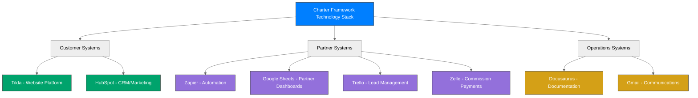

# Technology Stack

The Charter Framework leverages several powerful technologies to create a seamless business system. This document outlines the core components and how they work together.

## Core Technologies

The framework is built on integrated technology systems supporting customer acquisition, partner management, and business operations:



### 1. Tilda (Website Platform)

[Tilda](https://tilda.cc/) provides the customer-facing website where yacht listings are displayed and inquiries are collected.

**Key Features Used:**
- Zero Block for custom landing pages
- Store Module for yacht listing management
- Forms with CRM integration
- Parent-child product structure for charter variants
- Custom HTML/CSS for specification displays
- Tab interface for yacht details and pricing
- Mobile-responsive design

**Implementation Notes:**
- Each yacht is set up as a parent product
- Variants (day/week charters) are child products
- Detailed specifications are shown in tabs
- Inquiry forms create leads in HubSpot

### 2. HubSpot (CRM & Marketing)

[HubSpot](https://www.hubspot.com/) manages all customer relationships, from initial inquiry through booking and follow-up.

**Key Features Used:**
- Contact database with custom properties for yacht preferences
- Deal pipeline for charter bookings
- Email marketing automation and workflows
- Form integration with website (embed code)
- Task management for charter operations
- Partner referral tracking
- Reporting and analytics

**Implementation Notes:**
- **Setup Method**: Manual property configuration (15 minutes one-time setup)
- **Integration**: Form-based lead capture with partner attribution
- **Custom Properties**: 22 properties for charter details and partner tracking
- **Automation**: Email sequences and partner notifications via workflows
- **Partner Tracking**: URL parameter capture for referral attribution
- **API Required**: None - uses native forms and Zapier connectors
- **Cost**: Free for up to 1,000 contacts

**Setup Process:**
1. Manual property creation via HubSpot interface
2. Form creation with partner tracking fields
3. Workflow setup for automated follow-up
4. Zapier integration for Trello and Google Sheets sync

See [HubSpot Properties Setup Guide](/docs/hubspot-properties-setup) for complete implementation details.

### 3. Partner Management System

A complete partner/referral system built on free automation tools for scalable commission-based lead generation.

#### 3.1 Zapier (Automation Platform)
[Zapier](https://zapier.com/) automates referral tracking and partner communications.

**Key Features Used:**
- HubSpot to Trello automation (contact → card creation)
- HubSpot to Google Sheets automation (referral tracking)
- Gmail notifications for partner updates
- Automated commission calculations
- Partner notification workflows

**Implementation Notes:**
- **Automations**: 3 total (simplified from 5)
- **Triggers**: HubSpot form submissions, Trello card movements
- **Capacity**: 100 tasks/month on free plan (≈30 referrals)
- **Cost**: Free for up to 100 tasks/month
- **Upgrade Path**: Zapier Starter ($19.99/month) for 750 tasks

#### 3.2 Google Sheets (Partner Dashboards)
[Google Sheets](https://sheets.google.com) provides real-time partner tracking and financial management.

**Key Features Used:**
- Filtered views for individual partner dashboards
- Automated commission calculations
- Financial tracking and reporting
- Payment status management
- Mobile-friendly partner access

#### 3.3 Trello (Lead Pipeline)
[Trello](https://trello.com) manages the lead workflow that triggers referral tracking.

**Key Features Used:**
- Card-based lead management
- Automated stage transitions
- Integration with partner tracking
- Revenue tracking per booking
- Team collaboration tools

#### 3.4 Zelle (Commission Payments)
[Zelle](https://www.zellepay.com/) provides instant commission payments to partners.

**Key Features Used:**
- Instant bank-to-bank transfers
- Low/no transaction fees
- Automated payment tracking
- Secure financial transactions
- Mobile payment capabilities

### 4. Docusaurus (Documentation)

[Docusaurus](https://docusaurus.io/) powers this documentation site, providing comprehensive implementation guides and business processes.

**Key Features Used:**
- Markdown documentation
- Versioned documentation
- Mermaid diagram integration
- Search functionality
- Mobile-responsive design
- Code snippets and examples

**Implementation Notes:**
- Organized by business function and technical implementation
- Includes visual diagrams for key processes
- Provides pre-built templates and examples
- Regularly updated with best practices

## Data Structure

The framework uses standardized data structures for yacht listings:

```javascript
// Example Yacht Data Structure
{
  "parent": {
    "title": "Drakkar",
    "brand": "Lagoon",
    "model": "52F",
    "year": 2023,
    "description": "Luxury catamaran with 👥 12 guests, 🛏️ 5 cabins, 👤 2 crew",
    "text": "<div class='specs'>...</div>",
    "editions": [
      {
        "title": "Charter Duration",
        "options": ["Week Charter", "Day Charter"]
      }
    ],
    "tabs": [
      {
        "type": "info",
        "title": "Charter Rates",
        "content": "<table class='pricing-table'>...</table>"
      }
    ]
  },
  "children": [
    {
      "parentUid": "12345",
      "title": "Drakkar - Week Charter",
      "modifications": "Charter Duration=Week Charter",
      "price": 25000
    },
    {
      "parentUid": "12345",
      "title": "Drakkar - Day Charter",
      "modifications": "Charter Duration=Day Charter",
      "price": 4500
    }
  ]
}
```

## Integration Points

The technologies integrate at several key points:

**Customer System Integrations:**
1. **Tilda → HubSpot**: Form submissions create contacts and deals
2. **HubSpot → Tilda**: Marketing data informs website content

**Partner System Integrations:**
3. **HubSpot → Zapier**: Form submissions trigger automation workflows
4. **Zapier → Trello**: Automated lead card creation with partner attribution
5. **Zapier → Google Sheets**: Automated referral logging and commission calculations
6. **Google Sheets → Gmail**: Partner notifications and updates

**Business Operations:**
7. **Google Sheets → Zelle**: Manual commission payment processing
8. **Docusaurus → Implementation**: Documentation guides the setup process
9. **CSV Files**: Used for bulk data import/export between systems

## Implementation Requirements

To implement the Charter Framework, you'll need:

| Component | Minimum Requirement | Recommended |
|-----------|---------------------|-------------|
| **Customer Systems** | | |
| Tilda | Business Plan | Business Plan |
| HubSpot | Free CRM | Starter CRM Suite |
| **Partner Systems** | | |
| Zapier | Free Plan (5 automations) | Starter Plan ($19.99/month) |
| Google Sheets | Free Google Account | Google Workspace |
| Trello | Free Plan | Trello Standard |
| Zelle | Bank account with Zelle | Business banking account |
| **Operations** | | |
| Documentation | Static hosting (GitHub/Netlify) | Custom domain hosting |
| Browser | Modern browser | Chrome or Firefox latest |
| Data Preparation | CSV editing capabilities | Spreadsheet software |

## Security Considerations

The framework includes several security measures:

- Secure form processing
- HubSpot data protection
- Regular data backups
- Access control for admin functions
- Privacy policy compliance
- GDPR-compliant data handling

## Extension Points

The framework can be extended with these additional technologies:

- **Payment Processing**: Stripe or PayPal integration
- **Analytics**: Google Analytics or HubSpot Analytics
- **Chat Support**: Intercom or HubSpot Chat
- **Email Delivery**: SendGrid or HubSpot Email
- **Calendar Integration**: Google Calendar or Microsoft Outlook

## Technical Support Resources

For implementation assistance, refer to:

- [Tilda Help Center](https://help.tilda.cc/)
- [HubSpot Knowledge Base](https://knowledge.hubspot.com/)
- [Docusaurus Documentation](https://docusaurus.io/docs)
- [Charter Framework Support](/docs/getting-started)

---

*Last Updated: January 29, 2025*  
*Next Review: April 30, 2025* 