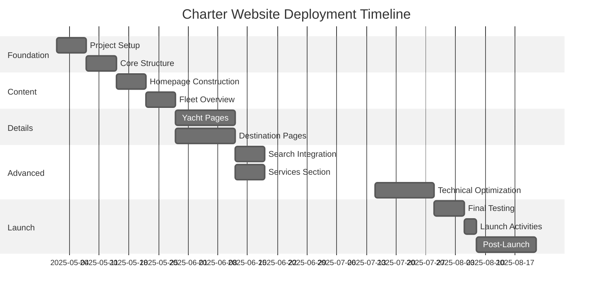

# Charter Business Website Deployment Plan

This document outlines a systematic approach to building and deploying the complete charter business website using Tilda. The plan breaks down the process into manageable phases with clear milestones and deliverables.

## Phase 1: Foundation and Setup (Weeks 1-2)

### 1.1 Project Setup

- [ ] Set up Tilda account and create a new project
- [ ] Configure domain settings and DNS
- [ ] Establish brand guidelines (colors, typography, logo usage)
- [ ] Create reusable design elements library

### 1.2 Core Structure

- [ ] Implement basic site navigation
- [ ] Build homepage skeleton
- [ ] Create site-wide header and footer
- [ ] Configure site analytics (Google Analytics)

### Milestone: Site Framework Ready

- Site accessible at domain with placeholder content
- Navigation structure established
- Brand identity implemented

## Phase 2: Content Development (Weeks 3-4)

### 2.1 Homepage Construction

- [ ] Develop hero banner with seasonal offers
- [ ] Create featured charters carousel
- [ ] Build destination highlights section
- [ ] Implement testimonials slider
- [ ] Add newsletter signup functionality

### 2.2 Fleet Overview

- [ ] Design fleet listing page layout
- [ ] Create yacht card template
- [ ] Implement basic filtering functionality
- [ ] Add "New Arrivals" section

### Milestone: Core Content Live

- Homepage fully functional with real content
- Fleet overview page operational with sample yachts
- Newsletter system connected

## Phase 3: Detail Pages and Functionality (Weeks 5-7)

### 3.1 Individual Yacht Pages

- [ ] Develop detailed yacht page template
- [ ] Create image gallery with lightbox functionality
- [ ] Build specifications display tables
- [ ] Implement pricing calculator
- [ ] Create availability calendar
- [ ] Add booking request form
- [ ] Set up similar yachts recommendation engine

### 3.2 Destination Pages

- [ ] Create interactive destination map
- [ ] Develop destination guide template
- [ ] Build initial guides for primary regions:
  - [ ] Caribbean
  - [ ] Mediterranean 
  - [ ] South Pacific
- [ ] Implement seasonal recommendations module

### Milestone: Full Functionality

- Complete booking process implemented
- All yacht details pages operational
- Main destination guides published

## Phase 4: Advanced Features and Optimization (Weeks 8-10)

### 4.1 Advanced Search Integration

- [ ] Implement advanced search filters
- [ ] Create dynamic results display
- [ ] Add saved search functionality
- [ ] Optimize search performance

### 4.2 Services Section

- [ ] Create charter types comparison
- [ ] Develop bareboat charter information pages
- [ ] Build crewed charter details pages
- [ ] Add service add-ons section

### 4.3 Technical Optimization

- [ ] Perform site-wide SEO audit and optimization
- [ ] Implement site performance improvements
- [ ] Ensure mobile responsiveness
- [ ] Test and fix cross-browser compatibility issues

### Milestone: Site Launch Ready

- All sections complete and populated with content
- Advanced functionality tested and operational
- SEO optimization complete
- Mobile experience refined

## Phase 5: Launch and Marketing (Weeks 11-12)

### 5.1 Final Testing

- [ ] Conduct user acceptance testing
- [ ] Perform security review
- [ ] Test all forms and integrations
- [ ] Review content for accuracy and consistency

### 5.2 Launch Activities

- [ ] Create 301 redirects (if migrating from previous site)
- [ ] Submit sitemap to search engines
- [ ] Implement launch marketing campaign
- [ ] Monitor analytics and user behavior

### 5.3 Post-Launch

- [ ] Gather initial user feedback
- [ ] Make priority adjustments based on feedback
- [ ] Implement content update schedule
- [ ] Plan Phase 2 improvements
- [ ] Schedule regular analytics review meetings

### Milestone: Successful Launch

- Site fully operational and publicly accessible
- Marketing initiatives driving traffic
- Feedback systems in place
- Ongoing maintenance plan established

## Resource Requirements

### Team Roles

- **Project Manager**: Oversee timeline and deliverables
- **Content Developer**: Create yacht and destination descriptions
- **Tilda Developer**: Build pages and implement functionality
- **Designer**: Create visual assets and ensure brand consistency
- **SEO Specialist**: Optimize content and structure for search engines

### Tools and Integrations

- **Tilda**: Primary development platform
- **Booking System**: Integration for availability and reservations
- **CRM**: Customer relationship management for inquiries
- **Email Marketing**: Newsletter and automation platform
- **Analytics**: Traffic and conversion tracking

## Implementation Timeline

## Next Steps

To begin implementation:

1. Review the [website structure](./site-structure) to understand the complete architecture
2. Set up your Tilda account following the [Tilda integration guide](./tilda-integration)
3. Establish your content inventory and gather assets (yacht images, specifications, etc.)
4. Schedule kickoff meeting with your implementation team

This deployment plan provides a structured approach to building your charter business website. Adjust the timeline and tasks as needed based on your specific requirements and resource availability. 