# Sales-Optimized Website Structure for Azure Yacht Group

This document outlines the optimized structure for implementing the Azure Yacht Group's online presence using Tilda. To accommodate a separate investor for the charter business, we maintain two distinct websites while ensuring brand consistency.

## Website Domain Structure

The Azure Yacht Group operates two separate but coordinated websites:

1. **azureyachtgroup.com (Project ID: 4198911)**
   - Primary corporate presence
   - Focuses on Yacht Brokerage and Yacht Design
   - Target audience: Yacht buyers, sellers, and design clients

2. **azurcharters.com (Project ID: 12993249)**
   - Dedicated to charter operations
   - Focuses exclusively on yacht charter services
   - Target audience: Charter clients and charter-specific investors

This separation allows for dedicated focus on each business line while maintaining overall brand consistency.

## Website Architectures (Visual Maps)

### Azure Yacht Group Main Website (azureyachtgroup.com)

```mermaid
%%{init: {'securityLevel': 'loose', 'theme': 'neutral'}}%%
graph TD
    %% Main structure in vertical layout
    root[AZURE YACHT GROUP MAIN]
    root --> home[HOME]
    root --> sales[YACHT SALES]
    root --> yachtDesign[YACHT DESIGN]
    root --> about[ABOUT US]
    root --> resources[RESOURCES]
    root --> contact[CONTACT]
    root --> charterLink[YACHT CHARTERS ↗]
    
    %% Home page elements
    home -.- hero[Hero Banner with Primary CTAs]
    home -.- featuredSales[Featured Yacht Listings]
    home -.- charterSection[Charter Services Section]
    home -.- companyHighlights[Company Highlights]
    home -.- testimonials[Client Testimonials]
    home -.- quickSearch[Search Widget]
    
    %% Charter section on home page
    charterSection -.- charterIntro[Charter Services Introduction]
    charterSection -.- featuredCharters[Featured Charter Yachts]
    charterSection -.- charterCTA[Visit Azure Charters Button]
    
    %% Yacht Sales section
    sales -.- brokerageServices[Brokerage Services]
    sales -.- sellingProcess[Selling Your Yacht]
    sales -.- acquisitionServices[Buying Services]
    sales -.- currentListings[Current Listings]
    
    %% Brokerage Services elements
    brokerageServices -.- sellerServices[Seller Services]
    brokerageServices -.- buyerServices[Buyer Services]
    brokerageServices -.- IYBAcredentials[IYBA Certification]
    brokerageServices -.- brokerageTeam[Brokerage Team]

    %% Sales Listings elements
    currentListings -.- listingsSearch[Search/Filter Listings]
    currentListings -.- featuredListings[Featured Listings]
    currentListings -.- listingPages[Individual Listing Pages]
    
    %% Yacht Design section
    yachtDesign -.- designPhilosophy[Design Philosophy]
    yachtDesign -.- exteriorArch[Exterior Architecture]
    yachtDesign -.- interiorArch[Interior Architecture]
    yachtDesign -.- designStudios[Design Studios Showcase]
    yachtDesign -.- innovations[Innovation Spotlight]
    yachtDesign -.- caseStudies[Design Case Studies]
    
    %% About Us section
    about -.- team[Our Team]
    about -.- story[Our Story]
    about -.- IYBAcompliance[IYBA Compliance]
    about -.- clientTestimonials[Client Testimonials]
    about -.- values[Our Values]
    
    %% Resources section
    resources -.- legalInfo[Legal & Financial Resources]
    resources -.- yachtKnowledge[Yacht Knowledge Base]
    resources -.- faq[FAQ]
    
    %% Contact section
    contact -.- contactForm[Contact Form]
    contact -.- officeLocations[Office Locations]
    contact -.- team[Meet the Team]
    contact -.- emergencyContact[Emergency Contact]

    %% Charter link goes to other website
    charterLink -.- externalLink[External link to azurcharters.com]

    %% Style Classes
    classDef primaryClass fill:#0078D4,color:#ffffff,stroke:#333,stroke-width:2px;
    classDef secondaryClass fill:#00A36C,color:#ffffff,stroke:#333,stroke-width:1px;
    classDef tertiaryClass fill:#d4a017,color:#ffffff,stroke:#333,stroke-width:1px;
    classDef externalClass fill:#9B59B6,color:#ffffff,stroke:#333,stroke-width:2px;
    
    %% Apply Styles
    class root,home,sales,yachtDesign,about,resources,contact primaryClass;
    class brokerageServices,sellingProcess,acquisitionServices,currentListings,designPhilosophy,exteriorArch,interiorArch,designStudios,innovations,caseStudies,team,story,IYBAcompliance,clientTestimonials,values,legalInfo,yachtKnowledge,faq,contactForm,officeLocations secondaryClass;
    class sellerServices,buyerServices,IYBAcredentials,brokerageTeam,listingsSearch,featuredListings,listingPages tertiaryClass;
    class charterLink,externalLink externalClass;
```

### Azure Yacht Charters Website (azurcharters.com)

```mermaid
%%{init: {'securityLevel': 'loose', 'theme': 'neutral'}}%%
graph TD
    %% Main structure in vertical layout
    rootCharter[AZURE YACHT CHARTERS]
    rootCharter --> homeCharter[HOME]
    rootCharter --> charters[YACHT CHARTERS]
    rootCharter --> destinations[DESTINATIONS]
    rootCharter --> aboutCharter[ABOUT US]
    rootCharter --> resourcesCharter[RESOURCES]
    rootCharter --> contactCharter[CONTACT]
    rootCharter --> groupLink[AZURE YACHT GROUP ↗]
    
    %% Home page elements
    homeCharter -.- heroCharter[Hero Banner with Charter CTAs]
    homeCharter -.- featuredCharters[Featured Charter Yachts]
    homeCharter -.- featuredDest[Popular Destinations]
    homeCharter -.- testimonialsCharter[Client Testimonials]
    homeCharter -.- quickSearchCharter[Charter Search Widget]
    
    %% Yacht Charters section
    charters -.- charterFleet[Charter Fleet]
    charters -.- charterExp[Charter Experience]
    charters -.- itineraries[Sample Itineraries]
    charters -.- charterProcess[Charter Process]
    
    %% Charter Fleet elements
    charterFleet -.- fleetSearch[Advanced Search/Filter]
    charterFleet -.- yachtPages[Individual Yacht Pages]
    charterFleet -.- specialOffers[Special Offers]
    
    %% Charter Experience elements
    charterExp -.- onboard[Onboard Experience]
    charterExp -.- crew[Meet the Crews]
    charterExp -.- cuisine[Culinary Experience]
    charterExp -.- activities[Onboard Activities]
    
    %% Yacht Pages elements
    yachtPages -.- gallery[Gallery]
    yachtPages -.- specs[Specifications]
    yachtPages -.- pricing[Charter Rates]
    yachtPages -.- crewInfo[Crew Information]
    yachtPages -.- calendar[Availability Calendar]
    yachtPages -.- enquiryForm[Charter Enquiry Form]
    
    %% Destinations section
    destinations -.- map[Interactive Map]
    destinations -.- destGuides[Destination Guides]
    destinations -.- seasonal[Seasonal Recommendations]
    destinations -.- experiences[Curated Experiences]
    
    %% Destination guides
    destGuides -.- caribbean[Caribbean]
    destGuides -.- mediterranean[Mediterranean]
    destGuides -.- southPacific[South Pacific]
    destGuides -.- otherRegions[Other Regions]
    
    %% About Us section
    aboutCharter -.- teamCharter[Our Team]
    aboutCharter -.- storyCharter[Our Story]
    aboutCharter -.- IYBAcomplianceCharter[IYBA Compliance]
    aboutCharter -.- clientTestimonialsCharter[Client Testimonials]
    aboutCharter -.- valuesCharter[Our Values]
    
    %% Resources section
    resourcesCharter -.- charterGuides[Charter Planning Guides]
    resourcesCharter -.- destinationInfo[Destination Information]
    resourcesCharter -.- faqCharter[FAQ]
    
    %% Contact section
    contactCharter -.- contactFormCharter[Contact Form]
    contactCharter -.- officeLocationsCharter[Office Locations]
    contactCharter -.- teamContactCharter[Meet the Team]
    contactCharter -.- emergencyContactCharter[Emergency Contact]

    %% Group link goes to other website
    groupLink -.- externalGroupLink[External link to azureyachtgroup.com]

    %% Style Classes
    classDef primaryCharterClass fill:#1E88E5,color:#ffffff,stroke:#333,stroke-width:2px;
    classDef secondaryCharterClass fill:#00897B,color:#ffffff,stroke:#333,stroke-width:1px;
    classDef tertiaryCharterClass fill:#FF8F00,color:#ffffff,stroke:#333,stroke-width:1px;
    classDef externalGroupClass fill:#8E24AA,color:#ffffff,stroke:#333,stroke-width:2px;
    
    %% Apply Styles
    class rootCharter,homeCharter,charters,destinations,aboutCharter,resourcesCharter,contactCharter primaryCharterClass;
    class charterFleet,charterExp,itineraries,charterProcess,map,destGuides,seasonal,experiences,teamCharter,storyCharter,IYBAcomplianceCharter,clientTestimonialsCharter,valuesCharter,charterGuides,destinationInfo,faqCharter,contactFormCharter,officeLocationsCharter secondaryCharterClass;
    class fleetSearch,yachtPages,specialOffers,onboard,crew,cuisine,activities,gallery,specs,pricing,crewInfo,calendar,enquiryForm,caribbean,mediterranean,southPacific,otherRegions tertiaryCharterClass;
    class groupLink,externalGroupLink externalGroupClass;
```

## Conversion-Focused Structure

This two-website structure prioritizes revenue-generating services and organizes content to support targeted sales journeys:

1. **Business Pillar Focus**: Each website focuses exclusively on its business pillars (Brokerage/Design vs. Charter)
2. **Clear Path to Conversion**: Each section leads users toward inquiry forms and booking steps
3. **Cross-Linking Strategy**: Strategic links between sites maintain brand cohesion while separating business operations
4. **Trust Elements on Both Sites**: Testimonials, IYBA certification, and team information positioned to build confidence
5. **Consistent Brand Experience**: Visual design, tone, and quality standards maintained across both properties

## Implementation Notes

When implementing this structure in Tilda:

1. **Clear Visual Distinction**: Use consistent branding but with visual cues distinguishing charter vs. brokerage/design
2. **Cross-Site Analytics**: Implement tracking to understand user journeys across both properties
3. **Shared Resources When Appropriate**: Cross-reference resources between sites where beneficial
4. **Consistent Contact Information**: Maintain consistent company contact information while routing inquiries appropriately
5. **Clear Cross-Navigation**: Make it obvious when users are moving between sites

## Navigation Implementation

The primary navigation should include:

- **HOME**
- **YACHT CHARTERS** (dropdown with Charter Fleet, Experience, Itineraries, Process)
- **YACHT SALES** (dropdown with Selling, Buying, Current Listings)
- **DESTINATIONS** (dropdown with regional options)
- **YACHT DESIGN** (featuring design philosophy, architecture, and innovations)
- **ABOUT US**
- **RESOURCES**
- **CONTACT US**

## Key Conversion Points

For optimal sales performance, prioritize these conversion points on both websites:

### azureyachtgroup.com (Main Site)
1. **Sales Inquiry Forms**: Prominently featured in the brokerage services section
2. **Design Consultation Requests**: Added to the Yacht Design section
3. **Quick Search**: For yacht listings
4. **Chat Support**: For sales and design inquiries
5. **Cross-Promotion to Charter Site**: Strategic links to charter offerings when appropriate

### azurcharters.com (Charter Site)
1. **Charter Inquiry Forms**: Prominently placed on yacht detail pages and throughout the site
2. **Destination Selection Tools**: Help users find ideal charter locations
3. **Charter Planning Tools**: Itinerary builders and planning resources
4. **Availability Calendars**: Real-time charter availability
5. **Cross-Promotion to Main Site**: Links to brokerage services when appropriate

Follow the [Tilda Integration](./tilda-integration) guide for specific implementation instructions.

---

*Last Updated: May 23, 2025*  
*Next Review: June 23, 2025* 