# Sales-Optimized Charter Business Website Structure

This document outlines the optimized structure for implementing a yacht charter business website using Tilda. This structure is designed to maximize conversions and support the complete customer journey.

## Main Website Architecture (Visual Map)

```mermaid
%%{init: {'securityLevel': 'loose', 'theme': 'neutral'}}%%
graph TD
    %% Main structure in vertical layout
    root[AZURE YACHT GROUP WEBSITE]
    root --> home[HOME]
    root --> charters[YACHT CHARTERS]
    root --> sales[YACHT SALES]
    root --> destinations[DESTINATIONS]
    root --> about[ABOUT US]
    root --> resources[RESOURCES]
    root --> contact[CONTACT]
    
    %% Home page elements
    home -.- hero[Hero Banner with Primary CTAs]
    home -.- featuredCharters[Featured Charter Yachts]
    home -.- featuredSales[Featured Yacht Listings]
    home -.- featuredDest[Popular Destinations]
    home -.- testimonials[Client Testimonials]
    home -.- quickSearch[Quick Search Widget]
    
    %% Yacht Charters section
    charters -.- charterFleet[Charter Fleet]
    charters -.- charterExp[Charter Experience]
    charters -.- itineraries[Sample Itineraries]
    charters -.- charterProcess[Charter Process]
    
    %% Charter Fleet elements
    charterFleet -.- fleetSearch[Advanced Search/Filter]
    charterFleet -.- yachtPages[Individual Yacht Pages]
    charterFleet -.- specialOffers[Special Offers]
    
    %% Charter Experience elements
    charterExp -.- onboard[Onboard Experience]
    charterExp -.- crew[Meet the Crews]
    charterExp -.- cuisine[Culinary Experience]
    charterExp -.- activities[Onboard Activities]
    
    %% Yacht Pages elements
    yachtPages -.- gallery[Gallery]
    yachtPages -.- specs[Specifications]
    yachtPages -.- pricing[Charter Rates]
    yachtPages -.- crewInfo[Crew Information]
    yachtPages -.- calendar[Availability Calendar]
    yachtPages -.- enquiryForm[Charter Enquiry Form]
    
    %% Yacht Sales section
    sales -.- brokerageServices[Brokerage Services]
    sales -.- sellingProcess[Selling Your Yacht]
    sales -.- acquisitionServices[Buying Services]
    sales -.- currentListings[Current Listings]
    
    %% Brokerage Services elements
    brokerageServices -.- sellerServices[Seller Services]
    brokerageServices -.- buyerServices[Buyer Services]
    brokerageServices -.- IYBAcredentials[IYBA Certification]
    brokerageServices -.- brokerageTeam[Brokerage Team]

    %% Sales Listings elements
    currentListings -.- listingsSearch[Search/Filter Listings]
    currentListings -.- featuredListings[Featured Listings]
    currentListings -.- listingPages[Individual Listing Pages]
    
    %% Destinations section
    destinations -.- map[Interactive Map]
    destinations -.- destGuides[Destination Guides]
    destinations -.- seasonal[Seasonal Recommendations]
    destinations -.- experiences[Curated Experiences]
    
    %% Destination guides
    destGuides -.- caribbean[Caribbean]
    destGuides -.- mediterranean[Mediterranean]
    destGuides -.- southPacific[South Pacific]
    destGuides -.- otherRegions[Other Regions]
    
    %% About Us section
    about -.- team[Our Team]
    about -.- story[Our Story]
    about -.- IYBAcompliance[IYBA Compliance]
    about -.- clientTestimonials[Client Testimonials]
    about -.- values[Our Values]
    
    %% Resources section
    resources -.- charterGuides[Charter Planning Guides]
    resources -.- legalInfo[Legal & Financial Resources]
    resources -.- yachtKnowledge[Yacht Knowledge Base]
    resources -.- destinationInfo[Destination Information]
    resources -.- faq[FAQ]
    
    %% Contact section
    contact -.- contactForm[Contact Form]
    contact -.- officeLocations[Office Locations]
    contact -.- team[Meet the Team]
    contact -.- emergencyContact[Emergency Contact]

    %% Style Classes
    classDef primaryClass fill:#0078D4,color:#ffffff,stroke:#333,stroke-width:2px;
    classDef secondaryClass fill:#00A36C,color:#ffffff,stroke:#333,stroke-width:1px;
    classDef tertiaryClass fill:#d4a017,color:#ffffff,stroke:#333,stroke-width:1px;
    
    %% Apply Styles
    class root,home,charters,sales,destinations,about,resources,contact primaryClass;
    class charterFleet,charterExp,itineraries,charterProcess,brokerageServices,sellingProcess,acquisitionServices,currentListings,map,destGuides,seasonal,experiences,team,story,IYBAcompliance,clientTestimonials,values,charterGuides,legalInfo,yachtKnowledge,destinationInfo,faq,contactForm,officeLocations secondaryClass;
    class fleetSearch,yachtPages,specialOffers,onboard,crew,cuisine,activities,gallery,specs,pricing,crewInfo,calendar,enquiryForm,sellerServices,buyerServices,IYBAcredentials,brokerageTeam,listingsSearch,featuredListings,listingPages,caribbean,mediterranean,southPacific,otherRegions tertiaryClass;
```

## Conversion-Focused Structure

This structure prioritizes revenue-generating services and organizes content to support the sales journey:

1. **Primary Services First**: Charter and Sales services are positioned prominently
2. **Clear Path to Conversion**: Each section leads users toward inquiry forms and booking steps
3. **Trust Elements Strategically Placed**: Testimonials, IYBA certification, and team information positioned to build confidence
4. **Supporting Content Accessible**: Resources and legal information available but don't interfere with the sales journey

## Implementation Notes

When implementing this structure in Tilda:

1. **Clear CTAs**: Every page should have clear calls-to-action directing users to the next step
2. **Visual Hierarchy**: Use design elements to draw attention to high-value conversion points
3. **Mobile Optimization**: Ensure all conversion elements are easily accessible on mobile devices
4. **A/B Testing**: Implement testing for key landing pages to optimize conversion rates
5. **Analytics Integration**: Set up proper tracking to measure the effectiveness of each conversion path

## Navigation Implementation

The primary navigation should include:

- **HOME**
- **YACHT CHARTERS** (dropdown with Charter Fleet, Experience, Itineraries, Process)
- **YACHT SALES** (dropdown with Selling, Buying, Current Listings)
- **DESTINATIONS** (dropdown with regional options)
- **ABOUT US**
- **RESOURCES**
- **CONTACT US**

## Key Conversion Points

For optimal sales performance, prioritize these conversion points:

1. **Charter Inquiry Forms**: Prominently placed on yacht detail pages and throughout the charter section
2. **Sales Inquiry Forms**: Prominently featured in the brokerage services section
3. **Quick Search**: Always accessible to help users find specific yachts
4. **Chat Support**: Offer live chat support throughout the site
5. **Clear Contact Information**: Phone numbers and email addresses easily accessible

Follow the [Tilda Integration](./tilda-integration) guide for specific implementation instructions.

---

*Last Updated: May 1, 2025*  
*Next Review: June 1, 2025* 