# Comprehensive Charter Business Website Structure

This document outlines the complete structure for implementing a yacht charter business website using Tilda. Use this as a reference guide when building your site sections.

## Main Website Architecture (Visual Map)

```mermaid
%%{init: {'theme': 'neutral', 'securityLevel': 'loose'}}%%
flowchart TD
    root[AZURE YACHT GROUP WEBSITE]
    root --> home[HOME]
    root --> fleet[CHARTER FLEET] 
    root --> destinations[DESTINATIONS]
    root --> services[SERVICES]
    
    %% Home Section
    subgraph homeSection[" "]
        direction TB
        home --> hero[Hero Banner - Seasonal Offers]
        home --> featured[Featured Charters Carousel]
        home --> destHighlights[Destinations Highlights]
        home --> testimonials[Testimonials]
        home --> newsletter[Newsletter Signup]
    end
    
    %% Charter Fleet Section
    subgraph fleetSection[" "]
        direction TB
        fleet --> fleetOverview[Fleet Overview]
        fleet --> search[Advanced Search/Filter]
        fleet --> yachtPages[Individual Yacht Pages]
        fleet --> newArrivals[New Arrivals Section]
        
        %% Search Options (as subcategory)
        search --> bySize[By Size]
        search --> byPrice[By Price]
        search --> byLocation[By Location]
        search --> byAvailability[By Availability]
        
        %% Individual Yacht Pages (as subcategory)
        yachtPages --> gallery[Gallery]
        yachtPages --> specs[Specifications]
        yachtPages --> pricing[Pricing Calculator]
        yachtPages --> crew[Crew Information]
        yachtPages --> calendar[Calendar Availability]
        yachtPages --> similar[Similar Yachts]
        yachtPages --> booking[Booking Request Form]
    end
    
    %% Destinations Section
    subgraph destSection[" "]
        direction TB
        destinations --> map[Interactive Map]
        destinations --> guides[Destination Guides]
        destinations --> seasonal[Seasonal Recommendations]
        destinations --> attractions[Local Attractions]
        
        %% Destination Guides
        guides --> caribbean[Caribbean]
        guides --> mediterranean[Mediterranean]
        guides --> southPacific[South Pacific]
        guides --> otherRegions[Other Regions]
    end
    
    %% Services Section
    subgraph servSection[" "]
        direction TB
        services --> charterTypes[Charter Types]
        charterTypes --> bareboat[Bareboat]
        charterTypes --> crewed[Crewed]
    end
    
    %% Style Classes
    classDef sectionClass fill:#0078D4,color:#ffffff,stroke:#333,stroke-width:2px;
    classDef subsectionClass fill:#00A36C,color:#ffffff,stroke:#333,stroke-width:1px;
    classDef featureClass fill:#d4a017,color:#ffffff,stroke:#333,stroke-width:1px;
    classDef subgraphClass fill:none,stroke:none;
    
    %% Apply Styles
    class root,home,fleet,destinations,services sectionClass;
    class fleetOverview,search,yachtPages,newArrivals,hero,featured,destHighlights,testimonials,newsletter,map,guides,seasonal,attractions,charterTypes subsectionClass;
    class bySize,byPrice,byLocation,byAvailability,gallery,specs,pricing,crew,calendar,similar,booking,caribbean,mediterranean,southPacific,otherRegions,bareboat,crewed featureClass;
    class homeSection,fleetSection,destSection,servSection subgraphClass;
```

## Implementation Notes

This structure serves as a blueprint for organizing your Tilda-based yacht charter website. When implementing each section:

1. **Consistency**: Maintain consistent navigation paths and user experience across sections
2. **Mobile Optimization**: Ensure all elements adapt properly to mobile devices
3. **Performance**: Optimize image sizes and page load times, especially for yacht galleries
4. **Integration Points**: Note where booking systems, availability calendars, and payment processing connect

## Getting Started

To implement this structure in Tilda:

1. Begin by creating the primary pages for each main section
2. Build reusable blocks for common elements (yacht cards, testimonials, etc.)
3. Create templates for pages that will be replicated (yacht detail pages, destination guides)
4. Develop the search and filtering functionality using Tilda's native tools or integrate third-party search solutions

Follow the [Tilda Integration](./tilda-integration) guide for specific implementation instructions. 