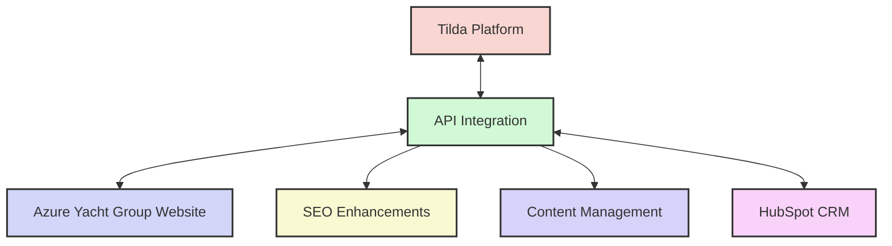
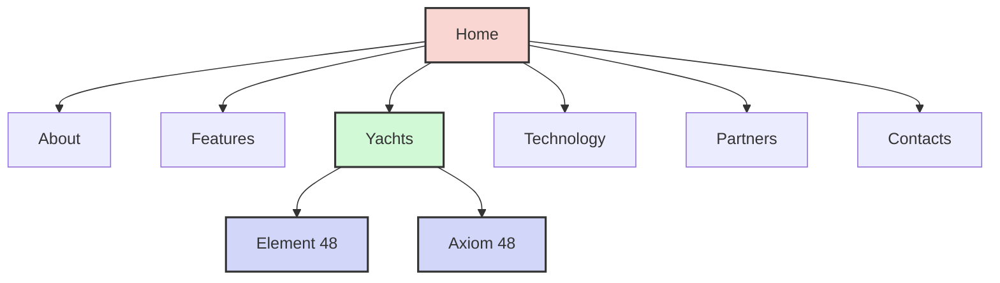
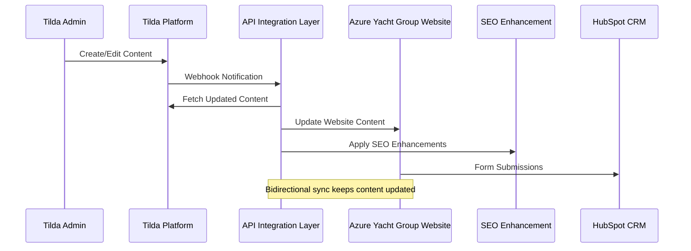
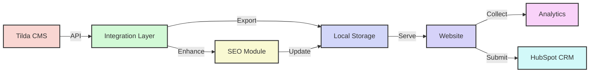
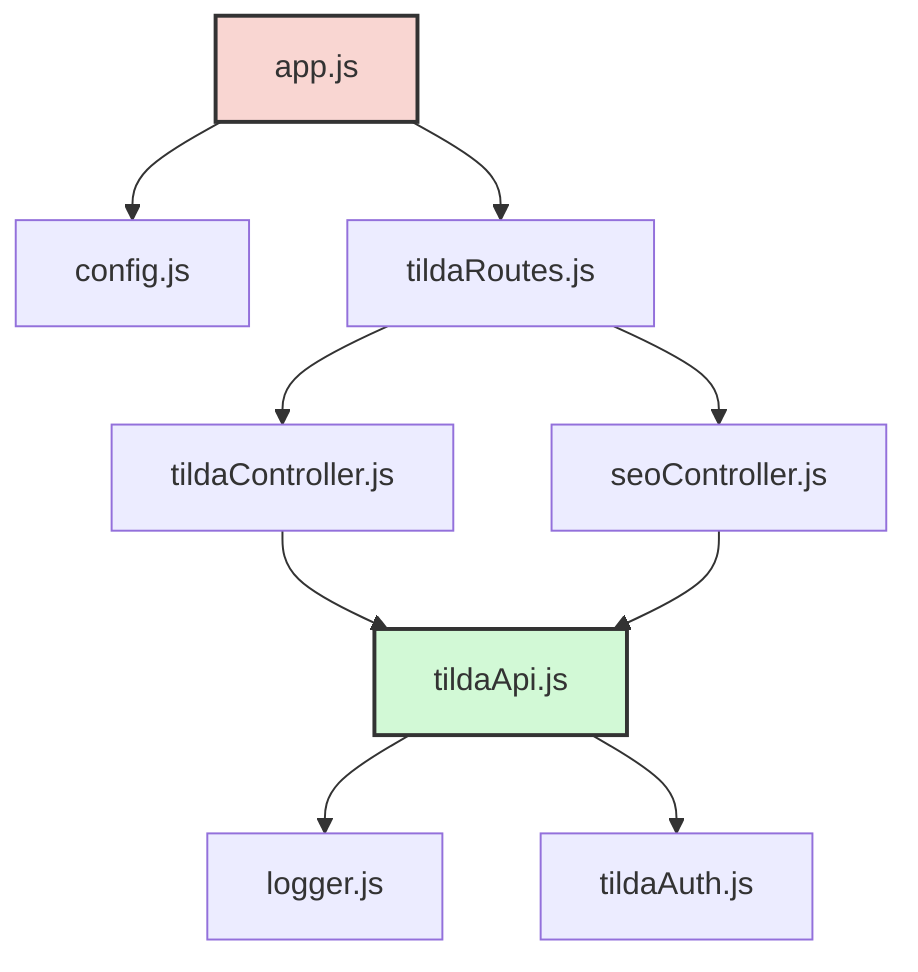
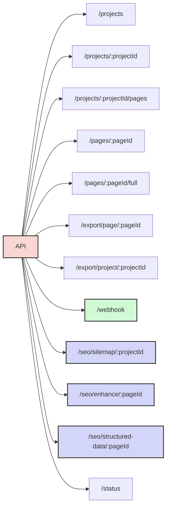
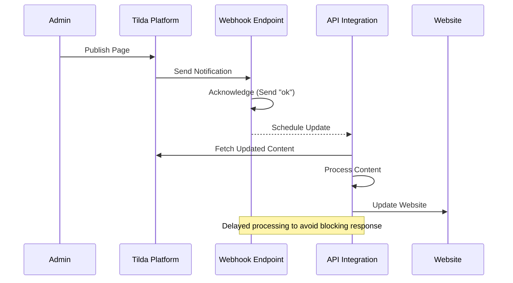
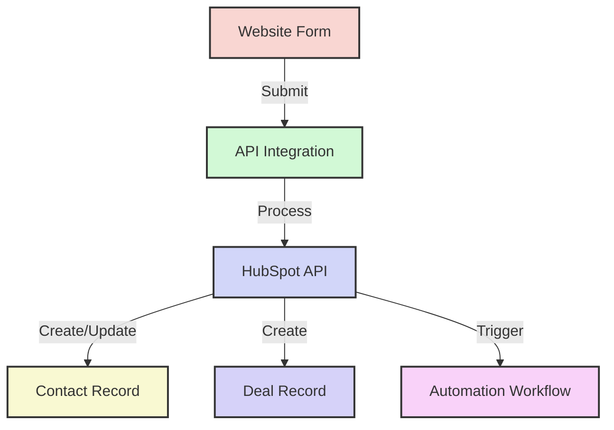

# Azure Yacht Group - Tilda API Integration & SEO Enhancement

This document provides comprehensive information about the Tilda API integration for Azure Yacht Group, including architecture diagrams, website structure analysis, and implementation guidelines.

## Table of Contents

1. [Overview](#overview)
2. [Website Structure Analysis](#website-structure-analysis)
    - [Current Structure (As-Is)](#current-structure-as-is)
    - [Proposed Structure (To-Be)](#proposed-structure-to-be)
3. [Integration Architecture](#integration-architecture)
4. [API Implementation](#api-implementation)
5. [SEO Enhancement Strategy](#seo-enhancement-strategy)
6. [Implementation Guidelines](#implementation-guidelines)
7. [Webhook Integration](#webhook-integration)
8. [HubSpot CRM Integration](#hubspot-crm-integration)

## Overview

The Azure Yacht Group website is built on Tilda, a website builder platform, and requires API integration to enhance its SEO capabilities, create new pages programmatically, and maintain content synchronization. This solution provides a complete API integration that connects to the Tilda API, manipulates website content, and implements SEO best practices.



## Website Structure Analysis

### Current Structure (As-Is)

The current Azure Yacht Group website has a relatively flat structure with the following main sections:



**Current structure analysis:**

1. **Home Page:**
   - Features hero section with Element 48 yacht
   - Introduction to Axiom 48 hybrid yacht
   - Overview of yacht design, brokerage, and management services
   - Company mission and values

2. **About Page:**
   - Company information
   - Team details
   - Limited content depth

3. **Features Page:**
   - Generic features of the yachts
   - Not yacht-specific features

4. **Yachts Section:**
   - Element 48 page
   - Axiom 48 page
   - Limited technical specifications
   - Minimal structured data

5. **Technology Page:**
   - Overview of technologies used
   - Not well-structured for SEO

6. **Partners Page:**
   - List of partners
   - Limited information about partnerships

7. **Contacts Page:**
   - Contact information
   - Form to express interest

**SEO Issues with Current Structure:**

- Flat hierarchy lacks topic clusters
- Limited structured data implementation
- Minimal internal linking strategy
- Lack of dedicated content for specific yacht models
- No FAQ sections with schema markup
- Missing technical specification pages
- Limited metadata optimization

### Proposed Structure (To-Be)

Based on analysis of the website and industry best practices, here's a proposed enhanced structure:

```mermaid
graph TD
    Home --> About
    Home --> Features
    Home --> YachtModels["Yacht Models"]
    Home --> Technology
    Home --> Services
    Home --> Blog
    Home --> Partners
    Home --> Contacts
    
    About --> CompanyHistory["Company History"]
    About --> Team
    About --> Mission
    
    YachtModels --> Element48["Element 48"]
    YachtModels --> Axiom48["Axiom 48"]
    YachtModels --> Element80["Element 80"]
    
    Element48 --> E48Specs["Specifications"]
    Element48 --> E48Features["Features"]
    Element48 --> E48Gallery["Gallery"]
    Element48 --> E48FAQ["FAQ"]
    
    Axiom48 --> A48Specs["Specifications"]
    Axiom48 --> A48Features["Features"]
    Axiom48 --> A48Gallery["Gallery"]
    Axiom48 --> A48FAQ["FAQ"]
    
    Element80 --> E80Specs["Specifications"]
    Element80 --> E80Features["Features"]
    Element80 --> E80Gallery["Gallery"]
    Element80 --> E80FAQ["FAQ"]
    
    Technology --> HybridTech["Hybrid Technology"]
    Technology --> ElectricProp["Electric Propulsion"]
    Technology --> SustainableMaterials["Sustainable Materials"]
    Technology --> InnovativeDesign["Innovative Design"]
    
    Services --> YachtDesign["Yacht Design"]
    Services --> Brokerage
    Services --> YachtManagement["Yacht Management"]
    
    Blog --> HybridYachtGuide["Hybrid Yacht Guide"]
    Blog --> SustainableSailing["Sustainable Sailing"]
    Blog --> LuxuryYachtTrends["Luxury Yacht Trends"]
    
    style Home fill:#f9d6d2,stroke:#333,stroke-width:2px
    style YachtModels fill:#d2f9d6,stroke:#333,stroke-width:2px
    style Element48 fill:#d2d6f9,stroke:#333,stroke-width:2px
    style Axiom48 fill:#d2d6f9,stroke:#333,stroke-width:2px
    style Element80 fill:#d2d6f9,stroke:#333,stroke-width:2px
    style Technology fill:#f9f9d2,stroke:#333,stroke-width:2px
    style Services fill:#d6d2f9,stroke:#333,stroke-width:2px
    style Blog fill:#f9d2f9,stroke:#333,stroke-width:2px
```



**Proposed structure improvements:**

1. **Deeper Hierarchy:**
   - Implement a logical content hierarchy with parent-child relationships
   - Create topic clusters around key subjects (yacht models, technology, services)

2. **Enhanced Yacht Model Pages:**
   - Detailed specifications page for each yacht model
   - Dedicated features page with rich content
   - Gallery page with optimized images
   - FAQ section with structured data

3. **Technology Section Expansion:**
   - Detailed pages on hybrid technology
   - Electric propulsion information
   - Sustainable materials used
   - Innovative design features

4. **Services Restructuring:**
   - Comprehensive yacht design service page
   - Dedicated brokerage page with process explanation
   - Detailed yacht management services

5. **Blog Section Addition:**
   - Educational content about hybrid yachts
   - Industry trends and news
   - Sustainable sailing practices
   - Regular updates for fresh content

## Integration Architecture

The integration between Tilda, the API layer, and the website follows this architecture:



### Data Flow Diagram



## API Implementation

The API integration is built using Node.js and Express, with the following components:



### Key Components

1. **tildaApi.js**: Core service that communicates with the Tilda API
2. **tildaController.js**: Handles API requests for Tilda operations
3. **seoController.js**: Manages SEO enhancement operations
4. **tildaAuth.js**: Manages API authentication
5. **logger.js**: Provides logging functionality
6. **config.js**: Manages application configuration

### API Endpoints

The API provides the following endpoints:



## SEO Enhancement Strategy

The SEO enhancement strategy focuses on the following areas:

```mermaid
graph TD
    SEO[SEO Strategy] --> TechnicalSEO[Technical SEO]
    SEO --> ContentSEO[Content SEO]
    SEO --> StructuredData[Structured Data]
    SEO --> MetaData[Metadata Optimization]
    SEO --> SiteStructure[Site Structure]
    
    TechnicalSEO --> Sitemap[XML Sitemap]
    TechnicalSEO --> Mobile[Mobile Optimization]
    TechnicalSEO --> PageSpeed[Page Speed]
    TechnicalSEO --> HTTPSecurity[HTTPS Security]
    
    ContentSEO --> Keywords[Keyword Research]
    ContentSEO --> TopicClusters[Topic Clusters]
    ContentSEO --> InternalLinking[Internal Linking]
    ContentSEO --> ContentQuality[Content Quality]
    
    StructuredData --> ProductSchema[Product Schema]
    StructuredData --> FAQSchema[FAQ Schema]
    StructuredData --> LocalBusinessSchema[Local Business Schema]
    StructuredData --> BreadcrumbSchema[Breadcrumb Schema]
    
    MetaData --> Titles[Title Tags]
    MetaData --> Descriptions[Meta Descriptions]
    MetaData --> OpenGraph[Open Graph Tags]
    MetaData --> TwitterCards[Twitter Cards]
    
    SiteStructure --> Hierarchy[Logical Hierarchy]
    SiteStructure --> Navigation[Clear Navigation]
    SiteStructure --> URLStructure[SEO-Friendly URLs]
    SiteStructure --> Breadcrumbs[Breadcrumb Navigation]
    
    style SEO fill:#f9d6d2,stroke:#333,stroke-width:2px
    style StructuredData fill:#d2f9d6,stroke:#333,stroke-width:2px
    style ContentSEO fill:#d2d6f9,stroke:#333,stroke-width:2px
```



### SEO Implementation Checklist

For each page on the Azure Yacht Group website:

1. **Technical SEO:**
   - Implement XML sitemap
   - Ensure mobile responsiveness
   - Optimize page loading speed
   - Secure with HTTPS

2. **Metadata Optimization:**
   - Craft unique, keyword-rich title tags (50-60 characters)
   - Write compelling meta descriptions (150-160 characters)
   - Implement Open Graph tags for social sharing
   - Add canonical tags to prevent duplicate content

3. **Structured Data:**
   - Add Product schema for yacht models
   - Implement FAQ schema for questions and answers
   - Add LocalBusiness schema for company information
   - Implement BreadcrumbList schema for navigation

4. **Content Optimization:**
   - Conduct keyword research for each page
   - Create topic clusters around main subjects
   - Implement internal linking strategy
   - Ensure content depth and quality

## Implementation Guidelines

### Setting Up the API

1. **Prerequisites:**
   - Node.js (v14 or later)
   - Tilda Business Plan subscription
   - API public and secret keys from Tilda

2. **Installation:**
   ```bash
   git clone <repository-url>
   cd tilda-api
   npm install
   cp .env.example .env
   # Update .env with your Tilda API credentials
   ```

3. **Starting the API:**
   ```bash
   npm run dev     # For development
   npm start       # For production
   ```

### Directory Structure

```
tilda-api/
├── client/                 # Client utilities
│   └── tilda-client.js     # Command-line client
├── exports/                # Exported content
│   ├── images/             # Downloaded images
│   ├── css/                # CSS files
│   └── js/                 # JavaScript files
├── logs/                   # Application logs
├── src/                    # Source code
│   ├── app.js              # Main application
│   ├── config.js           # Configuration
│   ├── controllers/        # Request handlers
│   │   ├── seoController.js
│   │   └── tildaController.js
│   ├── routes/             # API routes
│   │   └── tildaRoutes.js
│   ├── services/           # Business logic
│   │   └── tildaApi.js
│   └── utils/              # Utilities
│       ├── logger.js
│       └── tildaAuth.js
├── .env                    # Environment variables
├── .env.example            # Example environment file
├── package.json            # Dependencies
├── README.md               # Basic documentation
└── DOCUMENTATION.md        # Comprehensive documentation
```

## Webhook Integration

The webhook integration allows automatic updates when content is published on Tilda:



### Setting Up the Webhook

1. In your Tilda account, go to Site Settings → Export → API Integration
2. Set the webhook URL to `https://your-server.com/api/webhook`
3. Ensure your server is publicly accessible

## HubSpot CRM Integration

Future development will include integration with HubSpot CRM:



### Proposed HubSpot Integration Features

1. Form submissions automatically create/update contacts
2. Lead scoring based on website behavior
3. Deal creation for serious inquiries
4. Automated follow-up sequences
5. Analytics and reporting 