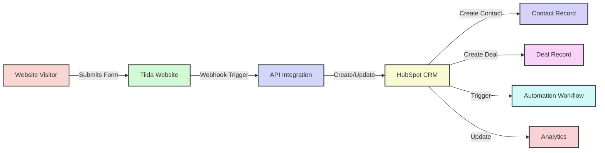
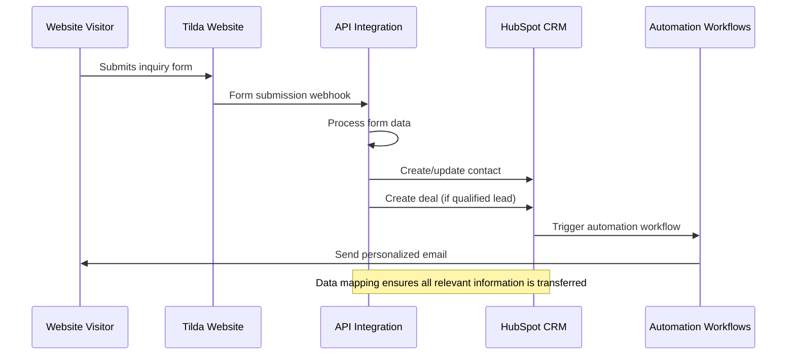
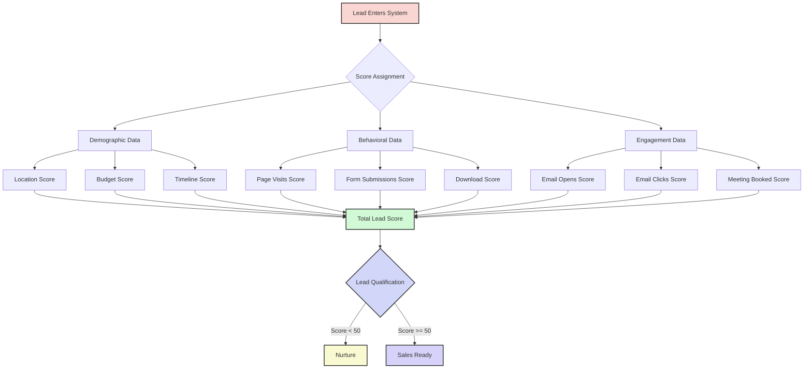
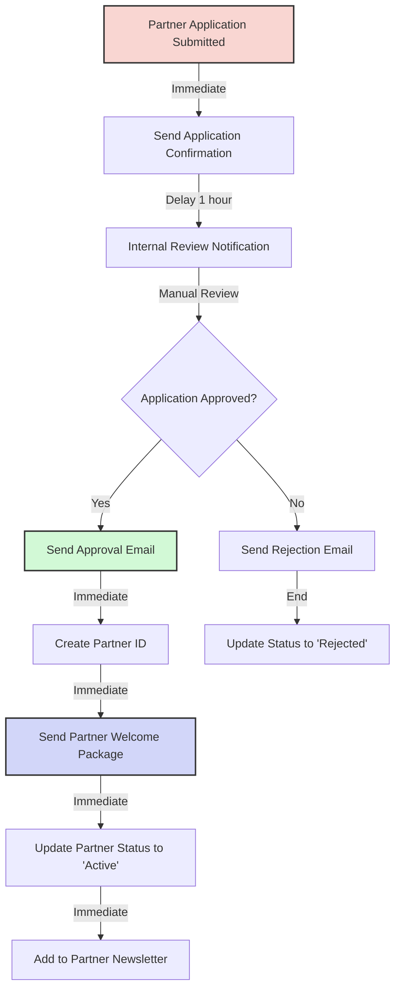
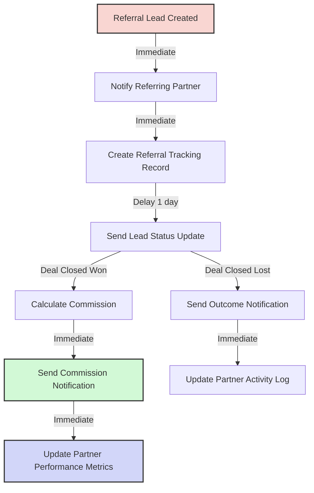
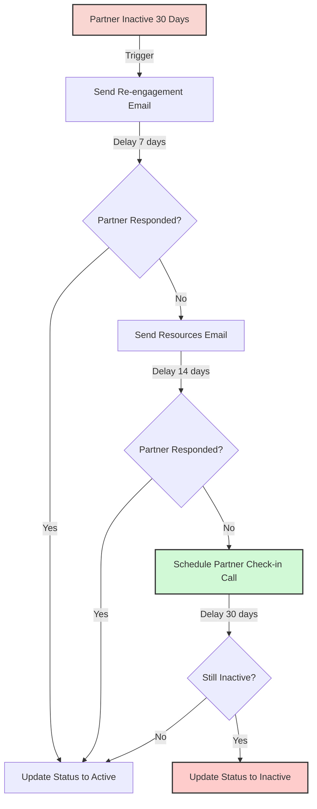
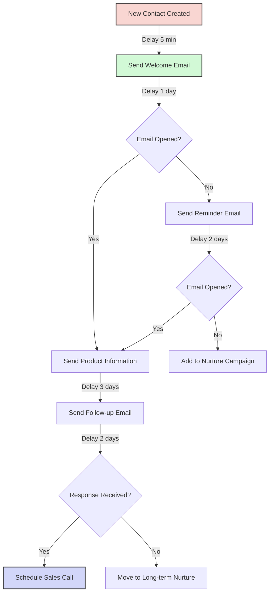
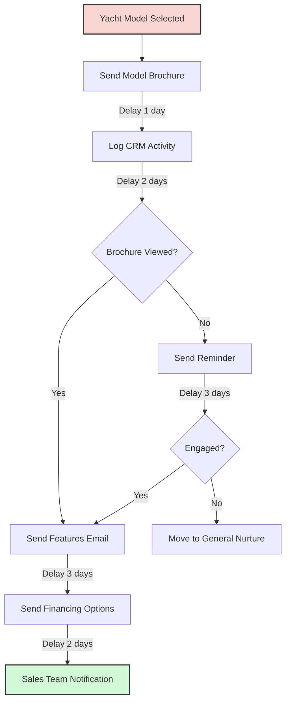

# HubSpot CRM Integration Guide

This guide explains how to integrate the Azure Yacht Group Tilda API with HubSpot CRM to create a seamless lead management system.

## Table of Contents

1. [Overview](#overview)
2. [Architecture](#architecture)
3. [Prerequisites](#prerequisites)
4. [Implementation Steps](#implementation-steps)
5. [Form Integration](#form-integration)
6. [Lead Management](#lead-management)
7. [Automated Workflows](#automated-workflows)
8. [Reporting & Analytics](#reporting--analytics)
9. [Testing & Validation](#testing--validation)

## Overview

The HubSpot CRM integration enables Azure Yacht Group to:

- Automatically capture website leads in HubSpot CRM
- Track customer interactions across touchpoints
- Implement lead scoring and qualification
- Set up automated follow-up sequences
- Track sales pipeline and conversions
- Generate comprehensive reports and analytics



## Architecture

The integration follows this architectural pattern:



## Prerequisites

Before implementing the integration, ensure you have:

1. **HubSpot Account:**
   - Marketing Hub Professional or Enterprise subscription
   - API credentials with proper permissions

2. **Tilda Website Setup:**
   - Tilda Business Plan subscription
   - Forms configured for lead capture
   - Webhook functionality enabled

3. **API Integration:**
   - Functioning Tilda API integration
   - Server with Node.js environment
   - HTTPS endpoint for secure communication

## Implementation Steps

### Step 1: Set Up HubSpot API Connection

1. **Install HubSpot Node.js SDK:**
   ```bash
   npm install @hubspot/api-client
   ```

2. **Configure API Client:**
   ```javascript
   // src/services/hubspotApi.js
   const hubspot = require('@hubspot/api-client');
   const config = require('../config');
   
   class HubSpotApiService {
     constructor() {
       this.client = new hubspot.Client({ 
         accessToken: config.hubspot.apiKey 
       });
     }
     
     // Service methods will be implemented here
   }
   
   module.exports = new HubSpotApiService();
   ```

3. **Add Configuration:**
   ```javascript
   // In src/config.js, add:
   hubspot: {
     apiKey: process.env.HUBSPOT_API_KEY,
     portalId: process.env.HUBSPOT_PORTAL_ID
   }
   ```

4. **Update Environment Variables:**
   ```
   # In .env file, add:
   HUBSPOT_API_KEY=your_hubspot_api_key
   HUBSPOT_PORTAL_ID=your_hubspot_portal_id
   ```

### Step 2: Create HubSpot Properties Mapping

1. **Updated Property Mapping with Latest API Standards:**
   ```javascript
   // src/utils/hubspotMapper.js
   function mapFormToContact(formData) {
     return {
       properties: {
         // Standard HubSpot properties
         email: formData.email,
         firstname: formData.firstName || formData.name?.split(' ')?.[0] || '',
         lastname: formData.lastName || formData.name?.split(' ')?.[1] || '',
         phone: formData.phone || '',
         
         // Charter-specific properties
         yacht_charter_interest: formData.yachtModel || '',
         charter_budget_range: formData.budgetRange || '',
         charter_date_preference: formData.charterDate || '',
         group_size: formData.groupSize || '',
         charter_duration: formData.charterDuration || '',
         charter_destination: formData.destination || '',
         special_requirements: formData.specialRequirements || '',
         
         // Lead tracking properties
         lead_source: formData.leadSource || 'Website Form',
         lead_source_detail: formData.formType || 'General Inquiry',
         original_source: 'Website',
         original_source_drill_down_1: formData.utm_source || '',
         original_source_drill_down_2: formData.utm_medium || '',
         
         // Form tracking properties
         form_submission_date: new Date().toISOString(),
         form_name: formData.formName || 'Customer Inquiry Form',
         form_url: formData.formUrl || '',
         
         // Partner tracking properties
         referral_partner_id: formData.referralPartner || '',
         referral_partner_name: formData.referralPartnerName || '',
         is_referral_lead: formData.referralPartner ? 'true' : 'false',
         
         // Communication preferences
         preferred_contact_method: formData.preferredContact || 'Email',
         best_time_to_contact: formData.bestTimeToContact || '',
         
         // Lifecycle stage
         lifecyclestage: 'lead',
         hs_lead_status: 'NEW'
       }
     };
   }
   
   function mapFormToDeal(formData, contactId) {
     return {
       properties: {
         dealname: `${formData.name || 'Website Lead'} - ${formData.yachtModel || 'Charter Inquiry'}`,
         dealstage: 'appointmentscheduled', // Updated to standard pipeline stage
         pipeline: 'default',
         amount: extractBudgetAmount(formData.budgetRange),
         closedate: calculateCloseDate(formData.charterDate),
         
         // Charter-specific deal properties
         yacht_model_requested: formData.yachtModel || '',
         charter_start_date: formData.charterDate || '',
         charter_group_size: formData.groupSize || '',
         charter_duration_days: formData.charterDuration || '',
         charter_destination: formData.destination || '',
         charter_special_requirements: formData.specialRequirements || '',
         
         // Deal source tracking
         deal_source: formData.leadSource || 'Website Form',
         deal_source_detail: formData.formType || 'General Inquiry',
         referral_partner_deal: formData.referralPartner || '',
         
         // Deal management
         deal_priority: calculateDealPriority(formData.budgetRange, formData.charterDate),
         deal_type: formData.referralPartner ? 'Partner Referral' : 'Direct Lead',
         
         description: `Charter inquiry from ${formData.name || 'Website visitor'}.
         Group Size: ${formData.groupSize || 'Not specified'}
         Budget: ${formData.budgetRange || 'Not specified'}
         Destination: ${formData.destination || 'Not specified'}
         Special Requirements: ${formData.specialRequirements || 'None'}
         ${formData.referralPartner ? `Referred by: ${formData.referralPartner}` : ''}`
       },
       associations: [{
         to: { id: contactId },
         types: [{ category: 'HUBSPOT_DEFINED', typeId: 3 }] // Contact to deal association
       }]
     };
   }
   
   // Helper functions for data processing
   function extractBudgetAmount(budgetRange) {
     if (!budgetRange) return 0;
     
     const budgetMap = {
       '$3,000 - $5,000': 4000,
       '$5,000 - $10,000': 7500,
       '$10,000 - $20,000': 15000,
       '$20,000 - $50,000': 35000,
       '$50,000+': 75000,
       'I need help determining budget': 10000
     };
     
     return budgetMap[budgetRange] || 0;
   }
   
   function calculateCloseDate(charterDate) {
     if (!charterDate) return null;
     
     const charter = new Date(charterDate);
     const closeDate = new Date(charter);
     closeDate.setDate(charter.getDate() - 30); // 30 days before charter
     
     return closeDate.toISOString();
   }
   
   function calculateDealPriority(budgetRange, charterDate) {
     if (!budgetRange || !charterDate) return 'Medium';
     
     const budget = extractBudgetAmount(budgetRange);
     const charter = new Date(charterDate);
     const now = new Date();
     const daysToCharter = Math.floor((charter - now) / (1000 * 60 * 60 * 24));
     
     if (budget >= 50000 && daysToCharter <= 60) return 'High';
     if (budget >= 20000 && daysToCharter <= 90) return 'High';
     if (budget >= 10000 && daysToCharter <= 30) return 'Medium';
     
     return 'Low';
   }
   
   module.exports = {
     mapFormToContact,
     mapFormToDeal,
     extractBudgetAmount,
     calculateCloseDate,
     calculateDealPriority
   };
   ```

2. **Updated Custom Properties for HubSpot (Latest 2025 Standards):**

   **Contact Properties:**
   ```javascript
   // Charter-specific contact properties to create in HubSpot
   const charterContactProperties = [
     {
       name: 'yacht_charter_interest',
       label: 'Yacht Charter Interest',
       type: 'enumeration',
       fieldType: 'select',
       options: [
         { label: 'Motor Yacht', value: 'motor_yacht' },
         { label: 'Sailing Yacht', value: 'sailing_yacht' },
         { label: 'Catamaran', value: 'catamaran' },
         { label: 'Luxury Yacht', value: 'luxury_yacht' },
         { label: 'Sport Yacht', value: 'sport_yacht' },
         { label: 'Expedition Yacht', value: 'expedition_yacht' },
         { label: 'Not Sure', value: 'not_sure' }
       ],
       groupName: 'Charter Information'
     },
     {
       name: 'charter_budget_range',
       label: 'Charter Budget Range',
       type: 'enumeration',
       fieldType: 'select',
       options: [
         { label: '$3,000 - $5,000', value: '3000-5000' },
         { label: '$5,000 - $10,000', value: '5000-10000' },
         { label: '$10,000 - $20,000', value: '10000-20000' },
         { label: '$20,000 - $50,000', value: '20000-50000' },
         { label: '$50,000+', value: '50000+' },
         { label: 'I need help determining budget', value: 'help_needed' }
       ],
       groupName: 'Charter Information'
     },
     {
       name: 'charter_date_preference',
       label: 'Preferred Charter Date',
       type: 'date',
       fieldType: 'date',
       groupName: 'Charter Information'
     },
     {
       name: 'group_size',
       label: 'Group Size',
       type: 'number',
       fieldType: 'number',
       groupName: 'Charter Information'
     },
     {
       name: 'charter_duration',
       label: 'Charter Duration (Days)',
       type: 'enumeration',
       fieldType: 'select',
       options: [
         { label: 'Half Day (4 hours)', value: 'half_day' },
         { label: 'Full Day (8 hours)', value: 'full_day' },
         { label: '2-3 Days', value: '2-3_days' },
         { label: '1 Week', value: '1_week' },
         { label: '2 Weeks', value: '2_weeks' },
         { label: '1 Month+', value: '1_month_plus' }
       ],
       groupName: 'Charter Information'
     },
     {
       name: 'charter_destination',
       label: 'Charter Destination',
       type: 'enumeration',
       fieldType: 'select',
       options: [
         { label: 'Caribbean', value: 'caribbean' },
         { label: 'Mediterranean', value: 'mediterranean' },
         { label: 'South Pacific', value: 'south_pacific' },
         { label: 'Florida/Bahamas', value: 'florida_bahamas' },
         { label: 'Mexico', value: 'mexico' },
         { label: 'Asia', value: 'asia' },
         { label: 'Other', value: 'other' },
         { label: 'Flexible', value: 'flexible' }
       ],
       groupName: 'Charter Information'
     },
     {
       name: 'special_requirements',
       label: 'Special Requirements',
       type: 'string',
       fieldType: 'textarea',
       groupName: 'Charter Information'
     },
     {
       name: 'preferred_contact_method',
       label: 'Preferred Contact Method',
       type: 'enumeration',
       fieldType: 'radio',
       options: [
         { label: 'Email', value: 'email' },
         { label: 'Phone', value: 'phone' },
         { label: 'Text/SMS', value: 'sms' },
         { label: 'WhatsApp', value: 'whatsapp' }
       ],
       groupName: 'Communication Preferences'
     },
     {
       name: 'best_time_to_contact',
       label: 'Best Time to Contact',
       type: 'enumeration',
       fieldType: 'select',
       options: [
         { label: 'Morning (9AM-12PM)', value: 'morning' },
         { label: 'Afternoon (12PM-5PM)', value: 'afternoon' },
         { label: 'Evening (5PM-8PM)', value: 'evening' },
         { label: 'Anytime', value: 'anytime' }
       ],
       groupName: 'Communication Preferences'
     },
     {
       name: 'referral_partner_id',
       label: 'Referral Partner ID',
       type: 'string',
       fieldType: 'text',
       groupName: 'Partner Tracking'
     },
     {
       name: 'referral_partner_name',
       label: 'Referral Partner Name',
       type: 'string',
       fieldType: 'text',
       groupName: 'Partner Tracking'
     },
     {
       name: 'is_referral_lead',
       label: 'Is Referral Lead',
       type: 'bool',
       fieldType: 'booleancheckbox',
       groupName: 'Partner Tracking'
     },
     {
       name: 'form_submission_date',
       label: 'Form Submission Date',
       type: 'datetime',
       fieldType: 'date',
       groupName: 'Form Tracking'
     },
     {
       name: 'form_name',
       label: 'Form Name',
       type: 'string',
       fieldType: 'text',
       groupName: 'Form Tracking'
     },
     {
       name: 'form_url',
       label: 'Form URL',
       type: 'string',
       fieldType: 'text',
       groupName: 'Form Tracking'
     }
   ];
   ```

   **Deal Properties:**
   ```javascript
   // Charter-specific deal properties to create in HubSpot
   const charterDealProperties = [
     {
       name: 'yacht_model_requested',
       label: 'Yacht Model Requested',
       type: 'string',
       fieldType: 'text',
       groupName: 'Charter Details'
     },
     {
       name: 'charter_start_date',
       label: 'Charter Start Date',
       type: 'date',
       fieldType: 'date',
       groupName: 'Charter Details'
     },
     {
       name: 'charter_group_size',
       label: 'Charter Group Size',
       type: 'number',
       fieldType: 'number',
       groupName: 'Charter Details'
     },
     {
       name: 'charter_duration_days',
       label: 'Charter Duration (Days)',
       type: 'string',
       fieldType: 'text',
       groupName: 'Charter Details'
     },
     {
       name: 'charter_destination',
       label: 'Charter Destination',
       type: 'string',
       fieldType: 'text',
       groupName: 'Charter Details'
     },
     {
       name: 'charter_special_requirements',
       label: 'Charter Special Requirements',
       type: 'string',
       fieldType: 'textarea',
       groupName: 'Charter Details'
     },
     {
       name: 'deal_source',
       label: 'Deal Source',
       type: 'enumeration',
       fieldType: 'select',
       options: [
         { label: 'Website Form', value: 'website_form' },
         { label: 'Phone Call', value: 'phone_call' },
         { label: 'Email Inquiry', value: 'email_inquiry' },
         { label: 'Social Media', value: 'social_media' },
         { label: 'Partner Referral', value: 'partner_referral' },
         { label: 'Trade Show', value: 'trade_show' },
         { label: 'Other', value: 'other' }
       ],
       groupName: 'Deal Source'
     },
     {
       name: 'deal_source_detail',
       label: 'Deal Source Detail',
       type: 'string',
       fieldType: 'text',
       groupName: 'Deal Source'
     },
     {
       name: 'referral_partner_deal',
       label: 'Referral Partner',
       type: 'string',
       fieldType: 'text',
       groupName: 'Deal Source'
     },
     {
       name: 'deal_priority',
       label: 'Deal Priority',
       type: 'enumeration',
       fieldType: 'radio',
       options: [
         { label: 'High', value: 'high' },
         { label: 'Medium', value: 'medium' },
         { label: 'Low', value: 'low' }
       ],
       groupName: 'Deal Management'
     },
     {
       name: 'deal_type',
       label: 'Deal Type',
       type: 'enumeration',
       fieldType: 'select',
       options: [
         { label: 'Direct Lead', value: 'direct_lead' },
         { label: 'Partner Referral', value: 'partner_referral' },
         { label: 'Repeat Customer', value: 'repeat_customer' },
         { label: 'Upsell', value: 'upsell' }
       ],
       groupName: 'Deal Management'
     }
   ];
   ```

### Step 3: Implement Core API Methods

1. **Create Contact Methods:**
   ```javascript
   // In HubSpotApiService class
   
   /**
    * Create or update a contact in HubSpot
    * @param {object} formData - The form data submitted by the user
    */
   async createOrUpdateContact(formData) {
     try {
       const contactProperties = mapFormToContact(formData);
       
       // Check if contact exists
       const contacts = await this.client.crm.contacts.searchApi.doSearch({
         filterGroups: [{
           filters: [{
             propertyName: 'email',
             operator: 'EQ',
             value: formData.email
           }]
         }]
       });
       
       if (contacts.results && contacts.results.length > 0) {
         // Update existing contact
         const contactId = contacts.results[0].id;
         await this.client.crm.contacts.basicApi.update(contactId, contactProperties);
         return { contactId, isNew: false };
       } else {
         // Create new contact
         const newContact = await this.client.crm.contacts.basicApi.create(contactProperties);
         return { contactId: newContact.id, isNew: true };
       }
     } catch (error) {
       throw new Error(`Failed to create/update contact: ${error.message}`);
     }
   }
   ```

2. **Create Deal Method:**
   ```javascript
   /**
    * Create a deal in HubSpot linked to a contact
    * @param {object} formData - The form data submitted by the user
    * @param {string} contactId - The HubSpot contact ID
    */
   async createDeal(formData, contactId) {
     try {
       const dealProperties = mapFormToDeal(formData, contactId);
       const deal = await this.client.crm.deals.basicApi.create(dealProperties);
       return deal.id;
     } catch (error) {
       throw new Error(`Failed to create deal: ${error.message}`);
     }
   }
   ```

3. **Log Activity Method:**
   ```javascript
   /**
    * Log activity for a contact
    * @param {string} contactId - The HubSpot contact ID
    * @param {string} title - Activity title
    * @param {string} description - Activity description
    */
   async logActivity(contactId, title, description) {
     try {
       const engagement = {
         engagement: {
           type: 'NOTE' 
         },
         associations: {
           contactIds: [contactId]
         },
         metadata: {
           body: description
         }
       };
       
       await this.client.engagements.engagementsApi.create(engagement);
     } catch (error) {
       throw new Error(`Failed to log activity: ${error.message}`);
     }
   }
   ```

### Step 4: Create Form Submission Controller

```javascript
// src/controllers/hubspotController.js
const hubspotApi = require('../services/hubspotApi');
const logger = require('../utils/logger');

/**
 * Handle form submissions and create HubSpot records
 */
exports.handleFormSubmission = async (req, res) => {
  try {
    const formData = req.body;
    
    // Validate required fields
    if (!formData.email) {
      return res.status(400).json({ 
        success: false, 
        error: 'Email is required' 
      });
    }
    
    // Create or update contact
    const { contactId, isNew } = await hubspotApi.createOrUpdateContact(formData);
    
    // Log activity
    await hubspotApi.logActivity(
      contactId, 
      'Website Form Submission',
      `Form submitted from ${formData.formType || 'website'} form. Message: ${formData.message || 'No message'}`
    );
    
    // Create deal if it's a qualified lead
    let dealId = null;
    if (formData.yachtModel || formData.budget) {
      dealId = await hubspotApi.createDeal(formData, contactId);
    }
    
    // Return success response
    res.json({
      success: true,
      contactId,
      dealId,
      isNewContact: isNew
    });
    
    logger.info(`HubSpot record created - Contact: ${contactId}, Deal: ${dealId || 'None'}`);
  } catch (error) {
    logger.error('Failed to process form submission: %s', error.message);
    res.status(500).json({ success: false, error: error.message });
  }
};
```

### Step 5: Add API Routes

```javascript
// src/routes/hubspotRoutes.js
const express = require('express');
const router = express.Router();
const hubspotController = require('../controllers/hubspotController');

// Form submission endpoint
router.post('/form-submission', hubspotController.handleFormSubmission);

module.exports = router;
```

Add to main app.js:

```javascript
// In app.js
const hubspotRoutes = require('./routes/hubspotRoutes');

// Add HubSpot routes
app.use('/api/hubspot', hubspotRoutes);
```

## Referral Partner Page Integration

### Tilda Referral Partner Page Setup

The referral partner page requires specific HubSpot integration to capture partner applications and track referral activities.

#### Partner Application Form Integration

1. **Updated Partner Contact Properties for HubSpot (Latest 2025 Standards):**
   ```javascript
   // Partner-specific properties to add in HubSpot
   const partnerProperties = [
     {
       name: 'partner_status',
       label: 'Partner Status',
       type: 'enumeration',
       fieldType: 'select',
       options: [
         { label: 'Applied', value: 'applied' },
         { label: 'Under Review', value: 'under_review' },
         { label: 'Approved', value: 'approved' },
         { label: 'Active', value: 'active' },
         { label: 'Inactive', value: 'inactive' },
         { label: 'Suspended', value: 'suspended' },
         { label: 'Terminated', value: 'terminated' }
       ],
       groupName: 'Partner Management'
     },
     {
       name: 'partner_type',
       label: 'Partner Type',
       type: 'enumeration',
       fieldType: 'select',
       options: [
         { label: 'Travel Advisor', value: 'travel_advisor' },
         { label: 'Concierge Service', value: 'concierge_service' },
         { label: 'Event Planner', value: 'event_planner' },
         { label: 'Wealth Manager', value: 'wealth_manager' },
         { label: 'Real Estate Agent', value: 'real_estate' },
         { label: 'Hotel/Resort', value: 'hotel_resort' },
         { label: 'Corporate Services', value: 'corporate_services' },
         { label: 'Other', value: 'other' }
       ],
       groupName: 'Partner Management'
     },
     {
       name: 'partner_id',
       label: 'Partner ID',
       type: 'string',
       fieldType: 'text',
       groupName: 'Partner Management'
     },
     {
       name: 'partner_tier',
       label: 'Partner Tier',
       type: 'enumeration',
       fieldType: 'select',
       options: [
         { label: 'Bronze', value: 'bronze' },
         { label: 'Silver', value: 'silver' },
         { label: 'Gold', value: 'gold' },
         { label: 'Platinum', value: 'platinum' }
       ],
       groupName: 'Partner Management'
     },
     {
       name: 'business_type',
       label: 'Business Type',
       type: 'string',
       fieldType: 'text',
       groupName: 'Partner Information'
     },
     {
       name: 'years_in_business',
       label: 'Years in Business',
       type: 'number',
       fieldType: 'number',
       groupName: 'Partner Information'
     },
     {
       name: 'business_size',
       label: 'Business Size',
       type: 'enumeration',
       fieldType: 'select',
       options: [
         { label: 'Solo/Independent', value: 'solo' },
         { label: 'Small (2-10 employees)', value: 'small' },
         { label: 'Medium (11-50 employees)', value: 'medium' },
         { label: 'Large (50+ employees)', value: 'large' }
       ],
       groupName: 'Partner Information'
     },
     {
       name: 'client_budget_range',
       label: 'Client Budget Range',
       type: 'enumeration',
       fieldType: 'select',
       options: [
         { label: '$3,000-$5,000', value: '3000-5000' },
         { label: '$5,000-$10,000', value: '5000-10000' },
         { label: '$10,000-$25,000', value: '10000-25000' },
         { label: '$25,000-$50,000', value: '25000-50000' },
         { label: '$50,000+', value: '50000+' }
       ],
       groupName: 'Partner Performance'
     },
     {
       name: 'expected_referrals_yearly',
       label: 'Expected Referrals Per Year',
       type: 'enumeration',
       fieldType: 'select',
       options: [
         { label: '1-5', value: '1-5' },
         { label: '6-10', value: '6-10' },
         { label: '11-25', value: '11-25' },
         { label: '25+', value: '25+' }
       ],
       groupName: 'Partner Performance'
     },
     {
       name: 'actual_referrals_yearly',
       label: 'Actual Referrals This Year',
       type: 'number',
       fieldType: 'number',
       groupName: 'Partner Performance'
     },
     {
       name: 'total_revenue_generated',
       label: 'Total Revenue Generated',
       type: 'number',
       fieldType: 'number',
       groupName: 'Partner Performance'
     },
     {
       name: 'commission_rate',
       label: 'Commission Rate (%)',
       type: 'number',
       fieldType: 'number',
       groupName: 'Partner Performance'
     },
     {
       name: 'partner_onboarding_date',
       label: 'Partner Onboarding Date',
       type: 'date',
       fieldType: 'date',
       groupName: 'Partner Management'
     },
     {
       name: 'last_referral_date',
       label: 'Last Referral Date',
       type: 'date',
       fieldType: 'date',
       groupName: 'Partner Performance'
     },
     {
       name: 'partner_agreement_signed',
       label: 'Partner Agreement Signed',
       type: 'bool',
       fieldType: 'booleancheckbox',
       groupName: 'Partner Management'
     },
     {
       name: 'marketing_materials_sent',
       label: 'Marketing Materials Sent',
       type: 'bool',
       fieldType: 'booleancheckbox',
       groupName: 'Partner Management'
     },
     {
       name: 'partner_training_completed',
       label: 'Partner Training Completed',
       type: 'bool',
       fieldType: 'booleancheckbox',
       groupName: 'Partner Management'
     },
     {
       name: 'primary_markets_served',
       label: 'Primary Markets Served',
       type: 'string',
       fieldType: 'textarea',
       groupName: 'Partner Information'
     },
     {
       name: 'specialization_areas',
       label: 'Specialization Areas',
       type: 'enumeration',
       fieldType: 'checkbox',
       options: [
         { label: 'Luxury Travel', value: 'luxury_travel' },
         { label: 'Corporate Events', value: 'corporate_events' },
         { label: 'Weddings', value: 'weddings' },
         { label: 'Family Vacations', value: 'family_vacations' },
         { label: 'Adventure Travel', value: 'adventure_travel' },
         { label: 'Romantic Getaways', value: 'romantic_getaways' }
       ],
       groupName: 'Partner Information'
     }
   ];
   ```

2. **Partner Application Form Mapping:**
   ```javascript
   // src/utils/partnerMapper.js
   function mapPartnerApplicationToContact(formData) {
     return {
       properties: {
         email: formData.businessEmail,
         firstname: formData.firstName || formData.name?.split(' ')?.[0] || '',
         lastname: formData.lastName || formData.name?.split(' ')?.[1] || '',
         phone: formData.phone || '',
         company: formData.companyName || '',
         website: formData.websiteUrl || '',
         jobtitle: formData.titlePosition || '',
         partner_status: 'Applied',
         partner_type: formData.businessType || '',
         business_type: formData.industryType || '',
         years_in_business: formData.yearsInBusiness || '',
         client_budget_range: formData.clientBudgetRange || '',
         expected_referrals_yearly: formData.expectedReferrals || '',
         lead_source: 'Partner Application Form',
         hs_lead_status: 'NEW'
       }
     };
   }
   
   module.exports = { mapPartnerApplicationToContact };
   ```

3. **Partner Application Workflow:**
   ```javascript
   // In HubSpotApiService class
   async processPartnerApplication(formData) {
     try {
       // Create contact with partner properties
       const contactProperties = mapPartnerApplicationToContact(formData);
       const contact = await this.createOrUpdateContact(contactProperties);
       
       // Create a deal for partner onboarding
       const dealProperties = {
         properties: {
           dealname: `Partner Application - ${formData.companyName}`,
           dealstage: 'qualifiedtobuy',
           pipeline: 'partner_onboarding', // Create custom pipeline
           amount: 0,
           description: `Partner application from ${formData.companyName}. Expected ${formData.expectedReferrals} referrals per year.`
         },
         associations: [{
           to: { id: contact.id },
           types: [{ category: 'HUBSPOT_DEFINED', typeId: 3 }]
         }]
       };
       
       const deal = await this.client.crm.deals.basicApi.create(dealProperties);
       
       // Trigger partner review workflow
       await this.triggerPartnerReviewWorkflow(contact.id);
       
       return { contact, deal };
     } catch (error) {
       console.error('Error processing partner application:', error);
       throw error;
     }
   }
   ```

4. **Tilda Form Configuration:**
   ```html
   <!-- Partner Application Form Block (T123) -->
   <form id="partner-application-form" action="/api/partner-application" method="POST">
     <!-- Company Information -->
     <input type="text" name="companyName" placeholder="Company/Organization Name*" required>
     <input type="text" name="name" placeholder="Your Name*" required>
     <input type="text" name="titlePosition" placeholder="Title/Position*" required>
     <input type="email" name="businessEmail" placeholder="Business Email*" required>
     <input type="tel" name="phone" placeholder="Phone Number*" required>
     <input type="url" name="websiteUrl" placeholder="Website URL">
     
     <!-- Business Details -->
     <select name="industryType" required>
       <option value="">Industry/Business Type*</option>
       <option value="Travel Advisor">Travel Advisor/Agency</option>
       <option value="Concierge Service">Concierge Service</option>
       <option value="Event Planner">Event Planner</option>
       <option value="Wealth Manager">Wealth Management</option>
       <option value="Real Estate">Real Estate</option>
       <option value="Other">Other</option>
     </select>
     
     <select name="yearsInBusiness" required>
       <option value="">Years in Business*</option>
       <option value="1-2">1-2 years</option>
       <option value="3-5">3-5 years</option>
       <option value="6-10">6-10 years</option>
       <option value="10+">10+ years</option>
     </select>
     
     <select name="clientBudgetRange">
       <option value="">Average Client Charter Budget Range</option>
       <option value="$5,000-$10,000">$5,000-$10,000</option>
       <option value="$10,000-$25,000">$10,000-$25,000</option>
       <option value="$25,000-$50,000">$25,000-$50,000</option>
       <option value="$50,000+">$50,000+</option>
     </select>
     
     <textarea name="clientDemographics" placeholder="Primary Client Demographics"></textarea>
     
     <!-- Partnership Interest -->
     <select name="hearAboutUs">
       <option value="">How did you hear about us?</option>
       <option value="Google Search">Google Search</option>
       <option value="Social Media">Social Media</option>
       <option value="Referral">Referral</option>
       <option value="Industry Event">Industry Event</option>
       <option value="Other">Other</option>
     </select>
     
     <select name="expectedReferrals">
       <option value="">Expected referrals per year</option>
       <option value="1-5">1-5</option>
       <option value="6-10">6-10</option>
       <option value="11-25">11-25</option>
       <option value="25+">25+</option>
     </select>
     
     <textarea name="additionalComments" placeholder="Additional comments"></textarea>
     
     <button type="submit">Submit Partner Application</button>
   </form>
   ```

#### Partner Referral Tracking

1. **Updated Referral Contact Properties (Latest 2025 Standards):**
   ```javascript
   const referralProperties = [
     {
       name: 'referral_partner_id',
       label: 'Referral Partner ID',
       type: 'string',
       fieldType: 'text',
       groupName: 'Referral Tracking'
     },
     {
       name: 'referral_source_partner',
       label: 'Referral Source Partner',
       type: 'string',
       fieldType: 'text',
       groupName: 'Referral Tracking'
     },
     {
       name: 'is_referral_lead',
       label: 'Is Referral Lead',
       type: 'bool',
       fieldType: 'booleancheckbox',
       groupName: 'Referral Tracking'
     },
     {
       name: 'referral_date',
       label: 'Referral Date',
       type: 'datetime',
       fieldType: 'date',
       groupName: 'Referral Tracking'
     },
     {
       name: 'referral_status',
       label: 'Referral Status',
       type: 'enumeration',
       fieldType: 'select',
       options: [
         { label: 'New Referral', value: 'new' },
         { label: 'Contacted', value: 'contacted' },
         { label: 'Qualified', value: 'qualified' },
         { label: 'Converted', value: 'converted' },
         { label: 'Lost', value: 'lost' }
       ],
       groupName: 'Referral Tracking'
     },
     {
       name: 'referral_commission_amount',
       label: 'Referral Commission Amount',
       type: 'number',
       fieldType: 'number',
       groupName: 'Referral Tracking'
     },
     {
       name: 'referral_commission_paid',
       label: 'Referral Commission Paid',
       type: 'bool',
       fieldType: 'booleancheckbox',
       groupName: 'Referral Tracking'
     },
     {
       name: 'referral_commission_date',
       label: 'Referral Commission Date',
       type: 'date',
       fieldType: 'date',
       groupName: 'Referral Tracking'
     }
   ];
   ```

### Step 2A: Automated Property Creation (Latest 2025 HubSpot API)

1. **Property Creation Service:**
   ```javascript
   // src/services/hubspotPropertyService.js
   const hubspot = require('@hubspot/api-client');

   class HubSpotPropertyService {
     constructor(apiKey) {
       this.hubspotClient = new hubspot.Client({ apiKey });
     }

     /**
      * Create custom properties in HubSpot using latest API
      * @param {Array} properties - Array of property definitions
      * @param {string} objectType - 'contacts', 'deals', 'companies', 'tickets'
      */
     async createCustomProperties(properties, objectType) {
       const results = [];
       
       for (const property of properties) {
         try {
           // Check if property already exists
           const existingProperty = await this.checkPropertyExists(property.name, objectType);
           
           if (existingProperty) {
             console.log(`Property ${property.name} already exists for ${objectType}`);
             results.push({ name: property.name, status: 'exists', property: existingProperty });
             continue;
           }

           // Create property group if it doesn't exist
           if (property.groupName) {
             await this.createPropertyGroup(property.groupName, objectType);
           }

           // Create the property
           const propertyInput = {
             name: property.name,
             label: property.label,
             type: property.type,
             fieldType: property.fieldType,
             groupName: property.groupName || 'contactinformation',
             description: property.description || '',
             options: property.options || [],
             displayOrder: property.displayOrder || -1,
             hasUniqueValue: property.hasUniqueValue || false,
             hidden: property.hidden || false,
             formField: property.formField !== false, // Default to true unless explicitly false
             searchableInGlobalSearch: property.searchableInGlobalSearch || false
           };

           const response = await this.hubspotClient.crm.properties.coreApi.create(
             objectType,
             propertyInput
           );

           console.log(`Successfully created property: ${property.name}`);
           results.push({ name: property.name, status: 'created', property: response });
           
         } catch (error) {
           console.error(`Failed to create property ${property.name}:`, error.message);
           results.push({ name: property.name, status: 'error', error: error.message });
         }
       }
       
       return results;
     }

     /**
      * Check if a property already exists
      */
     async checkPropertyExists(propertyName, objectType) {
       try {
         const response = await this.hubspotClient.crm.properties.coreApi.getByName(
           objectType,
           propertyName
         );
         return response;
       } catch (error) {
         if (error.code === 404) {
           return null; // Property doesn't exist
         }
         throw error;
       }
     }

     /**
      * Create property group if it doesn't exist
      */
     async createPropertyGroup(groupName, objectType) {
       try {
         // Check if group exists
         const existingGroups = await this.hubspotClient.crm.properties.groupsApi.getAll(objectType);
         const groupExists = existingGroups.results.some(group => group.name === groupName);
         
         if (!groupExists) {
           const groupInput = {
             name: groupName,
             label: groupName.replace(/_/g, ' ').replace(/\b\w/g, l => l.toUpperCase()),
             displayOrder: -1
           };
           
           await this.hubspotClient.crm.properties.groupsApi.create(objectType, groupInput);
           console.log(`Created property group: ${groupName}`);
         }
       } catch (error) {
         console.error(`Failed to create property group ${groupName}:`, error.message);
       }
     }

     /**
      * Update existing property
      */
     async updateProperty(propertyName, objectType, updates) {
       try {
         const response = await this.hubspotClient.crm.properties.coreApi.update(
           objectType,
           propertyName,
           updates
         );
         return response;
       } catch (error) {
         console.error(`Failed to update property ${propertyName}:`, error.message);
         throw error;
       }
     }

     /**
      * Setup all Azure Yacht Group properties
      */
     async setupAllProperties() {
       console.log('Setting up all Azure Yacht Group properties...');
       
       // Import property definitions
       const { charterContactProperties, charterDealProperties } = require('../config/propertyDefinitions');
       const { partnerProperties, referralProperties } = require('../config/partnerPropertyDefinitions');
       
       try {
         // Create contact properties
         console.log('Creating contact properties...');
         const contactResults = await this.createCustomProperties([
           ...charterContactProperties,
           ...referralProperties
         ], 'contacts');
         
         // Create deal properties
         console.log('Creating deal properties...');
         const dealResults = await this.createCustomProperties(charterDealProperties, 'deals');
         
         // Create partner properties (also on contacts)
         console.log('Creating partner properties...');
         const partnerResults = await this.createCustomProperties(partnerProperties, 'contacts');
         
         const summary = {
           contacts: contactResults,
           deals: dealResults,
           partners: partnerResults,
           totalCreated: [
             ...contactResults.filter(r => r.status === 'created'),
             ...dealResults.filter(r => r.status === 'created'),
             ...partnerResults.filter(r => r.status === 'created')
           ].length,
           totalErrors: [
             ...contactResults.filter(r => r.status === 'error'),
             ...dealResults.filter(r => r.status === 'error'),
             ...partnerResults.filter(r => r.status === 'error')
           ].length
         };
         
         console.log('Property setup completed:', summary);
         return summary;
         
       } catch (error) {
         console.error('Failed to setup properties:', error);
         throw error;
       }
     }
   }

   module.exports = HubSpotPropertyService;
   ```

2. **Property Setup Script:**
   ```javascript
   // scripts/setupHubSpotProperties.js
   const HubSpotPropertyService = require('../src/services/hubspotPropertyService');
   require('dotenv').config();

   async function setupProperties() {
     if (!process.env.HUBSPOT_API_KEY) {
       console.error('HUBSPOT_API_KEY environment variable is required');
       process.exit(1);
     }

     const propertyService = new HubSpotPropertyService(process.env.HUBSPOT_API_KEY);
     
     try {
       const results = await propertyService.setupAllProperties();
       
       console.log('\n=== PROPERTY SETUP SUMMARY ===');
       console.log(`✅ Total properties created: ${results.totalCreated}`);
       console.log(`❌ Total errors: ${results.totalErrors}`);
       
       if (results.totalErrors > 0) {
         console.log('\n=== ERRORS ===');
         [
           ...results.contacts.filter(r => r.status === 'error'),
           ...results.deals.filter(r => r.status === 'error'),
           ...results.partners.filter(r => r.status === 'error')
         ].forEach(error => {
           console.log(`❌ ${error.name}: ${error.error}`);
         });
       }
       
       console.log('\n=== NEXT STEPS ===');
       console.log('1. Review created properties in HubSpot Settings > Properties');
       console.log('2. Adjust property groups and display orders as needed');
       console.log('3. Test form submissions to verify property mapping');
       console.log('4. Configure property permissions for different user roles');
       
     } catch (error) {
       console.error('Setup failed:', error);
       process.exit(1);
     }
   }

   // Run the setup
   setupProperties();
   ```

3. **Property Validation Service:**
   ```javascript
   // src/services/hubspotValidationService.js
   class HubSpotValidationService {
     constructor(hubspotClient) {
       this.hubspotClient = hubspotClient;
     }

     /**
      * Validate form data against HubSpot property definitions
      */
     async validateFormData(formData, objectType = 'contacts') {
       const errors = [];
       const warnings = [];
       
       try {
         // Get all properties for the object type
         const properties = await this.hubspotClient.crm.properties.coreApi.getAll(objectType);
         const propertyMap = new Map(properties.results.map(p => [p.name, p]));
         
         // Validate each form field
         for (const [fieldName, fieldValue] of Object.entries(formData)) {
           const property = propertyMap.get(fieldName);
           
           if (!property) {
             warnings.push(`Property '${fieldName}' not found in HubSpot`);
             continue;
           }
           
           // Validate based on property type
           const validation = this.validateFieldValue(fieldValue, property);
           if (!validation.valid) {
             errors.push(`${fieldName}: ${validation.error}`);
           }
         }
         
         return {
           valid: errors.length === 0,
           errors,
           warnings
         };
         
       } catch (error) {
         console.error('Validation failed:', error);
         return {
           valid: false,
           errors: ['Validation service error'],
           warnings: []
         };
       }
     }

     /**
      * Validate individual field value
      */
     validateFieldValue(value, property) {
       if (!value && property.required) {
         return { valid: false, error: 'Required field is missing' };
       }
       
       if (!value) {
         return { valid: true }; // Optional field, no value is OK
       }
       
       switch (property.type) {
         case 'string':
           if (typeof value !== 'string') {
             return { valid: false, error: 'Must be a string' };
           }
           break;
           
         case 'number':
           if (isNaN(Number(value))) {
             return { valid: false, error: 'Must be a number' };
           }
           break;
           
         case 'bool':
           if (typeof value !== 'boolean' && value !== 'true' && value !== 'false') {
             return { valid: false, error: 'Must be true or false' };
           }
           break;
           
         case 'enumeration':
           if (property.options && property.options.length > 0) {
             const validValues = property.options.map(opt => opt.value);
             if (!validValues.includes(value)) {
               return { valid: false, error: `Must be one of: ${validValues.join(', ')}` };
             }
           }
           break;
           
         case 'date':
         case 'datetime':
           if (isNaN(Date.parse(value))) {
             return { valid: false, error: 'Must be a valid date' };
           }
           break;
       }
       
       return { valid: true };
     }
   }

   module.exports = HubSpotValidationService;
   ```

2. **Referral Tracking Integration:**
   ```javascript
   async processReferralLead(formData, partnerCode) {
     try {
       // Find partner by code
       const partner = await this.findPartnerByCode(partnerCode);
       
       // Create contact with referral tracking
       const contactProperties = {
         ...mapFormToContact(formData),
         properties: {
           ...mapFormToContact(formData).properties,
           referral_partner_id: partnerCode,
           referral_source_partner: partner?.company || '',
           is_referral_lead: true,
           lead_source: 'Partner Referral'
         }
       };
       
       const contact = await this.createOrUpdateContact(contactProperties);
       
       // Create deal with partner attribution
       const dealProperties = {
         ...mapFormToDeal(formData, contact.id),
         properties: {
           ...mapFormToDeal(formData, contact.id).properties,
           referral_partner_id: partnerCode,
           deal_type: 'Partner Referral'
         }
       };
       
       const deal = await this.client.crm.deals.basicApi.create(dealProperties);
       
       // Notify partner of new referral
       await this.notifyPartnerOfReferral(partner, contact, deal);
       
       return { contact, deal };
     } catch (error) {
       console.error('Error processing referral lead:', error);
       throw error;
     }
   }
   ```

## Form Integration

### Tilda Form Setup

1. **Create Form in Tilda:**
   - Design form with necessary fields
   - Set form submission handling to "Custom"
   - Add JavaScript to handle submission

2. **Add Form Submission Handler:**
   ```javascript
   // Add to Tilda form
   document.getElementById('yacht-inquiry-form').addEventListener('submit', function(e) {
     e.preventDefault();
     
     const formData = {
       name: document.getElementById('name').value,
       email: document.getElementById('email').value,
       phone: document.getElementById('phone').value,
       yachtModel: document.getElementById('yacht-model').value,
       message: document.getElementById('message').value,
       formType: 'Yacht Inquiry',
       budget: document.getElementById('budget').value
     };
     
     fetch('https://your-api-server.com/api/hubspot/form-submission', {
       method: 'POST',
       headers: {
         'Content-Type': 'application/json',
       },
       body: JSON.stringify(formData),
     })
     .then(response => response.json())
     .then(data => {
       if (data.success) {
         // Show success message
         document.getElementById('form-success').style.display = 'block';
       } else {
         // Show error message
         document.getElementById('form-error').style.display = 'block';
       }
     })
     .catch((error) => {
       console.error('Error:', error);
       document.getElementById('form-error').style.display = 'block';
     });
   });
   ```

### Form Types and Field Mapping

Create consistent form types across the website:

1. **General Inquiry Form:**
   - Name
   - Email
   - Phone (optional)
   - Message

2. **Yacht Model Inquiry Form:**
   - Name
   - Email
   - Phone
   - Yacht Model (dropdown)
   - Budget (optional)
   - Timeline (optional)
   - Message

3. **Brochure Request Form:**
   - Name
   - Email
   - Phone (optional)
   - Yacht Model (dropdown)
   - Address (for physical brochures)

## Lead Management

### Lead Scoring

Implement a lead scoring system in HubSpot:



### Lead Qualification Criteria

Set up lead qualification based on:

1. **Explicit Interest:**
   - Specific yacht model inquiry
   - Budget provided
   - Timeline specified

2. **Engagement Level:**
   - Multiple page visits
   - Form submissions
   - Content downloads

3. **Contact Quality:**
   - Complete contact information
   - Location in target market
   - Business email vs. personal email

## Automated Workflows

Set up the following workflows in HubSpot:

### Partner-Specific Workflows

#### 1. Partner Application Review Workflow



#### 2. Partner Referral Notification Workflow



#### 3. Partner Engagement Workflow



### 1. New Lead Welcome Sequence



### 2. Yacht Model Interest Workflow



## Reporting & Analytics

Set up the following reports in HubSpot:

### Standard Reports

1. **Lead Source Analysis:**
   - Track which channels generate the most leads
   - Analyze conversion rates by source

2. **Form Performance:**
   - Monitor form submission rates
   - Track conversion by form type

3. **Lead Quality Metrics:**
   - Average lead score by source
   - Qualification rate over time

4. **Sales Pipeline Metrics:**
   - Leads to opportunity conversion rate
   - Average deal size by yacht model
   - Sales cycle duration

### Partner Program Reports

5. **Partner Performance Dashboard:**
   - Total active partners
   - Partner application approval rate
   - Average time from application to approval
   - Partner status distribution

6. **Referral Analytics:**
   - Total referrals by partner
   - Referral conversion rates
   - Average deal size from referrals
   - Commission payouts by partner

7. **Partner Engagement Metrics:**
   - Partner activity levels
   - Communication response rates
   - Partner retention rates
   - Time to first referral

8. **Revenue Attribution:**
   - Revenue generated by partner referrals
   - Partner ROI analysis
   - Commission vs. revenue ratios
   - Top performing partner segments

### Custom Dashboards

Create custom dashboards for different stakeholders:

#### Partner Manager Dashboard
- Active partner count
- Pending applications
- Recent referral activity
- Commission payouts due
- Partner engagement alerts

#### Sales Team Dashboard
- Referral leads in pipeline
- Partner-attributed deals
- Referral lead quality scores
- Partner contact information

#### Executive Dashboard
- Partner program ROI
- Total partner-generated revenue
- Partner acquisition trends
- Program growth metrics

## Updated HubSpot Properties Implementation Guide (2025)

### Quick Setup Instructions

1. **Install Latest HubSpot API Client:**
   ```bash
   npm install @hubspot/api-client@latest
   ```

2. **Run Property Setup Script:**
   ```bash
   node scripts/setupHubSpotProperties.js
   ```

3. **Verify Properties in HubSpot:**
   - Go to Settings > Properties
   - Check all new property groups are created
   - Verify field types and options are correct

### Property Groups Created

| Group Name | Object Type | Properties Count | Purpose |
|------------|-------------|------------------|---------|
| Charter Information | Contacts | 7 | Yacht charter preferences and requirements |
| Communication Preferences | Contacts | 2 | How and when to contact customers |
| Partner Tracking | Contacts | 3 | Referral partner attribution |
| Form Tracking | Contacts | 3 | Form submission metadata |
| Charter Details | Deals | 6 | Specific charter booking information |
| Deal Source | Deals | 3 | Lead source and attribution |
| Deal Management | Deals | 2 | Priority and type classification |
| Partner Management | Contacts | 8 | Partner status and onboarding |
| Partner Information | Contacts | 4 | Partner business details |
| Partner Performance | Contacts | 6 | Partner metrics and performance |
| Referral Tracking | Contacts | 8 | Referral status and commission tracking |

### Key Improvements in 2025 Update

1. **Enhanced Data Structure:**
   - Proper field types for better data validation
   - Organized property groups for easier management
   - Standardized option values for consistent reporting

2. **Advanced Tracking:**
   - Automated deal priority calculation
   - Enhanced partner performance metrics
   - Comprehensive referral commission tracking

3. **Better Integration:**
   - Automated property creation via API
   - Data validation before submission
   - Error handling and logging

4. **Improved User Experience:**
   - Clear property labels and descriptions
   - Logical field grouping
   - Mobile-friendly field types

### Usage Examples

1. **Create Properties Programmatically:**
   ```javascript
   const propertyService = new HubSpotPropertyService(process.env.HUBSPOT_API_KEY);
   await propertyService.setupAllProperties();
   ```

2. **Validate Form Data:**
   ```javascript
   const validationService = new HubSpotValidationService(hubspotClient);
   const validation = await validationService.validateFormData(formData);
   if (!validation.valid) {
     console.log('Validation errors:', validation.errors);
   }
   ```

3. **Map Form Data with New Properties:**
   ```javascript
   const contactData = mapFormToContact({
     name: 'John Doe',
     email: 'john@example.com',
     yachtModel: 'motor_yacht',
     budgetRange: '10000-20000',
     destination: 'caribbean',
     referralPartner: 'AZURE-TRAVEL-001'
   });
   ```

## Testing & Validation

Before launching the integration:

1. **Test Property Creation:**
   - Run the property setup script in a test environment
   - Verify all properties are created correctly
   - Check property groups and field types

2. **Test Form Submissions:**
   - Submit test forms for each form type
   - Verify contact creation in HubSpot
   - Check property mapping accuracy

3. **Validate Data Flow:**
   - Test partner referral tracking
   - Verify deal creation and priority calculation
   - Check commission tracking functionality

2. **Validate Workflows:**
   - Test each automation workflow
   - Verify email delivery and tracking
   - Check task creation for sales team

3. **Test Edge Cases:**
   - Duplicate contact handling
   - Form submission with missing fields
   - Error handling and recovery

4. **Performance Testing:**
   - Test multiple simultaneous submissions
   - Verify API rate limit handling
   - Check response times under load

## Conclusion

This HubSpot CRM integration creates a seamless connection between the Azure Yacht Group website and your customer relationship management system. By automating lead capture, qualification, and nurturing, you'll be able to more effectively convert website visitors into yacht buyers while providing a premium customer experience that matches your luxury brand. 