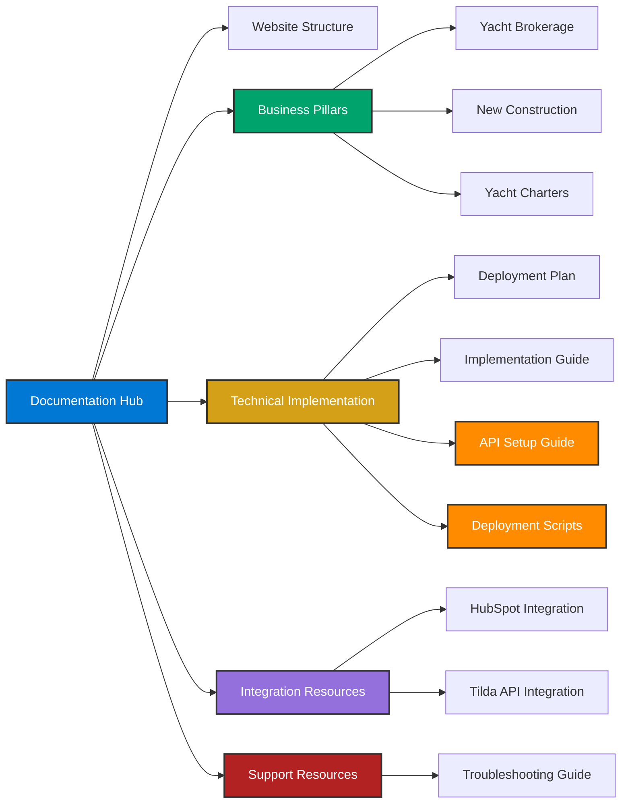

# Azure Yacht Group Documentation Hub

  

### *Premium Yachting Experience*

  
 &nbsp;&nbsp;
 &nbsp;&nbsp;
 &nbsp;&nbsp;
 &nbsp;&nbsp;

---

## Welcome to the Azure Yacht Group Documentation

This hub provides a comprehensive collection of documentation for the Azure Yacht Group website project, focusing on our three core business pillars: Yacht Brokerage, New Construction, and Yacht Charters.

---

## Core Documentation

<table>
  <tr>
    <td width="33%" align="center">
       
      <strong>Main Documentation</strong> 
      <a href="DOCUMENTATION.md">View Document</a>
      
Comprehensive information about the Tilda API integration, architecture diagrams, website structure analysis, and implementation guidelines.

    </td>
    <td width="33%" align="center">
       
      <strong>Website Structure</strong> 
      <a href="WEBSITE_STRUCTURE.md">View Document</a>
      
Detailed information on the reimagined website structure built around three core business pillars.

    </td>
    <td width="33%" align="center">
       
      <strong>Deployment Plan</strong> 
      <a href="DEPLOYMENT_PLAN.md">View Document</a>
      
Comprehensive timeline and strategy for implementing the website structure and features.

    </td>
  </tr>
</table>

---

## Business Pillars

### Yacht Brokerage

  

The Yacht Brokerage pillar connects buyers with existing yachts and helps yacht owners sell their vessels.

**Key Services:**
- Professional yacht listings
- Market valuation
- Buyer representation
- Seller services
- Transaction management

*This section is covered in the [Website Structure Documentation](WEBSITE_STRUCTURE.md#1-yacht-brokerage-pillar)*

---

### New Construction

  

The New Construction pillar showcases Azure Yacht Group's custom yacht building capabilities.

**Key Services:**
- Model lineup showcase
- Custom yacht design
- Build progress tracking
- Shipyard partnerships
- Delivery management

*This section is covered in the [Website Structure Documentation](WEBSITE_STRUCTURE.md#2-new-construction-pillar)*

---

### Yacht Charters

  

The Yacht Charters pillar promotes luxury yacht charter services and experiences.

**Key Services:**
- Destination planning
- Yacht selection
- Crew matching
- Experience customization
- Itinerary development

*For detailed information, see the [Yacht Charters Documentation](YACHT_CHARTERS.md)*

---

## Implementation Resources

<table>
  <tr>
    <td width="25%" align="center">
       
      <strong>Implementation Guide</strong> 
      <a href="IMPLEMENTATION_GUIDE.md">View Document</a>
      
Step-by-step approach to implementing the Tilda API integration and SEO enhancements.

    </td>
    <td width="25%" align="center">
       
      <strong>HubSpot Integration</strong> 
      <a href="HUBSPOT_INTEGRATION.md">View Document</a>
      
Comprehensive guide for integrating HubSpot CRM with the website.

    </td>
    <td width="25%" align="center">
       
      <strong>API Setup Guide</strong> 
      <a href="API_SETUP_GUIDE.md">View Document</a>
      
Instructions for setting up and troubleshooting the Tilda API connection.

    </td>
    <td width="25%" align="center">
       
      <strong>Deployment Scripts</strong> 
      <a href="DEPLOYMENT_SCRIPTS.md">View Document</a>
      
Guide to using automated scripts for environment setup and deployment.

    </td>
  </tr>
</table>

---

## Support Resources

<table>
  <tr>
    <td width="100%" align="center">
       
      <strong>Troubleshooting Guide</strong> 
      <a href="TROUBLESHOOTING.md">View Document</a>
      
Solutions to common issues that may arise when using the Azure Yacht Group Tilda API integration.

    </td>
  </tr>
</table>

---

## Quick Access Document Links

| Document | Description | Business Pillar |
|----------|-------------|----------------|
| [DOCUMENTATION.md](DOCUMENTATION.md) | Main technical documentation | All |
| [WEBSITE_STRUCTURE.md](WEBSITE_STRUCTURE.md) | Website structure & architecture | All |
| [DEPLOYMENT_PLAN.md](DEPLOYMENT_PLAN.md) | Implementation timeline & strategy | All |
| [YACHT_CHARTERS.md](YACHT_CHARTERS.md) | Yacht charters section documentation | Charters |
| [IMPLEMENTATION_GUIDE.md](IMPLEMENTATION_GUIDE.md) | Step-by-step implementation guide | Technical |
| [HUBSPOT_INTEGRATION.md](HUBSPOT_INTEGRATION.md) | HubSpot CRM integration guide | Marketing |
| [API_SETUP_GUIDE.md](API_SETUP_GUIDE.md) | Tilda API setup and troubleshooting | Technical |
| [DEPLOYMENT_SCRIPTS.md](DEPLOYMENT_SCRIPTS.md) | Guide to deployment scripts | DevOps |
| [TROUBLESHOOTING.md](TROUBLESHOOTING.md) | Solutions to common issues | Support |

---

## Getting Started

If you're new to this documentation, we recommend starting with these resources:

1. First, review the [Main Documentation](DOCUMENTATION.md) for an overview
2. Follow the [API Setup Guide](API_SETUP_GUIDE.md) to configure your development environment
3. Explore the [Website Structure](WEBSITE_STRUCTURE.md) to understand the business pillars
4. Review the [Deployment Plan](DEPLOYMENT_PLAN.md) for implementation timeline
5. Use the [Deployment Scripts](DEPLOYMENT_SCRIPTS.md) to automate environment setup and deployment
6. Refer to the [Troubleshooting Guide](TROUBLESHOOTING.md) when you encounter issues

---

  
**Azure Yacht Group**

*Transforming the luxury yachting experience*

[Technical Support](mailto:support@azureyachtgroup.com) | [Website](https://azureyachtgroup.com)

---

  <small>Last updated: April 2025</small>

 