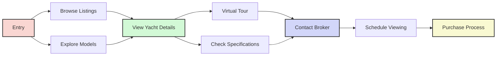
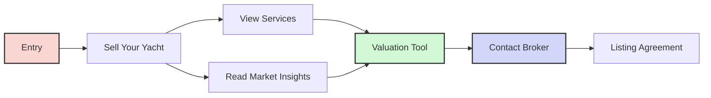
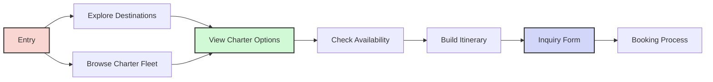
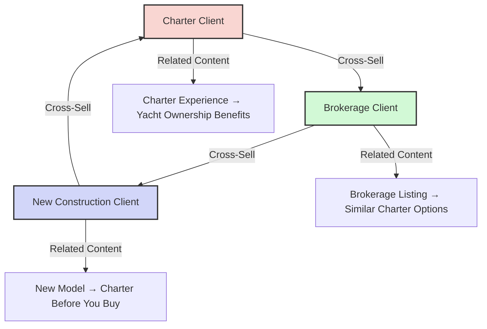
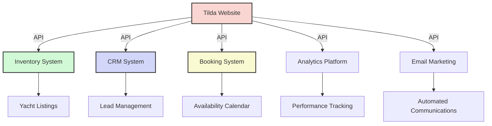
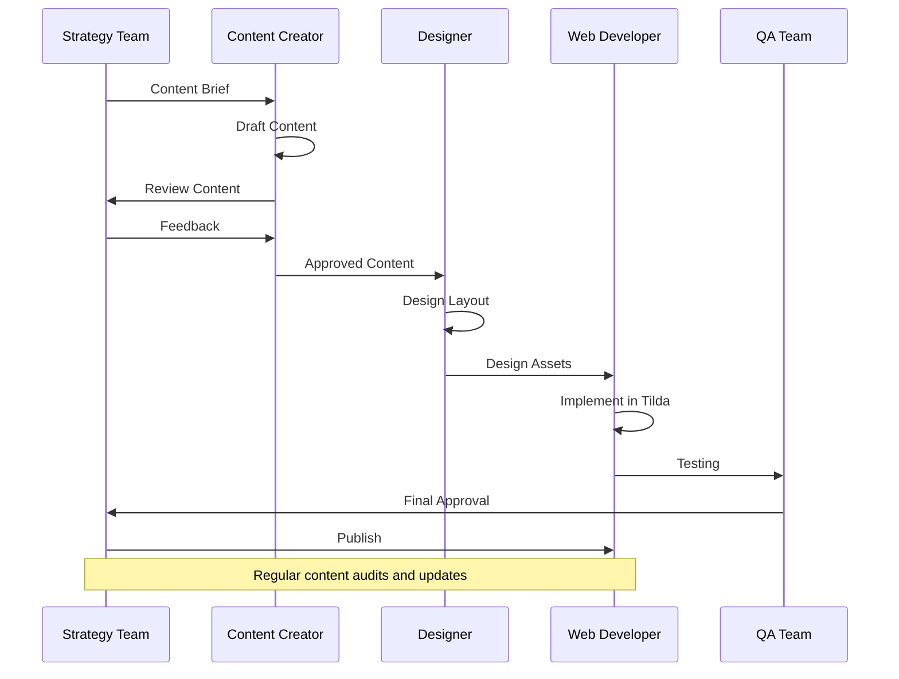
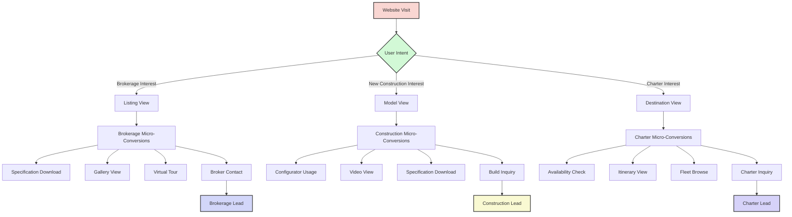

# Azure Yacht Group: Reimagined Website Structure

This document outlines the reimagined website structure for Azure Yacht Group, focusing on the three core business pillars: Yacht Brokerage, New Construction, and Yacht Charters.

## Table of Contents

1. [Strategic Overview](#strategic-overview)
2. [Core Business Pillars](#core-business-pillars)
3. [Information Architecture](#information-architecture)
4. [User Journeys](#user-journeys)
5. [Technical Implementation](#technical-implementation)
6. [Content Strategy](#content-strategy)
7. [SEO Strategy](#seo-strategy)
8. [Analytics Framework](#analytics-framework)
9. [Mobile Strategy](#mobile-strategy)

## Strategic Overview

### Business-First Approach

The reimagined website structure places the three core business areas at the forefront of the user experience:

1. **Yacht Brokerage** - Connecting buyers and sellers of existing yachts
2. **New Construction** - Custom yacht building and new model sales
3. **Yacht Charters** - Luxury yacht charter services

This structure transforms the website from an information repository into a powerful sales and marketing tool that clearly communicates Azure Yacht Group's three distinct business areas while guiding users along intuitive paths to conversion.

### Key Strategic Benefits

- **Business Clarity**: Clearly defines what Azure Yacht Group does
- **User-Centered Navigation**: Organizes content based on customer needs
- **Conversion Optimization**: Creates clear pathways toward business inquiries
- **Cross-Selling Opportunities**: Facilitates discovery of additional services
- **SEO Enhancement**: Creates strong topical content clusters

## Core Business Pillars

### Complete Website Structure

```mermaid
graph TD
    Home --> Brokerage["Yacht Brokerage"]
    Home --> NewConstruction["New Construction"]
    Home --> Charters["Yacht Charters"]
    Home --> AboutUs["About Us"]
    Home --> Technology["Technology & Innovation"]
    Home --> Resources["Resources"]
    Home --> Contact["Contact"]
    
    %% BROKERAGE SECTION - Primary Business Pillar 1
    Brokerage --> CurrentListings["Current Listings"]
    Brokerage --> SellYourYacht["Sell Your Yacht"]
    Brokerage --> MarketInsights["Market Insights"]
    Brokerage --> BuyingProcess["Buying Process"]
    Brokerage --> SpecialOffers["Special Offers"]
    
    CurrentListings --> MotorYachts["Motor Yachts"]
    CurrentListings --> SailingYachts["Sailing Yachts"]
    CurrentListings --> EcoFriendly["Eco-Friendly Yachts"]
    
    %% NEW CONSTRUCTION SECTION - Primary Business Pillar 2
    NewConstruction --> Models["Yacht Models"]
    NewConstruction --> BuildProcess["Build Process"]
    NewConstruction --> Customization["Customization Options"]
    NewConstruction --> Shipyard["Shipyard Partners"]
    NewConstruction --> DeliveryTimeline["Delivery Timeline"]
    
    Models --> Element48["Element 48"]
    Models --> Axiom48["Axiom 48"]
    Models --> Element80["Element 80"]
    
    Element48 --> E48Specs["Specifications"]
    Element48 --> E48Features["Features"]
    Element48 --> E48Gallery["Gallery"]
    Element48 --> E48Customization["Customization"]
    Element48 --> E48FAQ["FAQ"]
    
    Axiom48 --> A48Specs["Specifications"]
    Axiom48 --> A48Features["Features"]
    Axiom48 --> A48Gallery["Gallery"]
    Axiom48 --> A48Customization["Customization"]
    Axiom48 --> A48FAQ["FAQ"]
    
    Element80 --> E80Specs["Specifications"]
    Element80 --> E80Features["Features"]
    Element80 --> E80Gallery["Gallery"]
    Element80 --> E80Customization["Customization"]
    Element80 --> E80FAQ["FAQ"]
    
    %% CHARTERS SECTION - Primary Business Pillar 3
    Charters --> Destinations["Destinations"]
    Charters --> CharterFleet["Charter Fleet"]
    Charters --> CharterTypes["Charter Types"]
    Charters --> Experiences["Curated Experiences"]
    Charters --> BookingProcess["Booking Process"]
    Charters --> CrewProfiles["Crew Profiles"]
    Charters --> GuestTestimonials["Guest Testimonials"]
    
    Destinations --> Mediterranean["Mediterranean"]
    Destinations --> Caribbean["Caribbean"]
    Destinations --> ExoticLocations["Exotic Locations"]
    Destinations --> SeasonalGuide["Seasonal Guide"]
    
    CharterTypes --> PrivateCharters["Private Charters"]
    CharterTypes --> CorporateEvents["Corporate Events"]
    CharterTypes --> SpecialOccasions["Special Occasions"]
    CharterTypes --> DayCharters["Day Charters"]
    
    %% ABOUT US SECTION
    AboutUs --> CompanyStory["Company Story"]
    AboutUs --> Team["Our Team"]
    AboutUs --> Values["Values & Mission"]
    AboutUs --> Sustainability["Sustainability Commitment"]
    AboutUs --> Partners["Strategic Partners"]
    AboutUs --> Careers["Careers"]
    
    %% TECHNOLOGY SECTION
    Technology --> HybridPropulsion["Hybrid Propulsion"]
    Technology --> SustainableMaterials["Sustainable Materials"]
    Technology --> SmartSystems["Smart Systems"]
    Technology --> Innovation["Innovation Lab"]
    
    %% RESOURCES SECTION
    Resources --> Blog["Blog & News"]
    Resources --> YachtingGuides["Yachting Guides"]
    Resources --> Webinars["Webinars & Events"]
    Resources --> FAQ["Frequently Asked Questions"]
    Resources --> Financing["Financing Options"]
    Resources --> Ownership["Ownership Program"]
    
    Blog --> MarketTrends["Market Trends"]
    Blog --> DestinationSpotlights["Destination Spotlights"]
    Blog --> YachtLifestyle["Yacht Lifestyle"]
    Blog --> EcoYachting["Eco Yachting"]
    
    style Home fill:#f9d6d2,stroke:#333,stroke-width:2px
    style Brokerage fill:#d2f9d6,stroke:#333,stroke-width:2px,stroke-width:3px
    style NewConstruction fill:#d2d6f9,stroke:#333,stroke-width:2px,stroke-width:3px
    style Charters fill:#f9f9d2,stroke:#333,stroke-width:2px,stroke-width:3px
    style CurrentListings fill:#d6d2f9,stroke:#333,stroke-width:2px
    style Models fill:#f9d2f9,stroke:#333,stroke-width:2px
    style Destinations fill:#d2f9f9,stroke:#333,stroke-width:2px
```



### 1. Yacht Brokerage Pillar

**Purpose**: To connect buyers with existing yachts and help yacht owners sell their vessels

**Key Sections**:
- **Current Listings**: Inventory of available yachts
- **Sell Your Yacht**: Services for yacht owners
- **Market Insights**: Industry trends and valuation information
- **Buying Process**: Educational content for buyers
- **Special Offers**: Featured listings and promotions

**Key Features**:
- Advanced yacht search functionality
- Detailed yacht listings with specifications
- Virtual tours of available yachts
- Valuation tools
- Broker profiles and contact information

### 2. New Construction Pillar

**Purpose**: To showcase Azure Yacht Group's custom yacht building capabilities

**Key Sections**:
- **Yacht Models**: Model lineup with detailed specifications
- **Build Process**: Step-by-step explanation of yacht construction
- **Customization Options**: Available customizations and options
- **Shipyard Partners**: Featured construction partners
- **Delivery Timeline**: Expected build and delivery schedules

**Key Features**:
- Interactive yacht configurator
- Construction progress tracking
- Detailed technical specifications
- Customization visualization tools
- Shipyard virtual tours

### 3. Yacht Charters Pillar

**Purpose**: To promote luxury yacht charter services

**Key Sections**:
- **Destinations**: Charter locations and itineraries
- **Charter Fleet**: Yachts available for charter
- **Charter Types**: Different charter options (private, corporate, etc.)
- **Curated Experiences**: Special theme-based charters
- **Booking Process**: How to book a charter
- **Crew Profiles**: Information about available crews
- **Guest Testimonials**: Reviews and experiences

**Key Features**:
- Interactive destination maps
- Availability calendar
- Budget calculator
- Itinerary builder
- Crew matching tool

## Information Architecture

### Navigation Structure

1. **Primary Navigation**
   - Main menu featuring the three business pillars and supporting sections
   - Mega-menus for business pillars with quick access to key subsections
   - Utility navigation for search, language, and contact

2. **Secondary Navigation**
   - Context-specific sidebar navigation within each section
   - Breadcrumb trails for orientation
   - "Related content" cross-links between sections

3. **Footer Navigation**
   - Quick links to all main sections
   - Contact information
   - Social media links
   - Legal information

### Content Organization Principles

1. **Business-First Hierarchy**
   - Organize by business function rather than content type
   - Place high-conversion pages at shallower levels
   - Position cross-selling opportunities strategically

2. **Progressive Disclosure**
   - Present essential information first
   - Layer additional details for users who want to dive deeper
   - Maintain clarity at every level of detail

3. **Cross-Pillar Connections**
   - Link related content across business areas
   - Create natural pathways between business pillars
   - Highlight complementary services

## User Journeys

### Primary User Flows

1. **Yacht Buyer Journey**


2. **Yacht Seller Journey**


3. **Charter Client Journey**


### Cross-Selling Opportunities



## Technical Implementation

### Tilda Implementation Strategy

1. **Page Templates**
   - Develop consistent templates for each section
   - Create reusable blocks for common elements
   - Establish visual distinction between business pillars

2. **Component Library**
   - Yacht listing component
   - Specification tables
   - Image galleries
   - Inquiry forms
   - Testimonial displays
   - Interactive maps

3. **Advanced Functionality**
   - Integration with inventory management system
   - Charter booking system integration
   - CRM connection for lead management
   - User accounts for saved searches and favorites

### API Integration Points



## Content Strategy

### Content Types by Pillar

1. **Yacht Brokerage Content**
   - Listing descriptions and specifications
   - Yacht photography and videos
   - Market reports and pricing guides
   - Buyer and seller guides
   - Broker profiles and expertise

2. **New Construction Content**
   - Model specifications and features
   - Construction process documentation
   - Customization options
   - Design philosophy
   - Technical innovations

3. **Yacht Charters Content**
   - Destination guides
   - Itinerary suggestions
   - Charter yacht profiles
   - Crew biographies
   - Experience descriptions
   - Client testimonials

### Content Creation Workflow



## SEO Strategy

### Pillar-Based SEO Approach

1. **Topic Clusters**
   - Core pillar pages for each business area
   - Cluster content organized around primary keywords
   - Strong internal linking structure

2. **Keyword Strategy**
   - Primary keywords by business pillar:
     - Brokerage: "luxury yacht for sale," "yacht broker," "buy yacht"
     - New Construction: "custom yacht builder," "luxury yacht design," "new yacht construction"
     - Charters: "luxury yacht charter," "yacht rental," "private yacht vacation"

3. **Technical SEO**
   - Clean URL structure reflecting business pillars
   - Structured data implementation
   - Mobile optimization
   - Page speed optimization

### Structured Data Implementation

```
Brokerage Listings: Product Schema
Charter Offerings: TripAction Schema
Yacht Models: Product Schema
FAQ Sections: FAQPage Schema
Testimonials: Review Schema
Team Members: Person Schema
```

## Analytics Framework

### Business KPIs by Pillar

1. **Brokerage Metrics**
   - Listing view-to-inquiry ratio
   - Average time to inquiry
   - Market report engagement
   - Broker contact rate

2. **New Construction Metrics**
   - Model page engagement
   - Configurator usage
   - Technical specification views
   - Build process page progression

3. **Charter Metrics**
   - Destination page engagement
   - Fleet page views
   - Availability check usage
   - Booking request conversion rate

### Conversion Tracking



## Mobile Strategy

### Mobile-First Considerations

1. **Simplified Navigation**
   - Priority access to business pillars
   - Collapsible menu structure
   - Persistent contact options

2. **Touch-Optimized Interfaces**
   - Large, easily tappable elements
   - Swipe navigation for galleries
   - Simplified forms with appropriate input types

3. **Responsive Content Adaptation**
   - Content prioritization for small screens
   - Progressive image loading
   - Simplified layouts that maintain luxury feel

### Mobile User Journeys

Special consideration for mobile-specific user journeys:
- Quick access to key yacht details
- Simplified inquiry process
- Click-to-call functionality
- Location-based content prioritization
- Offline content availability for spotty connections

## Implementation Plan

The implementation of this reimagined structure will follow a phased approach:

### Phase 1: Foundation (Weeks 1-4)
- Define technical requirements
- Create page templates for each pillar
- Develop component library
- Set up analytics framework

### Phase 2: Core Pillar Implementation (Weeks 5-12)
- Implement Yacht Brokerage section
- Implement New Construction section
- Implement Yacht Charters section
- Create cross-pillar connections

### Phase 3: Supporting Content (Weeks 13-16)
- Implement About Us section
- Implement Technology section
- Implement Resources section
- Enhance cross-linking strategy

### Phase 4: Testing & Optimization (Weeks 17-20)
- Conduct user testing
- Perform SEO validation
- Optimize performance
- Refine based on analytics

### Phase 5: Launch & Monitoring (Weeks 21-24)
- Staged rollout
- Analytics monitoring
- Content refinement
- Ongoing optimization

## Conclusion

This reimagined website structure transforms the Azure Yacht Group online presence from an information-focused website into a powerful business tool that clearly communicates the three distinct business areas while creating intuitive pathways for users. By organizing content around these business pillars rather than generic information categories, the website will more effectively convert visitors into leads while providing a premium user experience that reflects the luxury nature of the Azure Yacht Group brand. 