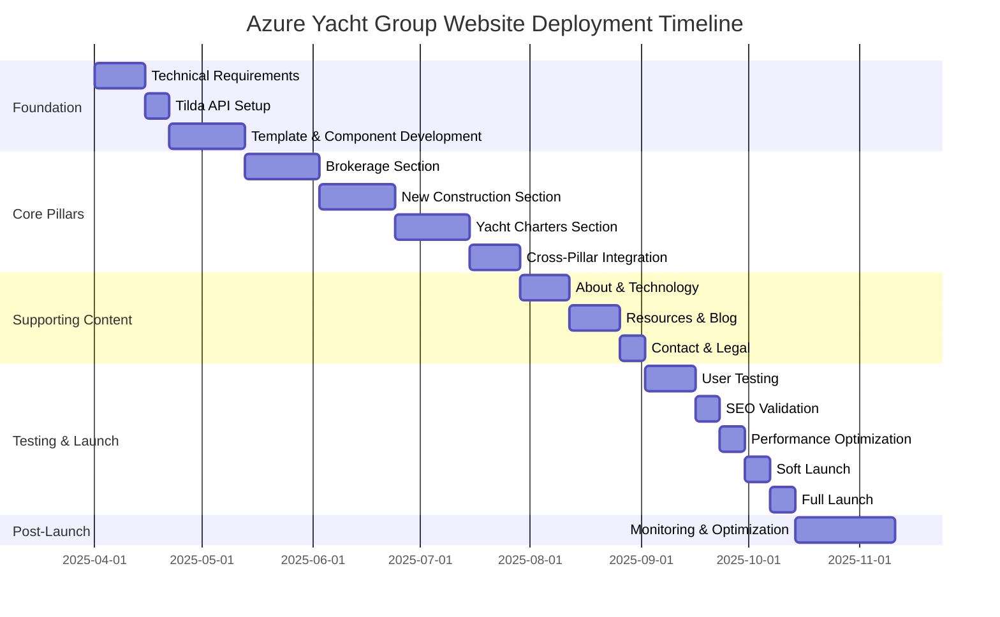
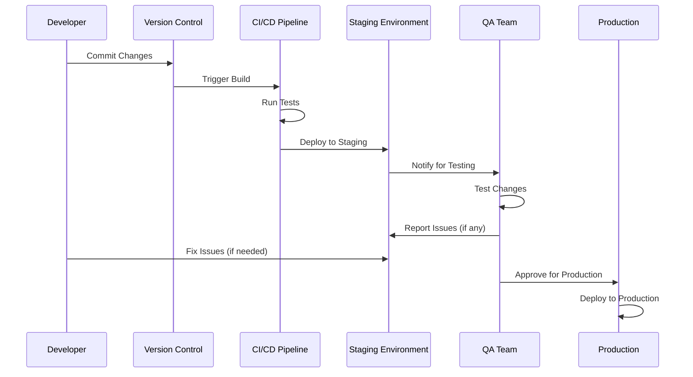

# Azure Yacht Group: Website Deployment Plan

This document outlines the detailed deployment plan for implementing the reimagined Azure Yacht Group website structure focused on the three core business pillars: Yacht Brokerage, New Construction, and Yacht Charters.

## Table of Contents

1. [Project Overview](#project-overview)
2. [Pre-Deployment Preparation](#pre-deployment-preparation)
3. [Infrastructure Setup](#infrastructure-setup)
4. [Phased Deployment Approach](#phased-deployment-approach)
5. [Technical Implementation Process](#technical-implementation-process)
6. [Testing & Validation Strategy](#testing--validation-strategy)
7. [Content Migration Plan](#content-migration-plan)
8. [Launch Strategy](#launch-strategy)
9. [Post-Launch Activities](#post-launch-activities)
10. [Risk Management](#risk-management)

## Project Overview

### Objectives

- Implement a reimagined website structure centered on three core business pillars
- Create clear user journeys for each business area
- Optimize for conversion and lead generation
- Establish cross-selling pathways between business areas
- Enhance SEO performance through strategic content organization

### Timeline Overview

Total project duration: 24 weeks (6 months)

## Pre-Deployment Preparation

### API Credentials & Environment Setup

- **Fix Current API Issues**
  - Resolve the "Wrong publickey length" error in Tilda API validation
  - Verify and update API credentials in environment configuration
  - Implement proper error handling for API connections

- **Environment Configuration**
  - Set up separate development, staging, and production environments
  - Configure environment-specific variables (.env files)
  - Establish secure credential management

### Technical Requirements Assessment

- **Tilda Platform Requirements**
  - Verify Business Plan subscription features and limitations
  - Identify any necessary plan upgrades
  - Document API rate limits and limitations

- **Third-Party Services**
  - Identify required third-party services (maps, booking systems, etc.)
  - Set up accounts and API access
  - Document integration points

### Resource Allocation

- **Team Assembly**
  - Project Manager: Overall coordination and stakeholder communication
  - Frontend Developer: Tilda implementation and UI development
  - Backend Developer: API integration and data processing
  - Designer: UI/UX design and assets
  - Content Specialist: Content creation and migration
  - SEO Specialist: Optimization and structured data
  - QA Specialist: Testing and validation

- **Infrastructure**
  - Server environments for staging and production
  - Development tooling and access
  - Backup and recovery systems

## Infrastructure Setup

### Server Environment

- **Development Environment**
  - Local development setup with Node.js
  - Version control with Git
  - Continuous integration pipeline

- **Staging Environment**
  - Mirror of production environment
  - Isolated database and storage
  - Access controls for internal testing

- **Production Environment**
  - Scalable server configuration
  - Content Delivery Network (CDN) integration
  - Automated backup system
  - Monitoring and alerting

### Domain & DNS Configuration

- **Domain Strategy**
  - Use existing domain or subdomain
  - Set up DNS records
  - Configure SSL certificates

- **CDN Setup**
  - Configure CDN for static assets
  - Set up geographic distribution
  - Implement caching policies

### Security Configuration

- **Access Controls**
  - Set up role-based access for CMS
  - Implement secure authentication
  - Configure permission levels

- **Data Protection**
  - Secure handling of inquiry data
  - Compliance with data protection regulations
  - Privacy policy implementation

## Phased Deployment Approach

### Phase 1: Foundation (Weeks 1-4)

#### Week 1-2: Technical Setup
- Resolve Tilda API credential issues
- Configure development and staging environments
- Set up version control repository
- Create project structure and documentation

#### Week 3-4: Template Development
- Develop master page templates for each pillar
- Create reusable component library
- Implement responsive design framework
- Set up analytics tracking

### Phase 2: Core Pillar Implementation (Weeks 5-12)

#### Weeks 5-7: Yacht Brokerage Section
- Implement Brokerage landing page
- Create listing templates and search functionality
- Develop broker profiles and contact forms
- Implement market insights content

#### Weeks 8-10: New Construction Section
- Implement model showcase pages
- Create specification templates
- Develop build process visualization
- Implement customization content

#### Weeks 11-12: Yacht Charters Section
- Implement destinations and experience pages
- Create charter fleet showcase
- Develop booking process and inquiry forms
- Implement testimonials and crew profiles

### Phase 3: Supporting Content (Weeks 13-16)

#### Weeks 13-14: About & Technology Sections
- Implement company information pages
- Create team profiles
- Develop technology showcase
- Implement sustainability content

#### Weeks 15-16: Resources & Additional Content
- Implement blog and news section
- Create FAQ and guides
- Develop financing information
- Implement legal and policy pages

### Phase 4: Testing & Optimization (Weeks 17-20)

#### Weeks 17-18: Comprehensive Testing
- Conduct functional testing
- Perform cross-browser compatibility testing
- Test responsive behavior
- Validate user journeys

#### Weeks 19-20: Optimization
- Implement SEO enhancements
- Optimize performance
- Address testing feedback
- Fine-tune user experience

### Phase 5: Launch & Monitoring (Weeks 21-24)

#### Weeks 21-22: Staged Launch
- Soft launch to limited audience
- Gather initial feedback
- Make final adjustments
- Prepare marketing materials

#### Weeks 23-24: Full Launch & Monitoring
- Complete public launch
- Monitor performance and analytics
- Address immediate issues
- Begin ongoing optimization

## Technical Implementation Process

### Deployment Workflow

### Tilda API Integration

- **Content Synchronization**
  - Implement webhook listeners for content updates
  - Create content export and processing pipeline
  - Set up error handling and retry mechanisms

- **Custom Block Development**
  - Create custom Tilda blocks for specialized content
  - Implement interactive components
  - Develop responsive templates

### Database & Storage Implementation

- **Content Storage**
  - Configure storage for exported content
  - Set up image optimization pipeline
  - Implement asset versioning

- **User Data Storage**
  - Configure secure storage for inquiry data
  - Set up CRM integration
  - Implement data retention policies

## Testing & Validation Strategy

### Pre-Deployment Testing

- **Functional Testing**
  - Test all interactive elements
  - Verify form submissions and data handling
  - Validate search functionality
  - Test filtering and sorting

- **Compatibility Testing**
  - Cross-browser testing (Chrome, Safari, Firefox, Edge)
  - Device testing (desktop, tablet, mobile)
  - Operating system testing
  - Screen size/resolution testing

- **Performance Testing**
  - Page load speed testing
  - Asset loading optimization
  - Server response time testing
  - API performance validation

- **Security Testing**
  - Input validation testing
  - Cross-site scripting protection
  - CSRF protection
  - Authentication security

### User Testing

- **Internal User Testing**
  - Team walk-through of key user journeys
  - Stakeholder review and feedback
  - Content validation by subject matter experts

- **External User Testing**
  - Targeted user testing with selected clients
  - Usability testing of key features
  - A/B testing of critical conversion points

### Automated Testing

- **Continuous Integration Tests**
  - Automated build testing
  - Code quality validation
  - Accessibility testing (WCAG 2.1 AA)

- **Monitoring Tests**
  - Uptime monitoring
  - Performance monitoring
  - Error tracking
  - API health checks

## Content Migration Plan

### Content Audit & Preparation

- **Content Inventory**
  - Document all existing content
  - Map current content to new structure
  - Identify content gaps
  - Prioritize content creation needs

- **Content Creation Schedule**
  - Develop content creation timeline
  - Assign content creation responsibilities
  - Set up review and approval workflow
  - Create content templates

### Migration Process

- **Phased Content Migration**
  - Migrate cornerstone content first
  - Move high-traffic content with care
  - Update internal links
  - Preserve SEO value

- **URL Mapping & Redirects**
  - Create comprehensive URL mapping
  - Set up 301 redirects for changed URLs
  - Monitor redirect chains
  - Update external references when possible

## Launch Strategy

### Soft Launch

- **Internal Review Period**
  - Team-wide review and testing
  - Stakeholder walk-through
  - Final content review
  - Technical performance validation

- **Limited External Access**
  - Access for selected clients
  - Beta testing group
  - Feedback collection
  - Rapid issue resolution

### Full Launch

- **Launch Sequence**
  - Final backup of existing site
  - DNS update
  - CDN propagation
  - SSL verification
  - Initial monitoring period

- **Marketing & Promotion**
  - Announcement to existing clients
  - Social media campaign
  - Email marketing
  - Press release (if applicable)

### Launch Day Support

- **War Room Setup**
  - Dedicated team for launch day
  - Real-time monitoring
  - Rapid response protocol
  - Communication channels

- **Issue Response Plan**
  - Severity classification system
  - Escalation procedures
  - Resolution tracking
  - Stakeholder communication

## Post-Launch Activities

### Immediate Post-Launch (First Week)

- **Intensive Monitoring**
  - 24/7 performance monitoring
  - User behavior tracking
  - Error logging and analysis
  - Conversion tracking

- **Rapid Iteration**
  - Critical issue resolution
  - Quick UX adjustments
  - Content refinements
  - Performance optimization

### Medium-Term (First Month)

- **Data Analysis**
  - User journey analysis
  - Conversion funnel optimization
  - Search ranking monitoring
  - A/B testing of key pages

- **Feature Refinement**
  - Enhanced functionality rollout
  - User feedback implementation
  - Content expansion
  - Performance optimization

### Long-Term (First Quarter)

- **Strategic Optimization**
  - Comprehensive analytics review
  - Conversion rate optimization
  - Content effectiveness analysis
  - Competitive positioning review

- **Roadmap Development**
  - Future enhancement planning
  - Feature prioritization
  - Content calendar development
  - Technology upgrade planning

## Risk Management

### Identified Risks & Mitigation Strategies

#### Technical Risks

| Risk | Probability | Impact | Mitigation Strategy |
|------|------------|--------|-------------------|
| API Integration Failure | Medium | High | Develop robust error handling, implement fallbacks, and establish monitoring |
| Performance Degradation | Medium | High | Implement performance budgets, CDN, and optimization techniques |
| Mobile Compatibility Issues | Medium | High | Adopt mobile-first approach, extensive device testing |
| Browser Compatibility Problems | Medium | Medium | Set baseline browser support, use progressive enhancement |
| Security Vulnerabilities | Low | High | Security audits, penetration testing, regular updates |

#### Content Risks

| Risk | Probability | Impact | Mitigation Strategy |
|------|------------|--------|-------------------|
| Content Delays | High | Medium | Create templates and placeholders, phase content creation |
| SEO Value Loss | Medium | High | Implement proper redirects, preserve metadata, monitor rankings |
| Inconsistent Messaging | Medium | Medium | Develop content guidelines, establish review process |
| Poor Content Quality | Low | High | Set quality standards, implement editorial process |
| Compliance Issues | Low | High | Legal review of content, privacy policy updates |

#### Project Risks

| Risk | Probability | Impact | Mitigation Strategy |
|------|------------|--------|-------------------|
| Timeline Slippage | Medium | Medium | Build buffer into schedule, prioritize critical features |
| Budget Overruns | Medium | Medium | Phase implementation, clear scope definition |
| Stakeholder Alignment | Medium | High | Regular communication, clear documentation |
| Resource Constraints | Medium | High | Identify backup resources, prioritize requirements |
| Scope Creep | High | Medium | Clear requirement documentation, change management process |

### Contingency Planning

- **Rollback Procedure**
  - Maintain current production environment
  - Document specific rollback steps for each phase
  - Test rollback procedures before deployment
  - Establish rollback decision criteria

- **Alternative Solutions**
  - Identify fallback options for critical features
  - Prepare simplified implementations if needed
  - Document workarounds for potential issues

## Conclusion

This deployment plan provides a comprehensive framework for implementing the reimagined Azure Yacht Group website structure. By following a phased approach with careful planning, testing, and risk management, the project will transform the website into an effective business tool focused on the three core pillars: Yacht Brokerage, New Construction, and Yacht Charters.

The result will be a premium digital presence that effectively communicates Azure Yacht Group's value proposition, guides users through intuitive journeys, and converts visitors into qualified leads while reflecting the luxury nature of the brand. 